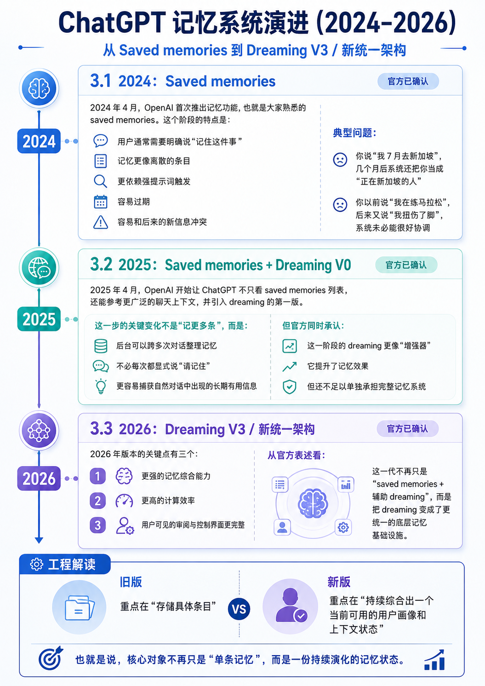
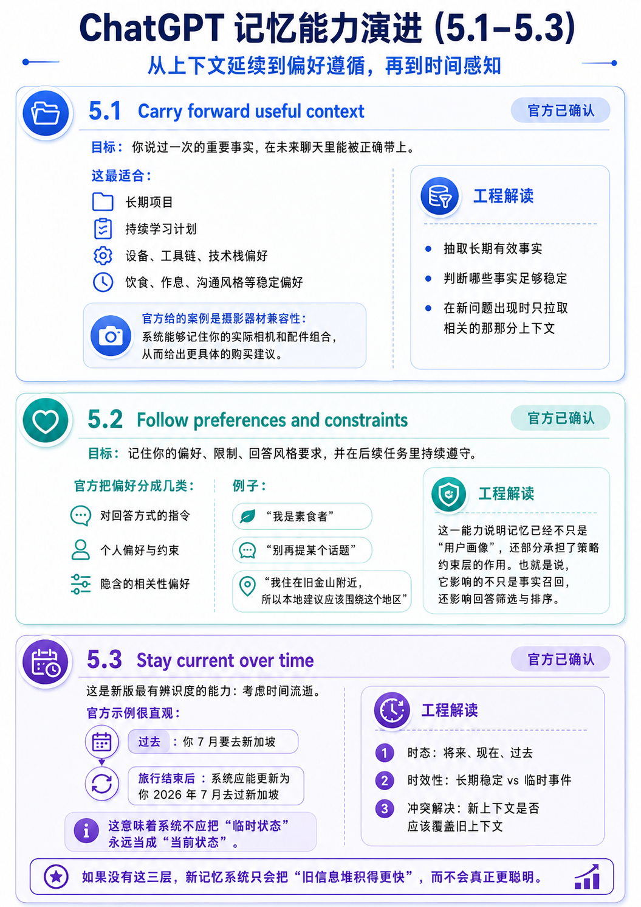
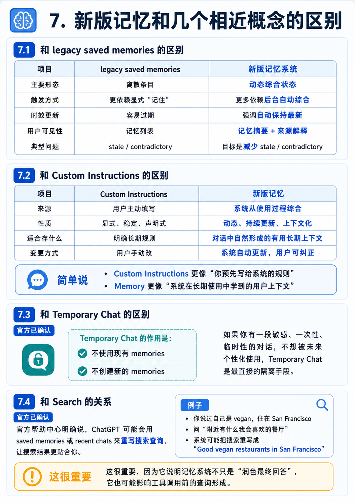

<title>ChatGPT Dreaming</title>

# ChatGPT 全新记忆系统技术文档（中文版）

参考：https://openai.com/index/chatgpt-memory-dreaming/ 

> 文档目标：基于 OpenAI 截至 2026 年 6 月 8 日公开资料，系统讲清 ChatGPT 新版记忆系统是什么、和旧版有什么不同、用户如何控制、以及从工程角度可以如何理解它。
> 
> 说明：本文严格区分两类信息。
> 
> - `官方已确认`：直接来自 OpenAI 官方博客、帮助中心、发布说明。
> - `工程解读`：基于官方表述做的技术推断，不代表 OpenAI 公开披露的内部实现细节。

*图 1：从 `Saved memories`* 到 *`Dreaming` 再到新版统一记忆架构的演进示意。该图为解释性配图，不是 OpenAI 官方架构图。*

*图 2：新版记忆系统的典型运行链路示意。该图为解释性配图，不是 OpenAI 官方架构图。*

## 1. 一页速览

截至 **2026 年 6 月 4 日**，OpenAI 正在把 ChatGPT 的记忆能力从“手工保存几条记忆”升级成“持续综合上下文、自动保持新鲜度”的新版系统。官方博客把这套方法称为 **dreaming**，并表示 2026 年上线的是建立在 dreaming 之上的新一代、更高效的记忆架构。

如果只记 7 件事，先记这 7 件：

1. **新版记忆不再只是一个记事本。** 它会从你的聊天、文件、已连接应用中自动综合有用上下文。
2. **它强调“持续更新”。** 旧记忆系统最容易出错的点是“过期”；新版核心目标之一就是减少 stale memory。
3. **用户终于能看到“记忆摘要”。** 这不是全部记忆的完整转储，而是一个可审阅、可修改的高层摘要。
4. **回答时会显示“来源”。** 你可以看到这次个性化回答用了哪些来源，例如 past chats、saved memories、files、Gmail、custom instructions。
5. **“摘要里没显示”不等于“模型完全不知道”。** 官方明确说 memory summary 只展示高层结果，不保证覆盖所有被综合过的上下文。
6. **删除需要分层理解。** “不再提起”“关闭记忆”“删聊天”“删文件”“断开连接应用”不是一回事；要彻底删除，必须删掉每个来源。
7. **这仍然是产品级个性化系统，不是个人数据库。** 它适合保存偏好、背景、长期项目上下文，不适合当成精确模板仓库或长期事实真相库。

## 2. 官方到底发布了什么

### 2.1 官方结论

`官方已确认`

- OpenAI 在 **2026 年 6 月 4 日** 发布了题为 *Dreaming: Better memory for a more helpful ChatGPT* 的文章，宣布开始推出一个“更强、更可扩展”的记忆综合系统，用来解决 **陈旧、正确性、可扩展性** 问题。
- 这次更新当天先提供给 **美国的 Plus 和 Pro 用户**，随后几周扩展到更多国家以及 **Free 和 Go** 用户。
- 帮助中心同步更新了新版 **Memory summary**、**Memory sources**、自动更新记忆、回退 legacy saved memories 等控制方式。

### 2.2 这个更新的本质

一句话概括：

> 旧系统更像“把几条你明确说过的话记下来”，新系统更像“在后台持续整理与你相关的长期上下文，并在真正有帮助时拿出来用”。

OpenAI 在官方文章中把新版记忆的目标概括成三个词：

- **freshness**：记忆要跟时间一起更新
- **continuity**：跨对话延续上下文
- **relevance**：只在相关时使用恰当的个人上下文

## 3. 记忆系统的三代演进

### 3.1 2024：Saved memories

`官方已确认`

2024 年 4 月，OpenAI 首次推出记忆功能，也就是大家熟悉的 **saved memories**。这个阶段的特点是：

- 用户通常需要明确说“记住这件事”
- 记忆更像离散的条目
- 更依赖强提示词触发
- 容易过期
- 容易和后来的新信息冲突

典型问题：

- 你说“我 7 月去新加坡”，几个月后系统还把你当成“正在新加坡的人”
- 你以前说“我在练马拉松”，后来又说“我扭伤了脚”，系统未必能很好协调

### 3.2 2025：Saved memories + Dreaming V0

`官方已确认`

2025 年 4 月，OpenAI 开始让 ChatGPT 不只看 saved memories 列表，还能参考更广泛的聊天上下文，并引入 dreaming 的第一版。

这一步的关键变化不是“记更多条”，而是：

- 后台可以跨多次对话整理记忆
- 不必每次都显式说“请记住”
- 更容易捕获自然对话中出现的长期有用信息

但官方同时承认：

- 这一阶段的 dreaming 更像“增强器”
- 它提升了记忆效果
- 但还不足以单独承担完整记忆系统

### 3.3 2026：Dreaming V3 / 新统一架构

`官方已确认`

2026 年版本的关键点有三个：

1. **更强的记忆综合能力**
2. **更高的计算效率**
3. **用户可见的审阅与控制界面更完整**

从官方表述看，这一代不再只是 “saved memories + 辅助 dreaming”，而是把 dreaming 变成了更统一的底层记忆基础设施。

`工程解读`

可以把它理解成：

- 旧版：重点在“存储具体条目”
- 新版：重点在“持续综合出一个当前可用的用户画像和上下文状态”

也就是说，核心对象不再只是“单条记忆”，而是**一份持续演化的记忆状态**。

## 4. 你在产品里能看到哪些新能力

### 4.1 Memory summary

`官方已确认`

新版最重要的用户界面变化，是 **memory summary**。

它的作用：

- 展示 ChatGPT 目前“高层次地知道你什么”
- 允许你直接修改、纠正、补充
- 允许你告诉它哪些话题以后不要再主动提起

要点：

- summary 会随着新上下文自动更新
- 顶部会显示最近一次更新时间
- 你可以直接在 summary 页面输入修正
- 你可以高亮某段内容并做具体修改
- 你可以点选 **Don’t mention this again**

但有一个非常重要的边界：

> **memory summary 不是完整内存转储。**

官方明确说明：

- 它应该抓住最重要的信息
- 但不会包含 ChatGPT 实际可能用于个性化的全部记忆

这意味着：

- 看到的只是“摘要”
- 不是底层所有候选上下文
- “摘要没写出来”不能直接推断“系统完全没保留这类信息”

### 4.2 Memory sources

`官方已确认`

当 ChatGPT 用到个性化上下文时，回答下方可以显示 **sources**。你能看到这次回答主要参考了哪些来源。

可能出现的来源包括：

- `Past chats`
- `Saved memories`
- `Custom instructions`
- `Files`
- `Gmail`

这里有两个理解重点：

1. **可解释性增强了。** 用户终于能反查“为什么它会这么回答”。
2. **这仍然不是全量可解释。** 官方明确说 sources 不一定展示影响回答的所有因素，只会展示最相关的一部分。

### 4.3 自动更新，而不是只会累加

`官方已确认`

新版记忆强调“自动更新”而不是“越记越多”。官方在多个页面反复提到的改进点是：

- 减少 stale memories
- 减少 contradictory memories
- 自动保留更重要的信息
- 把不那么重要的信息放到后台

这说明新版设计目标不是把用户历史全量永久背下来，而是**维持一个动态、优先级可调整的长期上下文层**。

### 4.4 回退到 legacy saved memories

`官方已确认`

如果你不喜欢新系统，OpenAI 当前提供回退路径：

- `Settings > Memory > Saved memories`

这说明当前产品实际处于一个**新旧机制并存、但新机制逐步替代旧机制**的过渡阶段。

## 5. 新版记忆系统的核心能力

OpenAI 在官方博客里用三个评估目标来描述“好记忆”应该做到什么。

### 5.1 Carry forward useful context

`官方已确认`

目标：你说过一次的重要事实，在未来聊天里能被正确带上。

这最适合：

- 长期项目
- 持续学习计划
- 设备、工具链、技术栈偏好
- 饮食、作息、沟通风格等稳定偏好

官方给的案例是摄影器材兼容性：系统能够记住你的实际相机和配件组合，从而给出更具体的购买建议。

`工程解读`

这一能力本质上要求系统不只是“检索历史聊天”，而是要能：

- 抽取长期有效事实
- 判断哪些事实足够稳定
- 在新问题出现时只拉取相关的那部分上下文

### 5.2 Follow preferences and constraints

`官方已确认`

目标：记住你的偏好、限制、回答风格要求，并在后续任务里持续遵守。

官方把偏好分成几类：

- 对回答方式的指令
- 个人偏好与约束
- 隐含的相关性偏好

例子：

- “我是素食者”
- “别再提某个话题”
- “我住在旧金山附近，所以本地建议应该围绕这个地区”

`工程解读`

这一能力说明记忆已经不只是“用户画像”，还部分承担了**策略约束层**的作用。也就是说，它影响的不只是事实召回，还影响回答筛选与排序。

### 5.3 Stay current over time

`官方已确认`

这是新版最有辨识度的能力：**考虑时间流逝**。

官方示例很直观：

- 过去：`你 7 月要去新加坡`
- 旅行结束后：系统应能更新为 `你 2026 年 7 月去过新加坡`

这意味着系统不应把“临时状态”永远当成“当前状态”。

`工程解读`

要实现这点，底层至少需要处理三类信息：

1. **时态**：将来、现在、过去
2. **时效性**：长期稳定 vs 临时事件
3. **冲突解决**：新上下文是否应该覆盖旧上下文

如果没有这三层，新记忆系统只会把“旧信息堆积得更快”，而不会真正更聪明。

## 6. 从工程角度看，新系统大概是怎样工作的

这一节是技术解读，不是 OpenAI 公布的内部实现图。

### 6.1 一个更合理的心智模型

`工程解读`

把新版记忆系统看成 4 层最容易理解

1. **来源层**
2. **综合层**
3. **控制层**
4. **调用层**

#### 1. 来源层

候选输入可能来自：

- 聊天历史
- saved memories
- 自定义指令
- 文件库
- 已连接应用，例如 Gmail

#### 2. 综合层

系统不会把所有原始输入直接拼到每次提示词里，而是会做：

- 抽取
- 合并
- 去重
- 时态修正
- 优先级排序
- 形成可持续更新的记忆状态

官方把这一过程称为 **synthesizing memory**。

#### 3. 控制层

用户可通过：

- settings
- memory summary
- sources
- delete / forget
- don’t mention this again
- temporary chat

来控制系统行为。

#### 4. 调用层

当新问题出现时，模型不会对每个请求都盲目搜索全部历史。官方明确说：

- 系统只会在“有助于提升回答”时智能寻找相关上下文

因此更合理的理解是：

- 先判断当前问题是否需要个性化
- 再选择相关记忆片段或综合结果
- 最后在回答阶段应用

### 6.2 为什么 summary 不是底层全量记忆

`工程解读`

这件事很关键。

如果底层是“动态综合状态”，那么用户界面就很难精确地把所有内部候选记忆逐条展开，因为：

- 很多内部状态可能是聚合的
- 有些状态是中间推断结果，不适合直接暴露
- 有些状态可能短期有效，很快会过期
- 有些状态可能只在某类问题里才会被视为相关

所以更自然的产品设计是：

- 给用户一份摘要
- 给用户一份回答级来源解释
- 但不承诺“UI 完整映射内部所有表示”

这正好和官方帮助中心的表述一致。

### 6.3 为什么新版比旧版更能规模化

`官方已确认`

OpenAI 在博客里给了一个非常关键的工程信号：

- 最近的改进把向 Free 用户提供 dreaming 所需的计算量降低了约 **5 倍**
- Plus 和 Pro 用户的记忆容量也因此扩大到 **2 倍**

`工程解读`

这说明新版优化的重点不只是“效果更好”，还包括：

- 后台综合流程更便宜
- 在线检索或应用流程更高效
- 更适合多用户、多年时间尺度

换句话说，这不是单纯的产品 UI 更新，而是一轮**底层记忆基础设施重构**。

## 7. 新版记忆和几个相近概念的区别

### 7.1 和 legacy saved memories 的区别

| 项目 | legacy saved memories | 新版记忆系统 |
|------|------|------|
| 主要形态 | 离散条目 | 动态综合状态 |
| 触发方式 | 更依赖显式“记住” | 更多依赖后台自动综合 |
| 时效更新 | 容易过期 | 强调自动保持最新 |
| 用户可见性 | 记忆列表 | 记忆摘要 + 来源解释 |
| 典型问题 | stale / contradictory | 目标是减少 stale / contradictory |

### 7.2 和 Custom Instructions 的区别

| 项目 | Custom Instructions | 新版记忆 |
|------|------|------|
| 来源 | 用户主动填写 | 系统从使用过程综合 |
| 性质 | 显式、稳定、声明式 | 动态、持续更新、上下文化 |
| 适合存什么 | 明确长期规则 | 对话中自然形成的有用长期上下文 |
| 变更方式 | 用户手动改 | 系统自动更新，用户可纠正 |

简单说：

- **Custom Instructions** 更像“你预先写给系统的规则”
- **Memory** 更像“系统在长期使用中学到的用户上下文”

### 7.3 和 Temporary Chat 的区别

`官方已确认`

Temporary Chat 的作用是：

- 不使用现有 memories
- 不创建新的 memories

如果你有一段敏感、一次性、临时性的对话，不想被未来个性化使用，Temporary Chat 是最直接的隔离手段。

### 7.4 和 Search 的关系

`官方已确认`

官方帮助中心明确说，ChatGPT 可能会用 saved memories 或 recent chats 来**重写搜索查询**，让搜索结果更贴合你。

例子：

- 你说过自己是 vegan，住在 San Francisco
- 问“附近有什么我会喜欢的餐厅”
- 系统可能把搜索重写成 “Good vegan restaurants in San Francisco”

这很重要，因为它说明记忆系统不只是“润色最终回答”，它也可能影响**工具调用前的查询形成**。

## 8. 用户控制、删除与隐私边界

### 8.1 你有哪些控制手段

`官方已确认`

目前公开可见的控制方式包括：

- 打开或关闭 memory
- 打开或关闭 reference chat history
- 查看和编辑 memory summary
- 管理 saved memories
- 删除单条记忆
- 删除全部记忆
- 删除引用该信息的聊天
- 删除相关文件
- 断开相关连接应用
- 使用 temporary chat
- 通过 sources 对来源标记相关/不相关

### 8.2 “不再提起”不等于“彻底删除”

`官方已确认`

这是最容易误解的一点。

`Don’t mention this again` 的效果是：

- 减少系统未来主动引用这个信息

但这**不等于**：

- 从所有来源彻底清除该信息

如果你想彻底删除，官方要求删除所有来源，包括：

- past chats
- archived chats
- files
- memory summary
- connected apps 中对应内容

### 8.3 关闭某些开关后会发生什么

`官方已确认`

- 关闭 `Reference chat history` 后，系统记住的 past-chat 信息会在 **30 天内**从系统中删除。
- 删除 saved memory 后，OpenAI 可能会出于安全与调试目的，最多保留已删除 saved memories 的日志 **30 天**。
- 关闭 saved memories 不会自动删除已经记住的内容。

### 8.4 敏感信息边界

`官方已确认`

OpenAI 明确提醒：

- 如果你把敏感信息发给 ChatGPT，它可能出现在 memory 中。
- 如果你不希望某段内容参与未来个性化，应关闭 memory 或使用 Temporary Chat。

### 8.5 训练使用边界

`官方已确认`

如果你开启了 **Improve the model for everyone**：

- OpenAI 可能使用你分享的内容帮助改进模型
- 这些内容可以包括 past chats、saved memories、以及从这些聊天中形成的 memories

默认不用于训练的范围：

- ChatGPT Business
- Enterprise
- Edu

## 9. 你应该如何正确使用这套系统

### 9.1 适合让它记住什么

建议让它记：

- 稳定偏好
- 长期项目背景
- 常用技术栈
- 沟通方式偏好
- 需要持续遵守的限制条件

例如：

- “我默认用 Python 3.11，优先 Conda 环境”
- “我写技术文档时更偏好中文、结构化、带验证结论”
- “我在做同一个长期产品项目，希望你延续上下文”

### 9.2 不适合让它记住什么

不建议把它当成：

- 精确事实数据库
- 法务或合规归档系统
- 密码库
- 机密信息仓库
- 需要逐字不变保存的大段模板

原因很简单：

- 它的目标是“有用的个性化”
- 不是“精确、可审计、字节级不变的长期存储”

### 9.3 提升效果的实操方法

如果你想让记忆更稳定、更可控，建议这样用：

1. 对长期稳定信息，明确表达。
2. 对已变化的信息，主动纠正。
3. 定期查看 memory summary。
4. 对敏感任务用 Temporary Chat。
5. 当回答明显被错误旧上下文污染时，去 sources 和 summary 里反查来源。

## 10. 这套系统当前仍有哪些局限

### 10.1 可见的不一定是全部

官方已经明确这一点，所以必须接受：

- summary 不是完整内部状态
- sources 不是完整因果解释

### 10.2 自动更新不等于永远正确

即便新版重点就是减少 stale memory，工程上它仍可能出错：

- 临时状态没有及时过期
- 新信息没有正确覆盖旧信息
- 误把短期偏好当成长期偏好
- 误把上下文相关性判断错了

### 10.3 新旧文档仍处于并存状态

截至 **2026 年 6 月 8 日**，OpenAI 帮助中心里同时存在：

- 新版 memory summary / memory sources 的描述
- 旧版 saved memories / reference chat history 的说明

这说明官方文档仍在更新过程中。阅读时一定要区分：

- **“new memory system”** 的描述
- **“legacy memory experience”** 的描述

## 11. 给技术读者的最终判断

如果你从系统设计角度看，这次升级最重要的不是“ChatGPT 记住了更多东西”，而是下面 4 个变化：

1. **记忆对象从条目变成状态。**
2. **记忆更新从手工管理变成后台综合。**
3. **个性化从黑盒调用变成部分可解释。**
4. **记忆基础设施开始满足更大规模分发。**

因此，新版记忆系统更像一个：

> 面向长期个性化的“用户上下文综合层”

而不是一个简单的：

> “记住我说过的话”的附加功能

这也是为什么 OpenAI 会把它和 freshness、relevance、scalability 一起讲，而不是只讲一个 UI 新开关。

## 12. 面向普通用户的最短结论

如果你只是想知道“值不值得开”：

- 想让 ChatGPT 越用越懂你，值得开
- 经常做长期项目，尤其值得开
- 有较多敏感对话，必须同时学会 Temporary Chat 和删除来源
- 不要把它当密码本、合同库或唯一事实来源

## 13. 参考资料

1. OpenAI 官方博客：Dreaming: Better memory for a more helpful ChatGPT

https://openai.com/index/chatgpt-memory-dreaming/

1. OpenAI Help Center：Memory FAQ

https://help.openai.com/en/articles/8590148-memory-in-chatgpt

1. OpenAI Help Center：ChatGPT Release Notes

https://help.openai.com/en/articles/6825453-chatgpt-release-notes

## 14. 参考摘录对应关系

为避免把官方事实和技术解读混淆，下面列出本文最关键结论对应的来源：

- “新版记忆开始向美国 Plus/Pro 推出，并将扩展到更多国家和 Free/Go”

来源：官方博客与发布说明

- “记忆帮助 ChatGPT 从 chats、files、connected apps 自动记住有用上下文”

来源：Memory FAQ

- “memory summary 不是全部记忆，只是高层摘要”

来源：Memory FAQ

- “sources 不会展示影响回答的所有因素”

来源：Memory FAQ

- “新版主要解决 stale / contradictory memory 问题”

来源：官方博客、Memory FAQ、Release Notes

- “Plus/Pro 记忆容量 2x，dreaming 面向 Free 的服务计算量约降 5x”

来源：官方博客、Release Notes
