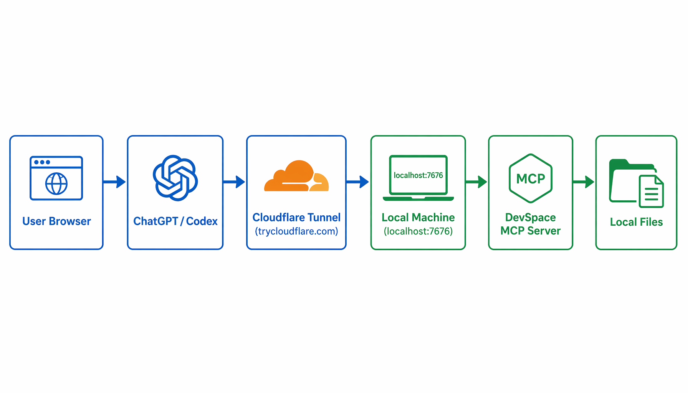
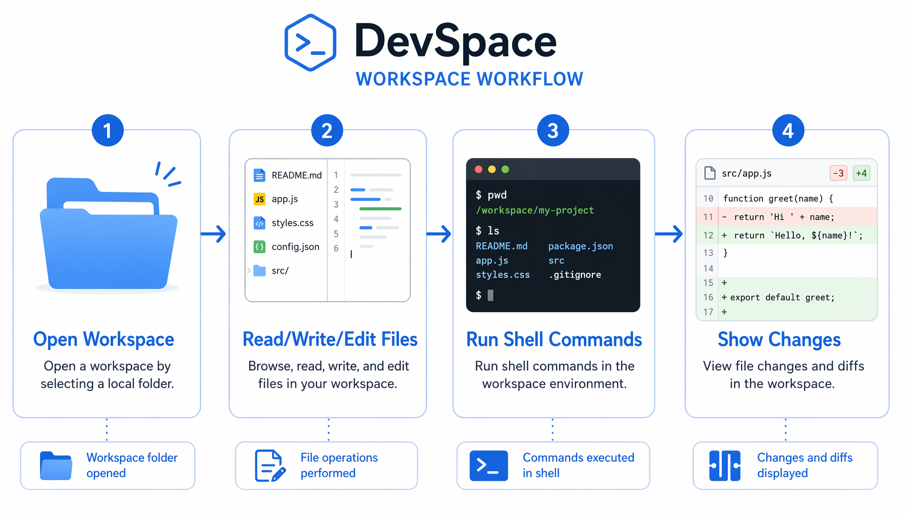
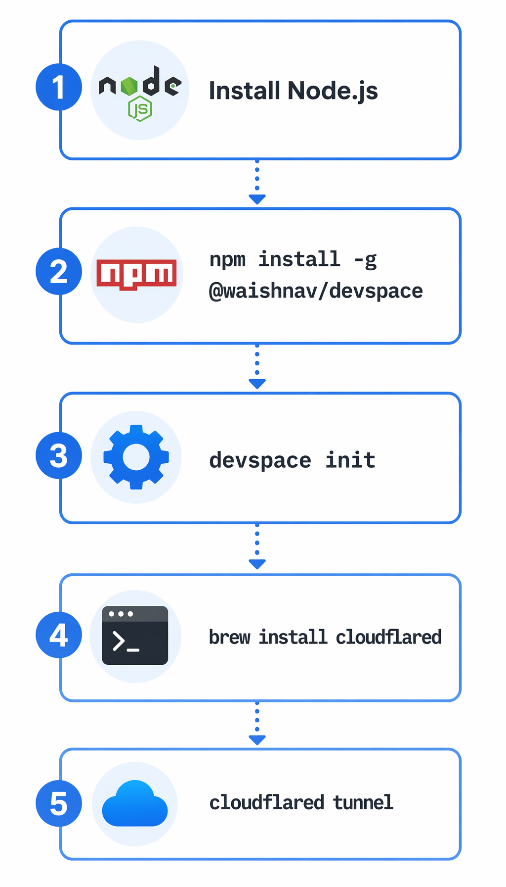
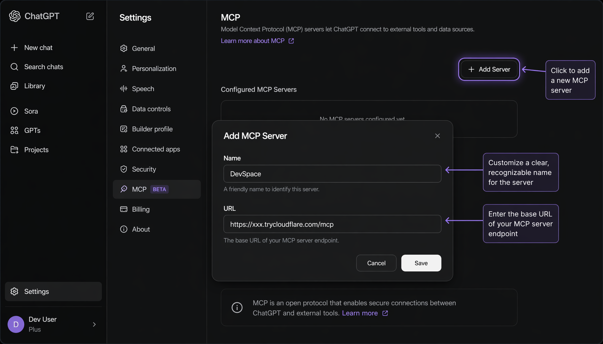
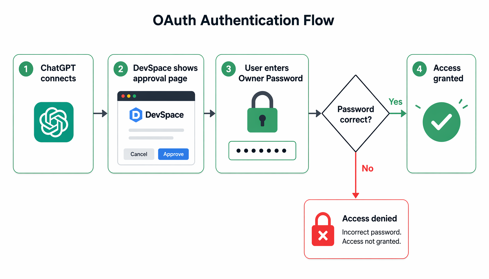
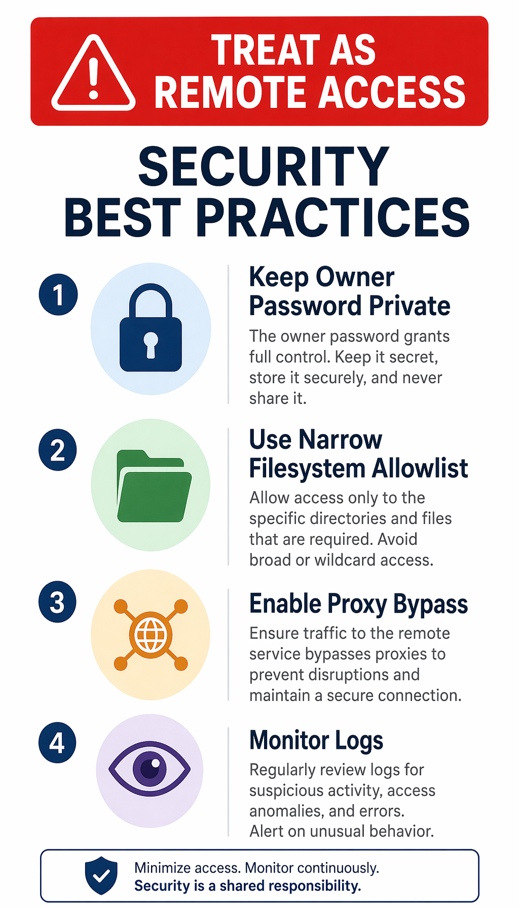
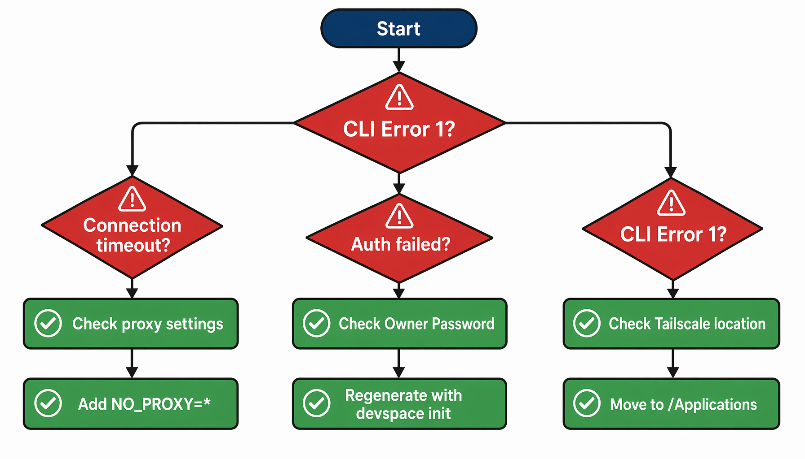
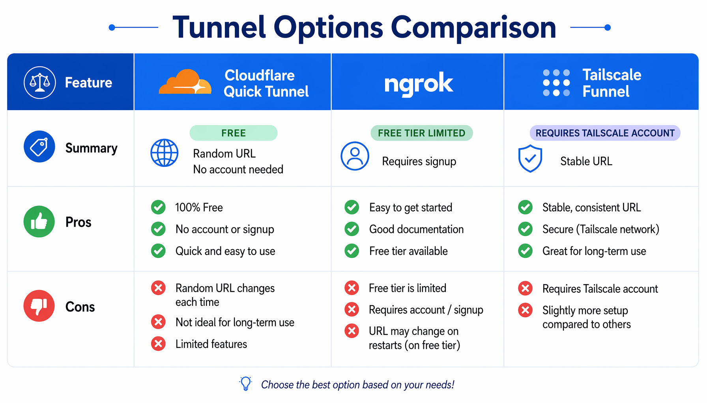

<title>DevSpace MCP 配置指南</title>

# DevSpace MCP 配置指南

> 让 ChatGPT / Codex 直接操作你本地代码的完整教程



## 目录

- [这是什么？](#这是什么)
- [适用场景](#适用场景)
- [前置条件](#前置条件)
- [快速开始](#快速开始)
- [详细配置](#详细配置)
- [连接 ChatGPT / Codex](#连接-chatgpt--codex)
- [使用方法](#使用方法)
- [安全注意事项](#安全注意事项)
- [故障排除](#故障排除)
- [进阶配置](#进阶配置)

---

## 这是什么？

DevSpace 是一个 **MCP（Model Context Protocol）服务器**，它让 AI 助手（如 ChatGPT、Codex）能够：

- 📂 读取你本地的项目文件
- ✏️ 编辑代码
- 🔍 搜索代码库
- 💻 运行 shell 命令（测试、构建、git 等）

**核心价值：** 你的代码不需要上传到云端，AI 直接在你的机器上操作。



---

## 适用场景

| 场景             | 说明                          |
| -------------- | --------------------------- |
| 用 ChatGPT 辅助编码 | 让 ChatGPT 直接读取你的项目，无需复制粘贴代码 |
| 用 Codex CLI 开发 | 在终端中让 Codex 操作本地文件          |
| 远程协作           | 同事可以通过 MCP 访问你的开发环境（需授权）    |
| 代码审查           | 让 AI 审查你的代码变更               |

---

## 前置条件

### 必需

| 工具 | 版本要求 | 检查命令 |
|------|----------|----------|
| Node.js | >= 20.12 < 27 | `node --version` |
| npm | 随 Node.js 安装 | `npm --version` |
| Git | 任意版本 | `git --version` |

### 可选（用于公网访问）

| 工具 | 用途 | 安装方式 |
|------|------|----------|
| Cloudflare Tunnel | 免费公网隧道 | `brew install cloudflared` |
| ngrok | 备选隧道 | 需要账号 |
| Tailscale | 备选隧道 | 需要安装应用 |

---

## 快速开始



### 第一步：安装 DevSpace

```bash
npm install -g @waishnav/devspace
```

### 第二步：初始化配置

```bash
devspace init
```

交互式提示会问你：

1. **项目根目录** — 你的代码在哪里？（如 `~/projects`）
2. **本地端口** — 默认 `7676`
3. **公网 URL** — 先跳过，后面配置

### 第三步：启动服务

```bash
devspace serve
```

服务启动后，本地访问地址：`http://127.0.0.1:7676/mcp`

### 第四步：配置公网隧道（可选）

如果需要让 ChatGPT/Codex 从外部访问，需要一个公网 URL。

**推荐：Cloudflare Quick Tunnel（零门槛）**

```bash
# 安装
brew install cloudflared

# 启动隧道（自动分配随机 URL）
NO_PROXY="*" cloudflared tunnel --url http://localhost:7676
```

启动后会显示类似：
```
https://random-name.trycloudflare.com
```

**更新 DevSpace 配置：**

```bash
# 编辑配置文件
vi ~/.devspace/config.json
```

将 `publicBaseUrl` 改为隧道 URL：
```json
{
  "publicBaseUrl": "https://random-name.trycloudflare.com"
}
```

**重启 DevSpace：**

```bash
pkill -f "devspace serve"
devspace serve
```

---

## 详细配置

### 配置文件位置

| 文件 | 用途 |
|------|------|
| `~/.devspace/config.json` | 服务器配置 |
| `~/.devspace/auth.json` | Owner 密码（不要泄露） |

### 配置文件示例

**config.json：**
```json
{
  "host": "127.0.0.1",
  "port": 7676,
  "allowedRoots": [
    "/Users/yourname/projects",
    "/Users/yourname/work"
  ],
  "publicBaseUrl": "https://your-tunnel.trycloudflare.com"
}
```

**auth.json：**
```json
{
  "ownerToken": "your-secret-password-here"
}
```

### 环境变量方式配置

也可以通过环境变量覆盖配置：

```bash
DEVSPACE_OAUTH_OWNER_TOKEN="your-secret" \
DEVSPACE_ALLOWED_ROOTS="$HOME/projects" \
DEVSPACE_PUBLIC_BASE_URL="https://your-tunnel.trycloudflare.com" \
devspace serve
```

---

## 连接 ChatGPT / Codex

### 连接 ChatGPT



1. 打开 ChatGPT
2. 进入 **Settings** → **Developer** → **MCP Servers**
3. 点击 **Add Server**
4. 填写：
   - **Name:** `DevSpace`
   - **URL:** `https://your-tunnel.trycloudflare.com/mcp`
5. 点击连接，会弹出审批页面
6. 输入 Owner 密码

### 连接 Codex CLI

编辑 Codex 配置文件：

```bash
vi ~/.codex/config.toml
```

添加以下内容：

```toml
[mcp_servers.devspace]
url = "https://your-tunnel.trycloudflare.com/mcp"
```

启动 Codex 后，输入 `/mcp` 查看连接状态。

### OAuth 认证流程



首次连接时：
1. ChatGPT/Codex 连接到 DevSpace
2. DevSpace 显示审批页面
3. 输入 Owner 密码
4. 认证通过，获得访问权限

---

## 使用方法

### 基本工作流

1. **打开工作区**
   ```
   请打开 ~/projects/my-app 项目
   ```

2. **读取文件**
   ```
   读取 src/index.ts 文件
   ```

3. **编辑文件**
   ```
   在 src/utils.ts 中添加一个 formatDate 函数
   ```

4. **运行命令**
   ```
   运行 npm test 测试
   ```

5. **查看变更**
   ```
   显示所有变更
   ```

### 可用工具

| 工具 | 说明 |
|------|------|
| `open_workspace` | 打开项目工作区 |
| `read` | 读取文件内容 |
| `write` | 写入新文件 |
| `edit` | 编辑现有文件 |
| `bash` | 运行 shell 命令 |
| `grep` | 搜索代码内容 |
| `glob` | 按模式查找文件 |
| `ls` | 列出目录内容 |

---

## 安全注意事项



### 核心原则

1. **Owner 密码要保密**
   - 不要提交到 Git
   - 不要分享给不信任的人
   - 定期更换

2. **限制文件系统访问**
   - `allowedRoots` 只包含需要的目录
   - 不要用 `~` 或 `/` 作为根目录

3. **代理环境注意**
   - 如果使用代理，确保 `NO_PROXY` 包含隧道域名
   - 否则可能导致连接失败

4. **监控日志**
   - 默认记录所有请求和工具调用
   - Shell 命令日志默认关闭（可能包含敏感信息）

### 权限模型

| 层级 | 机制 |
|------|------|
| 认证 | OAuth + Owner 密码 |
| 文件系统 | 白名单根目录限制 |
| 网络 | Host 头白名单 |
| 工具 | 显式 MCP 工具调用 |

---

## 故障排除



### 常见问题

#### 1. CLI Error 1（Tailscale）

**症状：** `tailscale status` 报错

**原因：** Tailscale 从外置硬盘运行

**解决：**
```bash
# 将 Tailscale 移到 Applications
mv /Volumes/.../Tailscale.app /Applications/
# 重启应用
```

#### 2. 连接超时

**症状：** ChatGPT 无法连接到 DevSpace

**原因：** 代理干扰

**解决：**
```bash
# 启动隧道时绕过代理
NO_PROXY="*" cloudflared tunnel --url http://localhost:7676
```

#### 3. 认证失败

**症状：** OAuth 审批页面报错

**原因：** Owner 密码错误

**解决：**
```bash
# 重新生成密码
devspace init --force
```

#### 4. 端口被占用

**症状：** `EADDRINUSE` 错误

**解决：**
```bash
# 查找占用端口的进程
lsof -i :7676
# 杀掉进程或换端口
```

#### 5. 隧道 URL 变了

**症状：** Quick Tunnel 重启后 URL 变化

**解决：**
```bash
# 更新配置
vi ~/.devspace/config.json
# 重启服务
pkill -f "devspace serve"
devspace serve
```

### 诊断命令

```bash
# 检查 DevSpace 配置
devspace doctor

# 查看服务日志
tail -f /tmp/devspace.log

# 测试本地连接
curl http://127.0.0.1:7676/healthz

# 测试公网连接
NO_PROXY="*" curl https://your-tunnel.trycloudflare.com/healthz
```

---

## 进阶配置

### 隧道方案对比



| 方案 | 费用 | URL 稳定性 | 门槛 |
|------|------|------------|------|
| Cloudflare Quick Tunnel | 免费 | 每次重启变化 | 无需账号 |
| Cloudflare Named Tunnel | 免费 | 固定 | 需要域名 |
| ngrok | 免费/付费 | 固定（付费） | 需要账号 |
| Tailscale Funnel | 免费 | 固定 | 需要账号 |

### 固定 URL（推荐长期使用）

1. **购买域名**（如 `yourdomain.com`）
2. **托管到 Cloudflare**
3. **创建 Named Tunnel：**
   ```bash
   cloudflared tunnel login
   cloudflared tunnel create devspace
   cloudflared tunnel route dns devspace mcp.yourdomain.com
   ```
4. **配置 config.yml：**
   ```yaml
   tunnel: your-tunnel-uuid
   credentials-file: ~/.cloudflared/your-tunnel-uuid.json
   ingress:
     - hostname: mcp.yourdomain.com
       service: http://localhost:7676
     - service: http_status:404
   ```
5. **运行隧道：**
   ```bash
   cloudflared tunnel run devspace
   ```

### 自定义工具模式

```bash
# 启用完整工具（grep, glob, ls）
DEVSPACE_TOOL_MODE=full devspace serve

# 使用传统工具名
DEVSPACE_TOOL_NAMING=legacy devspace serve

# 禁用 UI 组件
DEVSPACE_WIDGETS=off devspace serve
```

### 多项目配置

```json
{
  "allowedRoots": [
    "/Users/yourname/projects",
    "/Users/yourname/work",
    "/Users/yourname/open-source"
  ]
}
```

---

## 附录

### 完整配置参考

| 环境变量 | 默认值 | 说明 |
|----------|--------|------|
| `HOST` | `127.0.0.1` | 绑定地址 |
| `PORT` | `7676` | 端口 |
| `DEVSPACE_ALLOWED_ROOTS` | 当前目录 | 允许的根目录 |
| `DEVSPACE_PUBLIC_BASE_URL` | - | 公网 URL |
| `DEVSPACE_OAUTH_OWNER_TOKEN` | - | Owner 密码 |
| `DEVSPACE_TOOL_MODE` | `minimal` | 工具模式 |
| `DEVSPACE_TOOL_NAMING` | `short` | 工具命名 |
| `DEVSPACE_WIDGETS` | `full` | UI 组件 |
| `DEVSPACE_SKILLS` | `1` | 启用技能发现 |

### 快速命令速查

```bash
# 安装
npm install -g @waishnav/devspace

# 初始化
devspace init

# 启动服务
devspace serve

# 诊断
devspace doctor

# 隧道
NO_PROXY="*" cloudflared tunnel --url http://localhost:7676

# 更新配置
vi ~/.devspace/config.json

# 重启服务
pkill -f "devspace serve" && devspace serve
```

---

## 参考链接

- [DevSpace GitHub](https://github.com/Waishnav/devspace)
- [MCP 协议文档](https://modelcontextprotocol.io)
- [Cloudflare Tunnel 文档](https://developers.cloudflare.com/cloudflare-one/connections/connect-networks/get-started/create-local-tunnel/)
- [Codex MCP 配置](https://developers.openai.com/codex/mcp)
