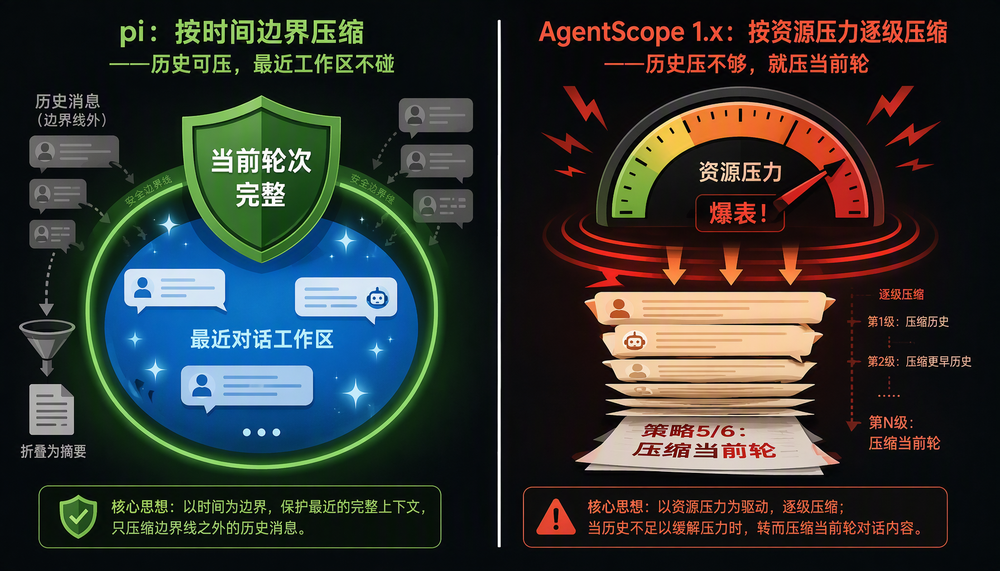
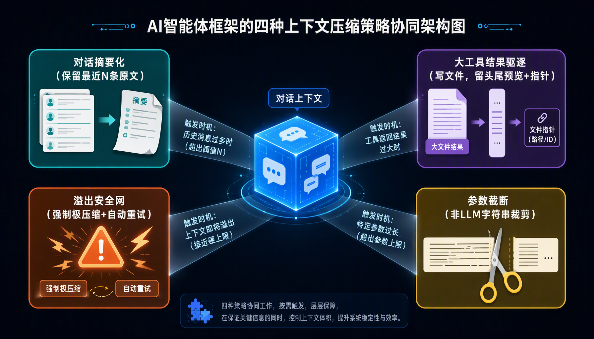

> **出处澄清**：AutoContextMemory 是 **AgentScope 1.x**（`agentscope-ai/agentscope-java`）的上下文压缩扩展，位于 `agentscope-extensions-autocontext-memory`。以下六层机制是 **1.x 的设计**，2.0 已重构为四正交策略（见文末「AgentScope 2.0 的演进」）。它与下文 pi 是两套独立方案，不是同源。

AutoContextMemory 的设计哲学是：**先压"代价低、收益高"的，再压"代价高、收益不确定"的**

## 六层渐进式压缩
### 第一层 压缩历史对话轮次工具消息
工具消息包括 tool_use tool_result
把原始结果摘要成"我之前查到了 XX 信息"
提示词设计
```text
“你是一位专业的内容压缩专家。你的任务是智能地压缩并总结以下工具调用历史记录：
必须保留：工具名称、精确的参数（含具体值），以及对输出结果的简明事实性总结。针对同一工具的重复调用：
• 将完全相同的调用（参数相同、结果相同）合并为一条记录，并注明调用频次。
• 仅列出导致不同结果的不同参数组合。• 如果行为未发生改变，请省略非必要的可变参数（例如时间戳、请求 ID 等）。
如果工具的名称或输出结果暗示了副作用（例如包含 'write'、'update'、'delete'、'create'，或返回了类似 'written' 的确认信息），则应将其视为写入/修改操作。
对于此类操作，必须保留关键细节：文件路径、数据键名、内容片段、状态变更以及成功/错误指示。
输出必须是纯文本格式——严禁使用 Markdown、JSON、项目符号、标题或任何元评论。
如果发现任何工具的输出被截断或损坏，请加上 '[TRUNCATED]' 标记。”
```

### 第二层 大消息卸载
大消息指的是超过 largePayloadThreshold的消息内容（默认 5KB），

> 5KB 这个数字的含义大约是：一个长篇网页正文、一个完整的 SQL 查询结果集、一段几千字的论文摘录、一张图的 base64 编码——这些内容的特点是"信息密度低且查阅频率低"，不需要实时存在于上下文里，按需 reload 即可。

所谓卸载。是这样的流程：取出消息的文本内容，比较长度是否超过阈值。超过的话：

- 第一步，生成一个新 UUID，把原始消息整条放进 offloadContext （map）。
    
- 第二步，截取前 offloadSinglePreview 个字符（默认 200）作为预览，再加省略号。注意这个预览不是简单截前 200 字，而是构造成"前 200 字内容 + 换行 + <context_offload uuid="xxx"/> 标签"的形式。
    
- 第三步，构造一条新的替代消息，role 和 name 都和原消息相同（保持角色身份），content 只放上面构造好的预览文本，metadata 里写入压缩元数据（包括 offloaduuid）。
    
- 第四步，用 rawMessages.set(i, replacementMsg) 直接原位替换。
    
- 第五步，记录压缩事件（事件类型为 LARGE_MESSAGE_OFFLOAD_WITH_PROTECTION 或 LARGE_MESSAGE_OFFLOAD，区分策略 2/3）。

策略 2 和策略 3 用的是同一个方法 offloadingLargePayload，区别只是 `lastKeep` 参数（是否保护最近的消息不被处理）。这种"先保守后激进"的设计很常见——能用温和方式解决就不要用激进方式。

策略 2 的"保护"含义是：在卸载大消息时，最近的 lastKeep 条（默认 50）一定不动。这样即便大消息恰好出现在最近，也优先保留以维持对话连贯性。

- 如果策略 2 找到了可卸载的内容（即"既是大消息、又不在最近 50 条里"），就生效返回；
    
- 如果策略 2 因为"所有大消息都在最近 50 条里"或"根本没有大消息超出 lastKeep 范围"而无功而返，就到策略 3。

### 第三层
策略3的lastKeep 参数变成 false。这导致搜索范围扩大到"从开头到最新 final assistant"——也就是说，最近 50 条里的大消息现在也成了候选。

### 第四层 历史轮次摘要
比如：

```
user[1]: "帮我订机票"assistant[2]: 调用 search_flights 工具tool[3]: 返回 50 条航班assistant[4]: "我推荐这 3 条..."（final response）
```

然后会调用 summaryPreviousRoundConversation 让 LLM 生成摘要。这个 prompt 与策略 1 不同，要求模型"把整轮对话压缩成一段总结"，重点是 user 提了什么需求、Agent 给了什么结论。

以上对话压缩完之后：

```
user[1]: "帮我订机票"assistant[摘要]: "用户询问机票预订，我搜索后推荐了 3 条航班（CA1234, MU5678, 9C7890）。详情见 uuid=abc-123。"
```

> 被卸载的 [2][3][4] 三条全部存进 offloadContext，可通过 UUID 拉回。

本轮用到的默认压缩提示词：

```
“你是专为自主智能体（Autonomous Agents）设计的对话压缩专家。
你的任务是重写上一轮助手的最终回复，将其改写为一个自包含、简洁的回复，并将该轮次中获取的所有关键事实融入其中——且绝不能提及任何工具、函数或内部执行步骤。输入内容将包括：用户的原始提问、助手的原始回复，以及用于生成该回复的任何工具执行结果。你的输出将替换对话历史中的原始助手消息，从而为未来的上下文构建一个干净的‘用户 -> 助手’对话对。处理准则：绝对不要提及工具、函数、API 调用或执行步骤（例如，避免使用‘我调用了……’、‘系统返回了……’、‘在运行 X 之后……’等表述）。相反地，请将所有发现直接陈述为助手现在已掌握的事实性知识。保留工具结果中的关键事实，特别是：
• 文件路径及其内容、变更或创建情况（例如：‘/etc/app.conf 设置了 port=8080’）。
• 具有诊断价值的精确错误信息（例如：‘Permission denied (errno 13)’、‘timeout after 30s’）。
• ID、URL、端口号、状态码、配置值和数据键名。
• 写入/修改操作的执行结果（例如：‘已将维护标志写入 /tmp/status’、‘已更新数据库中 user_id=789 的邮箱’）。
• 服务状态或进程信息（例如：‘auth-service 已停止’、‘PID=4567’）。如果执行了某项操作（例如：写入了文件、重启了服务），请明确说明更改了什么以及更改的位置。
如果某项操作失败或未完成，请说明具体的限制条件（例如：‘无法重启：权限被拒绝’）。合并冗余信息；省略那些没有任何可操作细节的通用成功提示。使用清晰、信息量丰富的语言——避免使用诸如‘根据日志显示……’或‘观察到……’等元描述短语。
输出必须是纯文本格式：严禁使用 Markdown、项目符号、JSON、XML 或章节标题。”
```

### 第五层 当前轮大消息 LLM 摘要
之前针对历史轮次，当历史轮次已经压缩的没有办法再压缩时，考虑动刀当前轮次
```
“你是一位专业的内容压缩专家。你的任务是智能地总结以下消息内容。该消息超出了大小阈值，需要在保留所有关键信息的前提下进行压缩。重要提示：
 此内容来自当前轮次。请在压缩时格外谨慎和保守。请尽可能多地保留以下内容，因为这些信息正在当前的对话中被积极使用。请提供一个简明扼要的总结，需满足以下要求：
 保留所有关键信息和核心细节。维持重要的上下文，以便未来参考。
 突出任何重要的结果、产出或状态信息。如果存在工具调用信息，请予以保留（包括工具名称、ID、关键参数）。”
```

### 第六层 当前轮整体压缩
这个压缩有一个特点，就是比例化压缩：

- 第一步算原始内容的总字符数（用 calculateMessagesCharCount 把所有 block 都算上）。
    
- 第二步用配置的 currentRoundCompressionRatio（默认 0.3）算出目标字符数 = 原始字符数 × 0.3。
    
- 第三步在 prompt 里直接告诉模型："原始内容是 X 字符，目标压缩到 Y 字符（约 30%）"。

这一轮由于没有动刀空间可言，只能强行压缩到一定字符数

```
“你是专为自主智能体（Autonomous Agents）设计的上下文整合专家。你的任务是将新的工具执行结果整合到当前的对话上下文中。输入结构：
输入内容包含：
(a) 可选的：一个先前的压缩上下文块，以 <!-- CONTEXT_OFFLOAD: uuid=... --> 结尾。
(b) 紧接其后的是当前轮次中零个或多个交替出现的 tool_use（工具调用）和 tool_result（工具结果）消息。输入中不包含用户消息。与计划相关的工具已在上一级流程中被过滤掉。你的工作流程：如果输入中包含匹配 <!-- CONTEXT_OFFLOAD: uuid=... --> 的行：将该行之前的所有文本原封不动地保留为先前上下文。仅处理该行之后的 tool_use / tool_result 对。
否则（未找到卸载标记）：将全部输入视为第一轮压缩中的新工具交互。仅基于这些工具调用及其结果生成摘要。针对每一个 tool_use / tool_result 对：以第一人称的事实陈述进行总结：
“我调用了 [tool_name]，参数为 [arg1=value1, ...]；返回结果：[关键细节]。”保留所有技术细节：文件路径、ID、错误代码、配置值、状态变更。如果结果被截断或格式错误，请将其逐字包含，并在前面加上 [UNPARSED OUTPUT]（未解析的输出）前缀。
输出要求：
输出为一个纯文本块，包含：[先前上下文（如果有）]\n[新工具摘要]不要在输出中包含任何 <!-- CONTEXT_OFFLOAD --> 标签。不要提及用户的请求、意图或问题（因为输入中根本没有这些内容）。不要使用 Markdown、JSON、项目符号，也不要使用诸如“如前所述”、“新操作：”之类的短语。
该输出将作为新的压缩上下文，新的卸载标签将在外部追加。可以从 tool_result 中安全删除的内容：样板文本（如许可证声明、自动生成的注释）。没有任何可操作数据的冗余成功提示。重复的日志前缀（前提是核心内容已保留）。
严格禁止：
包含原始的 tool_use / tool_result JSON 数据。重新压缩或修改先前的上下文。添加任何卸载标记（无论是旧的还是新的）。”
```

# pi的上下文压缩
原文：https://dg-ai-notes.pages.dev/modules/ch09-compaction/python/#%E5%90%91%E5%90%8E%E9%81%8D%E5%8E%86%E4%BF%9D%E6%8A%A4%E6%9C%80%E9%87%8D%E8%A6%81%E7%9A%84%E4%B8%9C%E8%A5%BF

> pi（`earendil-works/pi`）与上文 AutoContextMemory（AgentScope 1.x）是**两套独立方案**：pi 是"按时间边界压缩"，AgentScope 1.x 是"按资源压力逐级压缩"。对照见本章末尾。

pi 是开源编码 Agent（GitHub `earendil-works/pi`），类似 Claude Code 的 CLI 编码助手。它的压缩核心设计：**最近的上下文最重要，优先保完整轮次，保不住就用摘要缝回去**。

## 触发条件

```python
def should_compact(context_tokens, context_window, settings) -> bool:
    if not settings.enabled:
        return False
    return context_tokens > context_window - settings.reserve_tokens
```

默认值：`context_window = 200,000`，`reserve_tokens = 16,384`（为回复预留），即 token 超过 **183,616** 时触发。

**两种触发场景**：

| | 时机 | 条件 |
|---|---|---|
| **预防性** | 每轮对话结束（`agent_end`）后主动检查 | token > 窗口 − 预留 |
| **应急性** | API 报上下文溢出错误时 | 已经爆了，补救式压缩 |

一句话：**一个快满提前压，一个爆了立刻救。**

> **Token 估算用 `chars / 4` 启发式**（`math.ceil(chars/4)`）。此方法**严重低估中文**——1 个汉字实际约 1-2 token，却被算成 0.25 token。设计哲学"宁可高估、不可低估"：高估最多多压一次（无害），低估会触发 API 溢出报错（有害）。
>
> **关键时序**：压缩发生在**两轮对话之间**——`agent_end` 后检查超阈即压缩，下一轮用户开始时从压缩结果重建。

## 切割点算法：向后遍历保护最近

核心问题：从哪里"下刀"分割消息序列。

**向后遍历**（`find_cut_point`）：从最新消息往回走，累积 token，到 `keep_recent_tokens`（默认 20,000）停止，在停止位置之后找最近的有效切割点。

> 切点语义是**"保留区的第一条"**而非"被切掉的最后一条"——切在 user 上意味着该 user 及其后续全部进保留区，天然保证 Turn 完整。

**为什么是 user 和 assistant 两个切点**：

- **user 切**：以 user 为界，它和后面的整轮（assistant + tool_result）全进保留区 → 轮次完整
- **assistant 切**：user 切点太粗——往回走预算用完时最近的 user 可能隔很远，保留区会过大甚至压缩失败；assistant 切点能**精确卡在预算线上**，代价是轮次被切开
- **tool_result 不能切**：它必须紧跟带 toolCall 的 assistant，切了上下文断裂

一句话：**user 保完整、assistant 控精度、tool_result 是结构红线。**

**被切断的 Turn 怎么补**：切在 assistant 上时，该 Turn 被切开的前缀（`turnPrefixMessages`）用 `TURN_PREFIX_SUMMARIZATION_PROMPT` 生成一份轻量摘要，与主摘要**并行生成**，最后合并成一个摘要文本。

## 结构化摘要

- 强制 LLM 填 **6 个固定 section**：
  1. `## Goal` — 用户最初要做什么
  2. `## Constraints & Preferences` — 约束
  3. `## Progress` — Done / In Progress / **Blocked** 子项
  4. `## Key Decisions` — 关键决策
  5. `## Next Steps` — 下一步
  6. `## Critical Context` — 不能忘的关键信息

- **为什么固定**：自由摘要会漏——LLM 容易被"有意思的内容"带跑，忘了记用户核心需求；固定模板逼它每项扫一遍
- Progress 里单设 **Blocked**：记录卡住的事，下一轮优先解锁
- 多次压缩传 `previousSummary` 做**增量更新**而非重写，防"摘要漂移"累积误差

一句话：**用模板对抗 LLM 的选择性失忆。**

## 偏向保留完整轮次

- 从最新消息**往回走**，token 累积到 `keep_recent_tokens`（20k）才停 → "最近的上下文最重要"
- 切点语义：**切点 = 保留区的第一条**。切在 user 上 = 整轮完整保留
- 默认优先切 user；只有预算不够、必须精确控量时才切 assistant，再用 **turnPrefix 轻量摘要**把被切开的前缀补回去

一句话：**能保整轮就保整轮，实在不行才切轮次、用摘要缝回去。**


### 为什么安全：四道结构性防线

1. **时序安全（最关键）**：压缩**只发生在轮与轮之间**——`agent_end` 后检查、下一轮开始前完成。这决定了 pi 压缩的那一刻**"正在执行的轮次"在物理上不存在**，永远不会面对"要不要压当前轮"的问题
2. **边界安全**：`find_cut_point` 向后走到 20k token 才停 → 最近 N 轮原文完整保留，压缩只作用于"已完成的旧对话"
3. **结构安全**：切点只允许 user/assistant，`toolResult` 永不切 → 工具对（tool_use ↔ tool_result）作为原子单元**整块移动**，要么整轮进保留区、要么整轮进摘要，不存在"只有调用没结果"的悬空状态
4. **角色安全**：摘要以**独立的 CompactionSummaryMessage**（`<summary>` 标签包裹）写入，不是伪装成 ASSISTANT 文本 → 模型能区分"这里是摘要"和"这是我自己的回复"，不会模仿摘要格式说话

一句话：**pi 的安全性来自结构设计（时序 + 边界 + 切点 + 角色），它让"压当前轮"这个选项在物理上不存在。**

### 从"历史轮次触发"看：起点相同，底线不同

两者都是从历史开始压，但处理方式和底线不同：

| | pi | AgentScope 1.x |
|---|---|---|
| **处理历史的起点** | 一步到位：整段旧前缀 → 结构化摘要，最近 20k token 原样保留 | 逐层递进：先压工具调用（小刀）→ 卸载大消息（中刀）→ 整轮总结（大刀） |
| **对"最近"的保护** | 硬边界：20k token 永不压缩 | 软保护：`lastKeep=50` 条（策略 2），策略 3 就取消 |
| **历史压不够时** | 压不动就停，下一轮再压 | **保证缩下来**：进入策略 5/6，动当前轮 |
| **摘要的角色身份** | 独立 CompactionSummaryMessage | 策略 6 以 ASSISTANT 文本写回 |



关键在"历史压不够时"这一行——这就是安全性的分水岭：

> **pi 对历史的处理是"尽力而为"**：压到保留区边界就停，压不够就留待下次，**绝不以当前轮为代价**。
>
> **AgentScope 1.x 对历史的处理是"保证完成任务"**：历史压够了当然安全，但"压不够"是它设计里被允许的路径，而这条路径必然通向当前轮。

**为什么"压当前轮"是不可逆的损伤**：

- **历史轮次 = 已提交状态（死数据）**。压坏了损失的是信息，可补救——pi 有摘要、文件跟踪，AgentScope 有 offload 拉回。损伤是**信息级的**
- **当前轮 = 正在计算的中间状态（活数据）**。压坏了破坏的是**计算本身**——模型下一轮还要基于轨迹继续决策，轨迹被换成摘要后，它不知道哪个工具调过、哪个结果对应哪次调用、任务到哪一步。损伤是**执行级的**，无法补救，直接表现为行为错误（重复调用、幻觉、格式模仿）

一句话：**pi 压缩的是"历史"（已发生的事实，压错了损失信息）；AgentScope 1.x 在资源压力下压缩的是"现在"（正在进行的推理，压错了破坏执行）。**

> 两者的取舍本质：**pi 优先保护执行正确性（可能多压几次），AgentScope 1.x 优先保证压缩成功（可能破坏执行）**。这也是为什么 2.0 最终倒向了"保留最近 N 条原文 + 只总结前缀"的 pi 式边界。

## 文件跟踪（编码 Agent 特有）

通过 `extractFileOperations` 累积整个会话读/改过的文件，以 `<read-files>` / `<modified-files>` 标签附加到摘要末尾，让 Agent 多轮压缩后仍知道读过/改过哪些文件。这是"通用压缩机制 + 领域扩展"模式——算法本身通用，领域信息通过 `details` 字段承载。

## 实战示例：一次 98 万 token 的压缩

以下是一份真实的 pi 压缩输出，来自一个编码 Agent 会话——实现 `FULL_DIMENSION_REPORT` 规则（承认书智能检测系统），会话中读了 50+ 文件、跑了多轮测试、启动了两个并行 code review 子 Agent，上下文累积到 **981,447 tokens** 后触发自动压缩。

### 触发与切割

```
Compacted from 981,447 tokens
// 从 981,447 个 token 压缩而来
```

98 万 token 远超默认窗口（200K），说明这个会话已经历了多轮压缩（每次压缩后继续工作、继续累积）。压缩后的摘要约 3000-5000 token，加上保留的近期消息（~20K token），总上下文回到安全水位。

### 结构化摘要的六个 section

#### 1. Goal（一句话目标）

```markdown
Implement the FULL_DIMENSION_REPORT rule in the letter-auto v2 inspection system.
This rule checks that all measurable dimensions from 2D drawings are correctly
measured in the first full dimension report homepage, with proper spec matching
and sample validation. The visual model must be qwen3.8-max (user override from
original qwen3.7-plus plan).
```

> **中文翻译**：在 letter-auto v2 检测系统中实现 FULL_DIMENSION_REPORT 规则。该规则检查所有二维图纸中的可测尺寸是否在物理顺序第一份全尺寸报告首页中被正确测量，包括规格匹配和样本验证。视觉模型必须使用 qwen3.8-max（用户覆盖了原计划中的 qwen3.7-plus）。

**解读**：Goal 不是"写代码"这种泛泛描述，而是精确到规则名、检查逻辑、模型选择。注意最后一句"user override from original qwen3.7-plus plan"——这是会话中做出的决策，被摘要捕获，防止压缩后模型按旧计划用错模型。

#### 2. Constraints & Preferences（15 条约束）

```markdown
- Rule applies to 7 templates: FM-818, FM-820, FM-821, FM-822, FM-823, FM-872, FM-920
  (NOT FM-819)
  // 规则适用于 7 个模板（不包含 FM-819）
- Drawings: read all valid 2D drawing pages from template targets
  // 图纸侧：读取模板配置的全部有效二维图纸页
- Report: read ONLY the first full dimension report homepage; ignore continuation pages
  // 报告侧：只读取物理顺序中的首份全尺寸报告首页；忽略续页
- High-res full page vision only, no 3x3 tiles; if coverage cannot be proven →
  INCONCLUSIVE/FULL_DIMENSION_UNRESOLVED
  // 只用高分辨率整页视觉，不切九宫格；无法证明覆盖完整时返回 INCONCLUSIVE
- Match only by original drawing dimension ID, not numeric fuzzy match
  // 只按原图尺寸编号匹配，不做数值模糊配对
- Valid report rows need at least 5 numeric Samples
  // 有效报告行至少需要 5 个数字 Sample
- Python does ID join, spec compare, unit normalize; Agent extracts raw Evidence only
  // Python 负责编号连接、规格比较、单位归一化；Agent 只提取原始证据
- Model: qwen3.8-max, max_turns=10, no USD budget
  // 模型：qwen3.8-max，最多 10 轮，不设美元预算上限
- One Verdict per rule; Evidence keeps all issue details
  // 一条规则只生成一个判定结果；证据保留全部问题明细
...（共 15 条）
```

**解读**：这些约束来自用户在设计文档中写明的业务规则。固定模板的好处在这里体现——如果让 LLM 自由摘要，它很可能漏掉"NOT FM-819"这种否定约束，或者把"至少 5 个 Sample"这种精确数字模糊化。模板逼它逐条扫过。

#### 3. Progress（Done / In Progress / Blocked）

```markdown
### Done（已完成）
- [x] Created evidence models: DimensionObservation, ReportRowObservation, ...
  // 创建证据模型：尺寸观察、报告行观察等
- [x] Created dimension_report.py with math/parsing logic
  // 创建 dimension_report.py，包含数学计算和解析逻辑
- [x] Added DRAWING_DIMENSIONS AgentProbe with model qwen3.8-max
  // 添加 DRAWING_DIMENSIONS Agent 取证器，使用 qwen3.8-max 模型
- [x] Added full_dimension_report judge with 8-level priority
  // 添加全尺寸报告判定器，8 级优先级
- [x] Updated all 7 YAML templates with new fields
  // 更新全部 7 个 YAML 模板，添加新字段
- [x] Created comprehensive test file (30+ tests)
  // 创建完整测试文件（30+ 个测试用例）
- [x] All 429 unit+integration tests pass, ruff clean
  // 全部 429 个单元+集成测试通过，代码风格检查通过
...（共 20+ 项）

### In Progress（进行中）
- [ ] Code review completed — results received, implementation confirmed correct
  // 代码审查已完成——收到结果，确认实现正确
- [ ] Commit the changes to current branch
  // 将改动提交到当前分支

### Blocked（阻塞）
- (none)（无）
```

**解读**：Done 列表有 20+ 项，每一项都是具体的文件/功能/测试，不是"写了些代码"。In Progress 精确到"code review 完成但未 commit"——压缩后的模型知道下一步该做什么。Blocked 为空也要显式写出，这是模板的强制要求。

#### 4. Key Decisions（7 个关键决策）

```markdown
- qwen3.8-max over qwen3.7-plus: User explicitly overrode the plan's model choice
  for this rule only; other vision probes keep qwen3.7-plus
  // 选用 qwen3.8-max 而非 qwen3.7-plus：用户明确覆盖了计划中的模型选择，
  // 仅限本规则；其他视觉取证器仍用 qwen3.7-plus
- Runner short-circuit: When report is missing or ambiguous, run_drawing_dimensions
  returns prebuilt Evidence without calling the Agent SDK, saving a model call
  // 运行器短路：报告缺失或存在歧义时，直接返回预构建的证据，
  // 不调用 Agent SDK，节省一次模型调用
- Postprocess overwrites derived fields: Python always recomputes spec_match,
  within_range, mappings, issues — agent output for these is ignored
  // 后处理覆盖派生字段：Python 始终重新计算规格匹配、范围判定、
  // 映射和问题列表——Agent 对这些字段的输出被忽略
- Same-page duplicate IDs → unresolved: Cross-page same IDs map independently;
  same-page duplicates are flagged unresolved
  // 同页重复编号 → 未解析：跨页相同编号独立映射；
  // 同页重复编号标记为未解析
```

**解读**：这些是会话中做出的、后续工作必须知道的设计选择。第一条尤其重要——"只有这条规则用 qwen3.8-max，其他仍用 qwen3.7-plus"，如果这条丢了，压缩后的模型可能在改其他 Probe 时误用模型。

#### 5. Next Steps

```markdown
1. Review the code review subagent results (already completed)
   // 审查代码审查子 Agent 的结果（已完成）
2. Commit all changes with message like: feat: add FULL_DIMENSION_REPORT rule
   // 提交所有改动，提交信息类似：feat: 添加 FULL_DIMENSION_REPORT 规则
3. Push to branch
   // 推送到分支
```

#### 6. Critical Context（不能忘的技术细节）

```markdown
- Key files modified: evidence.py, probe.py, probes.py, rules.py, inspection.py, ...
  // 修改的关键文件
- Probe definition: DRAWING_DIMENSIONS = AgentProbe(prompt_path="drawing_dimensions.md",
  evidence=FullDimensionReportEvidence, channels={NATIVE,OCR,VISION},
  tools=("search_text","extract_native_table",...,"render_page"),
  model="qwen3.8-max", max_turns=10, ...)
  // 取证器定义：提示词路径、证据模型、通道、工具列表、模型、最大轮数
- Judge priority: report_missing(FAIL) > explicit_ng(FAIL) > measurement_missing(FAIL)
  > spec_mismatch(FAIL) > sample_invalid(FAIL) > sample_out_of_range(FAIL)
  > unresolved(INCONCLUSIVE) > valid(PASS)
  // 判定优先级：报告缺失 > 明确NG > 测量缺失 > 规格不一致
  // > 样本无效 > 样本超差 > 未解析 > 通过
- Git status: 22 modified files + 3 new files, all uncommitted on branch v2-foundation
  // Git 状态：22 个修改文件 + 3 个新文件，均未提交，在 v2-foundation 分支上
```

**解读**：Probe 定义的完整参数、Judge 的 8 级优先级链、Git 状态——这些都是压缩后继续工作时的"硬事实"。如果丢了 Judge 优先级，模型可能在修 bug 时搞错判定顺序。

### Split Turn：压缩发生在 turn 中间

```
Turn Context (split turn):
// 轮次上下文（分割轮次）：

Original Request
// 原始请求
The user's system reported the completion of a dual-axis code review workflow
(Standards and Spec) for the FULL_DIMENSION_REPORT implementation.
// 用户的系统报告了 FULL_DIMENSION_REPORT 实现的双轴代码审查工作流
// （标准轴和规格轴）已完成。

Early Progress
// 早期进展
- Read the review outputs and identified key P1 issues:
  // 读取审查输出，识别出关键 P1 问题：
    1. Circular dependency between dimension_report.py and probes.py
       // dimension_report.py 和 probes.py 之间的循环依赖
    2. Continuation pages incorrectly blocking PASS status
       // 续页错误地阻止了 PASS 状态
    3. FM-872 drawing pages being incorrectly stripped
       // FM-872 图纸页被错误地剥离
    4. pdf_tools.py render_page description improperly containing business semantics
       // pdf_tools.py 的 render_page 描述不当包含业务语义
- Implemented fixes for all 4 P1 issues
  // 已实现全部 4 个 P1 问题的修复

Context for Suffix
// 后缀上下文（告诉压缩后的模型"你现在在哪"）
- The assistant is in the final verification stage of the refactoring
  // 助手正处于重构的最终验证阶段
- Running grep and read commands to confirm relocated functions are correct
  // 正在运行 grep 和 read 命令，确认迁移后的函数正确无误
```

**解读**：这是 pi 的 Split Turn 机制的实际表现。一个 turn 的 token 量超过了 `keep_recent_tokens`（20K），Pi 在 turn 内部切割：

| 区块 | 作用 |
|------|------|
| **Original Request**（原始请求） | 压缩前用户/系统的原始请求（code review 完成，要求修 P1） |
| **Early Progress**（早期进展） | 这个 turn 前半段已完成的工作（修了 4 个 P1 问题） |
| **Context for Suffix**（后缀上下文） | 告诉压缩后的模型"你现在在哪"（正在做最终验证） |

Split Turn 的处理方式：Pi 生成两份摘要（历史摘要 + turn 前缀摘要），然后合并。这保证了即使一个 turn 特别长（比如一次大规模重构），切割后的模型仍知道这个 turn 的开头做了什么。

### 文件跟踪：累积 50+ 读、8 改

```xml
<read-files>
src/letter_auto/v2/probe.py
src/letter_auto/v2/rule.py
src/letter_auto/v2/verdict.py
src/letter_auto/v2/dimension_report.py
src/letter_auto/v2/probes.py
src/letter_auto/v2/rules.py
src/letter_auto/v2/agent_runtime.py
src/letter_auto/v2/evidence.py
src/letter_auto/v2/inspection.py
src/letter_auto/v2/pdf_tools.py
src/letter_auto/v2/template_loader.py
src/letter_auto/assets/prompts/drawing_dimensions.md
src/letter_auto/assets/templates/FM-818.yaml
...（共 50+ 文件）
</read-files>

<modified-files>
src/letter_auto/v2/evidence.py
src/letter_auto/v2/inspection.py
src/letter_auto/v2/probes.py
src/letter_auto/v2/rules.py
src/letter_auto/static/mcp_tester.html
tests/unit/v2/test_v2_drawing_critical_marks.py
...（共 8 文件）
</modified-files>
```

**解读**：`<read-files>` 和 `<modified-files>` 跨多次压缩累积保留。即使经历了 3-4 次压缩，Agent 仍知道整个会话中读过和改过哪些文件。这对编码 Agent 至关重要——压缩后如果要修 bug，模型知道该看哪些文件、哪些文件已经被改过。

### 压缩后的上下文结构

```
压缩前（981,447 tokens）：
  [system prompt] [msg1] [msg2] ... [msg_N-50] [msg_N-49] ... [msg_N]
                   └─────── 被压缩 ───────┘    └── 保留 ~20K tokens ──┘

压缩后（~25,000 tokens）：
  [system prompt] [结构化摘要 ~3-5K] [近期消息 ~20K]
                   ↑                    ↑
              Goal/Constraints/      最后几轮 grep/read
              Progress/Decisions/    验证输出
              Next Steps/Critical
              Context + 文件跟踪
```

98 万 token 被压到约 2.5 万，压缩比约 **97.5%**。但保留了继续工作所需的全部关键信息：目标、约束、进度、决策、下一步、文件清单。

### 这次压缩暴露的 pi 短板

对照 Grok 的机制，这次压缩有几个可观察的不足：

1. **无效果守卫**：98 万压到 2.5 万，压缩比很高，但如果某次压缩只省了 10%，pi 也会照样提交——Grok 的 `max_reduction_ratio(0.8)` 会回滚
2. **无原文回查**：压缩后，50+ 个 read 文件的具体内容全部丢失，只剩文件名。如果后续需要回看某个文件的具体内容，只能重新 `read`——Grok 的 Transcript/Segments 落盘可以让 Agent 用 `grep` 查阅
3. **Split Turn 的信息损失**：Early Progress 里"修了 4 个 P1 问题"只有标题级描述，具体的代码 diff 被丢弃。如果压缩后模型需要理解某个 fix 的细节，只能重新读文件

> 一句话：**这份 98 万 token 的压缩展示了 pi 的核心能力——用结构化模板把海量工作浓缩为可操作的摘要。但也暴露了它的"压完即弃"哲学：细节丢了就是丢了，没有回查通道。**

## 配置参数

| 参数 | 默认值 | 说明 |
|------|--------|------|
| `context_window` | 200,000 | 模型上下文窗口（Claude Sonnet） |
| `reserve_tokens` | 16,384 | 为回复预留 |
| `keep_recent_tokens` | 20,000 | 保留区最小 token 量 |
| Token 估算 | `chars / 4` | 简易启发式 |

## 与 AutoContextMemory 的对比

| 维度 | AutoContextMemory | pi |
|------|-------------------|-----|
| 核心动作 | **卸载**（offload 到 map 按需拉回，不丢原始数据）+ 摘要 | **压缩**（旧消息变结构化摘要，旧的丢弃） |
| 摘要结构 | 自由文本（强调事实性） | **6 固定 section 模板** + 增量更新 |
| 触发机制 | 六层渐进式，从便宜到昂贵 | 单一 token 阈值 + 向后遍历找切点 |
| 领域扩展 | 通用对话 | 文件跟踪（编码场景） |
| 保留最近 | `lastKeep=50` 保护最近 50 条 | `keep_recent_tokens=20,000` token 预算 |

> 一个有趣对照：AutoContextMemory 靠"卸载到 map 随时拉回"保全信息（**保全在存储层**），pi 靠"固定模板 + 增量更新 + 文件跟踪"保证摘要不漂移不遗漏（**保全在提示词设计层**）。

## AgentScope 2.0 的演进

旧版 1.x 六层机制的代价是：进入第 5、6 层后会**主动修改当前执行轮次**。社区有真实 Bug 报告（[issue #1026](https://github.com/agentscope-ai/agentscope-java/issues/1026)）：

> 策略 6 `summaryCurrentRoundMessages` 把 `[tool_use + tool_result]` 消息对压成**一条普通 ASSISTANT 文本消息** → LLM 看不到工具调用配对，以为没执行过 → **反复用相同参数重调同一工具**，形成无限循环。临时方案是在 system prompt 加"把压缩后的消息视为已完成工具执行"——被报告者评价为 *fragile and model-dependent*。

因此 AgentScope 2.0 把六层递进**重构为四个正交策略**（可自由组合、默认全部关闭，参考 [java.agentscope.io/v2 compaction 文档](https://java.agentscope.io/v2/en/docs/harness/compaction.html)）：

| 策略 | 解决的问题 | 触发时机 | 实现 |
|------|-----------|---------|------|
| 对话摘要化 | 上下文太**深**（消息数堆积） | 每次模型推理前 | 前缀蒸馏为结构化摘要（`SESSION INTENT / SUMMARY / ARTIFACTS / NEXT STEPS`）+ **保留最近 N 条原文**（`keepMessages`/`keepTokens`） |
| 大工具结果驱逐 | 上下文太**宽**（单条结果巨大） | 工具执行后（默认 >80K 字符 ≈20K token） | 完整输出写工作区文件，上下文只留**头尾预览**（各 ~2K 字符）+ `read_file` 指针，按需读取 |
| 溢出安全网 | API 报 `context_length_exceeded` | `call()` 抛异常时 | 强制极压缩（`triggerMessages=1`）+ 自动重试一次 |
| 参数截断 | 大工具参数无人再读 | 摘要化前轻量预处理 | 非 LLM 字符串截断（`maxArgLength` 等），近乎零成本延迟压缩触发 |



**压缩前还做两件保全动作**（默认开启）：

- `offloadBeforeCompact`：把原始消息写入未压缩日志 `*.log.jsonl`，使 `session_search` 工具仍可检索
- `flushBeforeCompact`：从对话前缀提取事实到长期记忆（`MEMORY.md` / `memory/*.md`），压缩后仍可用 `memory_search` 取回

**与旧版的核心区别**：

1. **正交组合，而非层级递进**——四种策略独立开关，不再"从便宜到昂贵逐层尝试"
2. **不触碰执行中状态**——压缩只动对话消息列表；Plan Mode、子智能体后台任务、todo 列表、权限规则各有独立状态机
3. **吸收了两家之长**——"保留最近 N 条原文 + 只总结前缀"正是 pi 的边界逻辑；"大结果写文件 + 头尾预览 + 指针"则是 AutoContextMemory 策略 2 的 offload 的**落盘版**。2.0 是"Pi 式边界 + AgentScope 式落盘"的融合

> 一句话演进：**1.x 是"哪里占空间就压哪里"（资源压力驱动，可能动当前轮）；2.0 是"历史可压、执行中不碰"（边界驱动），并补上文件系统与长期记忆做数据保全。**

# Grok Build 的压缩（xai-org/grok-build）

来源：[grok-build 代码解读 Wiki · 第 17 章：对话压缩](https://linearuncle.github.io/grok-build-wiki/#/17-compaction)（第三方源码解读，核心机制经源码 `crates/common/xai-grok-compaction/` 验证）

核心结论：**Grok Build 不是单一的"把旧消息总结一下"，而是一套"摘要替换 + 分区压缩 + 原文回查"的机制。**

## 两层压缩架构

| 类型 | 时机 | 触发方 | 代码位置 |
|------|------|--------|----------|
| **对内压缩** `intra_compaction` | Agent 执行任务过程中（窗口快满） | 自动 | `intra_compaction/compact.rs` |
| **对外压缩** `inter_compaction` | 会话结束后 | `/compact` 命令或外部系统 | `inter_compaction/compact.rs` |

对内压缩更复杂——需要在 Agent 运行中"插队"压缩而不中断工作流。

## 触发条件：三个信号 + 源码验证的默认值

触发检查三个信号（`trigger.rs`）：

1. **窗口占用率**：token 超过上下文窗口默认 **85%**（`trigger_threshold_percent: 85`，比较 `last_prompt_tokens / context_length.max_len`）
2. **步数门槛**：`min_steps_before_compact`（默认 3 轮；**FullReplace 模式下被忽略**）
3. **最小可压 token 数**：`min_compactable_tokens: 5_000`——压缩本身要调 LLM 有开销，不划算就不压

源码 `config.rs` 默认值（已逐项验证）：

| 参数 | 默认值 | 说明 |
|------|--------|------|
| `trigger_threshold_percent` | 85 | 触发阈值（窗口占用 85%） |
| `target_threshold_percent` | **50** | 压缩落点（压到窗口 50%）——85 触发、50 落点是一对 |
| `min_compactable_tokens` | 5,000 | 低于此值不压（不值得调 LLM） |
| `max_reduction_ratio` | 0.8 | 效果守卫：至少省 20%，否则丢弃 |
| `min_steps_before_compact` | 3 | 步数门槛（FullReplace 忽略） |
| `steps_trigger_ratio` | **0.3** | HistoryThenSteps：步骤 token 超过历史 token 的 30% 才继续压步骤 |
| `user_message_truncate_chars` | 3,000 | HistoryOnly/HistoryThenSteps 超长用户消息截断 |
| `mode` | FullReplace | 默认压缩模式 |
| `enabled` | **false** | 默认关闭，显式开启（同 AgentScope 2.0 四策略默认全关） |
| 压缩专用模型 | `grok-4.20` | `DEFAULT_COMPACTION_MODEL_NAME` |

## 四种压缩模式（选择"压哪里"）

| 模式 | 行为 | 激进程度 |
|------|------|---------|
| **FullReplace**（默认） | 历史 + 当前步骤**一次性全部**总结替换，不保留尾部 | 🔴 最激进 |
| **StepsOnly** | 只压当前 Agent 循环累积步骤，保留对话历史 | 🟡 |
| **HistoryOnly** | 只压历史，当前执行步骤原文保留（tail-keep） | 🟢 最保守 |
| **HistoryThenSteps** | 先压历史；步骤 token 超过压缩后历史的 **30%** 才再压步骤 | 🟡 折中 |

> 与 pi / AgentScope 的关键差异：pi 和 AgentScope 把"压不压当前轮"写成固定策略，Grok **把它做成可配置的模式**——HistoryOnly 就是 pi 式（时间边界），FullReplace 比 AgentScope 1.x 策略 6 还激进。

### 策略选择：三层递进

选择原则贯穿始终：**越老的内容越先牺牲，当前工作区尽量最后动**——即使默认 FullReplace 最激进，其内部的 fit 阶梯仍遵循这个优先级。

**第一层：模式分发（压哪里）** —— 一次 `match` 决定：

```rust
let result = match policy.mode {
    IntraCompactionMode::FullReplace   => apply_full_replace_compaction(...),
    IntraCompactionMode::StepsOnly     => apply_steps_compaction(...),
    IntraCompactionMode::HistoryOnly   => apply_history_compaction(...),
    IntraCompactionMode::HistoryThenSteps => apply_history_then_steps(...),
};
```

HistoryThenSteps 的内部判断（先压历史，再按比例决定是否压步骤）：

```rust
// 先压历史（NothingToCompact 则忽略继续）
apply_history_compaction(...)
// 只有步骤 token 超过压缩后历史 token 的 30% 才继续压步骤
let ratio_threshold_tokens = (history_tokens as f64 * policy.steps_trigger_ratio).ceil();
let should_compact_steps = steps_tokens > ratio_threshold_tokens;
```

**第二层：fit 阶梯（输入放不下时，牺牲谁）** —— FullReplace 把整个对话喂给压缩模型，若**连压缩模型的窗口都装不下**，`fit_turns_for_summarizer` 四级递进，前一级不够才进下一级：

| 级别 | 动作 | 语义 |
|------|------|------|
| 1. `HistoryTurnSelected` | 丢弃部分**旧历史**轮次 | 先牺牲最老的 |
| 2. `ToolTruncated` | **截断工具结果**内容 | 再压大块输出 |
| 3. `StepTurnsSelected` | **减少当前步骤**轮次 | 最后才动工作区 |
| 4. `Emergency` | 紧急保底，保留最新原始项 | 实在不行只喂最新的 |

`fit_rung` 记录实际用到哪一级（日志/观测）。两个保护细节：

- **空计划拒绝**：fit 后 `llm_turns` 为空或 `tokens_fit == 0` → 返回 `NothingToCompact`——防止给压缩模型喂空内容产生幻觉
- **守卫用 pre-fit 原始 token 数**：效果守卫仍用 fit 前的 `tokens_before` 判断，保证 fit 的裁剪不会让守卫误判丢弃

**第三层：分割点选择（压多少）** —— Steps/History 在选定区域内按预算选切点：

```rust
let target_tokens = context_window * target_threshold_percent(50) / 100;
let plan = select_turns_to_compact(&token_counts, &source_turns, target_tokens, min_compactable_tokens);
// split_idx 之前的压缩，之后的保留为 tail
```

注意用的是 **50%**（`target_threshold_percent`，压缩落点）——"压到窗口一半"是分割点预算，和 85% 触发阈值构成一对。

## FullReplace 流水线：select → fit → sample → guard → commit

```
读取全部对话（get_all_turns_for_compaction）→ 统计 tokens_before
    ↓ 低于 min_compactable_tokens → 返回 NothingToCompact
必要时预裁剪压缩输入（防"压缩请求本身超窗"）：
    先丢部分旧历史 → 截断大工具结果 → 减少当前步骤 → 紧急保底
    ↓
调 LLM 生成摘要（Shared 总结器，解析 <analysis>…</analysis><summary>…</summary>）
    ↓
追加 active_reminder（代码硬塞，非 LLM 生成）
    ↓
构建带 is_compaction_summary 标记的 Developer 角色消息，统计 tokens_after
    ↓
效果守卫：tokens_after > tokens_before × 0.8 → InsufficientReduction，丢弃保持原样
    ↓
replace_with_compaction 用摘要替换整个对话
```

## 三个守卫机制（Grok 独有的补偿设计）

### 1. active_reminder：执行中状态的代码级抢救

FullReplace 连当前工作过程一起替换，但可能有**后台任务**仍在运行（如 `cargo test --watch`、子 Agent）。原始对话里"我启动了 task_id=abc"的证据被压掉后，Agent 会忘记任务存在 → 孤儿进程、忘记轮询/取消。

机制：摘要生成后、提交前，**代码硬追加**一段提醒到摘要末尾（携带子 Agent ID 列表），压缩后的 Agent 仍知道哪些任务在跑、该查询哪些、能取消哪些。

> 关键：这是代码直接搬运，不依赖 LLM 摘要质量。AgentScope 2.0 是**隔离状态**（压缩不碰子任务），Grok 是**补偿信息**（压缩可碰对话，但把任务状态显式补回）。

### 2. 压缩效果守卫：压缩是交易，省不到 20% 就回滚

压缩有损（信息丢失）+ 有成本（LLM 调用）。若摘要写了 85K 而原文 100K，只省 15% 却丢了 15K 信息——**亏本买卖**。

机制：提交前纯数字对比 `tokens_after > tokens_before × max_reduction_ratio(0.8)` → 是则 `InsufficientReduction`，丢弃摘要保持原样。

> 两个检查点是一对：压缩前 `min_compactable_tokens`（有没有得压）管"值不值得调 LLM"，压缩后 `max_reduction_ratio`（压得够不够）管"值不值得丢信息"。pi/AgentScope 均无此机制——pi 是"压不动就不启动"，AgentScope 1.x 是"不允许失败"（策略 6 强制 30% 比例压）。

### 3. `<grok_user_queries>` 保护：用户原话，LLM 永远碰不到

用户原始提问（需求、补充要求、附件引用）**不能压缩、不能改写**——改一个字都可能曲解意图。HistoryOnly/StepsOnly/对外压缩路径中：

1. **拆**（`separate_prior_user_queries`）：喂 LLM 前把旧的查询块从输入中拿掉，LLM 只看到纯净对话
2. 压：LLM 生成摘要——它根本不知道查询块存在，自然不会碰
3. **合**（`assemble_user_queries_preamble`）：把旧查询块 + 新对话里的提问合并，附到新摘要前

结果：查询块只被**代码**搬运（拆出来、放回去），从不经 LLM → 不会改写、不会膨胀、不会丢失。

> 与 pi 的 previousSummary 对比（方向相反）：pi 让 LLM"接着写"旧摘要（防漂移，信任 LLM 更新能力）；Grok 让 LLM"根本看不见"查询块（防膨胀/改写，信任代码搬运能力）。
>
> ⚠️ **注意：默认 FullReplace 不使用这套保护**，依赖共享摘要模型本身保存用户意图——单从用户要求保真角度看，HistoryOnly 反而比默认 FullReplace 更明确。

## 回滚原理：事务式，而非撤销式

**"回滚"的本质是：原始对话在提交之前从未被修改过。** 这不是撤销（undo），而是事务（transaction）——失败路径上根本没有产生任何变更，自然无需恢复。

流程骨架：`select → sample → guard → commit`，commit 是最后一步。**摘要先在内存里构建好、检查通过，才提交替换对话**；任何一步失败，`replace_with_compaction` 永远不被调用。

**三个"不提交"的节点**：

1. **采样失败 → 直接返回，不碰对话**：摘要生成失败（超时、空响应、确定性错误）时函数直接 `return Err`，原始轮次未被触碰
2. **效果不达标 → 守卫拦截，丢弃摘要**：构建好替换项、算出 `tokens_after` 后，守卫检查才决定"要不要提交"——不通过则 `InsufficientReduction`，已生成的摘要只存在于内存里，直接丢弃（源码注释原文 `"insufficient reduction, discarding"`）
3. **提交本身失败 → 错误传播，状态不变**：`replace_with_compaction` 是 harness 实现的 trait 方法，源码注释明确 "On any error, parser state is left unchanged"；且提交是**原子的**（Steps：`split_off(n)` 后 `[摘要] + 保留tail` 链式拼接；FullReplace：`vec![摘要]` 整体替换），不存在"替换一半"的中间状态

**边界情况——HistoryThenSteps 的部分持久化**：历史压缩**已提交成功**、步骤压缩随后失败时，历史**不会回滚**：

```rust
// Steps-error after a successful history pass: history is already
// applied — mutation is durable on the parser.
```

> 回滚只发生在**提交前**；一旦提交，变更就是持久的。对比：pi 是"压不动就不启动"（压缩前避免失败），AgentScope 1.x 是"不允许失败"（策略 6 强制比例压），Grok 是"允许失败，失败 = 不提交"（提交前检查）。

## 压缩后的三种结果模式（原文回查）

| 模式 | 内容 | 定位 |
|------|------|------|
| **Summary** | 只留摘要 | 最省 token，漏掉的信息无法恢复 |
| **Transcript** | 摘要 + 原始 `updates.jsonl` 路径 | 需精确错误/代码/工具结果时可重读原始记录 |
| **Segments** | 摘要 + `compaction/segment_*.md` 逐段文件 | AI 可用 `read_file`/`grep` 查阅细节 |

> 核心思想：**摘要是工作记忆，磁盘 transcript/segments 是可检索的历史档案。** 承认摘要一定有损，不给"完美摘要"钻牛角尖，而是留一条恢复精确细节的通道。

## 对外压缩的分块策略

- **Basic**：全部历史一次 LLM 调用（chunk 上限 `u32::MAX`）
- **DivideAndConquer**：每 chunk ≤ `dnc_chunk_token_limit`，拆分多次调用，最后拼接 `<chunk_summary index="i">` 块

> 代价：多块摘要**没有再做统一语义整合**，只是按顺序拼接——可能存在重复、跨块关系丢失、决策分散（设计取舍：分块本身就是防超窗）。

## 错误处理与总结器

- **总结器**：Legacy（旧算法，无清洗无退化过滤） vs Shared（默认，复用 `code_compaction::sample_summary_with_retries`，有格式清洗 + 退化检测——摘要太短则重试）
- **错误分类**：瞬态错误（Timeout/EmptyResponse/SamplerStream）重试 `max_attempts`（默认 2）次；确定性错误（SamplerBuild/InsufficientReduction/NothingToCompact）不重试
- **续接**：摘要后 `AUTO_CONTINUE_PROMPT` 指示 AI 根据摘要中"当前工作/下一步"段落自动接续

## 四方对比

| 维度 | pi | AgentScope 1.x | AgentScope 2.0 | Grok Build |
|------|-----|----------------|----------------|------------|
| 核心设计 | 时间边界 + 切点 | 六层资源压力递进 | 四正交策略组合 | **模式可选**（Full/Steps/History） |
| 压不压当前轮 | 永不（结构保证） | 压不够就进当前轮 | 不碰执行中状态 | **模式决定**（默认全压） |
| 摘要结构 | 6-section 模板 | 自由文本 | 4 段模板 | 9 段编码模板 + Shared 清洗 |
| 用户原话保真 | 依赖摘要质量 | 依赖摘要质量 | 依赖摘要质量 | **`<grok_user_queries>` 代码级隔离**（非 FullReplace） |
| 执行中状态保全 | 当前轮物理不存在 | 无（已知 Bug #1026） | 状态隔离 | **active_reminder 补偿** |
| 压缩效果守卫 | 无 | 无 | 无 | **max_reduction_ratio 0.8 回滚** |
| 原始数据回查 | 摘要丢弃旧消息 | offload map 拉回 | 日志 + 长期记忆 | **Transcript/Segments 落盘回查** |
| 防递归退化 | previousSummary 增量 | — | — | **user_queries 拆分重组** |

> 一句话：**pi 靠"保留最近原文"降低风险，Grok 默认"敢于全量替换"，但靠摘要结构、状态提醒和磁盘回查补偿风险**——它把"让摘要写好"的问题，转移成"让摘要够用，细节反正可以回查"。

# pi vs Grok：谁的上下文压缩更好

结论先行：**分维度看，pi 的哲学更优雅，Grok 的工程更完整。** 如果二选一部署到真实产品，选"配置成保守模式的 Grok"；如果问默认配置谁更安全，pi 胜。

## 五维判断

### 1. 执行安全性：pi 胜（结构性优势）

这是 pi 唯一无法被补偿的核心优势：

- pi 让"压当前轮"**在物理上不可能**（轮间压缩 + 切点红线 + 工具对原子性）——它消灭了一整类问题
- Grok 默认 FullReplace 会压当前步骤，active_reminder 只是"提醒"不是"原样保全"——摘要里一行"有子任务在跑"的信息量，远小于原始轨迹里几十次工具调用的上下文

> **pi 是"从根上不出事"，Grok 是"出事概率更高但兜底更多"。** 对"压坏正在执行的推理"这种不可逆损伤，预防永远优于补救。

### 2. 工程完备度：Grok 胜（维度上的碾压）

pi 缺了四样 Grok 有的关键件：

| 能力 | pi | Grok |
|------|-----|------|
| **效果守卫**（压完没省到 20% 回滚） | 无——摘要没省多少也照样提交 | ✅ 事务式回滚 |
| **fit 阶梯**（摘要模型本身超窗时） | 无——历史太长时压缩请求本身可能失败 | ✅ 四级降级（丢旧历史→截工具→减步骤→保底） |
| **原文回查**（压错/漏细节） | 无——压完就没了，不可逆 | ✅ Transcript/Segments 落盘 + read_file/grep |
| **退化检测**（摘要太短/为空重试） | 无 | ✅ Shared 总结器 `<500 字符` 重试 |

pi 没有"压缩性价比"和"失败恢复"的概念——它的失败模式是静默的（压完可能没省多少、可能丢了细节，但流程照常）。

### 3. 摘要质量：Grok 略胜

- Grok：9 段编码模板（Primary Request / Key Technical Concepts / Files…）+ 退化检测 + AUTO_CONTINUE_PROMPT 自动续接——**为编码场景深度定制**
- pi：6-section 模板 + previousSummary 增量更新——**防漂移的设计更好**（这是 Grok 没有的），但模板更通用、无质量检查

> pi 的增量更新治"越压越偏"，Grok 的退化检测治"这次压得烂"。防的是不同的问题。

### 4. 可配置性：Grok 胜（双刃剑）

- Grok：4 模式 + 分块策略 + 三种结果模式 + 专用模型——但**默认配置是危险的**（FullReplace + enabled 要自己开），部署者必须懂行
- pi：单一策略写死——没有选择，但**默认配置就是安全配置**

> 很讽刺：**Grok 的安全性是"配置出来的"，pi 的安全性是"天生的"。** Grok 文档写得再清楚，默认 FullReplace 就摆在那里。

### 5. 适用场景

- **长会话、有子进程/子 agent 的编码任务**：Grok 实用得多——active_reminder 保任务、落盘回查保细节、分块防超窗，全是长会话真实痛点
- **对"压了必须不出错"敏感的场景**：pi 更稳——结构保证让最坏情况不发生

## 最终立场

如果必须二选一，选 **Grok（配置成 HistoryOnly 或 HistoryThenSteps）**——它把 pi 的短板（无回查、无守卫、无 fit）全补上了，且 pi 的结构安全通过"配置保守模式"就能等效获得：

```
Grok HistoryOnly ≈ pi 的保守姿态（压历史、保最近）
              + Grok 的工程件（守卫/回查/退化检测/active_reminder）
              − pi 的切点红线（Grok 没有"工具对永不拆"的显式保证）
```

但要诚实：**pi 的"切点红线"和"工具对原子性"是 Grok 没有对应物的设计**——Grok 按区域压（历史区/步骤区），pi 按轮次压（user/assistant 边界，tool 对永不拆）。在"不破坏 ReAct 结构"这个 AgentScope 1.x 翻过车的地方（[issue #1026](https://github.com/agentscope-ai/agentscope-java/issues/1026)），pi 是唯一从结构上杜绝的方案。

> 一句话总结：**pi 是"优雅的极简主义"（用结构消灭问题），Grok 是"完备的工业级"（承认问题并逐一兜底）。** 真正最好的方案是两者的合体——pi 的切点红线 + Grok 的守卫/回查，这恰好就是 AgentScope 2.0 正在走的方向。

# 四工具横向对比矩阵

## 总览：四工具 × 关键维度

| 维度 | pi | AgentScope 1.x | AgentScope 2.0 | Grok Build |
|------|-----|----------------|----------------|------------|
| **压缩哲学** | 时间边界（历史压、最近留） | 资源压力（哪里占压哪里） | 边界 + 落盘（保守 + 数据保全） | 模式选择（配置定策略） |
| **默认姿态** | 保守（保最近 20K 原文） | 渐进（先温和后激进） | 全关（opt-in） | 激进（FullReplace 全压） |
| **当前轮** | 永不压（结构保证） | 压不够就压（策略 5/6） | 不碰（状态隔离） | 模式决定（默认压） |
| **最近保护** | 20K token 硬边界 | `lastKeep=50` 软保护 | `keepMessages`/`keepTokens` | tail-keep（非 FullReplace） |
| **摘要结构** | 6-section 模板 | 自由文本 | 4 段模板 | 9 段模板 + Shared 清洗 |
| **防漂移/防劣质** | previousSummary 增量（防漂移） | — | — | 退化检测重试（防劣质） |
| **数据保全** | 无回查（压完即弃） | offload map + UUID 拉回 | 日志 + 长期记忆 | Transcript/Segments 落盘回查 |
| **守卫机制** | 无 | 无 | 溢出安全网（事后） | 效果守卫 0.8（事前） |
| **触发** | token 阈值（窗口−预留） | 消息数 / token 阈值 | 消息数 / token 阈值 | 85% 窗口 + 步数 + 最小可压 |
| **可配置性** | 单一写死 | 六层固定顺序 | 四正交策略独立开关 | 四模式 + 分块 + 结果模式 |

## 两两对比（六对）

### 1. pi vs AgentScope 1.x（详见「与 AutoContextMemory 的对比」表格）

一句话：**pi 按时间边界压缩（历史可压、最近不动），1.x 按资源压力升级（压不动就动当前轮）。**

- 安全：pi 结构保证（当前轮物理不存在） vs 1.x 策略 5/6 可进当前轮（Bug #1026 实锤）
- 保全：pi 摘要丢弃旧消息 vs 1.x offload map 拉回（存储层保全）
- 摘要：pi 6-section 模板 vs 1.x 自由文本
- 共同点：都保护最近（20K token vs lastKeep=50），工具对都作为原子单元处理

### 2. pi vs AgentScope 2.0（相似度最高的一对）

一句话：**2.0 是 pi 思想的工程化——保留最近 N 条 + 只总结前缀，但补上了落盘与长期记忆保全。**

- 边界逻辑**同源**："保留最近原文 + 前缀摘要"正是 pi 的 `keep_recent_tokens` 边界
- 2.0 是**四正交策略可自由组合**，pi 是单一策略写死
- 2.0 有落盘（大结果写文件 + 头尾预览 + 指针）和长期记忆提取，pi 无任何回查通道
- 2.0 默认全关（opt-in），pi 默认启用
- 摘要：2.0 四段模板（SESSION INTENT/SUMMARY/ARTIFACTS/NEXT STEPS） vs pi 6-section
- 差异本质：**pi 是 2.0 的思想来源，2.0 = pi 边界 + AgentScope 式落盘**

### 3. pi vs Grok（详见「pi vs Grok：谁的上下文压缩更好」章节）

一句话：**pi 用结构保证安全（默认保守），Grok 用补偿机制兜底（默认激进）。**

### 4. Grok vs AgentScope 1.x

一句话：**1.x 默认温和但会升级到破坏当前轮，Grok 默认激进但有守卫与回查兜底。**

| 维度 | AgentScope 1.x | Grok |
|------|----------------|------|
| 策略结构 | 六层渐进（小刀→大刀→动当前轮） | 四模式选择（默认直接全压） |
| 结构安全 | 策略 6 压平工具对（Bug #1026） | HistoryOnly 保结构 + active_reminder 补偿 |
| 失败处理 | 无守卫（压了就算） | 效果守卫 0.8 回滚（事务式） |
| 数据保全 | offload map 拉回 | Transcript/Segments 落盘回查 |
| 摘要 | 自由文本 | 9 段编码模板 + 退化检测 |

- 差异本质：**1.x 是"资源压力驱动的被动升级"，Grok 是"配置驱动的主动选择 + 兜底"**——Grok 把 1.x 翻车的地方（动当前轮）变成了可选模式，并补上了 1.x 缺失的守卫

### 5. Grok vs AgentScope 2.0

一句话：**都吸收 pi 思想、都有落盘回查，但 2.0 是"默认全关的正交工具箱"，Grok 是"默认全压但兜底完整的系统"。**

| 维度 | AgentScope 2.0 | Grok |
|------|----------------|------|
| 策略结构 | 四正交策略独立开关（可同时启用） | 四模式互斥（一次选一个） |
| 执行中状态 | 状态隔离（压缩不碰子任务） | active_reminder 补偿（压缩可碰、状态补回） |
| 大结果处理 | 驱逐单条（>80K 字符写文件） | fit 阶梯截断（FullReplace 输入适配） |
| 溢出处理 | 溢出安全网（事后：报错后强压+重试） | 效果守卫（事前：压完检查回滚） |
| 额外能力 | — | 退化检测、DivideAndConquer 分块、专用模型 |

- 共同点：都不碰/补救执行中状态、都有"摘要 + 落盘回查"的双层设计
- 差异本质：**2.0 是"保守的工具栏"（默认不开，用户按需组合），Grok 是"完整的压缩系统"（默认全开，但机制兜底）**

### 6. AgentScope 1.x vs 2.0（详见「AgentScope 2.0 的演进」章节）

一句话：**从"资源压力驱动的六层递进"演进到"边界驱动的正交组合"，2.0 吸收了 pi 的保守思想。**

- 层级递进 → 正交组合（1.x 按顺序尝试六层；2.0 四策略独立开关）
- 动当前轮 → 不碰执行中状态（1.x 策略 5/6；2.0 Plan Mode/子任务/todo/权限独立）
- offload map → 落盘 + 长期记忆（1.x 内存 map；2.0 文件系统 + MEMORY.md）
- 自由文本 → 4 段模板
- Bug #1026 → 溢出安全网（1.x 无守卫；2.0 报错后强制压缩 + 重试）

## 一句话总览

> **四工具其实是一条收敛线：1.x 是"资源压力驱动"（会伤当前轮）→ pi 是"时间边界驱动"（绝不伤当前轮）→ 2.0 把两者融合成"保守边界 + 落盘保全"→ Grok 在此基础上加回"激进的默认"（FullReplace），但用守卫、回查、补偿把激进的风险全部兜住。** 越晚的设计越完备，但 pi 的"切点红线"至今仍是唯一从结构上杜绝 ReAct 破坏的方案。


---

# Harness 设计：从 Agent Loop 到 Durable Runtime
原文：https://github.com/earendil-works/pi/blob/harness-v2/j4/packages/agent/docs/harness-v2.md
图解：[Harness v2 图解（ELI5 版）](output/harness-v2-eli5.html)

> 这一章不再按文档章节顺序讲，而是按"这套 Harness 到底是怎么工作的"完整串起来。

先给一句总定义：

> **Agent Loop 负责让 Agent 一轮轮"思考 → 调工具 → 再思考"；Harness 负责让这个 Loop 变成一个可持久化、可恢复、可并发、可插话、可观测、可测试的 Agent Runtime。**


## 1. 先看整套 Harness 的全景

可以先把它压缩成这张图：

```text
Application / UI
       │
       │ prompt / steer / abort / config
       ▼
┌──────────────────────────────┐
│         AgentHarness         │
│                              │
│  Session                     │
│  ├─ Conversation Tree        │
│  ├─ Lanes                    │
│  ├─ Operation Logs           │
│  └─ Global Facts             │
│                              │
│  Runtime                     │
│  ├─ Run / Turn / Step        │
│  ├─ Queue / Checkpoint       │
│  ├─ Retry                    │
│  ├─ Recovery                 │
│  ├─ Compaction               │
│  └─ Navigation               │
│                              │
│  Extension                   │
│  ├─ Hooks                    │
│  ├─ Events                   │
│  └─ Telemetry                │
└──────────────┬───────────────┘
               │
               ▼
          Agent Loop
        ┌──────┴──────┐
        ▼             ▼
      LLM           Tools
               │
               ▼
       Memory / JSONL / SQLite
```

这就是整篇 Harness V2 的本质。


## 2. 为什么已经有 Agent Loop，还需要 Harness？

一个最简单的 Agent Loop 其实很容易写：

```text
while true:
    调 LLM

    如果有 tool_call:
        执行 tool
        把 tool result 给 LLM
    else:
        结束
```

比如：

```text
User
 ↓
LLM
 ↓
read_file
 ↓
LLM
 ↓
edit_file
 ↓
LLM
 ↓
run_test
 ↓
LLM
 ↓
Answer
```

这能跑。

但一进入生产环境，马上会出现一堆 Agent Loop 本身解决不了的问题：

```text
执行一半进程挂了怎么办？

Tool 到底执行没执行？

LLM 已经 retry 几次？

用户中途发一句"先别改数据库"怎么办？

同时跑两个 Subagent 怎么办？

Context 超长怎么办？

Agent 正准备结束，用户同时 steer 怎么办？

Tool 执行一半用户 abort 怎么办？

恢复后 System Prompt 发生变化怎么办？

UI 怎么知道 Agent 正在执行哪个 Tool？

怎么测试每一个 crash point？
```

Harness 就是在解决这些问题。

所以：

```text
Agent Loop
= Agent 的认知循环

Harness
= Agent 的执行操作系统
```


## 3. Harness 的核心不是 Context，而是 Session

Harness 每一次运行都依附于一个：

```text
Session
```

Session 不是简单的：

```text
messages[]
```

而是四部分：

```text
Session

├── 1. Tree
│      Conversation
│
├── 2. Lanes
│      当前工作位置
│
├── 3. Operation Logs
│      Runtime 执行记录
│
└── 4. Global Facts
       Session 级事实
```

这是理解整套 Harness 的第一根支柱。

## 4. 第一部分：Tree

Tree 是：

> **Conversation 的持久化历史。**

例如：

```text
E1 User:
   帮我修 auth

       ↓

E2 Assistant:
   我先读取 auth.ts
   tool_call read_file

       ↓

E3 Tool:
   auth.ts 内容

       ↓

E4 Assistant:
   我发现问题了
```

每个 Entry 都有：

```text
id
parentId
```

所以它不是普通 List，而是 Tree。

例如：

```text
A
│
B
├── C
│   └── D
│
└── E
    └── F
```

这意味着同一段历史可以分叉。

类似 Git：

```text
commit A
   ↓
commit B
   ├── branch1
   └── branch2
```

因此 Conversation Tree 很适合：

```text
branch
subagent
thread
navigation
```


## 5. 为什么 Tree 里面不能塞 Runtime 状态？

这是 Harness 一个非常重要的原则：

```text
Tree
=
Conversation only
```

例如可以放：

```text
User Message
Assistant Message
Tool Result
Compaction Summary
Branch Summary
Model Change
```

但不应该放：

```text
step_attempt
tool_started
retry_count
abort_requested
queue_enqueued
operation_finished
```

因为这些东西不是"Agent 应该看到的对话"。

它们是：

> **Runtime 自己的执行账本。**

所以 Harness 把：

```text
Conversation State
```

和：

```text
Execution State
```

彻底拆开。

## 6. 第二部分：Lane

接下来是整篇 Harness V2 最有特色的概念之一：

```text
Lane
```

可以把它理解成：

> **Session Tree 上的一条工作线程。**

文档自己的类比非常好：

> 类似 Git branch + worktree。

比如 Tree：

```text
A → B → C → D
      \
       E → F
```

可能存在：

```text
main            → D

subagent:test   → F
```

这里：

```text
main
subagent:test
```

就是两个 Lane。


## 7. 一个 Lane 到底有什么？

一个 Lane 拥有：

```text
Lane

├── name
├── leaf
├── current operation
├── operation log
├── steer queue
├── followUp queue
├── pending writes
└── configuration view
```

其中最重要的是：

```text
leaf
```

比如：

```text
main → D
```

表示：

> main Lane 以后产生的新 Entry 都从 D 往后接。

如果另一个 Lane：

```text
subagent → F
```

它就从 F 往后继续。

## 8. 为什么 Lane 对 Subagent 很重要？

假设主 Agent：

```text
main
```

需要同时启动两个 Subagent：

```text
backend-agent
frontend-agent
```

可以：

```text
Session

├── main
├── subagent:backend
└── subagent:frontend
```

它们可以：

```text
共享 Conversation Tree 的历史前缀
```

但每个 Lane：

```text
有自己的 leaf
自己的 operation
自己的 queue
自己的恢复状态
```

于是就可以并行。

Harness 规定：

> **一个 Lane 同时只能有一个 Operation。**

但是：

```text
不同 Lane
```

可以并行运行。

所以：

```text
main 正在跑 Run A
backend 正在跑 Run B
frontend 正在跑 Run C
```

完全没问题。


## 9. 第三部分：Operation

Harness 不把用户的一次请求当成一个普通函数调用，而是：

```text
Durable Operation
```

Operation 有三种：

```text
Operation

├── Run
├── Compaction
└── Navigation
```

### Run

最常见。

例如：

```text
User:
帮我修这个 Bug
```

然后：

```text
LLM
↓
read
↓
LLM
↓
edit
↓
LLM
↓
test
↓
LLM
↓
完成
```

从用户输入被 Harness 接受开始，到整个 Agent 完成：

> 都属于一个 Run。

### Compaction

Context 太长：

```text
A B C D E F G H I J
```

Harness 生成：

```text
Summary + H I J
```

这是 Compaction。

它也是 durable operation。

### Navigation

比如：

```text
A → B → C → D
            ↑
           main
```

现在用户希望回到 B：

```text
A → B → C → D
    ↑
   main
```

这叫 Navigation。

类似 Git checkout。


## 10. Run / Turn / Step 的关系

这里非常重要。

可以记：

```text
Run
  ↓
Turn
  ↓
Step
```

比如用户：

```text
帮我修 bug
```

### Turn 1

```text
LLM:
我要先读 auth.ts

Tool:
read(auth.ts)
```

一个：

```text
Assistant Step
+
完整 Tool Batch
```

叫一个 Turn。

### Turn 2

Tool Result 回来了。

```text
LLM:
发现 bug 了，我修改

Tool:
edit(auth.ts)
```

这是第二个 Turn。

### Turn 3

```text
LLM:
已经修复完成
```

第三个 Turn。

所以：

```text
Run

├── Turn 1
│   ├── Assistant Step
│   └── Tool Step
│
├── Turn 2
│   ├── Assistant Step
│   └── Tool Step
│
└── Turn 3
    └── Assistant Step
```


## 11. 为什么 Harness 还要有 Step？

因为：

> Step 是可重试的执行单元。

例如一次 LLM Request：

```text
Attempt 1
↓
timeout

Attempt 2
↓
HTTP 500

Attempt 3
↓
成功
```

如果 Attempt 2 之后 Crash：

普通 Agent：

```text
重启
↓
retry count = 0
```

Harness：

```text
step_attempt attempt=1
step_attempt attempt=2
```

已经 durable。

所以恢复：

```text
next attempt = 3
```

不会因为重启把 Retry 数量重置。

## 12. 第四部分：Operation Log

这是 Harness 真正实现 Durability 的核心。

例如一个 Run 可能留下：

```text
operation_started

step_attempt

tool_started

queue_enqueued

abort_requested

operation_finished
```

这些叫：

```text
Records
```

这些 Record 不进入 Context。

它们只给 Harness 自己看。

所以：

```text
Tree Entries
=
发生了哪些 Conversation 内容


Operation Records
=
Runtime 做到了哪里
```


## 13. Durable Facts 到底是什么？

现在就可以回答：

Harness 并没有一个单独叫：

```text
DurableFacts
```

的数据结构。

所谓 Durable Facts 实际是：

```text
Tree Entries
+
Operation Records
+
Lane Pointer
+
Global Facts
+
Persisted Configuration
```

共同组成。

它们满足一个要求：

> **即使进程内存全部消失，也能够重新推导当前 Agent 的执行状态。**

## 14. Harness 最核心的 Durability Rule

整套设计最值得记住的一句话：

> **Effect 前先写 Intent。**
>
> **Effect 后再写 Result。**

例如 Tool：

```text
准备执行 edit_file
```

Harness 先：

```text
R tool_started
```

Record 内容可能包括：

```text
toolName
effectiveArgs
resultEntryId
replay
```

然后才：

```text
executeTool()
```

成功以后：

```text
E tool_result
```


## 15. 为什么必须这么设计？

假设：

```text
R tool_started
↓
executeTool()
↓
💥 Crash
↓
tool_result 没来得及写
```

恢复以后 Harness 看到：

```text
tool_started ✓

tool_result ✗
```

马上知道：

> 这个 Tool 已经进入 Effect 阶段，但没有 durable outcome。

于是就进入 Recovery。

## 16. Provisioned ID 是这套设计很漂亮的一点

Harness 在 Effect 发生之前就预分配：

```text
resultEntryId = abc123
```

例如：

```text
tool_started
resultEntryId = abc123
```

然后 Tool 成功后生成：

```text
ToolResultEntry
id = abc123
```

所以恢复的时候：

```text
getEntry(abc123)
```

即可。

存在：

```text
结果已经 durable
```

不存在：

```text
Intent 有
Result 没有
```

于是：

```text
Intent     Result

不存在      不存在
→ 什么都没发生

存在        不存在
→ 未完成，需要恢复

存在        存在
→ 已完成
```

这就是 Harness 很核心的：

> Intent → Effect → Result

模型。


## 17. Tool Recovery 为什么需要 replay policy？

问题来了。

如果：

```text
tool_started ✓

tool_result ✗
```

Tool 到底执行没执行？

Harness 其实不知道。

例如：

```text
send_email
```

可能已经把邮件发出去，但结果写 Session 前 Crash 了。

所以 Tool 定义：

```text
replay: "safe"
```

或者：

```text
replay: "never"
```

### Safe

例如：

```text
read_file
search
list_directory
```

通常重跑一次问题不大：

```text
replay = safe
```

恢复：

```text
重新 execute
```

### Never

例如：

```text
send_email
transfer_money
delete_record
```

重跑可能产生二次副作用。

所以：

```text
replay = never
```

恢复时：

```text
不再执行
```

而是给 Agent 写一个：

```text
synthetic interrupted result
```

告诉 Agent：

> 这个操作执行状态不确定。

这实际上是分布式系统经典的：

```text
exactly-once 不可轻易保证
```

问题。


## 18. Context 在这里到底是什么？

Context 不是：

```text
Harness 的完整状态
```

Context 只是：

> **下一次调用 LLM 时，模型应该看到的输入。**

大致由：

```text
System Prompt
+
Conversation Tree 当前分支
+
Compaction
+
Configuration
+
Projection
+
transform_context
```

组合产生。

所以：

```text
Durable State
       ↓
Build Context
       ↓
LLM
```

而不是：

```text
Context
       ↓
恢复 Runtime State
```

## 19. 为什么 Context 不够做 Recovery？

假设 Context 最后一条：

```text
Assistant:
我要调用 sendEmail()
```

你能知道：

```text
模型想发邮件
```

但不知道：

```text
邮件到底发没发

tool 是否已经开始

是否 retry 过

是否收到 abort

tool 是否 safe replay
```

所以：

```text
Context
```

回答的是：

> **模型下一次应该看到什么？**

而：

```text
Durable Facts
```

回答：

> **Runtime 下一步应该做什么？**

这是整套 Harness 最重要的区别。


## 20. 为什么 originalPrompt 还要单独存？

假设：

```text
User:
帮我修 auth
```

Harness 接受 Run：

```text
operation_started
originalPrompt = "帮我修 auth"
```

但还没写：

```text
User Message Entry
```

就 Crash：

```text
operation_started ✓
↓
💥
User Entry ✗
```

用户的请求已经被 Harness 接受了。

所以不能丢。

Recovery 看到：

```text
originalPrompt exists
initial message entry missing
```

就重新 append。

因此：

```text
originalPrompt
```

不是为了重复 Context。

而是在保证：

> **Accepted input never lost。**

## 21. 为什么 System Prompt Override 也要存？

因为：

```text
System Prompt
```

可能是动态产生的。

比如：

```text
before_run()
```

对 Prompt 做了修改：

```text
你是 coding agent
+
禁止删除文件
```

Run 开始后 Crash。

重启时 Hook 的代码可能已经升级：

```text
禁止执行 bash
```

如果重新计算：

```text
Run 前半段规则 A
Run 后半段规则 B
```

就不是同一个 Run 了。

所以：

```text
before_run
```

产生的重要结果会在 Operation Acceptance 时 durable。

恢复不会重新运行 `before_run`。

这样保证：

```text
Crash 前后
同一个 Run 的语义保持一致
```


## 22. Recovery 真正怎么工作？

进程挂掉以后：

```text
Memory LaneState
Memory Queue
Memory Retry State
```

全部没了。

新 Harness 启动。

第一步：

```text
findOpenOperations(lane)
```

如果：

```text
0
```

Lane Idle。

如果：

```text
1
```

Lane Suspended。

如果：

```text
2+
```

直接判定 Corruption。

## 23. 然后读取这一 Operation 相关的事实

Harness 不需要重放整个 Session。

只读：

```text
当前 Operation 的 Records
+
当前 Operation 新增的 Entries
+
相关 Configuration
```

然后进入：

```text
reduceLaneState()
```

## 24. Reducer 是整套 Recovery 的核心

它会推导：

```text
operation 是否 aborting

当前 step 是什么

已经 attempt 几次

是否存在 unresolved tool

是否有 deferred handle

有没有 pending steer

有没有 followUp

有没有 pending writes

initial messages 是否缺失

是否已经出现 terminal failure
```

然后得到：

```text
LaneState
```

所以：

```text
Storage Facts
     ↓
Reducer
     ↓
LaneState
```

这和 Event Sourcing 的思想非常接近。


## 25. Resume 不是重新开始 Run

这一点特别重要。

```text
resume()
```

不等于：

```text
重新 prompt()
```

而是：

> **继续当前 Open Operation。**

比如 Recovery 推导：

### 情况 1

```text
Initial User Message missing
```

那就：

```text
append missing message
```

### 情况 2

```text
tool_started
tool result missing
```

那就：

```text
reconcile tool
```

### 情况 3

```text
step_attempt attempt=2
result missing
```

那就：

```text
attempt 3
```

### 情况 4

```text
deferred handle
```

那就：

```text
fetch deferred result
```

### 情况 5

```text
abort_requested
```

那就：

```text
abort reconciliation
```

所以 Resume 是：

> **从精确 Durable Boundary 继续。**

而不是：

> "把旧 Context 给 LLM，让它猜该干嘛。"


## 26. Queue 是如何解决用户中途插话的？

Agent 正在运行：

```text
帮我重构项目
```

用户突然：

```text
先别动数据库，重点处理测试
```

Harness 有三类 Queue：

```text
steer
followUp
nextRun
```

### steer

修改当前 Run 的方向：

```text
"先别改数据库"
```

### followUp

当前工作结束前再做：

```text
"修完以后补测试"
```

### nextRun

属于下一次 Run：

```text
"下一个任务再做文档"
```

## 27. Queue 为什么也必须 Durable？

例如：

```text
Agent 正在 execute_tool

User:
先别动数据库
```

Harness：

```text
R queue_enqueued
```

用户此时调用就已经成功。

结果下一秒：

```text
💥 Crash
```

因为 Queue 已经有 Durable Record：

```text
queue_enqueued
```

恢复以后它仍然存在。

不会出现：

```text
UI 告诉用户消息发成功
但 Agent 重启以后完全丢了
```


## 28. Checkpoint 是干什么的？

Harness 不会在 Agent 正进行 LLM Request 时直接把 steer 塞到中间。

它会等待：

```text
Turn Boundary
```

进入：

```text
Checkpoint
```

Checkpoint 大致做：

```text
1. apply pending writes

2. consume steering

3. 检查 context 是否需要 compact

4. 决定是否继续下一 Turn
```

## 29. 为什么一定要 Checkpoint？

假设模型这一 Request 看到：

```text
[A B C]
```

然后生成：

```text
D
```

如果过程中突然插：

```text
X
```

最后 Conversation 变：

```text
A B C X D
```

就产生两个问题。

第一：

```text
D 实际没有看到 X
```

但 Transcript 看起来像 D 看过。

第二：

```text
KV Cache
```

也会从 X 的位置开始失效。

所以 Harness 保证：

> **Provider Context 尽量只在尾部追加。**

即：

```text
A B C D X
```

而不是：

```text
A B C X D
```


## 30. Deferred Write 和 Queue 又有什么区别？

这个也要完全分开。

### Queue

表达：

```text
Conversational Intent
```

例如：

```text
steer
followUp
```

### Deferred Write

表达：

```text
Fact / State Update
```

例如：

```text
setModel()

appendMessage()

setActiveTools()
```

如果当前 LLM Request 正在飞：

不能立即插进去。

所以：

```text
write_deferred
```

等 checkpoint 再 apply。

## 31. Abort 是怎么处理的？

用户：

```text
abort()
```

Harness 首先：

```text
R abort_requested
```

然后：

```text
signal AbortController
```

但是 Abort 不等于：

```text
直接把内存清掉
```

因为可能正处于：

```text
Tool 一半
Deferred write 未提交
Queue 未清理
```

所以还会进入：

```text
Reconciliation
```

例如：

```text
未完成 Tool
→ synthetic interrupted result

pending deferred writes
→ apply

steer / followUp
→ 清掉并返回用户

Assistant
→ 写 aborted closing message

operation_finished
→ aborted
```

即使 Abort 中间 Crash：

恢复之后仍然会继续：

```text
abort reconciliation
```


## 32. Compaction 为什么也属于 Harness？

LLM Context Window 有上限。

Harness 会在 Checkpoint 判断：

```text
next request 是否会超窗口
```

如果超：

```text
before_compaction
↓
生成 Summary
↓
写 CompactionEntry
↓
后续 Context 从这里开始
```

这样：

```text
旧历史
↓
压成 summary
+
retainedTail
+
新消息
```

Harness 甚至处理一种情况：

```text
Provider 返回 length
```

但实际输出量没有达到用户预期上限。

它可能推断：

```text
这是 context pressure
```

于是：

```text
discard response
↓
compact
↓
retry
```

并且为了避免死循环：

> 每个 conversational input 最多做一次 overflow recovery。


## 33. Hooks 是控制 Agent 的扩展点

Harness 有一系列 Hooks：

```text
before_run

before_resume

transform_context

before_request

before_payload

after_response

before_tool

after_tool

before_compaction

before_navigation

before_run_end
```

### 比如 before_tool

可以：

```text
修改 args
```

或者：

```text
block tool
```

例如：

```text
bash rm -rf /
```

Hook：

```text
before_tool
→ block
```

### transform_context

只改变：

```text
这一次 LLM Request 看见什么
```

而不改 Durable Tree。

可以用来做：

```text
RAG
临时注入
Context pruning
```

这再次说明：

> Context 是 ephemeral view。

## 34. Events 和 Hooks 不一样

Events：

```text
只能观察
```

例如：

```text
run_start
turn_start

message_start
message_update
message_end

tool_start
tool_update
tool_end

retry_start
retry_end

run_end
```

UI 可以用：

```text
tool_start
```

显示：

```text
正在执行 read_file...
```

但是 Event Listener：

> 不允许改变 Execution。

所以：

```text
Hook
=
Interception / Control

Event
=
Product Observation
```


## 35. Telemetry 又是第三套东西

Telemetry 专门用于：

```text
trace
span
latency
token
provider request
tool execution
cost
```

所以可以这样记：

```text
Hooks
→ 控制执行

Events
→ UI / 产品层观察

Telemetry
→ OTel / Langfuse 这一类 observability
```

## 36. Tool 为什么被拆成三阶段？

Harness 把 Tool 划分为：

```text
1 prepare

2 execute

3 finalize
```

原因就是：

```text
prepare
↓
======== Durable Boundary ========
↓
execute
↓
finalize
↓
======== Durable Result ==========
```

具体：

```text
prepareToolCall
│
├─ lookup tool
├─ validate args
├─ before_tool
└─ 得到 effective args

        ↓

R tool_started

        ↓

executeToolCall
        ↓
真正副作用

        ↓

after_tool

        ↓

E tool result
```

这样 Crash 后才能准确知道：

```text
Tool 是在 Effect 前挂
还是 Effect 后挂
```


## 37. Parallel Tools 又是怎么处理的？

假设 LLM 一次返回：

```text
Tool A
Tool B
Tool C
```

Parallel 模式：

```text
prepare A
prepare B
prepare C

↓ ↓ ↓

A ─┐
B ─┼─ parallel execution
C ─┘

↓ ↓ ↓

finalize A
finalize B
finalize C
```

虽然执行可以并发，但最终：

> 按 Tool 原始 source order durable finalize。

这样 Recovery 和日志具有确定性。

## 38. Effects Boundary 是整套设计另一个核心

Harness 要求所有真正副作用都必须经过：

```text
Effects
```

例如：

```text
fx.appendEntry

fx.appendRecord

fx.streamAssistant

fx.executeTool

fx.fetchDeferred

fx.runHook

fx.sleep
```

为什么？

因为这样：

```text
每一个副作用
```

都成为一个明确的：

```text
Crash Boundary
```


## 39. Manual Drive 为什么厉害？

生产环境：

```text
drive = automatic
```

直接执行。

测试：

```text
drive = manual
```

每一个 Effect 都先暂停。

例如：

```text
peekAction()

→ append_record
```

测试：

```text
executeAction()
```

然后：

```text
peekAction()

→ stream_assistant
```

再：

```text
executeAction()
```

然后模拟：

```text
💥 Crash
```

重新打开 Session：

```text
resume()
```

于是测试可以验证：

> 在每一个 Effect 前后 Crash，都能不能恢复。

这就是所谓：

```text
Deterministic Stepping
```


## 40. Lane Mutation Line 又解决什么？

Crash 是一个问题。

Concurrent Race 又是另一个问题。

例如：

```text
Agent 正准备 finish Run
```

与此同时：

```text
用户 steer()
```

如果普通异步代码：

```text
A:
检查 queue 为空

B:
queue_enqueued

A:
operation_finished
```

于是出现：

```text
steer 返回成功
但 Run 已经结束
```

消息卡住。

Harness 用：

```text
Lane Mutation Line
```

解决。

本质就是每个 Lane 一个串行 FIFO：

```text
mutation A
↓
mutation B
↓
mutation C
```

每个 mutation：

```text
validate state
↓
最多一个 durable write
↓
update LaneState
```

这样：

```text
steer vs finish
```

只能有：

### 顺序 A

```text
steer
↓
finish 检查发现 pending
↓
继续 Run
```

或者：

### 顺序 B

```text
finish
↓
steer
↓
NoActiveRun
```

不会出现第三种中间态。


## 41. Storage 层做什么？

底部是：

```text
SessionStorage
```

Harness 支持：

```text
Memory
JSONL
SQLite
```

但它们必须实现同样的语义：

```text
appendEntry
appendRecord

moveLane

findEntries
findRecords

findOpenOperations

setFact
```

## 42. 所有 Durable Writes 共享一个 seq

例如：

```text
101 operation_started

102 user message

103 step_attempt

104 assistant message

105 tool_started

106 tool result

107 operation_finished
```

所有：

```text
Entry
Record
Fact
Lane Move
```

共享：

```text
monotonic seq
```

因此 Session 有全局确定顺序。


## 43. JSONL 为什么也能实现 Durability？

JSONL 的思想其实很简单：

```text
一条 mutation
=
一行
```

例如：

```json
{"kind":"record", ...}
{"kind":"entry", ...}
{"kind":"record", ...}
```

每次：

```text
append line
```

就是一个 commit unit。

如果最后一行写一半 Crash：

```text
torn tail
```

重启：

```text
truncate 最后一行
```

因为那个 append 从来没有成功 resolve。

所以：

> Storage 仍然是 valid prefix。

## 44. SQLite 则进一步提供 Writer Lease

SQLite 后端还实现：

```text
writer_leases
```

防止：

```text
两个进程
```

同时写一个 Session。

因为 Harness 有一个明确假设：

> **Single Writer per Session。**

可以：

```text
一个 Harness
里面多个 Lane 并行
```

但不能：

```text
Process A 写 Session X
Process B 同时也写 Session X
```


## 45. 为什么 Harness 强调 Single Writer？

因为如果允许：

```text
两个 Runtime
```

同时修改：

```text
Lane leaf
Operation
Queue
Tree
```

整个 Recovery 模型会复杂一个数量级。

Harness 的选择是：

```text
Concurrency
=
Session 内多个 Lane
```

而不是：

```text
多个 Writer 同时操作一个 Session
```

这是一个非常重要的工程取舍。


## 46. 一个完整的 Run 到底怎么跑？

现在把所有东西串一遍。

用户：

```text
帮我修 auth.ts
```

### 第 1 步：before_run

```text
before_run
```

可能：

```text
注入消息
修改 System Prompt
准备 resumeData
```

### 第 2 步：Operation Acceptance

写：

```text
R operation_started
```

其中包含：

```text
runId
sourceLeaf
originalPrompt
prepared System Prompt
initial messages
```

到这里：

> Run 已经 durable accepted。

### 第 3 步：写 User Message

```text
E user message
```

Lane leaf 向前移动。

### 第 4 步：Assistant Step

先：

```text
R step_attempt
attempt=1
resultEntryId=A1
```

然后：

```text
LLM Request
```

成功：

```text
E assistant A1
```

Assistant：

```text
我先读取 auth.ts
tool_call read
```

### 第 5 步：Tool

先：

```text
prepareToolCall
```

然后：

```text
R tool_started
resultEntryId=T1
```

再：

```text
execute read
```

再：

```text
after_tool
```

最后：

```text
E tool result T1
```

### 第 6 步：Checkpoint

```text
pending writes?
steering?
context pressure?
abort?
```

### 第 7 步：下一 Turn

```text
R step_attempt
↓
LLM
↓
E assistant
```

LLM：

```text
我要修改 auth.ts
```

再进入 Tool。

### 第 8 步：直到没有 pending work

最后：

```text
before_run_end
```

如果没有 FollowUp：

```text
R operation_finished
completed
```

Run 结束。


## 47. 如果第 5 步 Tool 执行时 Crash 呢？

Storage：

```text
operation_started ✓
user ✓
step_attempt ✓
assistant ✓
tool_started ✓

tool result ✗
operation_finished ✗
```

新进程：

```text
AgentHarness.create()
```

发现：

```text
Open Operation
```

所以：

```text
Lane = Suspended
```

Reducer：

```text
tool_started exists
resultEntry missing
```

所以：

```text
toolBatch.unresolved = true
```

`resume()`：

```text
if replay safe:
    重跑 tool
else:
    写 interrupted result
```

然后：

```text
继续 checkpoint
↓
下一 Turn
```

这就是完整的 Durable Recovery。


## 48. 所以 Harness 和传统 Workflow Engine 很像

到这里你应该已经能感觉到，它有：

```text
Durable state

Intent log

Retry

Replay

Checkpoint

Recovery

Concurrency

State reduction
```

非常像：

```text
Temporal
Durable Functions
Workflow Runtime
```

但区别是 Harness 设计时天然考虑：

```text
LLM Context

Tool Calls

Streaming

Compaction

Steering

Agent Conversation Tree

Subagents
```

所以它是：

> **专门面向 Agent 的 Durable Workflow Runtime。**


## 49. 最后把整套 Harness 压成 6 层

以后再看这篇文档，可以只记这个：

```text
┌────────────────────────────┐
│ 1 Application             │
│ prompt / steer / abort    │
├────────────────────────────┤
│ 2 Harness                 │
│ Runtime Controller        │
├────────────────────────────┤
│ 3 Lane / Operation        │
│ Run / Turn / Step         │
├────────────────────────────┤
│ 4 Agent Loop              │
│ LLM ↔ Tools               │
├────────────────────────────┤
│ 5 Durable State           │
│ Tree + Records + Facts    │
├────────────────────────────┤
│ 6 Storage                 │
│ Memory / JSONL / SQLite   │
└────────────────────────────┘
```

而旁边还有三套横切能力：

```text
Hooks
→ 改变执行

Events
→ 观察执行

Telemetry
→ Trace / Metrics
```


## 50. 最重要的 5 条设计思想

如果以后面试或者自己设计 Harness，这 5 条最值得记。

**第一：Conversation State ≠ Execution State。**

```text
Tree
≠
Operation Log
```

不要把 Runtime 状态塞进 messages。

---

**第二：Context ≠ Source of Truth。**

```text
Durable Facts
↓
Build Context
↓
LLM
```

Context 是派生 View。

---

**第三：Effect 前写 Intent。**

```text
Intent
↓
Effect
↓
Result
```

这是 Crash Recovery 的核心。

---

**第四：Memory State 必须能从 Durable State 重建。**

```text
Records + Entries
↓
reduceLaneState()
↓
LaneState
```

内存不是 Source of Truth。

---

**第五：Recovery 由 Runtime 决定，而不是 LLM 猜。**

不是：

```text
"这是之前 Context，请继续。"
```

而是：

```text
我确定你现在停在：
Tool #T1 started
result missing
replay safe

所以：
重新执行 Tool #T1
```

这就是 **Durable Agent Harness 和普通 Agent Loop 最大的分水岭**。

如果再往下一层钻，这篇文档最值得继续精读的其实只剩两个核心模块：**`reduceLaneState()` 如何从 Record 推导状态，以及 `driverLoop()` 如何根据 LaneState 推动下一步**。这两个一旦搞懂，基本就已经不是"看懂 Harness 文档"，而是真正能自己设计 Harness 了。
