## __init__.py 声明"包对外公开什么"，
下划线约定声明"什么不该碰"，两者合起来才是 Python 的封装。
```
  包 catalog/
  │
  ├── __init__.py          ← 门面（声明公共 API）
  │   ├── from .loader import load_rules   ← 搬运：外部可以短路径导入
  │   └── __all__ = [...]                  ← 白名单：写死公共清单
  │
  └── loader.py             ← 实现模块
      ├── load_rules()      ← 公共符号（被搬运到门口）
      └── _private_helper() ← 私有符号（下划线约定，不用搬）
```

只有import * 才会导入all中的内容，单个方法import 阻止不了

## 接口
```python
class Probe(Protocol):
```
Protocol 是 Python 的结构化子类型（structural subtyping）机制。和 Java interface 的区别在于：Java 要求 `implements Probe` 显式声明，Python Protocol 是鸭子类型——只要你的类有匹配的属性和方法签名，就自动被视为 `Probe` 的实现，不需要显式 `implements` 它。

| Python | Java | 含义 |
|---|---|---|
| `Protocol` | `interface` | 纯契约，无实现 |
| `...` 方法体 | 无方法体的抽象方法 | 签名声明，不提供实现 |
| 属性声明无赋值 | getter 方法声明 | 实现类必须提供 |
| `@runtime_checkable` | 天然支持 `instanceof` | 运行时类型检查 |
| 鸭子类型匹配 | `implements` 显式声明 | 结构兼容即视为实现 |

## 类型检查
```python
type(r.probe).__name__ == "ExtractProbe"  # 精确匹配，只看当前类型
isinstance(r.probe, ExtractProbe)          # 继承感知，子类也算
```

区别在继承：
```python
class SpecialExtractProbe(ExtractProbe):
    pass

p = SpecialExtractProbe()

type(p).__name__ == "ExtractProbe"   # False — 类型名是 "SpecialExtractProbe"
isinstance(p, ExtractProbe)           # True  — 它是 ExtractProbe 的子类
```

| Python | Java | 行为 |
|---|---|---|
| `type(obj).__name__ == "Foo"` | `obj.getClass().getName().equals("Foo")` | 精确匹配，不认子类 |
| `type(obj) is Foo` | `obj.getClass() == Foo.class` | 精确匹配，类型安全 |
| `isinstance(obj, Foo)` | `obj instanceof Foo` | 继承感知，子类也算 |

绝大多数情况用 `isinstance`。用 `type().__name__` 通常是因为类还没导入，或者故意要排除子类（少见）。

## id()

`id(obj)` 把对象身份折算成整数（CPython 里就是对象的堆地址）。唯一常见用途：当 dict 键，做"按对象身份"的缓存。

Java 不需要这个函数：引用本身是现成的身份值，能 `==`、能当键（IdentityHashMap）。Python 的 dict 键是**值相等**语义（hash + `__eq__`），不是身份，所以想按"同一个对象"做缓存时没有现成容器，只能 `id()` 数值化。

为什么不直接拿对象当键：

- 类一旦重写 `__eq__`/`__hash__`（dataclass、框架上下文几乎都会），值相等的两个对象就在 dict 里互相覆盖，判键从身份漂移成值相等；
- dict 强引用键，对象不会被回收，防泄漏还得换弱引用容器，标准库里没有 IdentityHashMap 那种东西。

```python
cache_key = id(ctx)  # 身份变整数，语义/生命周期契约一次剥干净
```

| Python | Java | 含义 |
|---|---|---|
| `id(obj)` | （无；引用即身份） | 身份数值化 |
| `a is b` | `a == b`（引用比较） | 身份比较 |
| dict 键 = hash + `__eq__` | HashMap 键 = hashCode + equals | 值相等判键 |
| `id()` 当键 | `IdentityHashMap` | 按身份缓存 |
| 弱键容器 | `WeakHashMap` | 键不阻止回收 |
| 手动 `clear()` | — | id 缓存只能靠外部纪律管生命周期 |

最大的坑：**id 只在对象存活期间唯一**。CPython 引用计数归零立刻回收，内存马上被新对象复用，同一个 id 会安静地属于下一个对象。Java 引用不会过期（握着引用对象就必活），Python 的 id 整数躺在缓存里时对象可能已经死了——陈旧缓存不报错，只给错数据。

心智模型：对象 = 客房，id = 房号，变量 = 通讯录条目。房号只在你握着房卡（对象活着）时算数；退房后房号给新房客。跨请求活着的 `dict[房号]` 就是过期登记本。

工程准则：id() 缓存等价于 Java 里"每个请求 new 一个 IdentityHashMap，入口 finally 里 clear"。短生命周期、单入口、入口保证 clear，可以用；ctx 生命周期不可控或多入口交错时，改用缓存挂 ctx 属性（随 ctx 生灭），或 `weakref.WeakKeyDictionary`。

## 协程与 await

协程是一个能暂停、能恢复的函数。`async def` 调用只产出一个惰性对象，`await` 才驱动它执行，并在拿不到结果时把控制权交还给驱动者（Task → 事件循环）。

```python
# asyncio.Future.__await__ —— 整个机制的缩影
def __await__(self):
    if not self.done():
        yield self          # 我不行，把"等什么"交给 Task
    return self.result()    # 被唤醒后取结果，也可能抛

# await x 约等于 yield from x.__await__()
```

`await` 有四种结局：

| 写法 | 行为 |
|---|---|
| `await fut`，fut 已完成 | `if` 不成立 → 不 yield、不让出、原地取值 |
| `await fut`，fut 未完成 | `yield self` → Task 挂 done 回调，返回事件循环 |
| `await fut`，fut 失败 | `result()` 抛异常 → `throw` 回 await 所在那一行 |
| `await coro` | 你亲自驱动它，它是你调用栈上的一层，别的 Task 并发不了 |

Task 侧的对应实现（CPython 3.11 `asyncio/tasks.py`）：

- `:277` `coro.send(None)` 驱动一步，返回值就是协程 yield 出来的东西
- `:297` `_asyncio_future_blocking` 是个一次性标志位，区分"真在等这个 Future"和"随手 yield 了它"
- `:314` `add_done_callback(self.__wakeup)` 挂起发生在这里，挂完 Task 就返回事件循环
- `:286` `StopIteration.value` 就是协程的 return 值。协程没有别的通道返回

**关键推论**：`await` 不保证切换。目标已完成、或目标内部没有真挂起点时，原地继续。`async def` 里可以一个 `await` 都没有（letter-auto 的 `_material_rows_from_ocr_facts` 就是），await 它等于同步调用，不让出控制权。

Java 的对应物是虚拟线程（JDK 21）。两者都是用户态并发，差别在谁定义让出点、调度器跑在几条 OS 线程上：

| 维度 | Python 协程 async/await | Java 21 虚拟线程 |
|---|---|---|
| 让出点 | 你显式写 `await` | JDK 改造过的阻塞 API，隐式让出 |
| 传染性 | 有，调用链一路 `async` | 无，普通方法调用 |
| 调度器 | asyncio 事件循环 | ForkJoinPool |
| 承载线程 | 1 条 OS 线程 | N 条 carrier 线程 |
| 一处没让出 | 整个事件循环停摆 | 只占住 1 个 carrier，其余照跑 |
| 栈放哪 | 协程 frame 直接在堆上 | 未挂起时在 carrier 栈上，挂起时拷到堆 |
| 切换成本 | 状态机跳转，几乎零拷贝 | mount/unmount 要拷栈 chunk |
| 抢占式? | 否，纯协作 | 否，也是协作（只在阻塞点 unmount） |

两个反直觉的点：

- **虚拟线程不是抢占式**。它只在阻塞点 unmount，CPU 密集循环不会 yield，Javadoc 明确说不适合长时间计算。它是"更便宜的阻塞"，不是"更好的线程"。
- **跨语言对应关系是反的**。Java 里最像 Python 协程的是 Reactor / `CompletableFuture` 那套链式 API（显式让出 + 传染）；Python 里最像虚拟线程的是 gevent / eventlet 的猴子补丁。虚拟线程的本质就是"把 gevent 那套做进 JVM，并且能跑在多条 carrier 线程上"。

JDK 21 的坑：`synchronized` 块和 `Object.wait()` 会 pin 住 carrier 线程，到 JDK 24 的 JEP 491 才修。Python 侧没有 pinning 这个概念，对应的坑是"在协程里调阻塞函数"。

图解：[协程与 await：一个能暂停的函数](output/coroutine-await.html)（浏览器打开，9 段图解 + 可步进的 10 帧时序图：生命周期 → 一次 await 的完整往返 → CPython 源码对应 → 本质三行 → 四种结局 → 四者关系 → Java 虚拟线程对照 → letter-auto 真实调用链）

## 抽象与面向对象基类层次

`ABC` 就是 Python 的抽象类基类，`@abstractmethod` 就是抽象方法，语义上和 Java 的 `abstract class` + `abstract` 方法对应。但 Python 没有 Java 那样纯粹由 `interface` 和显式继承统治的世界，而是基于**元类（Metaclass）**、**抽象类（ABC）**、**协议（Protocol）**与**鸭子类型（Duck Typing）**构成的多层体系。

### 这些基类靠记吗？

**不靠死记。**
- Java 是**名义类型（Nominal Typing）**：不显式写 `implements Closeable`，即使有 `close()` 方法也不能放进 `try-with-resources`。
- Python 的灵魂是**鸭子类型（Duck Typing）**与**魔术方法（Dunder Methods）**：
  - 想支持 `with obj:`？实现 `__enter__` 和 `__exit__` 即可，不用继承任何类。
  - 想支持 `for x in obj:`？实现 `__iter__` 即可。
  - 想支持 `len(obj)`？实现 `__len__` 即可。
- 口诀：**“语法看双下（Dunder），静态约束用 Protocol，防漏实现用 ABC，网络传输用 BaseModel，内部载荷用 dataclass / NamedTuple / TypedDict。”**

### 整体心智全景：从“元编程”到“业务建模”的 4 层金字塔

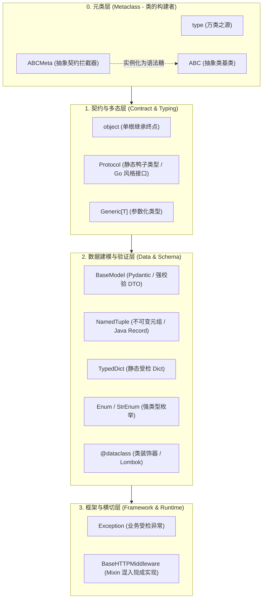

### 常见基类清单（按层次划分）


| 基类 / 语法 | 层次 | 核心作用 | Java 对标 | AgentScope 仓库实例 |
| :--- | :--- | :--- | :--- | :--- |
| `object` | 类 | 一切实例的根基类 | `java.lang.Object` | 每个类的 MRO 链末尾 |
| `type` | 元类 | 一切类的类型（类的类） | `Class<?>`（但具有动态构造类的能力） | 隐式使用，动态元编程 |
| `ABCMeta` | 元类 | 维护 `__abstractmethods__`，拦截未完全实现的实例化 | 类似 Java 编译期抽象类完整性检查 | `type(MessageBus)` |
| `ABC` | 类 | `metaclass=ABCMeta` 的语法糖基类 | `abstract class` | `MessageBus(ABC)` |
| `Protocol` | 类 | 结构化子类型（静态鸭子类型） | 类似 Go `interface` / Java 单方法接口 | `PipelineProtocol` |
| `Generic[T]` | 类 | 泛型类型参数化 | `<T>` 泛型声明 | `EmbeddingModelBase(Generic[InputT])` |
| `BaseModel` | 类 | Pydantic 数据解析、运行时类型强校验 | Lombok `@Data` + Jackson + Spring `@Valid` | `WikiPage(BaseModel, Generic[...])` |
| `Enum` / `StrEnum` | 类 | 枚举类型（`StrEnum` 原生支持直接当 str 使用与 JSON 序列化） | Java `enum` | `PermissionMode(Enum)`、`EventType(StrEnum)` |
| `Exception` | 类 | 业务/运行时异常分类基类 | `java.lang.Exception` | `AgentOrientedException(Exception)` |
| `NamedTuple` | 类 | 不可变元组语法糖（C 级性能） | Java 14+ `record` | `SkillArchive(NamedTuple)` |
| `TypedDict` | 类 | 带有字段类型提示的 Dict 语法糖（零运行时开销） | 编译期受检的 `Map<String, Object>` | `_SkillEntry(TypedDict)` |
| `BaseHTTPMiddleware` | 类 | 混入外部框架现成实现（Mixin / 多重继承） | 组合模式 / 拦截器基类 | `ProtocolMiddlewareBase(BaseHTTPMiddleware, ABC)` |
| `@dataclass` | **装饰器** | 自动生成 `__init__`、`__repr__`、`__eq__` 等样板代码（**注意：不是基类！**） | Lombok `@Data` / `@AllArgsConstructor` | 仓库内 22 处内部状态实体 |

### 核心分层与工程决策

1. **元类与抽象契约 (`type` / `ABCMeta` / `ABC`)**
   - `ABC` 本质是只有两行代码的语法糖：`class ABC(metaclass=ABCMeta): __slots__ = ()`。
   - `ABCMeta` 负责在实例化（`__call__`）时进行 Fail-Fast 校验，若子类漏写抽象方法，当场抛出 `TypeError`。

2. **名义契约 vs 结构协议 (`ABC` vs `Protocol`)**
   - 团队公共基座、需要复用默认模板方法（Template Method Pattern）时用 `class MyBase(ABC)`。
   - 插件化架构、第三方扩展、只关心“有没有这个方法”而不强加继承关系时用 `Protocol`（如 `PipelineProtocol`，只要实现了匹配的 `__call__` 就是 Pipeline，彻底解耦）。

3. **数据载荷 (DTO) 的 4 种选型权衡**
   - **外部网络输入/API 报文** ➔ `BaseModel`（做字段强转、格式校验，防脏数据）。
   - **内部领域状态对象** ➔ `@dataclass`（纯装饰器，无运行时校验开销，类似 Lombok）。
   - **不可变高性能小结构体** ➔ `NamedTuple`（C 级 Tuple 性能，只读保护，类似 Java `record`）。
   - **原生 Dict 互操作** ➔ `TypedDict`（纯静态类型检查提示，运行时就是原生字典，零损耗）。

4. **横切复用与多重继承 (Mixin)**
   - Java 仅支持单继承，需依赖接口默认方法或装饰器；Python 支持多重继承。
   - 如 `ProtocolMiddlewareBase(BaseHTTPMiddleware, ABC)`：一边继承 Starlette 的 ASGI HTTP 中间件管道，一边混入 `ABC` 声明业务抽象方法。

## 异步上下文管理器与生命周期（__aenter__ / __aexit__ / aclose）

在 `MessageBus` 等需要管理连接池、底层套接字的类中，常见以下三件套：

```python
async def __aenter__(self) -> Self:
    return self

async def __aexit__(self, exc_type, exc_value, traceback) -> None:
    await self.aclose()

async def aclose(self) -> None:
    """Release underlying transport resources. Default is a no-op."""
```

### 1. 四者的核心关系与层次划分

> **`async with` 是语言级语法糖，只认 `__aenter__` 和 `__aexit__`；而 `aclose()` 是工程级设计约定，被 `__aexit__` 委托调用，同时支持脱离 `async with` 独立关闭。**

```mermaid
flowchart TD
    subgraph LanguageLevel ["1. Python 语言规范层 (PEP 492)"]
        AsyncWith["语法糖: async with obj as x:"]
    end

    subgraph ProtocolLevel ["2. 协议契约层 (Asynchronous Context Manager)"]
        AEnter["__aenter__()<br>(初始化并返回实例)"]
        AExit["__aexit__(*exc_info)<br>(拦截异常并保证清理)"]
    end

    subgraph EngineeringLevel ["3. 工程设计层 (业务释放入口)"]
        AClose["aclose()<br>(底层连接池/资源真实销毁逻辑)"]
    end

    AsyncWith -->|语句入口调用| AEnter
    AsyncWith -->|离开作用域调用 (finally)| AExit
    AExit -->|内部委托调用| AClose
    
    SingletonCaller["长生命周期单例 / 停机钩子<br>(不方便写 async with 的场景)"] -.->|直接显式调用| AClose
```

#### 调用关系链（两条消费路径）
- **路径 A：作用域内自动闭环（RAII / 短生命周期）**
  `async with bus as b:` ➔ `await __aenter__()` ➔ 业务执行 ➔ `await __aexit__()` ➔ 内部调用 `await aclose()`
- **路径 B：脱离 async with 的常驻单例（长生命周期）**
  全局持有对象 ➔ 停机钩子（如 FastAPI shutdown）直接显式触发 ➔ `await bus.aclose()`

### 2. Java 概念精准映射表

| 元素 | 层次 | 语言 / 模式 | Java 对应物 | 核心认知 |
| :--- | :--- | :--- | :--- | :--- |
| **`async with`** | 语法层 | 语言关键字 | `try (...) { }` | 编译器层面的结构控制，离开作用域必执行清理。 |
| **`__aenter__`** | 协议层 | 魔术方法 (Dunder) | 构造器或工厂方法的初始化阶段 | 必须存在，且通常 `return self`（让 `as b` 绑定当前引用）。 |
| **`__aexit__`** | 协议层 | 魔术方法 (Dunder) | `AutoCloseable.close()` 包装层 | 负责桥接异常参数与退出逻辑。 |
| **`aclose()`** | **实现层** | **自定义方法（非语法）** | `AsyncCloseable.closeAsync()` / Spring `@PreDestroy` | **Python 解释器根本不知道什么是 `aclose`**，它纯粹是工程师为了兼顾单例显式调用而抽出来的标准方法名。 |

### 3. 运行控制流对比：`async with` 的语法糖展开


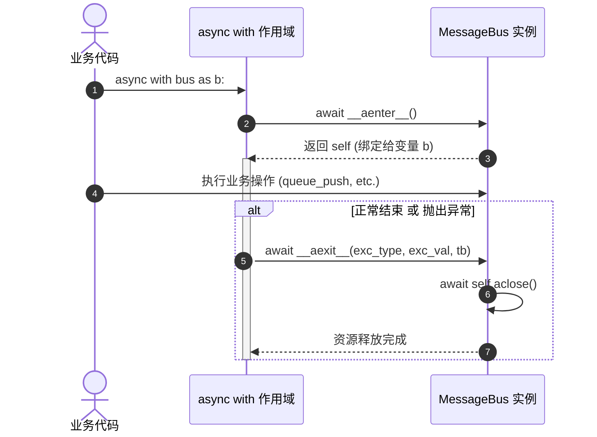

```python
# 编写代码：
async with bus as b:
    await b.queue_push(...)

# 解释器实际展开的底层控制流：
b = await bus.__aenter__()
exc = True
try:
    await b.queue_push(...)
except Exception as e:
    exc = False
    # 如果 __aexit__ 返回 True 则代表吞没异常；返回 None/False 则继续向上 re-raise
    if not await bus.__aexit__(type(e), e, e.__traceback__):
        raise
finally:
    if exc:
        await bus.__aexit__(None, None, None)
```

### 4. 双重生命周期设计（Dual Lifecycle Pattern）

为什么要把 `aclose()` 从 `__aexit__` 中单独抽离出来？为了同时支持两种企业级场景：

- **局部短生命周期（RAII 作用域）**：
  ```python
  # 用完即关，依赖 async with 自动触发 __aexit__
  async with RedisMessageBus(...) as bus:
      await bus.queue_push(...)
  ```
- **全局长生命周期单例（对标 Spring Bean / 容器管控）**：
  作为 FastAPI / 服务常驻单例，应用启动时不关，只在进程终止时平滑下线：
  ```python
  app_bus = RedisMessageBus(...)

  @app.on_event("shutdown")
  async def on_shutdown():
      await app_bus.aclose()  # 显式关闭，等价于 Java DisposableBean.destroy()
  ```

### 5. `__aexit__` 参数的精妙之处（对比 Java 抑制异常）

`__aexit__` 的签名里有三个参数：
```python
async def __aexit__(self, exc_type, exc_value, traceback) -> None:
```

在 Java 中：
- `try-with-resources` 如果 `try` 块崩了，JVM 会调用 `close()`。如果 `close()` 又抛了异常，JVM 会调用 `Throwable.addSuppressed()` 把后面的异常压入主异常的抑制列表。

在 Python 中：
- 如果 `async with` 代码块发生异常，Python 会将该异常的**类型、实例、堆栈**完整作为实参传递给 `__aexit__`。
- **异常吞没控制（Exception Suppression）**：
  - 如果 `__aexit__` 返回了 `True`，Python 会认为“该异常已被上下文管理器在内部处理完毕”，**不再往外抛异常**（相当于在底层默默执行了 `catch(Exception e) {}`）；
  - 此处代码默认没有返回值（即 `None`，代表 `False`），因此业务代码抛出的任何异常都会在清理完资源后继续向外抛出，符合 Java 程序员直觉。

## asyncio 工程构件：锁、gather、静态方法

以 `LocalWorkspaceManager.close_all` 为例（`src/agentscope/app/workspace_manager/_local_workspace_manager.py:181`）：

```python
async def close_all(self) -> None:
    async with self._lock:
        entries = list(self._cache.values())
        self._cache.clear()
    if not entries:
        return
    await asyncio.gather(
        *(self._safe_close(ws) for ws, _ in entries),
        return_exceptions=True,
    )

@staticmethod
async def _safe_close(ws: LocalWorkspace) -> None:
    try:
        await ws.close()
    except Exception:
        logger.exception("Failed to close LocalWorkspace %s", ws.workspace_id)
```

### 对照总表

| Java | Python 这里 | 关键差异 |
| :--- | :--- | :--- |
| `ReentrantLock` | `asyncio.Lock` | 不跨线程，不可重入 |
| `lock.lock(); try {…} finally { unlock(); }` | `async with self._lock:` | 合并成一个语法 |
| `Map<String, Entry>` | `self._cache: dict[...]` | `values()` 同样是视图 |
| `new ArrayList<>(map.values())` | `list(self._cache.values())` | 同一个防御性拷贝 |
| `CompletableFuture.allOf(...).join()` | `await asyncio.gather(...)` | 不开线程池 |
| `future.join()` | `await coro` | 让出线程，不阻塞 |
| `private static` | `@staticmethod` | 描述符，见下文 |
| 虚拟线程 / `@Async` | `async def` | 单线程协作式 |

### 1. `async def` 不是线程

```text
Java：一个请求一个线程
  thread-1  ├── close(ws1) ──────────┤
  thread-2  ├── close(ws2) ──────┤
  thread-3  ├── close(ws3) ────────────┤
            → 并行，代价是三个线程栈

Python asyncio：一个线程，协作式切换
  loop      ├─ ws1.close() ─await─┐
                        ├─ ws2.close() ─await─┐
                                    ├─ ws3.close() ...
            → 并发，只有一个线程栈，切换点只在 await
```

`await` 不是「等待」，是「把控制权交回事件循环，等这件事就绪再回来」。所以进程里任何一处调用阻塞函数（`time.sleep`、同步 requests、阻塞文件读），卡住的是**整个服务**，不是一个请求。

Java 21 虚拟线程是最接近的类比，但虚拟线程被阻塞时 JVM 会 park 它，业务代码不用改；Python 协程必须手写 `await`。

### 2. `asyncio.Lock` 不是 `ReentrantLock`

```diff
- lock.lock();
- try {
-     entries = new ArrayList<>(cache.values());
-     cache.clear();
- } finally {
-     lock.unlock();                     // 忘了这行就是死锁
- }
+ async with self._lock:
+     entries = list(self._cache.values())
+     self._cache.clear()
```

`async with` 展开就是 try/finally，`__aexit__` 里 release。Java 靠人记住 finally，Python 靠语法。

但它不是 `ReentrantLock`。同一个 task 抢两次的实测：

```text
第一次拿锁: 成功
第二次拿锁: TimeoutError → 不可重入，自己等自己
```

标准库的类文档给了原因：

> A primitive lock is a synchronization primitive that is **not owned by a particular coroutine** when locked.

`ReentrantLock` 记录持有者线程所以能重入；`asyncio.Lock` 不记录，`acquire()` 两次就是自己等自己。另外它只在单个 event loop 内有效，没有 `tryLock()`，只有 `locked()` 能查状态、拿不到结果。

### 3. `list(self._cache.values())` 的视图陷阱

Java 的 `Map.values()` 返回视图，Python 的 `dict.values()` 也是。这个 `list()` 不是风格问题：

```text
entries = cache.values(); cache.clear()        →  len(entries) = 0
entries = list(cache.values()); cache.clear()  →  len(entries) = 3
```

不包 `list()`，`clear()` 会把 `entries` 一起清空，后面的 `gather` 无事可做。`list(...)` 是浅拷贝，`entries` 里装的还是同一批 `LocalWorkspace` 引用，清空 `_cache` 只是让 manager 不再持有它们，真正销毁在 `close()` 里。

### 4. `gather` 不是线程池

```diff
- List<CompletableFuture<Void>> fs = workspaces.stream()
-     .map(ws -> CompletableFuture.runAsync(ws::close, pool))
-     .toList();
- CompletableFuture.allOf(fs.toArray(new CompletableFuture[0])).join();
+ await asyncio.gather(
+     *(self._safe_close(ws) for ws, _ in entries),
+     return_exceptions=True,
+ )
```

实测差别：

```text
顺序 for + await : 0.90s   (0.30+0.20+0.40)
asyncio.gather   : 0.40s   (max(0.30,0.20,0.40))
```

`CompletableFuture.runAsync` 会真的派到 executor；`gather` 只是把协程排进同一个 loop 的待办队列。并发只发生在 `await` 处：一个 `ws.close()` 等子进程 IO 时，loop 去跑另一个。纯 CPU 计算的话 `gather` 和 for 循环一样慢。

`return_exceptions=True` 对应 Java 的「不要 fail-fast」：`allOf` 返回的 future 在任意一个失败时立刻异常完成，要收集全部失败得逐个 `handle`；`gather` 这个参数直接给结果列表，异常对象当元素塞进去，不会重新抛出。

### 5. `await ws.close()`

对应 Java 的 `future.join()`，语义不同：`join()` 阻塞当前线程，`await` 让出线程。

```text
Java:    thread-1  [==== 阻塞等待 子进程退出 ====]  其他线程照跑
Python:  loop      [让出] → 跑别的协程 → 子进程退了 → 回来继续
                   ^ 这里若用了阻塞版 subprocess.wait()，全进程停摆
```

用错一个字，`gather` 的并发就没了，而且不是变慢，是整个事件循环被卡住，所有 HTTP 请求不响应。

### 6. `@staticmethod` 的反直觉点

```text
A.f 和 a.f 是同一个对象吗: True
a.f(1)  -> 收到 1
a.g(1)  -> 收到 1   ← self 没有被传进去
```

`@staticmethod` 是个描述符，通过实例访问返回的是裸函数，不绑定 `self`。所以 `close_all` 里写 `self._safe_close(ws)` 不会多传一个 `self`。Java 读者第一次看到这行容易以为是普通方法调用。

写成 `staticmethod` 的意图是声明「不依赖实例状态」，写成实例方法也能跑，但那样丢了这个信息。

### 6 个坑速查

```text
1. 在 async 函数里调阻塞 API（requests、time.sleep、subprocess.wait）
   → 不是慢，是整个服务停摆。换成 httpx / asyncio.sleep / await proc.wait()

2. 把 asyncio.Lock 当 ReentrantLock 用
   → 不可重入，嵌套拿锁自己等自己；也不能跨线程共享

3. 把 gather 当线程池用
   → 没有 await 点的代码不会并发。CPU 密集任务得 run_in_executor 丢到线程/进程池

4. 忘掉 dict.values() 是视图
   → 后面 clear() 会把「快照」一起清空

5. 把 await 当 join()
   → join 阻塞线程，await 让出线程，混用会把并发退化成串行

6. 以为并发粒度是「对象内部」
   → 这里的粒度只到 workspace 之间。_close_all_mcp_instances（workspace/_base.py:876）
     内部还是两层 for + await，一个 workspace 里的多个 MCP 仍然顺序关
```

## 应用装配与启动：create_app 与 lifespan

`examples/agent_service/main.py:83` 的 `app = create_app(...)` 不是初始化，是**装配**。这个框架的启动分两段：

| 阶段 | 谁执行 | 同步/异步 | 做什么 |
| :--- | :--- | :--- | :--- |
| 装配期 | `create_app`（`app/_app.py:78`） | 同步 | 建 FastAPI 对象、往 `app.state` 挂配置、注册 15 个 router |
| 启动期 | `lifespan`（`app/_lifespan.py:35`） | 异步 | `storage.__aenter__` 连 Redis、起后台任务、构造各类 Service |

`RedisStorage(host=...)`、`QdrantStore(url=...)` 在装配期只存参数不连网（`_redis_storage.py:150` 的 docstring 明确写了「the actual pool is created in `__aenter__`」）。真正的连接动作全在 lifespan，由 `AsyncExitStack` 逆序拆栈收尾。

Router 取依赖的方式是 `app.state` + `deps.py`：`create_app` 写配置，`lifespan` 写实例，`deps.py:67` 这样的依赖函数读出来。对 Java 的类比是 `create_app` ≈ `@Configuration` + 构造 `ApplicationContext`，`lifespan` ≈ `ApplicationRunner` + `DisposableBean`。

### `uvicorn.run("main:app")` 会让这个模块跑 3 次

脚本第 179 行传的是**字符串**，不是对象。实测（`print` 打在模块级）：

```text
[module-exec] pid=41625 name=__main__      ← 父进程，跑完配置段后进 if __name__ 分支
[app-created] pid=41625 name=__main__
[main-guard]  pid=41625
[module-exec] pid=41653 name=__mp_main__   ← multiprocessing spawn 重新执行主脚本
[app-created] pid=41653 name=__mp_main__
[module-exec] pid=41653 name=main          ← uvicorn import_from_string("main:app")，这一遍才 serve
[app-created] pid=41653 name=main
```

三条路径：

1. 父进程以 `__main__` 身份执行配置段，进 `if __name__` 分支调 `uvicorn.run`，它自己的 `app` 对象直接丢弃。
2. `reload=True` 让 uvicorn 走 reloader：父进程只 bind 端口，用 `multiprocessing` 的 spawn 起子进程。spawn 会重新执行一遍主脚本（`__mp_main__`），配置段跑第二遍，`app` 又丢弃；此时 `__name__` 不是 `"__main__"`，所以第 176 行不进。
3. 子进程执行 `Server.run()` → `Config.load_app()` → `import_from_string("main:app")` → `import_module("main")`。配置段跑第三遍，这一次生成的 `app` 才被 serve。

证据链（venv 里 uvicorn 0.52.4）：`uvicorn/main.py` 的 `run()` 在 reload 分支不调 `config.load_app()`；`uvicorn/_subprocess.py:21` 的 `get_subprocess` 用 `spawn.Process`；`uvicorn/config.py:494` 才做 `self.loaded_app = self.load_app()`。

推论：**模块级副作用会被执行 3 次**。这个示例的模块级代码都是纯构造（`RedisStorage`、`QdrantStore`、`MCPClient` 都不连网），所以无害。但如果在模块级起线程、写文件、连数据库，就会重复。另外 `reload=True` 下每改一次文件，子进程重启，配置段再跑 2 遍。

想避开重复，不进 `if __name__` 分支，直接：

```bash
cd examples/agent_service && uvicorn main:app --port 8008
```

这样只 import 一次，模块名就是 `main`，也没有 reloader 的 `__mp_main__` 副本。注意 `"main:app"` 是硬编码模块名，必须在脚本目录下跑，`sys.path[0]` 才是脚本目录。

## MessageBus：按「载荷生命周期」分组的抽象基类

`src/agentscope/app/message_bus/_base.py` 是个值得当范本读的抽象基类：910 行里有 550 行是接口，20 个 `@abstractmethod` 分成五组。

设计约束是**按 payload 怎么死来分组**，不按业务分组：

```text
              写入            存着吗        谁能读到              语义
Mode A   queue_push    [e1 e2 e3]   读一次就没了   唯一一个消费者     at-most-once
Mode C   log_append    [e1 e2 e3]   读到也不删     每个读者各自游标    replay
Mode D   publish       不存          不存          只在线的订阅者      fire-and-forget
```

Mode A 和 Mode C 用同一套 key 空间却语义相反，这是整个类最需要想清楚的一点。A 的 `queue_drain` 是「读 + 删」一个原子操作，并发调用者拿到互不相交的条目；读到的人崩了那条就永久丢了。C 的 `log_read` 不删除，带 `since` 游标，能给任意多个读者补历史。

后两组不是投递，是协调：

| | 原语 | 干什么 | Java 类比 |
| :--- | :--- | :--- | :--- |
| Mode E | `acquire_lock` / `try_lock` | 集群级互斥 | `ReentrantLock`，但带 lease TTL |
| Mode F | `registry_*` | 带命名空间的哈希表 | `ConcurrentHashMap` + CAS |

**key 和 payload 对 bus 完全不透明。** docstring 里反复出现「the bus treats it as opaque」，业务键名全在隔壁 `_keys.py` 的 `MessageBusKeys`，一共 20 多个（`session_lock(sid)`、`inbox(sid)`、`wakeup_signal()`…）。这个约束是它值 20 个抽象方法的原因：换 Redis 换 NATS，只要 key/payload 约定不变，上层不动。

Java 里没有对应的单一抽象，要拼好几个：`Map` + `BlockingQueue` + `List` + `ReentrantLock` + `AtomicReference`，而且每个的语义都固定，无法在「读即删」和「读到不删」之间切换。

### 用 `None` 当终止哨兵

`InMemoryMessageBus.aclose`（`_in_memory_message_bus.py:100`）：

```python
async def aclose(self) -> None:
    """Signal all open subscribers so their generators terminate."""
    for subs in self._subscribers.values():
        for q in subs:
            q.put_nowait(None)
    self._subscribers.clear()
```

因为 `asyncio.Queue` **没有「关闭」这个概念**。它只有「空」和「非空」，`await q.get()` 在空的时候永远等下去，没有 `QueueClosedError` 之类的信号。所以约定一个特殊值当终止信号：

```python
q: asyncio.Queue[dict | None] = asyncio.Queue()
#                ^^^^^^^^^^^
#                多出来的 None 就是哨兵

# 消费端
while True:
    item = await q.get()
    if item is None:      # Sentinel from aclose()
        break
    yield item
```

实测：调了 `aclose` 的订阅者拿到 `StopAsyncIteration` 退出，没调的那个 `TimeoutError`，永远卡在 `await q.get()`。

两个细节：用 `put_nowait` 而不是 `await put`（队列无界，且叫醒别人不该让出控制权）；这是**协作式**关闭，订阅者必须真的被调度到才会退出，`aclose` 返回不代表所有订阅者都退干净了。

### 抽象方法必须有函数体

```python
@abstractmethod
@asynccontextmanager
async def acquire_lock(self, key: str, *, ttl_secs: int = 600):
    # The decorator-based abstract method requires a body for
    # @asynccontextmanager to work; subclasses override it.
    if False:  # pylint: disable=using-constant-test
        yield  # pylint: disable=unreachable
```

Java 的 `abstract` 方法在字节码里根本不存在；Python 的抽象方法是**正常函数**，只是被标记了。因为 `@asynccontextmanager` 要求函数体存在，所以写 `if False: yield` 让它在语法上成为 async generator。这段 body 永远不执行。

### 一个容易误判的地方

`@abstractmethod` 的检查只在**实例化时**发生，而且守卫只是一个可写的类属性：

```python
Partial.__abstractmethods__ = frozenset()
obj = Partial()                  # 实例化成功
await obj.queue_drain("k")       # → None（不是抛异常）
await obj.publish("k", {})       # → None
```

因为继承来的抽象方法有函数体（docstring），调用**静默返回 None**。Java 里方法不存在，编译期就过不去；Python 里这种漏实现会变成运行时的静默错误。所以类型检查器在这个语言里不是可选项。

## Workspace 与 WorkspaceManager：两层职责

文档分两页讲这两层，看清楚不会混：

| 层 | 类 | 源码 | 文档页 |
| :--- | :--- | :--- | :--- |
| 运行环境本体 | `LocalWorkspace`、`DockerWorkspace`… | `src/agentscope/workspace/` | `building-blocks/workspace/overview` |
| 服务层管理器 | `LocalWorkspaceManager`… | `src/agentscope/app/workspace_manager/` | `deploy/workspace-manager` |

workspace 是 agent 的「手和脚」落地的地方，管三类资源：通过后端执行的**工具**（Bash、Read、Write 加 MCP 提供的）、`skills/` 下的**技能**、`Offloader` 协议的**上下文卸载**。后端有七种（Local / Bubblewrap / Docker / E2B / Daytona / K8s / OpenSandbox），接口统一，换后端等于换 agent 的执行环境。

manager 是**应用级单例**，职责两个：按 `isolation` 策略判断一次请求属于哪个 workspace；把 workspace 当廉价依赖交给路由和服务。

### 磁盘布局

```text
examples/agent_service/workspaces/            ← basedir
├── 0f80f901ca7947d2a12d6aa9f5b2b8d8/        ← agent_id
│   ├── Memory/MEMORY.md                      ← 长期记忆 middleware 写的
│   └── skills/
│       ├── .seed                              ← 种子模板
│       └── 0f80f901ca7947d2a12d6aa9f5b2b8d8/  ← 该 agent 自己的技能分区
│           └── .index
└── ... 共 7 个
```

目录名来自 `_local_workspace_manager.py:129` 的 `os.path.join(self._basedir, agent_id)`，**是 agent_id，不是 workspace_id**。这解释了 `main.py:157` 那条注释为什么成立：同一 agent 的多个 session 落到同一个 `Memory/MEMORY.md`，长期记忆才能跨 session 存活。

### 隔离策略与 TTL

| 取值 | 共享规则 |
| :--- | :--- |
| `PER_AGENT`（默认） | 同一 `(user_id, agent_id)` 下所有 session 共享一个 workspace |
| `PER_SESSION` | 每个 session 一个独立 workspace |
| `PER_USER` | 同一 `user_id` 下所有 agent 共享一个，不区分 agent |

注意一个副作用：`LocalWorkspaceManager` 的磁盘路径只看 `agent_id`，切成 `PER_SESSION` 会得到不同的 `LocalWorkspace` 对象（不同 workspace_id、缓存项、MCP 生命周期），但**目录还是同一个**。本地后端下 `PER_SESSION` 隔离的是运行时状态，不是文件系统。

缓存默认 `ttl=3600`，`LocalWorkspaceManager` 没有后台 sweeper，回收发生在下一次 `get_workspace()` 里（`_pop_expired`）；沙箱类 manager 多一个后台 sweeper。

### 文档和源码对不上时的处理

同一批事实我核对过两轮，`deploy/workspace-manager` 有三处落后于源码：

| 文档说                                             | 源码是                                                                                    |
| :---------------------------------------------- | :------------------------------------------------------------------------------------- |
| `assign_workspace_id` 是纯函数，不做 I/O               | `_base.py:83` 在 `PER_AGENT` + 有 storage 时 `await self._storage.list_sessions(...)`，还抢锁 |
| session router 片段里 `assign_workspace_id(...)`   | 真实代码（`_router/_session.py:344`）有 `await`，文档漏了                                          |
| `create_workspace` 属于 `WorkspaceManagerBase` 契约 | 基类没这个方法；5 个具体实现各有，全部标了 `@deprecated`                                                   |

另外 `basedir` 的路径注释写 `<basedir>/<user_id>/<agent_id>`，源码只有一层。`_docker_workspace_manager.py:12` 的模块 docstring 也有同样的旧说法，而同一个文件第 84 行的构造函数 docstring 写现在的布局是 `<basedir>/<workspace_id>`。

结论：概念、隔离策略、生命周期看文档；方法签名、参数、并发语义读源码 docstring，那份比文档精确。

## 优雅停机模式：Poison Pill（毒丸）哨兵广播机制

在 `InMemoryMessageBus.aclose`（`src/agentscope/app/message_bus/_in_memory_message_bus.py:101`）中，有如下核心停机代码：

```python
"""Signal all open subscribers so their generators terminate."""
for subs in self._subscribers.values():
    for q in subs:
        q.put_nowait(None)
self._subscribers.clear()
```

### 1. 控制流与毒丸机制图解

`asyncio.Queue` 没有类似网络连接的“Close”关闭状态，队列为空时 `await q.get()` 会永久阻塞等待。为实现优雅退出，系统采用并发编程的经典模式：**Poison Pill（毒丸/哨兵值）**。

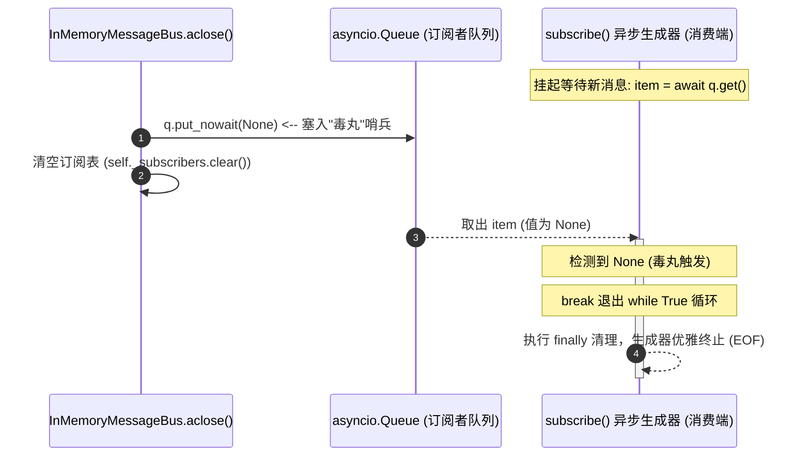

### 2. 消费端的配合机制

消费端 `subscribe()`（`_in_memory_message_bus.py:346`）内部通过 `while True` 等待这个 `None` 哨兵：

```python
while True:
    item = await q.get()
    if item is None:
        # Sentinel from aclose() — 吞下毒丸，跳出循环，触发优雅退出
        break
    yield item
```

### 3. Java 架构对照

* **Java 并发对标**：Java `BlockingQueue` 实现生产者-消费者模型时，停止 Worker 线程的经典做法是在队列末尾塞入预定义的静态标记 `POISON_PILL = new Object()`。Worker 识别到该标记主动 break 退出线程。
* **反应式流对标**：等价于 Project Reactor / RxJava 的 `subscriber.onComplete()` 终止流信号。
* **规避协程泄漏（Coroutine Leak）**：若不推入 `None` 而直接 `clear()`，所有阻塞在 `await q.get()` 的消费者协程将永远驻留内存，导致应用事件循环无法彻底终止。

---

## Web 容器与全局依赖：app.state（FastAPI 的 ApplicationContext）

在 `src/agentscope/app/_app.py:293` 的 `create_app` 中，核心组件被密集挂载到 `app.state`：

```python
app = FastAPI(...)
app.state.storage = storage
app.state.message_bus = message_bus
app.state.workspace_manager = workspace_manager
```

### 1. 架构定位：心智模型图解

`app.state`（基于 Starlette 的 `State` 数据结构）是 FastAPI 体系中扮演 **Spring `ApplicationContext` / ServletContext** 的全局单例与依赖持有者。

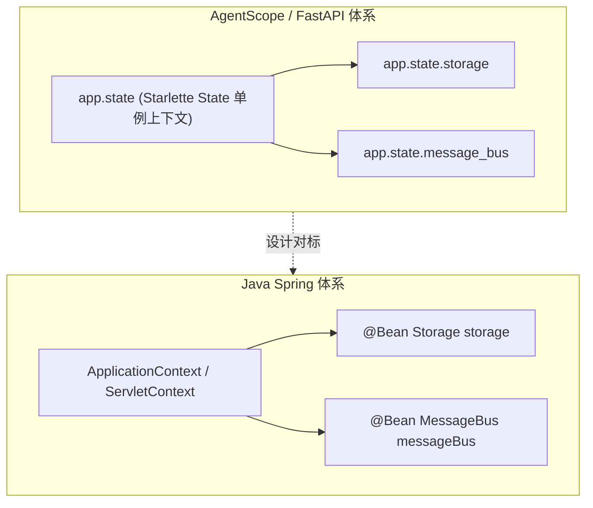

### 2. Java 架构对照表

| 维度 | Python (`app.state`) | Java Web / Spring | 核心说明 |
| :--- | :--- | :--- | :--- |
| **容器本质** | `starlette.datastructures.State` | `ApplicationContext` / `ServletContext` | 全局唯一的单例上下文持有者，应用级共享。 |
| **注册 Bean** | `app.state.message_bus = bus` | `@Bean` 或 `ctx.registerSingleton(...)` | 随应用工厂函数初始化装配。 |
| **获取依赖** | `request.app.state.message_bus` 或 `Depends(...)` | `@Autowired private MessageBus bus;` | 在 Controller / Router 中提取全局单例。 |
| **生命周期接管** | `_lifespan.py` 读取并放入 `AsyncExitStack` | `@PostConstruct` / `@PreDestroy` | 应用启动时统一 `__aenter__`，停机时统一 `__aexit__`。 |

### 3. AgentScope 中 `app.state` 的全生命周期流转

```text
1. create_app() 装配期 (src/agentscope/app/_app.py)
   └── 将 storage、message_bus、workspace_manager 等挂到 app.state 上（依赖注册）

2. lifespan 启动期 (src/agentscope/app/_lifespan.py)
   ├── 从 app.state 读取各种资源
   ├── 统一纳入 AsyncExitStack 进入异步上下文 (建立 Redis 连接、启动后台 Worker)
   └── 把运行时生成的单例 (如 background_task_manager) 再次挂回 app.state

3. Request 执行期 (路由处理函数)
   └── 接口通过 request.app.state.storage 或 Depends 获取单例，执行业务读写

4. lifespan 停机期
   └── AsyncExitStack 逆序弹出所有资源并关闭 (触发 aclose() 毒丸广播，释放连接池)
```

---

## Redis 分布式锁底层实现与看门狗机制（acquire_lock）

在多节点部署或并发请求场景下，防止同一会话（Session）或同一资源被多个 Worker 并发执行是核心痛点。AgentScope 在 [`RedisMessageBus.acquire_lock`](file:///Volumes/PortableSSD/workspace/agentscope/src/agentscope/app/message_bus/_redis_message_bus.py#L628) 中实现了一套生产级的 Redis 异步分布式互斥锁（Mutex）。

图解：[Redis 分布式锁底层架构解析](output/redis_distributed_lock_deep_dive.html)（浏览器打开，包含 4 阶段交互时序 + 看门狗自动续期 + 安全防误删 + Redisson 对照）

### 1. 核心源码呈现

```python
@asynccontextmanager
async def acquire_lock(
    self,
    key: str,
    *,
    ttl_secs: int = 600,
) -> AsyncGenerator[None, None]:
    token = uuid.uuid4().hex
    # 阶段 1：原子轮询抢锁
    while True:
        ok = await self._client.set(key, token, nx=True, ex=ttl_secs)
        if ok:
            break
        await asyncio.sleep(self._LOCK_RETRY_DELAY_SECS)

    # 阶段 2：异步看门狗心跳续期
    async def _heartbeat() -> None:
        while True:
            await asyncio.sleep(max(1.0, ttl_secs / 2))
            await self._client.expire(key, ttl_secs)

    hb_task = asyncio.create_task(
        _heartbeat(),
        name=f"lock-heartbeat:{key}",
    )

    # 阶段 3：让出执行权进入临界区
    try:
        yield
    finally:
        # 阶段 4：停心跳 + Token 校验安全释放
        hb_task.cancel()
        try:
            await hb_task
        except asyncio.CancelledError:
            pass
        try:
            current = await self._client.get(key)
            if current == token:
                await self._client.delete(key)
        except Exception:
            pass
```

### 2. 四阶段生命周期深度拆解

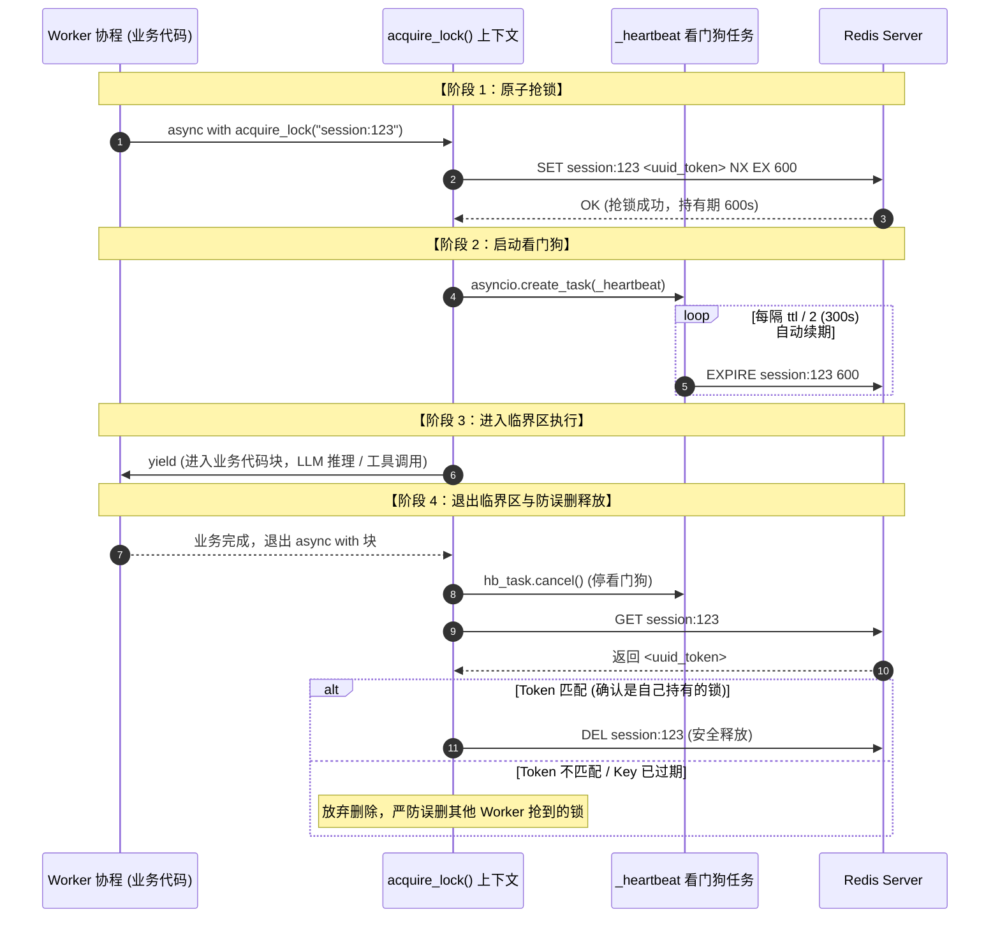

#### 阶段 1：原子加锁与身份标记（SET NX EX + UUID Token）
* **互斥与超时一体化**：通过 `SET key token NX EX ttl` 保证“判断不存在”与“写入并设置超时”是 **Redis 单条原子指令**。绝不能拆成 `SETNX` + `EXPIRE` 两步，否则若在两者间进程崩溃将导致永久死锁。
* **唯一所有权 Token**：使用 `uuid.uuid4().hex` 生成不可伪造的随机 Token。作为 Value 存入 Redis，为后续释放锁提供身份证明。
* **非阻塞/轮询等待**：抢锁失败时休眠 `_LOCK_RETRY_DELAY_SECS` (100ms) 重试，直到获取排他权。

#### 阶段 2：异步看门狗心跳续期（Heartbeat Watchdog）
* **大模型长耗时痛点**：Agent 执行复杂推理、多步工具调用往往耗时数分钟，锁的默认 TTL 设短了容易中途失效，设太长又会在节点异常退出时长期阻碍会话复原。
* **后台续租协程**：启动 `_heartbeat()` 异步任务，每隔 `ttl_secs / 2`（默认 300s）向 Redis 发送一次 `EXPIRE key ttl_secs` 重置过期时间。
* **天然防死锁（Fault-Tolerant）**：如果 Worker 进程 OOM 或断电强行死机，Python 事件循环直接中断，看门狗协程瞬间阵亡停止续期。Redis Key 在剩余 TTL 耗尽后**自然过期销毁**，其他节点即可自动接管会话，系统永不死锁。

#### 阶段 3：上下文转移（yield 进入临界区）
* 基于 `@asynccontextmanager` 装饰器，实现类似 Java `try-with-resources` 的语法糖。
* `yield` 之前执行抢锁与看门狗装配；`yield` 期间业务协程独占会话；退出时无条件落入 `finally` 块。

#### 阶段 4：Token 核对安全释放（GET + DEL 防误删）
* **防御性编程（Defensive Deletion）**：在分布式场景下，绝不能无脑调用 `DEL key`。若因为网络瞬断或 GC 暂停导致锁先超时，且另一个 Worker 刚好抢到了锁，无脑 `DEL` 就会把别人的锁给释放掉，引发严重脑裂。
* **Token 双重核对**：释放前先 `GET key`，只有 `current == token` 时才执行 `DEL key`。
* **工程权衡反思（Python GET+DEL vs Lua 脚本）**：
  * Java Redisson 等工业级库使用 Lua 脚本把 `if redis.call('get', KEYS[1]) == ARGV[1] then return redis.call('del', KEYS[1])` 做成绝对原子操作。
  * AgentScope 此处选用 Python 双步命令：因为看门狗每 `ttl / 2`（如 300s）才续期一次，正常业务结束停掉心跳到执行 GET+DEL 只有亚毫秒级（sub-millisecond）时间差，此时 key 的剩余 TTL 仍有数百秒之多，锁在此微秒区间内“恰好过期且被他人抢占”的理论概率趋近于零。源码注释专门指出这是工程上实用主义的选择。

---

### 3. 与 Java Redisson（RLock）核心架构全景对照

| 架构维度 | AgentScope (`acquire_lock`) | Java Redisson (`RLock`) | 架构原理与权衡差异 |
| :--- | :--- | :--- | :--- |
| **加锁指令** | `SET key token NX EX` | Lua 脚本（操作 Hash 结构并 `PEXPIRE`） | AgentScope 锁不可重入；Redisson 使用 Hash 记录重入计数（可重入锁）。 |
| **重入支持** | 否（Session 级别单任务排他设计） | 是（基于线程 ID 计数，支持递归重入） | AgentScope 服务于 Web 接口排他，不需要同线程内函数层层加锁。 |
| **看门狗实现** | `asyncio.create_task` 独立协程 | Netty `HashedWheelTimer` 时间轮定时任务 | Python 利用事件循环内置的任务调度；Java 利用 Netty 高效分层时间轮。 |
| **续期频率** | 每 `ttl / 2` 触发一次 `EXPIRE` | 每 `internalLockLeaseTime / 3` 触发一次续期 | 默认 10s 续期一次（默认锁租期为 30s）。 |
| **释放原子性** | GET 核对 Token + DEL 删除（Python 双步） | Lua 脚本原子执行（核对线程标识 + 计数减一 + 计数为零时 DEL + 发广播） | Redisson 保证原子操作并在释放时通过 Redis Pub/Sub 唤醒等待线程。 |
| **等待唤醒机制** | 轮询休眠（每 100ms 重新抢锁） | 信号量 + Redis Pub/Sub 事件通知唤醒 | Redisson 在抢锁失败时订阅锁的释放事件，避免空轮询浪费 CPU 与网络带宽。 |

---

## 洋葱模型（Onion Model）与异步拦截器机制

在现代异步 Web 框架与智能体系统（如 AgentScope、FastAPI/Starlette、Koa、Spring 等）中，**洋葱模型（Onion Model）**是实现“环绕拦截（Around Interception）”最经典的架构模式。

它的核心思想是：**请求像一根针从外向内穿透每一层中间件，到达最核心的业务逻辑；处理完成后，响应再由内向外反向穿出每一层。**

### 1. 心智模型与执行全貌

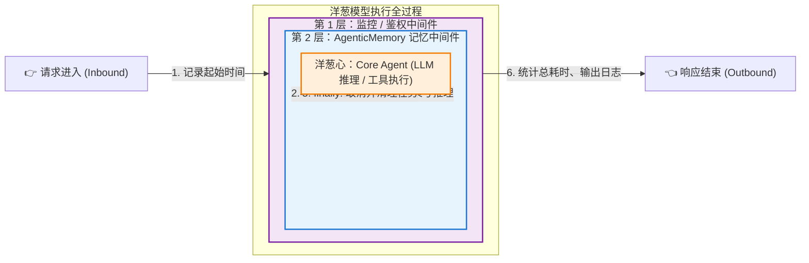

用调用时序展现其**调用栈（Call Stack）的双向折返跑**：

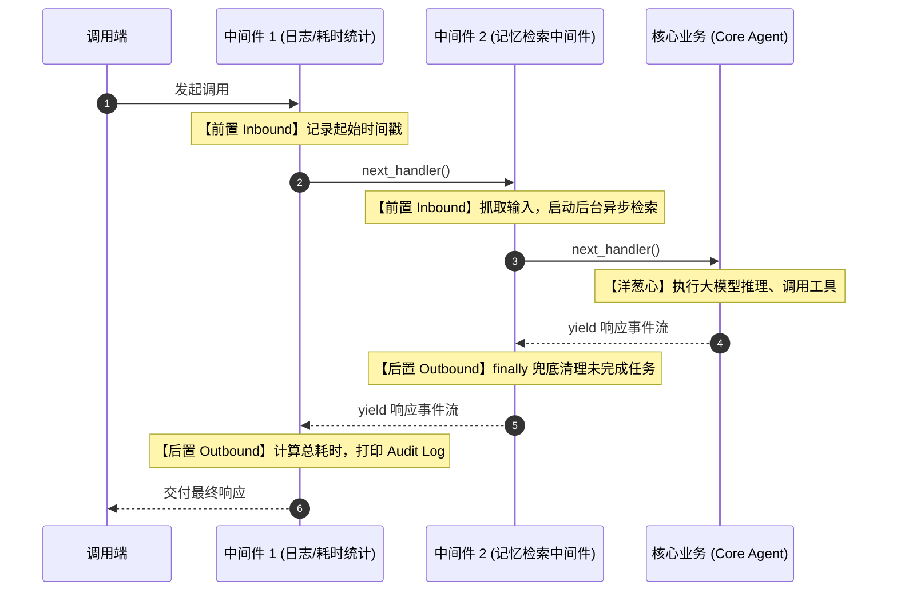

---

### 2. 为什么代码天然会长成“洋葱”？

洋葱模型在底层依赖的是**函数的递归嵌套与回调传递（`next()` / `next_handler()`）**。

在 Python 异步生成器环境下的经典范式：

```python
async def onion_middleware(request, next_handler):
    # ==================== 1. 前置（进入洋葱皮） ====================
    start_time = time.time()
    # 权限校验、提取参数、启动预加载协程

    try:
        # ==================== 2. 穿透到内层 ====================
        # 调用 next_handler() 将控制权交给下一个中间件或核心业务
        async for chunk in next_handler(request):
            yield chunk

    except Exception as e:
        # 集中式异常捕获与重试
        logger.error(f"Execution failed: {e}")
        raise

    finally:
        # ==================== 3. 后置（退出洋葱皮） ====================
        # 无论内层正常结束还是抛出异常，退出洋葱时必然执行
        cost = time.time() - start_time
        logger.info(f"Finished in {cost:.2f}s, cleanup resources.")
```

---

### 3. AgentScope 实战：`AgenticMemoryMiddleware` 的洋葱实践

在 AgentScope 的 [`_base.py:19`](file:///Volumes/PortableSSD/workspace/agentscope/src/agentscope/middleware/_base.py#L19) 中，明确划分了拦截体系：
* **Transformer Pattern（单向转换）**：如 `on_system_prompt`，纯线性流水线加工 Prompt 字符串。
* **Onion Pattern（环绕洋葱）**：如 `on_reply`、`on_reasoning`、`on_acting`，具备前后置环绕能力。

在 [`AgenticMemoryMiddleware.on_reply`](file:///Volumes/PortableSSD/workspace/agentscope/src/agentscope/middleware/_longterm_memory/_agentic_memory/_middleware.py#L568) 中，洋葱模型发挥了关键的生命周期控制作用：

```python
async def on_reply(
    self,
    agent: "Agent",
    input_kwargs: dict,
    next_handler: Callable[..., AsyncGenerator],
) -> AsyncGenerator:
    # ------------ 【前置 Inbound】------------
    # 1. 抓取当前 Query
    self._cached_input = self._extract_input(input_kwargs)
    # 2. 启动非阻塞后台并发检索，完全不增加首字延迟 (TTFT)
    if self._cached_input:
        self._retrieval_task = asyncio.create_task(
            self._retrieve_relevant_files(agent, self._cached_input),
        )

    try:
        # ------------ 【穿透到内层核心】------------
        # 核心 Agent 开始思考、生成回复、调用工具
        async for item in next_handler(**input_kwargs):
            yield item

    finally:
        # ------------ 【后置 Outbound】------------
        # 无论是顺利完成还是异常断开，出洋葱时坚决清理协程，防止内存泄漏
        if self._retrieval_task and not self._retrieval_task.done():
            self._retrieval_task.cancel()
            try:
                await self._retrieval_task
            except (asyncio.CancelledError, Exception):
                pass
        self._retrieval_task = None
        self._cached_input = None
```

---

### 4. 洋葱模型 vs 管道模型（Pipeline）

| 维度 | 管道模型（Pipeline / Stream） | 洋葱模型（Onion / Wrap） |
| :--- | :--- | :--- |
| **流转路径** | **单向单程票**：`A -> B -> C -> Output` | **双向折返跑**：`A进 -> B进 -> Core -> B出 -> A出` |
| **层级关系** | 串行接力，上一阶段结束，下一阶段才开始 | **外层包裹内层**，外层调用栈一直挂起等待内层返回 |
| **后置收尾能力** | **无**（A 无法感知 B 的耗时，更无法捕获 B 的异常） | **极强**（支持统一耗时统计、事务提交/回滚、`finally` 资源回收） |
| **典型场景** | Unix 管道 (`cat \| grep \| sort`)、数据清洗 ETL | Web 框架中间件（ASGI / Koa）、AOP 环绕切面、Agent 拦截器 |

---

### 5. 跨技术栈全景对照

| 技术生态 | 代表框架 | 核心 API / 语法 | 穿透到下一层的方式 |
| :--- | :--- | :--- | :--- |
| **Python (AI Agent)** | AgentScope Middleware | `async def on_reply(..., next_handler)` | `async for x in next_handler(): yield x` |
| **Python (Web)** | Starlette / FastAPI | `async def dispatch(request, call_next)` | `response = await call_next(request)` |
| **Node.js (起源地)** | Koa.js | `app.use(async (ctx, next) => { ... })` | `await next()` |
| **Java (Servlet)** | Java Web / Tomcat | `Filter.doFilter(req, resp, chain)` | `chain.doFilter(req, res)` |
| **Java (Spring)** | Spring AOP / WebFilter | `@Around("...") public Object around(ProceedingJoinPoint pjp)` | `Object result = pjp.proceed()` |

---

## 智能体架构解密：Middleware vs Hook vs Tool（Java 工程化视角）

在智能体应用开发中，`Middleware`、`Hook` 与 `Tool` 是最容易被混淆的概念。从 Java / Spring 的工程化设计模式出发，可以用最直观的模型建立认知对标。

* **动效演示**：[Middleware vs Hook vs Tool 架构解密动画](output/middleware_vs_hook_java_animation.html)（浏览器打开，包含 5 阶段执行流转 SVG 脉冲动画 + Java Spring 架构全景对照 + 状态并发隔离沙盘）
* **详细说明**：[Middleware 与 Hook：从直觉到源码的完整解析（核心原理篇）](output/middleware_vs_hook_java_deep_dive.html#core-idea)（浏览器打开，涵盖核心区别判定 `#core-idea`、餐厅做菜类比 `#analogy`、Hook 调度机制 `#hook`、Middleware 环绕流程 `#middleware`、逐步执行对比 `#playground`、状态与并发 `#state` 等 14 个核心专题的完整长文）

### 1. Java Spring 1:1 概念对标

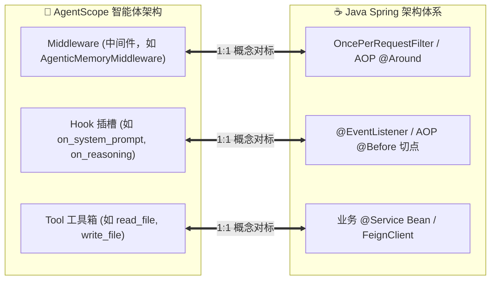

* **Middleware ⇋ Spring AOP `@Around` / `OncePerRequestFilter`**：
  * **角色**：守门人与全生命周期包裹者。
  * **核心权力**：手握 `proceed()` / `next_handler()`，拥有**放行权、随时中断短路权、异常捕获与统一资源清理权（`finally`）**。
* **Hook ⇋ Spring `@EventListener` / AOP `@Before`**：
  * **角色**：单向被动监听器 / 生命周期观察插槽。
  * **核心特征**：框架在特定时刻“叫你一声”。你执行完函数就弹栈销毁，**无法“包裹”主干流程**，更管不到执行完后发生了什么。
* **Tool ⇋ 业务层 `@Service` Bean / RPC 客户端**：
  * **角色**：被动的武器库。
  * **核心特征**：静静躺在工具箱里，由 LLM 大脑根据思维链决策“主动拿起并使用”，与外部物理世界交互（如读写文件、发 HTTP 请求）。

---

### 2. 底层代码差异：看有没有那个 `next` 参数

代码层面一眼看穿两者的本质差异：

#### 框架调用 Hook 的方式（旁观者模式）：
```python
# 框架主干内部
for hook in hooks:
    hook() # 👈 框架叫你一下，你做完退出，核心流程依然在框架手里
do_the_real_llm_reasoning()
```

#### 框架调用 Middleware 的方式（控制权反转）：
```python
# 框架把核心逻辑打包成 next_func，整条命交到中间件手里
middleware(next_func=do_the_real_llm_reasoning)

# 中间件内部实现
def my_middleware(next_func):
    # 1. 前置处理
    start_time = time.time()
    try:
        # 2. 决定是否放行（如果不调 next_func()，直接原地短路截断！）
        return next_func()
    except Exception as e:
        # 3. 核心业务抛异常，我能兜底降级救活
        return "fallback"
    finally:
        # 4. 后置处理与绝对安全的资源清理
        cost = time.time() - start_time
```

---

### 3. 为什么必须用 `self`，不能用 `static Map` 全局字典？

很多初学者容易产生疑问：“为什么不用全局字典 `_TASKS[user_id] = task` 暂存异步检索任务，非要用面向对象的 `self`？”

这对应了 Java 中的经典戒律：**绝不在单例/静态类中维护与请求相关的 `static ConcurrentHashMap`**。

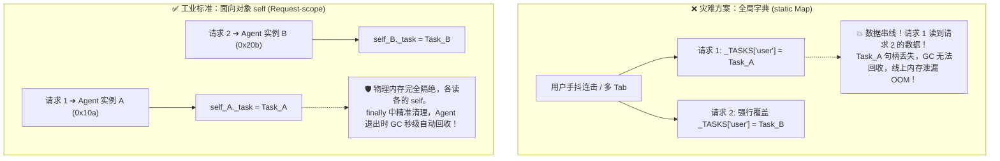

1. **同一用户并发踩踏**：`user_id` 防得住不同用户，防不住用户连击或双开浏览器 Tab，全局字典瞬间被后一个请求覆写。
2. **内存泄漏（OOM 致命隐患）**：全局字典是 GC Root 强引用，只要漏掉一次 `pop()`，Task 句柄及其背后的上下文闭包将永远常驻内存，服务器跑一个月必定爆内存。
3. **面向对象物理隔离**：Python 的 `self` 相当于 Spring 的 `@Scope("request")` / Prototype 实例，每个 Agent 独享内存地址，退出时引用归零，GC 自动秒级回收，天然无并发死锁与泄漏风险。

---

### 4. AgentScope 五阶段执行流转（以 AgenticMemory 为例）

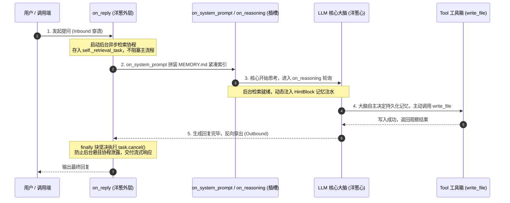

---

### 5. 三者工程化属性天梯表

| 工程维度 | Middleware (中间件) | Hook (生命周期钩子) | Tool (工具) |
| :--- | :--- | :--- | :--- |
| **谁来驱动** | 框架运行时**自动环绕触发** | 框架在特定时机**单点回调** | **LLM 大脑自主决策**主动调用 |
| **控制流向** | **双向折返跑** (Inbound ➔ Outbound) | **单向单点通知** (Point-in-time) | **外部方法调用** (RPC / API) |
| **生命周期包裹** | ✅ 拥有 `try...finally` 绝对掌控 | ❌ 无法包裹整个主流程 | ❌ 仅负责单一业务动作返回 |
| **短路阻断能力** | ✅ 不调 `next()` 直接原地拦截 | ❌ 很难主动中止流程 | ❌ 无关阻断 |
| **状态存储** | **实例私有成员 (`self._task`)** | 无状态 (孤立函数) | 通常无状态 (单例工具 Bean) |
| **Java 体系对标** | Spring AOP `@Around` / FilterChain | Spring `@EventListener` / `@Before` | Spring 业务层 `@Service` Bean / RPC 客户端 |

---

## Pydantic 数据验证与反序列化：model_validate 与双层校验体系

在 FastAPI 和现代 Python 智能体服务中，经常见到形如 `TravelRequest.model_validate(data)` 或路由参数 `req: TravelRequest` 的写法。

### 1. model_validate 是 Python 原生自带的方法吗？

**不是。** Python 内置的 `object` 基类没有任何数据反序列化与校验机制。

`model_validate` 是第三方库 **Pydantic (v2)** 在基类 `BaseModel` 中定义的**类方法（`@classmethod`）**。

```mermaid
classDiagram
    direction TB
    class object {
        __init__()
        __repr__()
        __eq__()
    }

    class StandardPythonClass {
        +name: str
        +my_method()
        (纯 Python 类，无校验机制)
    }

    class BaseModel["pydantic.BaseModel"] {
        +model_validate(obj)*
        +model_validate_json(json_data)*
        +model_dump()
        +model_dump_json()
    }

    class TravelRequest {
        +user_id: str
        +destination: str
        +start_at: date
        +validate_destination()
        +validate_start_at()
    }

    object <|-- StandardPythonClass
    object <|-- BaseModel : Pydantic 核心数据模型基类
    BaseModel <|-- TravelRequest : 继承获得校验与反序列化能力
```

> **版本注记**：在 Pydantic v1 中该方法名为 `parse_obj(raw_dict)`，从 v2 开始统一标准化为 `model_validate(obj)` 与 `model_validate_json(json_str)`。

---

### 2. 校验机制：只有 @field_validator 写的方法在校验吗？

**远远不止。**
很多初学者容易误以为只有显式写了 `@field_validator` 的方法才在执行校验。实际上，Pydantic 采用的是**“内置声明式校验 + 自定义业务校验”的双层流水线架构**：

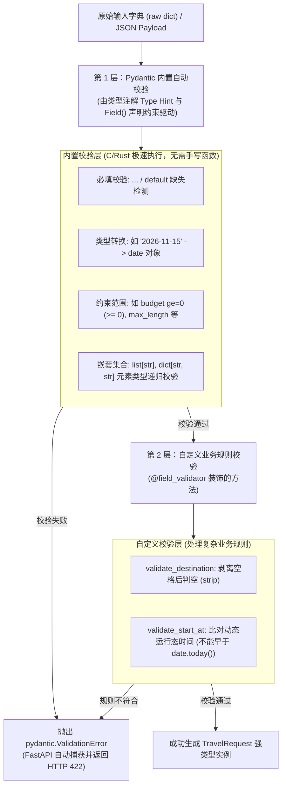

---

### 3. 各字段的校验职责对照表

以实际模型定义为例：

```python
class TravelRequest(BaseModel):
    user_id: str = Field(..., description="申请人标识")
    destination: str = Field(..., description="目的地")
    start_at: date = Field(..., description="出发日期")
    budget: Optional[float] = Field(default=None, ge=0, description="预算")
    tags: list[str] = Field(default_factory=list)
    preferences: dict[str, str] = Field(default_factory=dict)
```

| 字段定义 | 第 1 层：Pydantic 内置校验（自动） | 第 2 层：自定义校验（@field_validator） |
| :--- | :--- | :--- |
| `user_id: str = Field(...)` | 必填项缺失检查；强校验必须为字符串（或可兼容转为 str） | *无需手写* |
| `destination: str = Field(...)` | 必填项缺失检查；字符串类型检查 | `validate_destination`：拦截纯空格字符串 `"   "` |
| `start_at: date = Field(...)` | 必填项缺失检查；自动把 ISO 日期字符串解析为 `date` 对象（非日期格式直接报错） | `validate_start_at`：拦截早于当前系统的过去日期 |
| `budget: Optional[float] = Field(ge=0)` | 允许为 `None` 或浮点数；**`ge=0` 自动拦截负数（如 `-500`）** | *无需手写* |
| `tags: list[str]` | 自动确保为列表，且列表内每一个元素都必须是字符串 | *无需手写* |
| `preferences: dict[str, str]` | 自动确保为字典，且所有 key 和 value 均符合字符串类型 | *无需手写* |

---

### 4. 为什么架构要分成这两层？

1. **性能极致（Rust 内核）**：
   - Pydantic v2 底层完全使用 Rust（`pydantic-core`）重构。
   - 所有内置类型判断、范围约束（`ge`、`le`、`max_length`、正则表达式 `pattern`）、JSON 反序列化均在 C/Rust 级别秒级完成，性能远超纯 Python 函数。
2. **关注点分离（Separation of Concerns）**：
   - **基础契约（类型、格式、上下限）**：交给声明式注解和 `Field(...)`，声明即文档，自动生成 OpenAPI/Swagger Schema。
   - **复杂业务规则（时效性、去空清洗、跨字段联动）**：才交由 Python 函数编写 `@field_validator` 或 `@model_validator`。

---

### 5. 与 Java Web / Spring 体系全景对照

| 概念维度 | Python (Pydantic + FastAPI) | Java Web (Spring Boot + JSR-380) |
| :--- | :--- | :--- |
| **DTO 基础模型** | `class Foo(BaseModel)` | `class FooDTO` + Lombok `@Data` |
| **声明式反序列化** | `Foo.model_validate(dict)` | `objectMapper.readValue(json, FooDTO.class)` |
| **必填与字段约束** | `Field(..., ge=0, min_length=2)` | `@NotNull`, `@Min(0)`, `@Size(min=2)` |
| **自定义校验规则** | `@field_validator("fieldName")` | 自定义注解 + `ConstraintValidator<MyAnno, T>` |
| **跨字段复合校验** | `@model_validator(mode="after")` | 类级别的自定义校验注解 / `scriptAssert` |
| **序列化导出** | `model.model_dump()` / `model_dump_json()` | `objectMapper.writeValueAsString(dto)` |
| **Controller 自动拦截** | 路由参数直接写 `req: TravelRequest`，不符合自动拦截返回 422 | `@PostMapping public Result create(@Valid @RequestBody FooDTO req)` |

---

## asyncio 并发核心：asyncio.gather 执行流程与事件循环时序

在异步编程与智能体服务中（例如 [`exercises/ex000_b_async.py`](file:///Volumes/PortableSSD/workspace/gogo-agent/exercises/ex000_b_async.py#L69-L72)），并发调用多个独立 I/O 任务的核心写法是：

```python
flights, hotels = await asyncio.gather(
    search_flights(destination),
    search_hotels(destination),
)
```

图解：[asyncio.gather 核心执行流程与事件循环时序](output/asyncio_gather_execution_flow.html)（浏览器打开，包含单线程并发时间轴泳道图 + 9 步时序拆解 + Java 对照）

---

### 1. 运行时字符版交互时序图

```text
主流程 (plan_travel_concurrent)        事件循环 (Event Loop)       Task 1 (查航班)          Task 2 (查酒店)
             │                                 │                          │                       │
 1. 启动并发  │ 构造 coro1, coro2                │                          │                       │
             │── await asyncio.gather(...) ───▶│                          │                       │
             │   (主流程让出，挂起等待)          │                          │                       │
             │                                 │── 2. 调度执行 ─────────▶│                       │
             │                                 │                          │ 提取 contextvars      │
             │                                 │◀── await sleep(0.15) ────│                       │
             │                                 │    (T1 让出控制权)        │                       │
             │                                 │                          │                       │
             │                                 │── 3. 立即切到 T2 ────────┼──────────────────────▶│
             │                                 │                          │                       │ 提取 contextvars
             │                                 │◀── await sleep(0.15) ────┼───────────────────────│
             │                                 │    (T2 让出控制权)        │                       │
             │                                 │                          │                       │
             │                                 │ ====== 两者在后台并发等待 I/O (耗时重叠 0.15s) ===== │
             │                                 │                          │                       │
             │                                 │── 4. 定时到期，唤醒 ────▶│                       │
             │                                 │                          │ 组装航班并 return     │
             │                                 │◀── 返回 flights 数据 ────│                       │
             │                                 │                          │                       │
             │                                 │── 5. 定时到期，唤醒 ────┼──────────────────────▶│
             │                                 │                          │                       │ 组装酒店并 return
             │                                 │◀── 返回 hotels 数据 ─────┼───────────────────────│
             │                                 │                          │                       │
 6. 恢复执行  │◀── gather 严格按原参顺序组装 ────│                          │                       │
             │    元组: (flights, hotels)      │                          │                       │
             ▼                                 ▼                          ▼                       ▼
    解包赋值，继续向下执行
```

---

### 2. 核心执行 6 步深度拆解

1. **生成协程（非立即执行）**：
   调用 `search_flights(dest)` 与 `search_hotels(dest)` 时，因为是 `async def` 定义的函数，代码**根本没有开始跑**，仅仅是在内存中实例化了两个惰性的**协程对象（coroutine object）**。
2. **`gather` 包装与任务入队**：
   `asyncio.gather(*coros)` 将传入的协程包装为 `asyncio.Task` 对象，并注册到事件循环的任务就绪调度队列中，返回一个聚合的 Future。
3. **主流程让出控制权**：
   主流程执行到 `await asyncio.gather(...)` 时暂停自身执行，将单线程的 CPU 控制权交还给**事件循环（Event Loop）**。
4. **Task 1 让出与无缝切换**：
   事件循环调度 Task 1 执行，遇到 `await asyncio.sleep(0.15)`（或 `await client.get(...)` 网络请求），向底层注册事件监听并挂起 Task 1；单线程不休眠，事件循环**瞬间无缝切换**到 Task 2 运行。
5. **后台并发等待（耗时重叠）**：
   Task 2 同样执行到 `await` 处挂起让出。此时底层操作系统（kqueue / epoll）在后台并行等待两个 I/O 描述符就绪，两个 0.15s 的网络等待在时间轴上高度重叠，总耗时趋近于 `max(t1, t2) = 0.15s`（而非串行的 `0.15 + 0.15 = 0.3s`）。
6. **保序组装与唤醒解包**：
   网络 I/O 准备就绪后，事件循环依次唤醒协程收尾并返回结果。`gather` **严格按照参数传入的先后顺序**组装成元组 `(flights, hotels)`。主流程从 `await` 点恢复并完成解包赋值。

---

### 3. Java 工程师对比核心要点

| 维度 | Python (`asyncio.gather`) | Java (`CompletableFuture.allOf`) |
| :--- | :--- | :--- |
| **并发基础** | **单线程用户态调度**（协作式切换，无锁、无上下文切换开销） | **多线程内核态调度**（依赖 ForkJoinPool 物理并发） |
| **返回值获取** | 原生有序解包：`flights, hotels = await gather(...)` | `allOf()` 返回 `Void`，需手动对每个 Future 执行 `.join()` |
| **顺序保证** | **严格保序**（即使后面的任务先完成，解包元组依然严格匹配入参顺序） | 手动 `.join()` 依赖开发者的提取顺序 |
| **异常控制** | 默认 Fail-Fast（一处抛错立刻向上冒泡）；可配置 `return_exceptions=True` 将异常当返回值收集 | `allOf` 遇到异常立刻异常完成，全量捕获需 `handle()` / `exceptionally()` |
| **上下文传递** | 自动通过 `contextvars` 在创建 Task 时做环境快照，协程隔离且安全 | `ThreadLocal` 无法跨线程池自动传递，需引入阿里 `TransmittableThreadLocal` |

---

## 方法形态与 @classmethod：类方法、多态工厂与校验器前置

在 Python 中，方法不只有“实例方法”和“静态方法”，还存在一种面向对象的核心构件——**类方法（`@classmethod`）**。

### 1. 三种方法形态与参数隐式绑定机制

面向 Java 开发者理解 Python 的方法调用，最本质的区别在于**首个隐式参数的绑定目标**：

```text
1. 实例方法 (默认，不加修饰符)
   obj.run(10)          ──▶ 解释器自动注入: def run(self, 10)
                                                    ▲
                                                    └── self 指向当前实例对象 (等价于 Java 的 this)

2. 类方法 (@classmethod)
   User.from_dict(d)    ──▶ 解释器自动注入: def from_dict(cls, d)
                                                          ▲
                                                          └── cls 指向类对象本身 (等价于 Java 的 User.class)

3. 静态方法 (@staticmethod)
   Utils.calc(1, 2)     ──▶ 纯裸函数调用:   def calc(1, 2)
                                                ▲
                                                └── 无任何隐式注入，仅作为命名空间挂在类名下
```

---

### 2. 核心特性与 Java 全景对照表

| 方法类型 | 装饰器 | 首个隐式参数 | 调用方式 | Java 对标 | 典型工程用途 |
| :--- | :--- | :--- | :--- | :--- | :--- |
| **实例方法** | *无* | `self` (当前实例) | `obj.method()` | 普通成员方法 (`this.xxx`) | 访问/修改实例属性、执行对象生命周期逻辑 |
| **类方法** | `@classmethod` | `cls` (当前类对象) | `Cls.method()` 或 `obj.method()` | **支持动态多态的静态工厂方法** | **替代构造器（如 `from_json`）**、前置校验规则 |
| **静态方法** | `@staticmethod` | *无* | `Cls.method()` | 普通 `public static` 工具函数 | 纯计算工具、无状态辅助函数，不访问类或实例 |

---

### 3. @classmethod 杀手级特性：自适应继承的多态工厂方法

在 Java 中，静态方法是**编译期静态绑定**的，无法实现“子类继承静态方法并自动生产子类实例”的多态行为（通常只能通过泛型抽象工厂或反射解决）。

而在 Python 中，`@classmethod` 接收的 `cls` 是**运行时动态传入的实际调用类**：

```python
class ModelBase:
    def __init__(self, name: str):
        self.name = name

    # 备选构造器 / 通用工厂方法
    @classmethod
    def from_string(cls, text: str):
        # ⚠️ 关键点：这里的 cls 不是写死的 ModelBase，谁调用它，cls 就是谁！
        return cls(name=text)


class UserModel(ModelBase):
    pass


class OrderModel(ModelBase):
    pass


# 继承的多态派发：
u = UserModel.from_string("张三")   # cls 是 UserModel ➔ 自动返回 UserModel 实例！
o = OrderModel.from_string("ORD01") # cls 是 OrderModel ➔ 自动返回 OrderModel 实例！

print(type(u))  # <class '__main__.UserModel'>
print(type(o))  # <class '__main__.OrderModel'>
```

> **Java 架构思考**：这相当于在父类里只写一套 `from_json` 反序列化逻辑，所有子类无需重写，直接继承即可获得完全类型特化的工厂方法。

---

### 4. 为什么 Pydantic 字段校验器必须使用 @classmethod？

在 Pydantic v2（如 [`exercises/ex000_a_types.py`](file:///Volumes/PortableSSD/workspace/gogo-agent/exercises/ex000_a_types.py#L24-L38)）中，字段校验器的标准写法是：

```python
@field_validator("destination")
@classmethod
def validate_destination(cls, value: str) -> str:
    trimmed = value.strip()
    if not trimmed:
        raise ValueError("目的地不能为空")
    return trimmed
```

**核心生命周期原因：校验是在“对象创建之前”执行的！**

```text
外部输入原始 Dict: {"destination": " 北京 "}
      │
      ▼
1. TravelRequest.model_validate(raw_dict) 启动
      │
      ▼
2. 执行 @field_validator: 此时 TravelRequest 实例尚未被分配内存！
   (没有 self 对象，只有类模板 cls 存在)
      │
      ▼
3. 校验与清洗通过: " 北京 " -> "北京"
      │
      ▼
4. 底层真正调用 __init__ 构建出 self 实例对象并返回
```

若写成普通的实例方法，框架在没生成对象前根本无法调用它；因此，必须使用 `@classmethod` 将校验逻辑牢牢绑定在类级别（Class-level Hook）。

---

## 依赖注入与请求上下文：FastAPI Depends() 的工程化心智模型

在 FastAPI 中，`Depends()` 是**声明式依赖注入（Dependency Injection）与请求参数解析**的核心语法。

面向 Java / Spring 工程师理解，`Depends()` 并不是单一的 API，而是将 Spring 体系中的 **四种经典设计模式与基础设施** 融为一体的纯函数式实现：

> **`Depends()` ≈ `@Autowired` (IoC/DI) + `HandlerMethodArgumentResolver` (参数解析) + `HandlerInterceptor` (路由前置守卫) + `@RequestScope` (请求域单例缓存) + AOP 环绕切面 (`yield`)**

---

### 1. 心智模型流程图：Spring MVC 链式分治 vs FastAPI 依赖有向无环图 (DAG)

在 Spring MVC 中，一个带有权限校验、上下文提取和数据库事务的请求，需要分散配置在 Filter、Interceptor、Resolver 与 AOP 切面中；而在 FastAPI 中，`Depends()` 将这些能力统一组织为一个 **依赖有向无环图（DAG）**，在路由执行前自动自底向上递归解析：

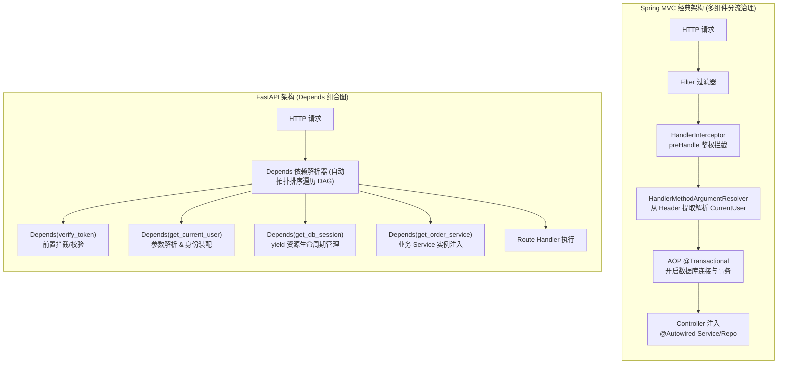

---

### 2. 依赖引用图解（Dependency Reference Graph & DAG 缓存）

FastAPI 的 `Depends` 允许函数相互嵌套依赖。以 GoGo Agent 对话接口（`POST /api/chat/{sessionId}`）为例，底层依赖被自动组装成树状引用图。

框架内置的 `use_cache=True`（默认开启）确保：**在同一 HTTP 请求生命周期内，哪怕多处依赖引用了同一个底层函数，该函数也仅被执行一次**（等价于 Spring 的 `@RequestScope` 请求域单例）：

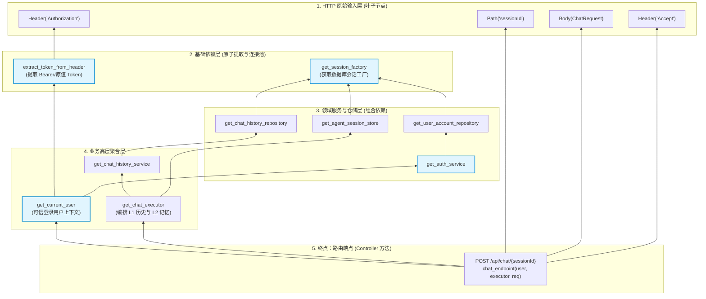

> **引用图要点解读**：
> 1. **自动拓扑解析**：`Endpoint` 仅声明需要 `current_user` 和 `executor`，FastAPI 自动逆向递归解析出所有前置依赖（从 Header 到数据库工厂），无需像 Spring 一样手动配置 Bean 依赖关系。
> 2. **菱形依赖去重（Diamond Dependency）**：图中 `get_session_factory` 被三个仓储同时引用，`use_cache=True` 保证单次请求中工厂只初始化一次并复用，避免连接池与资源的重复创建。

---

### 3. 四大经典 Java 工程场景代码映射

#### (1) 类似 `@Autowired` / 构造器注入（Service / Repository 组装）

* **Java Spring**：通过 Spring IoC 容器反射装配 `@Service` 或 `@Component`。
  ```java
  @RestController
  @RequestMapping("/api/chat")
  public class ChatController {
      @Autowired // 或构造函数注入
      private ChatHistoryService chatHistoryService;

      @GetMapping("/conversations")
      public List<ConversationView> list() {
          return chatHistoryService.listConversations();
      }
  }
  ```

* **FastAPI `Depends`**：通过形参默认值声明契约，框架自动按需调用工厂函数注入：
  ```python
  @router.get("/conversations")
  def list_conversations(
      # 等价于 @Autowired private ChatHistoryService chatHistoryService;
      history_service: ChatHistoryService = Depends(get_chat_history_service),
  ):
      return history_service.list_conversations()
  ```

---

#### (2) 类似 `HandlerMethodArgumentResolver`（可信身份与上下文提取）

在 Java 中，若想在 Controller 方法形参直接拿到已鉴权的 `CurrentUser`，需要实现参数解析器并在 WebMvcConfigurer 中注册：

```java
// Spring MVC 实现
public class CurrentUserArgumentResolver implements HandlerMethodArgumentResolver {
    public boolean supportsParameter(MethodParameter p) {
        return p.hasParameterAnnotation(CurrentUser.class);
    }
    public Object resolveArgument(...) {
        String token = request.getHeader("Authorization");
        return tokenService.parseUser(token); // 返回 UserAccount 领域对象
    }
}
```

在 FastAPI 中，`Depends` 原生支持**依赖嵌套链（Chained Dependencies）**，无须编写额外配置类：

```python
# 依赖 1：从 Header 抽取 Token (底层依赖)
def extract_token_from_header(authorization: str = Header(...)) -> str:
    return authorization.removeprefix("Bearer ").strip()

# 依赖 2：校验 Token 并返回 UserAccount 实体 (中间依赖，自动嵌套注入 extract_token)
async def get_current_user(
    token: str = Depends(extract_token_from_header),
    auth_service: AuthService = Depends(get_auth_service),
) -> UserAccount:
    user = auth_service.get_user_by_token(token)
    if not user:
        raise HTTPException(status_code=401, detail="未登录或登录态失效")
    return user

# 路由端点：直接注入最终强类型领域对象，禁止从请求 Body 伪造身份
@router.get("/info")
def get_user_info(current_user: UserAccount = Depends(get_current_user)):
    return {"userId": current_user.user_id, "realName": current_user.real_name}
```

---

#### (3) 类似 `@Transactional` 与 AOP 环绕通知（资源生命周期管理）

Java 中管理数据库连接和事务通常依赖 `@Transactional` 或 AOP 切面。FastAPI 中使用 Python 的 `yield` 生成器，实现等价的环绕执行：

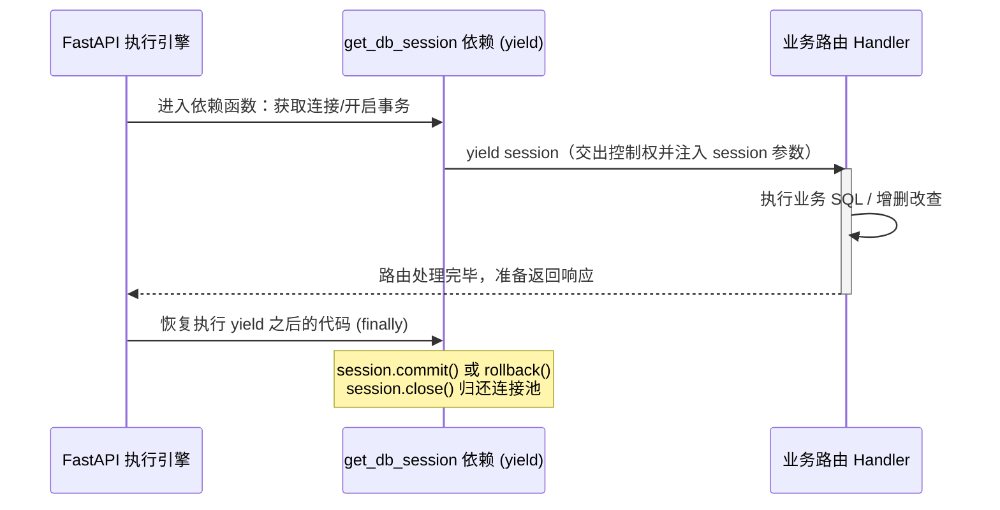

```python
def get_db_session():
    session = SessionFactory()
    try:
        yield session       # 前置逻辑：注入给路由使用
        session.commit()    # 后置逻辑：业务成功无异常时自动提交
    except Exception:
        session.rollback()  # 异常分支：自动回滚
        raise
    finally:
        session.close()     # 最终资源清理（等价于 try-finally / AOP After）
```

---

#### (4) 类似 `HandlerInterceptor` / `@PreAuthorize`（路由守卫与全局权限拦截）

无需在 Handler 中显式接收返回值，仅声明依赖即可作为拦截器运行：

```python
# 1. 声明守卫函数：校验不通过直接抛出 HTTPException 熔断请求
async def require_admin(current_user: UserAccount = Depends(get_current_user)):
    if not current_user.is_admin():
        raise HTTPException(status_code=403, detail="无管理员权限")

# 2. 单个路由方法级别守卫
@router.delete("/orders/{orderId}", dependencies=[Depends(require_admin)])
def delete_order(orderId: str):
    ...

# 3. 整个 Controller / 路由组级别守卫 (等价于 Spring 的 addInterceptors 匹配路由路径)
admin_router = APIRouter(
    prefix="/api/admin",
    dependencies=[Depends(get_current_user), Depends(require_admin)],
)
```

---

### 4. 核心工程机制对照总表

| 维度 | Java Spring Boot | Python FastAPI `Depends()` |
| :--- | :--- | :--- |
| **装配机制** | 全局 IoC 容器 + 反射（Reflect）扫描 + CGLIB 动态代理 | 函数类型内省（`inspect.signature`）+ 运行时构建有向无环图（DAG） |
| **请求级单例缓存** | `@RequestScope` 作用域注解 | `Depends(get_obj, use_cache=True)`（同一 HTTP 请求内多次引用只执行一次） |
| **生命周期管控** | `@PostConstruct` / `@PreDestroy`，Spring AOP 切面 | `yield` 生成器（进路由前跑上半段，出路由后跑下半段） |
| **测试隔离与 Mock** | `@MockBean` 或自定义 `@TestConfiguration` | `app.dependency_overrides[get_service] = mock_service`（直接热替换，开箱即用） |

> **总结**：`Depends()` 是 Python 现代化 Web 框架在吸收了 Java Spring 庞大工程化经验后，用 **“纯函数组合（Function Composition）”** 代替 **“重量级反射容器与类继承”** 的产物。它把对象创建、上下文解析、请求拦截和资源回收全部收敛到同一个优雅的语法糖中。

---

## 方法劫持、包装闭包与 AOP 环绕：从 Java `@Around` / `@Before` 到 Python 装饰器

在编写模型教学演示或测试脚本（如 `demo_010_011_real_model.py`）时，常看到如下代码：

```python
original_call = model._call_api
call_count = 0

async def counted_call(*args, **kwargs):
    nonlocal call_count
    call_count += 1
    return await original_call(*args, **kwargs)

model._call_api = counted_call
```

这段代码利用了 Python 的动态特性（Monkey Patching / 猴子补丁），其**本质是一个闭包包装器（Decorator/Wrapper）**，在行为和设计模式上与 **Java AOP 的环绕通知（`@Around` Advice）** 完全同构。

---

### 1. 心智模型一：Java 的 `@Before` 与 `@Around` 区别

在 Java Spring AOP 中，很多初学者容易混淆 `@Before` 和 `@Around`：
- **`@Before` 是“旁路观察者”**：框架在调用目标前触发它，它只能看一眼入参（`JoinPoint`），不能修改参数，不能阻止目标执行（除非抛异常），返回值强制为 `void`，无权接触返回值。
- **`@Around` 是“全权代理人”**：入参是 `ProceedingJoinPoint`，它**把目标方法的执行点（`proceed()`）包裹在自己的函数体内**。它只执行一次，以 `proceed()` 为分界线，拥有决定是否调用、篡改入参、捕获异常、篡改返回值的全部控制权。

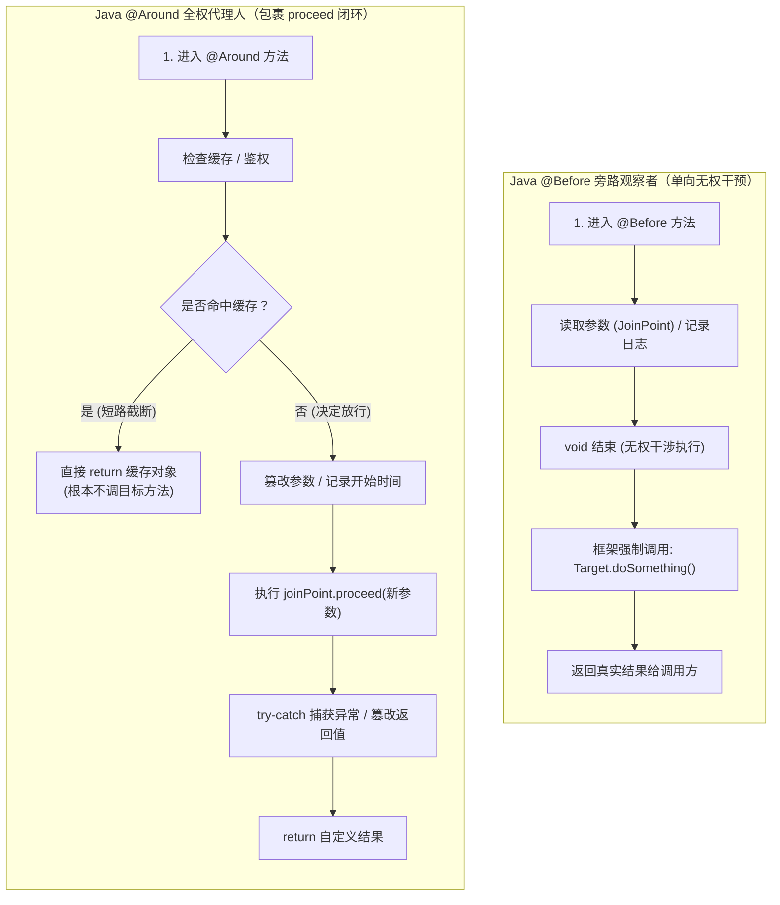

#### 四大核心能力差异

| 核心维度 | Java `@Before` (前置通知) | Java `@Around` (环绕通知) |
| :--- | :--- | :--- |
| **入参类型** | `JoinPoint` | `ProceedingJoinPoint`（多了 `.proceed()` 调度权） |
| **能否阻止/短路目标** | ❌ 不能（必须抛 RuntimeException 才能中断） |  **可以**（不调用 `proceed()` 即彻底短路，如缓存命中） |
| **能否修改目标入参** | ❌ 不能 |  **可以**（传新参数数组：`pjp.proceed(newArgs)`） |
| **能否篡改返回值** | ❌ 不能（方法强制要求为 `void`） |  **可以**（返回值是 `Object`，可任意修饰或替换） |
| **能否捕获目标异常** | ❌ 不能（目标方法尚未开始执行） |  **可以**（用 `try...catch(proceed)` 实现异常兜底或降级） |

---

### 2. 心智模型二：Python 装饰器只有“环绕”，没有单独的“前/后”

Python 原生语法中没有 `@Before`、`@After` 等细分注解，因为在函数式编程中，**“环绕包装（Around Wrapper）”是所有其他切面的超集**。

Python 依靠高阶函数和语言原本的控制流（`try...except...finally`），用一个包装函数天然统一了所有切面：

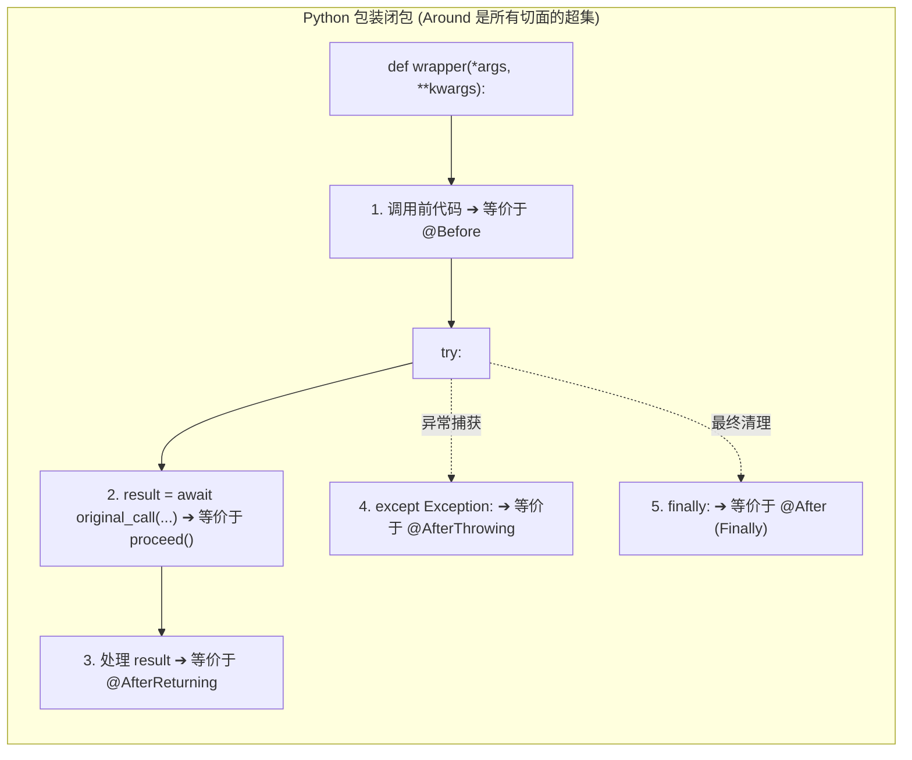

#### 为什么 `counted_call` 只累加了一次？
在教学脚本 [`scripts/demo_010_011_real_model.py`](file:///Volumes/PortableSSD/workspace/gogo-agent/scripts/demo_010_011_real_model.py#L96-L104) 中：
```python
async def counted_call(*args, **kwargs):
    nonlocal call_count
    call_count += 1                              # ① 仅在调用前写了一次：+1
    return await original_call(*args, **kwargs)  # ② 调用原方法，拿到结果立刻 return
                                                 # ③ 这里没有任何代码，后置不会执行任何动作
```
“环绕”指的是包装函数**具备在调用前后自由插入逻辑的能力**，而不是代码自动执行两次。因为开发者只在 `original_call` 前写了一句 `+1`，调用结束后直接 `return`，所以每次 API 调用严格只累加 1 次。

---

### 3. 心智模型三：动态语言的指针替换 vs JVM 字节码代理

当我们将该包装函数赋给实例属性时：
```python
model._call_api = counted_call
```

从 Java 工程化视角来看，它等价于 **`Mockito.spy()` + `doAnswer()`** 或 **Spring CGLIB 代理**，但底层实现机制有着本质差异：

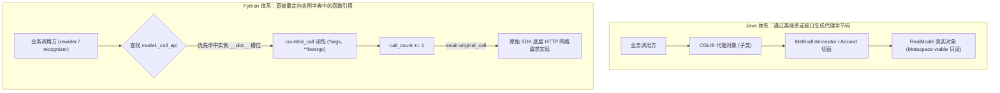

#### 对照总结

| 维度 | Java (JVM) | Python (CPython) |
| :--- | :--- | :--- |
| **方法存放位置** | 类元空间（Metaspace）的方法虚表（vtable），只读不可篡改 | 实例对象的 `__dict__` 属性字典中，本质是普通变量指针 |
| **拦截与织入成本** | 必须生成子类代理（CGLIB/ByteBuddy）或实现接口（JDK Proxy） | **3 行代码直接修改实例属性**：`model._call_api = counted_call` |
| **测试场景对标** | `Mockito.spy(real).doAnswer(...).when(...)` | 手工猴子补丁（测试中亦可用标准库 `unittest.mock.patch.object`） |
| **影响隔离性** | 仅对持有 Proxy 引用的调用方生效，不污染原生 Bean | 仅影响被修改的特定实例，类的其他实例不受影响 |

---

## 内置函数 `enumerate(collection, start=0)`：迭代与结构化解包

在脚本（如 `demo_010_011_real_model.py`）中遍历多轮对话历史或测试问句时，常见如下写法：

```python
for turn, question in enumerate(QUESTIONS, start=1):
    ...
```

### 1. 它是如何做到 `turn` 是数字、`question` 是元素的？

这一行语法由 **内置迭代器** 与 **语言级元组解包** 两个机制共同完成：

1. **`enumerate(..., start=1)` 每次产出一个二元元组**：`(计数, 元素)`。
2. **`for turn, question` 进行结构化赋值**：相当于每轮循环在语法底层执行 `turn, question = pair`。

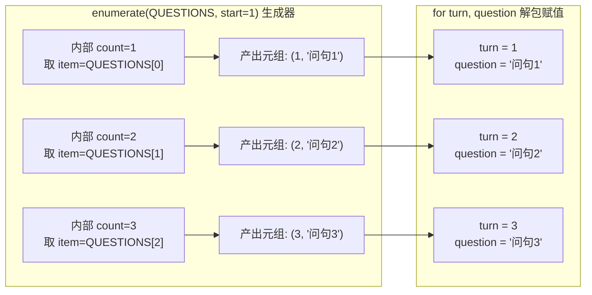

---

### 2. 为什么输出是“键/序号在前，值/元素在后”？

Python 官方在 **[PEP 279](https://peps.python.org/pep-0279/)** 中明确规范了函数原型并给出了参考实现：

```python
def enumerate(collection, start=0):
    i = start
    for item in collection:
        yield (i, item)   # 官方规范固定：序号 i 在前，元素 item 在后
        i += 1
```

把“键/序号放在前面，值放在后面”是函数特意设计的，主要出于以下考量：

1. **符合程序员的自然书写习惯与思维直觉**：
   - 在 C、Java 等传统语言中，循环习惯向来是 **“先声明下标 `i`，再通过下标取值 `item`”**：
     ```java
     for (int i = 0; i < list.size(); i++) {
         String item = list.get(i);
     }
     ```
   - Python 的 `for i, item in enumerate(...)` 严格贴合“第一位是下标、第二位是内容”的肌肉记忆。
2. **统一全语言 `(Key, Value)` 的映射惯例**：
   - 字典遍历：`for key, value in dict.items()`（键在前，值在后）。
   - 列表本质是整数为键的映射：`list[index] = item`。遵循相同的“定位标识在前、内容在后”的对称设计。
3. **保护元组天然排序的稳定性**：
   - Python 元组在比较大小时先比第 0 项。把递增整数放在首位，塞进 `heapq`（堆）或 `sort()` 时直接按序号排序，避免因元素是不可比对象而抛出 `TypeError`。

---

### 3. 对照总结

| 维度 | Java 传统写法 | Python `enumerate` |
| :--- | :--- | :--- |
| **计数与遍历** | 手动维护 `int count = 1;` 并在循环内 `count++;` 或传统下标 `for` | `enumerate(collection, start=1)` 内置迭代器一步封装 |
| **产出格式** | 无原生轻量二元组 | 产出 `(index, item)` 二元元组 |
| **变量接收** | 分布在不同语句中 | 循环头直接结构化解包 `for turn, question in ...` |

---

## 依赖注入与拦截：FastAPI Depends（Spring IoC + ArgumentResolver + Filter 的合体）

在阅读 Web/Agent API 路由入口（如 `src/gogo_agent/chat/router.py`）时，经常会看到控制器方法参数中带有 `Depends(...)`：

```python
async def send_chat_message(
    sessionId: str,
    req: ChatRequest,
    request: Request,
    current_user: UserAccount = Depends(get_current_user),
    executor: ChatAgentExecutor = Depends(get_chat_executor),
):
    ...
```

对于习惯了 Java Spring 生态的工程师来说，初见此写法容易产生困惑：**它到底是一个依赖注入注解、一个参数解析器，还是一个权限过滤器？**

答案是：**它是三者的合体**。

通关练习与图解：[FastAPI Depends 核心机制与 Java 对照通关测评](output/show_me_fastapi_depends_quiz.html)（浏览器打开，包含 8 道核心考点实战闯关题 + 实时仪表盘 + Java 架构逐题深度对照解析）

---

### 1. 从 Java 工程化体系看 Depends 的角色定位

在典型的 Spring Boot 项目中，完成上述接口的职责通常需要拆解在 4 个完全不同的组件中：

1. **Spring IoC 容器（`@Autowired` / 构造器注入）**：注入单例组件（如 `ChatAgentExecutor`）。
2. **Spring MVC `HandlerMethodArgumentResolver`**：从当前请求中抽取上下文（如将 Authorization Header 解析为当前登录实体 `UserAccount`）。
3. **拦截器 / 过滤器（`HandlerInterceptor` / `OncePerRequestFilter` / Spring Security）**：校验 Token 有效性，若无效提前返回 401，阻断后续执行。
4. **环绕切面 / 资源管理器（AOP `@Around` / `try-with-resources`）**：在方法执行前开启数据库会话、在方法返回后释放连接。

FastAPI 的设计哲学是 **“以函数为核心”**，通过统一的 `Depends(dependency_callable)` 协议将上述四大机制全部统一为一套 **依赖求解有向无环图（DAG）**。

```mermaid
flowchart LR
    subgraph SpringEcosystem ["Java Spring 生态：多套割裂机制协作"]
        direction TB
        F["Filter / Interceptor<br>(安全校验与预拦截)"] --> AR["ArgumentResolver<br>(请求参数绑定与实体抽取)"]
        AR --> IOC["IoC Container (@Autowired)<br>(单例/原型服务组件注入)"]
        IOC --> AOP["AOP 切面 / 事务<br>(try-with-resources 后置清理)"]
    end

    subgraph FastAPIEcosystem ["FastAPI 生态：单一协议统一抽象"]
        direction TB
        DEP["Depends(callable)<br>声明式依赖定义"] --> DAG["依赖树有向无环图 (DAG) 拓扑求解"]
        DAG --> Unified["统一处理：鉴权拦截 + 实体抽取 + 组件注入 + 资源清理"]
    end
```

---

### 2. 核心原理：启动期 DAG 构建与请求期拓扑求解

FastAPI 并不是在运行时通过“黑盒魔术”硬编码去寻找依赖，其底层执行模型分为明确的两个阶段：

#### 阶段一：应用启动期（Reflection & DAG Construction）
当使用 `@router.post(...)` 注册路由时，FastAPI 内部会通过 Python 标准库的 **`inspect.signature(func)`** 反射解析目标函数的所有形参：
1. 识别普通路径参数、Query 参数、请求体 Pydantic 模型（`ChatRequest`）。
2. 识别形参默认值是否是 `params.Depends` 的实例。
3. 若是 `Depends`，递归分析该依赖函数（如 `get_current_user`）的形参列表，直到叶子节点（底层 `Request`、Header 或无参函数）。
4. 在内存中建立完整的 **依赖有向无环图（DAG）**，并校验是否存在循环依赖。

#### 阶段二：运行期请求到达（Topological Sort Execution）
当客户端发起 HTTP 请求时，执行流程如下：

```mermaid
sequenceDiagram
    autonumber
    actor Client as 客户端
    participant Route as FastAPI 路由分发器
    participant DepToken as extract_token (叶子依赖)
    participant DepUser as get_current_user (中间依赖)
    participant DepExec as get_chat_executor (服务依赖)
    participant Controller as send_chat_message (业务处理)

    Client->>Route: POST /api/chat/message (带 Token & Body)
    Note over Route: 拓扑求解：自底向上解析依赖树

    Route->>DepToken: 提取 Header 中的 Bearer Token
    DepToken-->>Route: 返回 token_str

    Route->>DepUser: 传入 token_str 解析 UserAccount
    alt Token 无效 / 用户被禁用
        DepUser-->>Route: 抛出 HTTPException(401, "未授权")
        Route-->>Client: 立即熔断响应 401 (业务方法根本不执行)
    else Token 有效
        DepUser-->>Route: 返回 UserAccount 实例
    end

    Route->>DepExec: 获取 ChatAgentExecutor 实例
    DepExec-->>Route: 返回 executor 实例

    Route->>Controller: send_chat_message(sessionId, req, request, current_user, executor)
    Controller-->>Route: 返回响应结果 (ChatResponse / EventSourceResponse)
    Route-->>Client: 200 OK
```

- **天然熔断能力**：依赖函数执行过程中抛出任何 `HTTPException`，FastAPI 会立即捕获并直接返回对应状态码的 HTTP 响应，后续所有依赖与业务路由函数**彻底终止执行**（天然等价于 Java 拦截器的 `preHandle() return false`）。

---

### 3. 两大进阶机制：Java 工程师的核心对应点

#### 机制一：`use_cache=True` —— 请求级单例（类比 Spring `@RequestScope`）

```python
def Depends(dependency=None, *, use_cache: bool = True):
    ...
```

- **默认行为**：FastAPI 默认开启 `use_cache=True`。在单次 HTTP 请求链路中，如果 `A` 函数依赖 `get_current_user`，`B` 函数也依赖 `get_current_user`，FastAPI 在当前请求上下文中**只会执行一次**该依赖函数，并将解析好的返回值缓存复用给所有下游形参。
- **Java 对标**：类似于 Spring 中的 `@Scope("request")` 或线程上下文 `ThreadLocal` 缓存，避免了一次请求内重复查询用户表或解析多次 JWT。
- **关闭缓存**：若声明为 `Depends(generate_trace_id, use_cache=False)`，则每次注入都会重新执行该函数（类似于 Spring `@Scope("prototype")` 原型模式）。

#### 机制二：`yield` 生成器依赖 —— 生命周期与资源后置释放（类比 `try-with-resources` + AOP环绕）

在 Java 中管理数据库连接或事务时，通常依赖声明式事务注解 `@Transactional` 或 `try (Session session = sessionFactory.openSession())`。而在 FastAPI 中，通过带有 `yield` 的依赖函数优雅解决：

```python
async def get_db_session():
    session = AsyncSessionLocal()
    try:
        # yield 前：前置准备阶段 (请求前创建连接)
        yield session
        # 业务路由函数执行完毕，准备提交事务
        await session.commit()
    except Exception:
        await session.rollback()
        raise
    finally:
        # yield 后：后置清理阶段 (无论成功还是抛异常，必须释放连接)
        await session.close()
```

- **执行时机**：
  1. 请求进入时，FastAPI 执行依赖函数直到遇到 `yield` 语句，并将 `yield` 出的值（此处为 `session`）作为参数注入给业务控制器。
  2. 控制器处理完成并生成响应后，FastAPI 重新**唤醒（Resume）**该生成器，继续执行 `yield` 之后的语句（如 `commit` 或 `finally: close()`）。
- **工程优势**：把“准备”、“供给”、“回收”全部闭环在一个单一函数中，彻底替代了 Java 中 `Filter.doFilter()`、`HandlerInterceptor.afterCompletion()` 与切面的割裂设计。

---

### 4. Java vs FastAPI 体系全景对照

| 维度 | Java (Spring 生态) | Python (FastAPI `Depends`) |
| :--- | :--- | :--- |
| **单例服务注入** | `@Autowired` / `@Inject` / 构造器注入 | `Depends(get_service)` |
| **请求上下文实体提取** | 自定义 `HandlerMethodArgumentResolver` | `current_user: UserAccount = Depends(get_current_user)` |
| **前置鉴权与拦截** | `HandlerInterceptor.preHandle` 或 Spring Security Filter | 依赖函数直接 `raise HTTPException(status_code=401)` |
| **请求级单例缓存** | `@Scope(WebApplicationContext.SCOPE_REQUEST)` | `use_cache=True`（默认启用） |
| **瞬态多实例注入** | `@Scope("prototype")` | `Depends(..., use_cache=False)` |
| **资源打开与安全关闭** | `try-with-resources` + AOP `@Around` 环绕切面 | `yield` 生成器依赖 (`try: yield res; finally: cleanup()`) |
| **类型约束与文档生成** | 反射注解 + Swagger/SpringDoc OpenAPI 扫描器 | Pydantic 类型注解 + OpenAPI/JSON Schema 自动生成 |

> 🎯 **实战通关测评**：针对上述全景对照表中 7 大维度的理论细节与工程边界，可直接在配套交互页面 [FastAPI Depends 核心机制与 Java 对照通关测评](output/show_me_fastapi_depends_quiz.html) 中完成 8 道专项闯关测评题，检验理解深度。

---

## 动态工厂与协程折返：_pipeline_factory 的跳转奥妙（一等函数 + 默认实参 IoC + @asynccontextmanager 双向跳跃）

在阅读核心执行器代码（[`ChatAgentExecutor._prepare_turn`](file:///Volumes/PortableSSD/workspace/gogo-agent/src/gogo_agent/chat/executor.py#L334-L345)）时，会看到一段极具 Python 语言特色的写法：

```python
async with self._pipeline_factory(self._history_service) as pipeline:
    prepared = await pipeline.prepare(request)
```

直觉上看，类内部并没有定义 `def _pipeline_factory(self): ...`，也没有像 Java 那样声明一个庞大的 `PipelineFactory` 接口类。**它是如何精确跳转到 `intent/runtime.py` 中的？底层的控制流又是如何打乒乓球般双向跳跃的？**

---

### 1. 跳转全景图：函数指针与双向协程折返

```mermaid
sequenceDiagram
    autonumber
    participant Exec as executor.py<br>(ChatAgentExecutor)
    participant Ptr as self._pipeline_factory<br>(一等公民函数指针)
    participant RT as runtime.py<br>(open_intent_pipeline)

    Note over Exec,Ptr: 阶段一：默认形参指针绑定 (模块加载与对象实例化时)
    Exec->>Ptr: 构造函数默认形参：= open_intent_pipeline
    Note over Ptr: self._pipeline_factory 直接持有 runtime 模块中的函数内存地址

    Note over Exec,RT: 阶段二：去程跳跃 (Inbound: 进入 async with)
    Exec->>Ptr: async with self._pipeline_factory(h)
    Ptr->>RT: 调用 open_intent_pipeline(h)
    Note over RT: 1. 创建模型与向量连接<br>2. 组装 IntentPipelineService<br>3. 执行到 yield 暂停挂起！
    RT-->>Exec: 把 pipeline 实例产出给 as pipeline 变量

    Note over Exec: 阶段三：执行核心业务
    Exec->>Exec: await pipeline.prepare(request)

    Note over Exec,RT: 阶段四：回程折返 (Outbound: 离开 async with)
    Exec->>RT: 退出 with 块，自动触发 __aexit__ 唤醒生成器
    Note over RT: 恢复 yield 之后的代码，坚决执行 finally:<br/>关闭 text_model 与 embedding 网络客户端
```

---

### 2. 核心设计奥妙拆解

#### 奥妙 1：函数是一等公民（First-Class Citizen）+ 默认参数 IoC 机制
在传统的 Java 体系中，要在运行时实现工厂替换，通常需要完整的三件套：
`PipelineFactory` 接口 + `@Component RuntimePipelineFactory` 实现类 + 构造器 `@Autowired` 注入。

但在 Python 的 [`executor.py`](file:///Volumes/PortableSSD/workspace/gogo-agent/src/gogo_agent/chat/executor.py#L95-L105) 中：

```python
from gogo_agent.intent.runtime import open_intent_pipeline  # 👈 1. 静态导入目标函数

class ChatAgentExecutor:
    def __init__(
        self,
        ...,
        # 👈 2. 核心：将函数本身作为形参的默认实参！
        pipeline_factory: Callable[[ChatHistoryService], AsyncContextManager[IntentPipelineService]] = open_intent_pipeline,
    ):
        self._pipeline_factory = pipeline_factory  # 👈 3. 将函数内存指针保存为实例属性
```

- **类加载求值**：Python 在解析 `__init__` 函数签名时，默认参数表达式会在**类定义加载时求值**，因此 `open_intent_pipeline` 的内存地址在启动时就已经固定注入给形参默认值。
- **开箱即用（生产环境）**：业务路由在初始化 `ChatAgentExecutor()` 时无需传入该参数，自动走默认值，IDE 点击 `_pipeline_factory` 的默认值即可一键直达 `runtime.py`。
- **极简依赖注入（测试环境）**：单元测试想要替换真实模型与向量库时，无需任何 ByteBuddy 或 Spring 复杂的 Mockito 容器重建，直接传入普通 Lambda 即可完成 100% 隔离：
  ```python
  executor = ChatAgentExecutor(pipeline_factory=lambda h: mock_pipeline_context)
  ```

---

#### 奥妙 2：`@asynccontextmanager` 的协程包装魔术
跳转到 [`runtime.py`](file:///Volumes/PortableSSD/workspace/gogo-agent/src/gogo_agent/intent/runtime.py#L74-L106) 后，会发现 `open_intent_pipeline` **并不是普通函数，而是一个带有 `yield` 的异步生成器**：

```python
@asynccontextmanager
async def open_intent_pipeline(history_service: ChatHistoryService) -> AsyncIterator[IntentPipelineService]:
    # 前置：读取配置，创建 Embedding 与 LLM 网络客户端，连接 Qdrant
    try:
        async with QdrantStore(...) as store:
            yield IntentPipelineService(...)  # 👈 产出服务，在此冻结挂起！
    finally:
        # 后置：离开 with 块时必然执行清理
        await embedding.client.close()
        await text_model.client.close()
```

- 原生包含 `yield` 的生成器函数是无法直接用于 `async with` 的。
- 标准库 `@asynccontextmanager` 充当了适配器，将其封装为实现了 `__aenter__` 和 `__aexit__` 的 `_AsyncGeneratorContextManager` 上下文对象。
- **调用方因此可以像使用资源句柄一样优雅安全地管理复杂 Agent 流水线**：
  ```python
  async with self._pipeline_factory(...) as pipeline:
      ...
  ```

---

#### 奥妙 3：双向折返控制流（The Yield Trampoline 乒乓跳跃）
这里的代码执行并不是单向的“调用 $\to$ 返回”，而是像乒乓球一样在两个文件之间打了**两次折返跳跃**：

1. **第一次跳入（去程）**：`executor.py` 触发 `__aenter__`，跳入 `runtime.py` 执行前置资源创建，直到 `yield IntentPipelineService(...)`。此时 `runtime.py` 的局部变量和调用栈被**就地冻结挂起**；
2. **切回调用方**：控制权交还给 `executor.py`，并将产出的服务赋给 `as pipeline`，执行核心意图识别 `prepared = await pipeline.prepare(request)`；
3. **第二次跳入（回程）**：当 `executor.py` 退出 `async with` 块时（无论是正常返回、中途抛出业务异常、还是客户端断开触发取消），Python 事件循环会自动调用 `__aexit__` **重新唤醒（Resume）** `runtime.py`，继续执行 `finally:` 之后的代码，确保网络长连接被 100% 释放！

---

### 3. Java vs Python 架构全景对照

| 维度 | Java 体系 (Spring Boot) | Python AgentScope (本项目) |
| :--- | :--- | :--- |
| **契约声明** | `public interface PipelineFactory` 单独定义接口文件 | `Callable[[ChatHistoryService], AsyncContextManager[...]]` 函数签名类型提示 |
| **装配机制** | `@Component` + `@Autowired` 依赖注入框架配置 | 构造函数默认参数 `= open_intent_pipeline`，开箱即用 |
| **测试隔离** | `@MockBean` 或 Spring Profile 多套 Context | 单测直接传 lambda：`ChatAgentExecutor(pipeline_factory=mock_factory)`，**零侵入替换** |
| **生命周期** | `AutoCloseable` + `try-with-resources` 或 AOP 环绕 | 原生 `@asynccontextmanager` + `yield` 协程挂起与唤醒 |
| **控制流** | 依靠模板方法（`Template Callback`）或闭包执行 | 双向折返协程跳跃（Inbound 准备 $\to$ 挂起 $\to$ Outbound 强制清理） |


