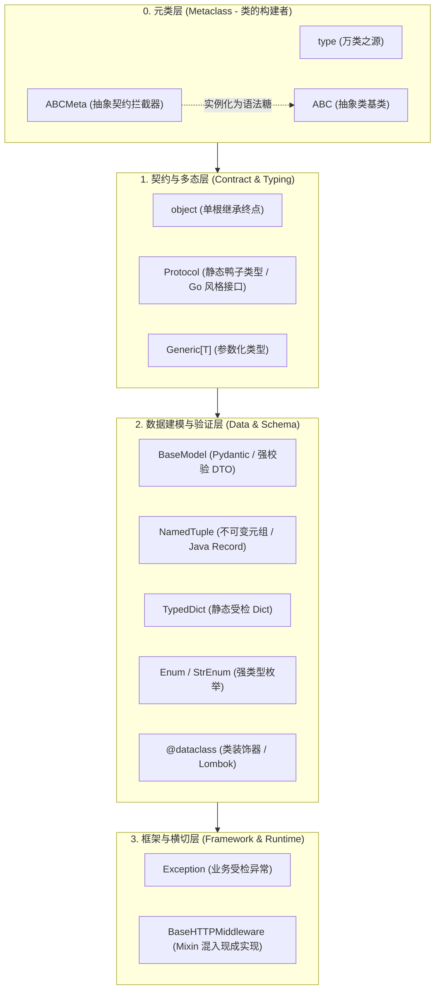
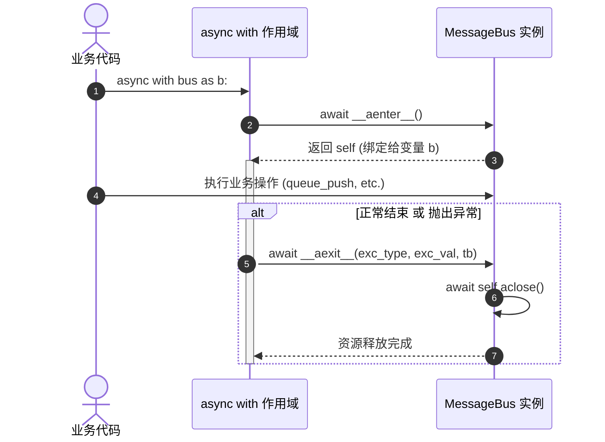
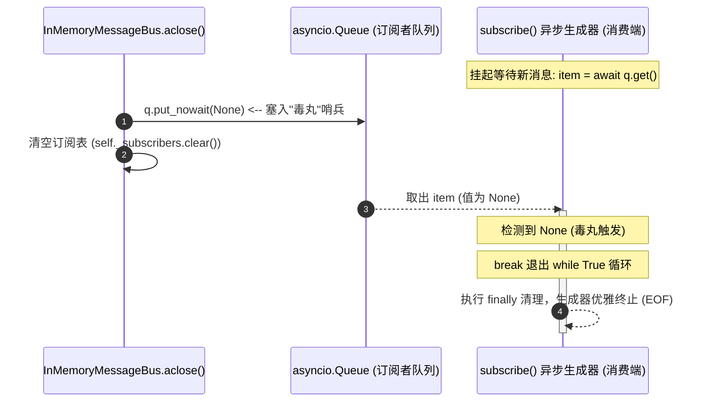
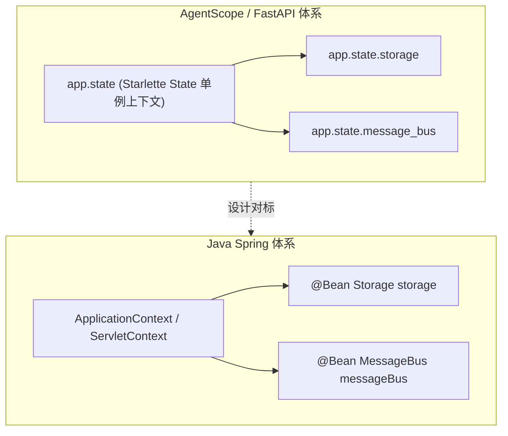
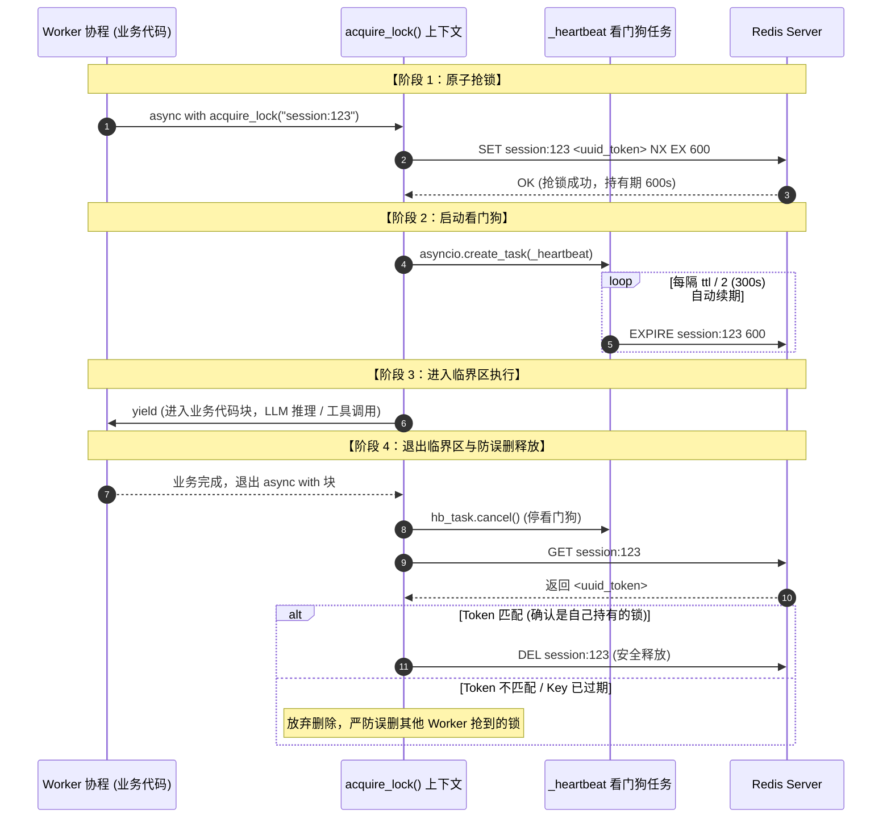
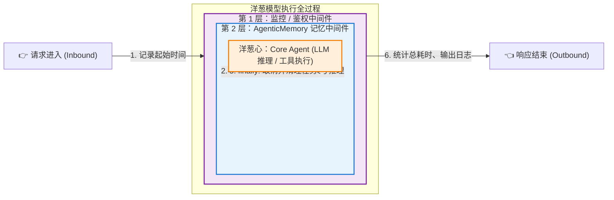
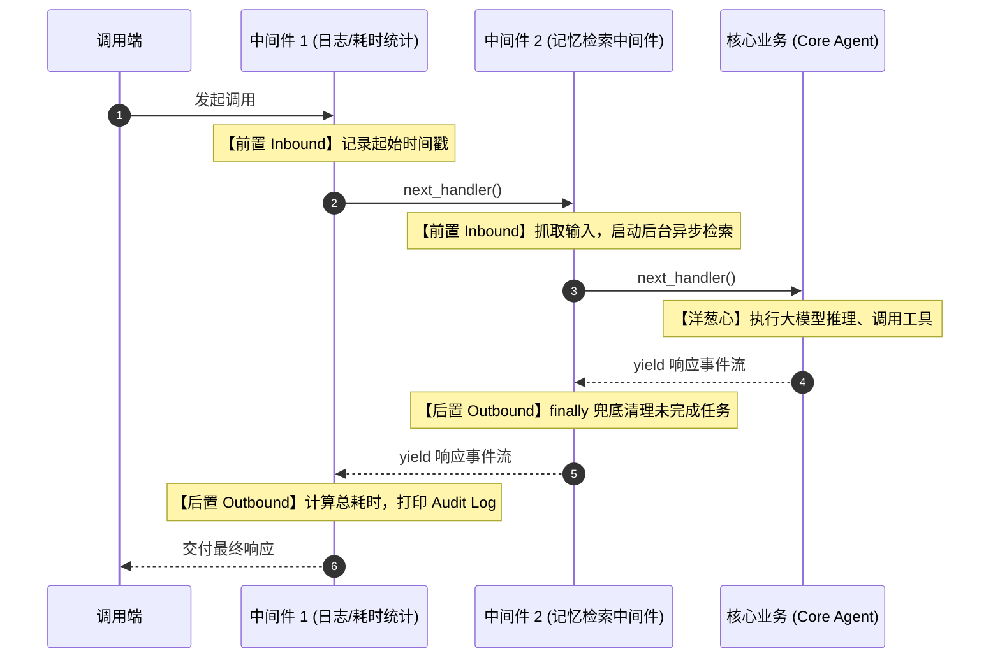
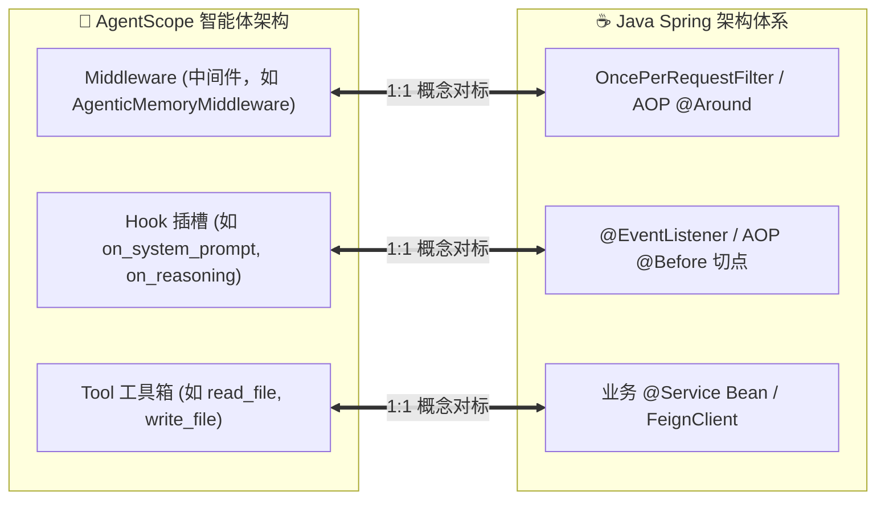
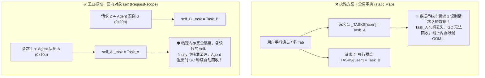
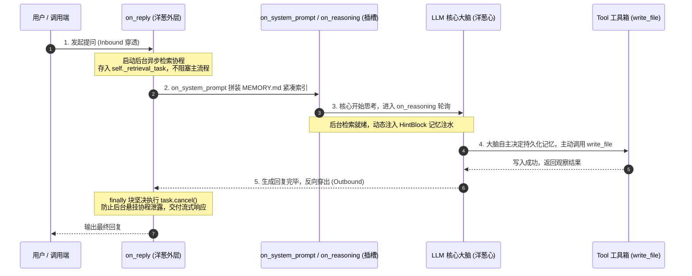

## __init__.py 声明"包对外公开什么"，
下划线约定声明"什么不该碰"，两者合起来才是 Python 的封装。
```
  包 catalog/
  │
  ├── __init__.py          ← 门面（声明公共 API）
  │   ├── from .loader import load_rules   ← 搬运：外部可以短路径导入
  │   └── __all__ = [...]                  ← 白名单：写死公共清单
  │
  └── loader.py             ← 实现模块
      ├── load_rules()      ← 公共符号（被搬运到门口）
      └── _private_helper() ← 私有符号（下划线约定，不用搬）
```

只有import * 才会导入all中的内容，单个方法import 阻止不了

## 接口
```python
class Probe(Protocol):
```
Protocol 是 Python 的结构化子类型（structural subtyping）机制。和 Java interface 的区别在于：Java 要求 `implements Probe` 显式声明，Python Protocol 是鸭子类型——只要你的类有匹配的属性和方法签名，就自动被视为 `Probe` 的实现，不需要显式 `implements` 它。

| Python | Java | 含义 |
|---|---|---|
| `Protocol` | `interface` | 纯契约，无实现 |
| `...` 方法体 | 无方法体的抽象方法 | 签名声明，不提供实现 |
| 属性声明无赋值 | getter 方法声明 | 实现类必须提供 |
| `@runtime_checkable` | 天然支持 `instanceof` | 运行时类型检查 |
| 鸭子类型匹配 | `implements` 显式声明 | 结构兼容即视为实现 |

## 类型检查
```python
type(r.probe).__name__ == "ExtractProbe"  # 精确匹配，只看当前类型
isinstance(r.probe, ExtractProbe)          # 继承感知，子类也算
```

区别在继承：
```python
class SpecialExtractProbe(ExtractProbe):
    pass

p = SpecialExtractProbe()

type(p).__name__ == "ExtractProbe"   # False — 类型名是 "SpecialExtractProbe"
isinstance(p, ExtractProbe)           # True  — 它是 ExtractProbe 的子类
```

| Python | Java | 行为 |
|---|---|---|
| `type(obj).__name__ == "Foo"` | `obj.getClass().getName().equals("Foo")` | 精确匹配，不认子类 |
| `type(obj) is Foo` | `obj.getClass() == Foo.class` | 精确匹配，类型安全 |
| `isinstance(obj, Foo)` | `obj instanceof Foo` | 继承感知，子类也算 |

绝大多数情况用 `isinstance`。用 `type().__name__` 通常是因为类还没导入，或者故意要排除子类（少见）。

## id()

`id(obj)` 把对象身份折算成整数（CPython 里就是对象的堆地址）。唯一常见用途：当 dict 键，做"按对象身份"的缓存。

Java 不需要这个函数：引用本身是现成的身份值，能 `==`、能当键（IdentityHashMap）。Python 的 dict 键是**值相等**语义（hash + `__eq__`），不是身份，所以想按"同一个对象"做缓存时没有现成容器，只能 `id()` 数值化。

为什么不直接拿对象当键：

- 类一旦重写 `__eq__`/`__hash__`（dataclass、框架上下文几乎都会），值相等的两个对象就在 dict 里互相覆盖，判键从身份漂移成值相等；
- dict 强引用键，对象不会被回收，防泄漏还得换弱引用容器，标准库里没有 IdentityHashMap 那种东西。

```python
cache_key = id(ctx)  # 身份变整数，语义/生命周期契约一次剥干净
```

| Python | Java | 含义 |
|---|---|---|
| `id(obj)` | （无；引用即身份） | 身份数值化 |
| `a is b` | `a == b`（引用比较） | 身份比较 |
| dict 键 = hash + `__eq__` | HashMap 键 = hashCode + equals | 值相等判键 |
| `id()` 当键 | `IdentityHashMap` | 按身份缓存 |
| 弱键容器 | `WeakHashMap` | 键不阻止回收 |
| 手动 `clear()` | — | id 缓存只能靠外部纪律管生命周期 |

最大的坑：**id 只在对象存活期间唯一**。CPython 引用计数归零立刻回收，内存马上被新对象复用，同一个 id 会安静地属于下一个对象。Java 引用不会过期（握着引用对象就必活），Python 的 id 整数躺在缓存里时对象可能已经死了——陈旧缓存不报错，只给错数据。

心智模型：对象 = 客房，id = 房号，变量 = 通讯录条目。房号只在你握着房卡（对象活着）时算数；退房后房号给新房客。跨请求活着的 `dict[房号]` 就是过期登记本。

工程准则：id() 缓存等价于 Java 里"每个请求 new 一个 IdentityHashMap，入口 finally 里 clear"。短生命周期、单入口、入口保证 clear，可以用；ctx 生命周期不可控或多入口交错时，改用缓存挂 ctx 属性（随 ctx 生灭），或 `weakref.WeakKeyDictionary`。

## 协程与 await

协程是一个能暂停、能恢复的函数。`async def` 调用只产出一个惰性对象，`await` 才驱动它执行，并在拿不到结果时把控制权交还给驱动者（Task → 事件循环）。

```python
# asyncio.Future.__await__ —— 整个机制的缩影
def __await__(self):
    if not self.done():
        yield self          # 我不行，把"等什么"交给 Task
    return self.result()    # 被唤醒后取结果，也可能抛

# await x 约等于 yield from x.__await__()
```

`await` 有四种结局：

| 写法 | 行为 |
|---|---|
| `await fut`，fut 已完成 | `if` 不成立 → 不 yield、不让出、原地取值 |
| `await fut`，fut 未完成 | `yield self` → Task 挂 done 回调，返回事件循环 |
| `await fut`，fut 失败 | `result()` 抛异常 → `throw` 回 await 所在那一行 |
| `await coro` | 你亲自驱动它，它是你调用栈上的一层，别的 Task 并发不了 |

Task 侧的对应实现（CPython 3.11 `asyncio/tasks.py`）：

- `:277` `coro.send(None)` 驱动一步，返回值就是协程 yield 出来的东西
- `:297` `_asyncio_future_blocking` 是个一次性标志位，区分"真在等这个 Future"和"随手 yield 了它"
- `:314` `add_done_callback(self.__wakeup)` 挂起发生在这里，挂完 Task 就返回事件循环
- `:286` `StopIteration.value` 就是协程的 return 值。协程没有别的通道返回

**关键推论**：`await` 不保证切换。目标已完成、或目标内部没有真挂起点时，原地继续。`async def` 里可以一个 `await` 都没有（letter-auto 的 `_material_rows_from_ocr_facts` 就是），await 它等于同步调用，不让出控制权。

Java 的对应物是虚拟线程（JDK 21）。两者都是用户态并发，差别在谁定义让出点、调度器跑在几条 OS 线程上：

| 维度 | Python 协程 async/await | Java 21 虚拟线程 |
|---|---|---|
| 让出点 | 你显式写 `await` | JDK 改造过的阻塞 API，隐式让出 |
| 传染性 | 有，调用链一路 `async` | 无，普通方法调用 |
| 调度器 | asyncio 事件循环 | ForkJoinPool |
| 承载线程 | 1 条 OS 线程 | N 条 carrier 线程 |
| 一处没让出 | 整个事件循环停摆 | 只占住 1 个 carrier，其余照跑 |
| 栈放哪 | 协程 frame 直接在堆上 | 未挂起时在 carrier 栈上，挂起时拷到堆 |
| 切换成本 | 状态机跳转，几乎零拷贝 | mount/unmount 要拷栈 chunk |
| 抢占式? | 否，纯协作 | 否，也是协作（只在阻塞点 unmount） |

两个反直觉的点：

- **虚拟线程不是抢占式**。它只在阻塞点 unmount，CPU 密集循环不会 yield，Javadoc 明确说不适合长时间计算。它是"更便宜的阻塞"，不是"更好的线程"。
- **跨语言对应关系是反的**。Java 里最像 Python 协程的是 Reactor / `CompletableFuture` 那套链式 API（显式让出 + 传染）；Python 里最像虚拟线程的是 gevent / eventlet 的猴子补丁。虚拟线程的本质就是"把 gevent 那套做进 JVM，并且能跑在多条 carrier 线程上"。

JDK 21 的坑：`synchronized` 块和 `Object.wait()` 会 pin 住 carrier 线程，到 JDK 24 的 JEP 491 才修。Python 侧没有 pinning 这个概念，对应的坑是"在协程里调阻塞函数"。

图解：[协程与 await：一个能暂停的函数](output/coroutine-await.html)（浏览器打开，9 段图解 + 可步进的 10 帧时序图：生命周期 → 一次 await 的完整往返 → CPython 源码对应 → 本质三行 → 四种结局 → 四者关系 → Java 虚拟线程对照 → letter-auto 真实调用链）

## 抽象与面向对象基类层次

`ABC` 就是 Python 的抽象类基类，`@abstractmethod` 就是抽象方法，语义上和 Java 的 `abstract class` + `abstract` 方法对应。但 Python 没有 Java 那样纯粹由 `interface` 和显式继承统治的世界，而是基于**元类（Metaclass）**、**抽象类（ABC）**、**协议（Protocol）**与**鸭子类型（Duck Typing）**构成的多层体系。

### 这些基类靠记吗？

**不靠死记。**
- Java 是**名义类型（Nominal Typing）**：不显式写 `implements Closeable`，即使有 `close()` 方法也不能放进 `try-with-resources`。
- Python 的灵魂是**鸭子类型（Duck Typing）**与**魔术方法（Dunder Methods）**：
  - 想支持 `with obj:`？实现 `__enter__` 和 `__exit__` 即可，不用继承任何类。
  - 想支持 `for x in obj:`？实现 `__iter__` 即可。
  - 想支持 `len(obj)`？实现 `__len__` 即可。
- 口诀：**“语法看双下（Dunder），静态约束用 Protocol，防漏实现用 ABC，网络传输用 BaseModel，内部载荷用 dataclass / NamedTuple / TypedDict。”**

### 整体心智全景：从“元编程”到“业务建模”的 4 层金字塔



### 常见基类清单（按层次划分）


| 基类 / 语法 | 层次 | 核心作用 | Java 对标 | AgentScope 仓库实例 |
| :--- | :--- | :--- | :--- | :--- |
| `object` | 类 | 一切实例的根基类 | `java.lang.Object` | 每个类的 MRO 链末尾 |
| `type` | 元类 | 一切类的类型（类的类） | `Class<?>`（但具有动态构造类的能力） | 隐式使用，动态元编程 |
| `ABCMeta` | 元类 | 维护 `__abstractmethods__`，拦截未完全实现的实例化 | 类似 Java 编译期抽象类完整性检查 | `type(MessageBus)` |
| `ABC` | 类 | `metaclass=ABCMeta` 的语法糖基类 | `abstract class` | `MessageBus(ABC)` |
| `Protocol` | 类 | 结构化子类型（静态鸭子类型） | 类似 Go `interface` / Java 单方法接口 | `PipelineProtocol` |
| `Generic[T]` | 类 | 泛型类型参数化 | `<T>` 泛型声明 | `EmbeddingModelBase(Generic[InputT])` |
| `BaseModel` | 类 | Pydantic 数据解析、运行时类型强校验 | Lombok `@Data` + Jackson + Spring `@Valid` | `WikiPage(BaseModel, Generic[...])` |
| `Enum` / `StrEnum` | 类 | 枚举类型（`StrEnum` 原生支持直接当 str 使用与 JSON 序列化） | Java `enum` | `PermissionMode(Enum)`、`EventType(StrEnum)` |
| `Exception` | 类 | 业务/运行时异常分类基类 | `java.lang.Exception` | `AgentOrientedException(Exception)` |
| `NamedTuple` | 类 | 不可变元组语法糖（C 级性能） | Java 14+ `record` | `SkillArchive(NamedTuple)` |
| `TypedDict` | 类 | 带有字段类型提示的 Dict 语法糖（零运行时开销） | 编译期受检的 `Map<String, Object>` | `_SkillEntry(TypedDict)` |
| `BaseHTTPMiddleware` | 类 | 混入外部框架现成实现（Mixin / 多重继承） | 组合模式 / 拦截器基类 | `ProtocolMiddlewareBase(BaseHTTPMiddleware, ABC)` |
| `@dataclass` | **装饰器** | 自动生成 `__init__`、`__repr__`、`__eq__` 等样板代码（**注意：不是基类！**） | Lombok `@Data` / `@AllArgsConstructor` | 仓库内 22 处内部状态实体 |

### 核心分层与工程决策

1. **元类与抽象契约 (`type` / `ABCMeta` / `ABC`)**
   - `ABC` 本质是只有两行代码的语法糖：`class ABC(metaclass=ABCMeta): __slots__ = ()`。
   - `ABCMeta` 负责在实例化（`__call__`）时进行 Fail-Fast 校验，若子类漏写抽象方法，当场抛出 `TypeError`。

2. **名义契约 vs 结构协议 (`ABC` vs `Protocol`)**
   - 团队公共基座、需要复用默认模板方法（Template Method Pattern）时用 `class MyBase(ABC)`。
   - 插件化架构、第三方扩展、只关心“有没有这个方法”而不强加继承关系时用 `Protocol`（如 `PipelineProtocol`，只要实现了匹配的 `__call__` 就是 Pipeline，彻底解耦）。

3. **数据载荷 (DTO) 的 4 种选型权衡**
   - **外部网络输入/API 报文** ➔ `BaseModel`（做字段强转、格式校验，防脏数据）。
   - **内部领域状态对象** ➔ `@dataclass`（纯装饰器，无运行时校验开销，类似 Lombok）。
   - **不可变高性能小结构体** ➔ `NamedTuple`（C 级 Tuple 性能，只读保护，类似 Java `record`）。
   - **原生 Dict 互操作** ➔ `TypedDict`（纯静态类型检查提示，运行时就是原生字典，零损耗）。

4. **横切复用与多重继承 (Mixin)**
   - Java 仅支持单继承，需依赖接口默认方法或装饰器；Python 支持多重继承。
   - 如 `ProtocolMiddlewareBase(BaseHTTPMiddleware, ABC)`：一边继承 Starlette 的 ASGI HTTP 中间件管道，一边混入 `ABC` 声明业务抽象方法。

## 异步上下文管理器与生命周期（__aenter__ / __aexit__ / aclose）

在 `MessageBus` 等需要管理连接池、底层套接字的类中，常见以下三件套：

```python
async def __aenter__(self) -> Self:
    return self

async def __aexit__(self, exc_type, exc_value, traceback) -> None:
    await self.aclose()

async def aclose(self) -> None:
    """Release underlying transport resources. Default is a no-op."""
```

### 1. 四者的核心关系与层次划分

> **`async with` 是语言级语法糖，只认 `__aenter__` 和 `__aexit__`；而 `aclose()` 是工程级设计约定，被 `__aexit__` 委托调用，同时支持脱离 `async with` 独立关闭。**

```mermaid
flowchart TD
    subgraph LanguageLevel ["1. Python 语言规范层 (PEP 492)"]
        AsyncWith["语法糖: async with obj as x:"]
    end

    subgraph ProtocolLevel ["2. 协议契约层 (Asynchronous Context Manager)"]
        AEnter["__aenter__()<br>(初始化并返回实例)"]
        AExit["__aexit__(*exc_info)<br>(拦截异常并保证清理)"]
    end

    subgraph EngineeringLevel ["3. 工程设计层 (业务释放入口)"]
        AClose["aclose()<br>(底层连接池/资源真实销毁逻辑)"]
    end

    AsyncWith -->|语句入口调用| AEnter
    AsyncWith -->|离开作用域调用 (finally)| AExit
    AExit -->|内部委托调用| AClose
    
    SingletonCaller["长生命周期单例 / 停机钩子<br>(不方便写 async with 的场景)"] -.->|直接显式调用| AClose
```

#### 调用关系链（两条消费路径）
- **路径 A：作用域内自动闭环（RAII / 短生命周期）**
  `async with bus as b:` ➔ `await __aenter__()` ➔ 业务执行 ➔ `await __aexit__()` ➔ 内部调用 `await aclose()`
- **路径 B：脱离 async with 的常驻单例（长生命周期）**
  全局持有对象 ➔ 停机钩子（如 FastAPI shutdown）直接显式触发 ➔ `await bus.aclose()`

### 2. Java 概念精准映射表

| 元素 | 层次 | 语言 / 模式 | Java 对应物 | 核心认知 |
| :--- | :--- | :--- | :--- | :--- |
| **`async with`** | 语法层 | 语言关键字 | `try (...) { }` | 编译器层面的结构控制，离开作用域必执行清理。 |
| **`__aenter__`** | 协议层 | 魔术方法 (Dunder) | 构造器或工厂方法的初始化阶段 | 必须存在，且通常 `return self`（让 `as b` 绑定当前引用）。 |
| **`__aexit__`** | 协议层 | 魔术方法 (Dunder) | `AutoCloseable.close()` 包装层 | 负责桥接异常参数与退出逻辑。 |
| **`aclose()`** | **实现层** | **自定义方法（非语法）** | `AsyncCloseable.closeAsync()` / Spring `@PreDestroy` | **Python 解释器根本不知道什么是 `aclose`**，它纯粹是工程师为了兼顾单例显式调用而抽出来的标准方法名。 |

### 3. 运行控制流对比：`async with` 的语法糖展开




```python
# 编写代码：
async with bus as b:
    await b.queue_push(...)

# 解释器实际展开的底层控制流：
b = await bus.__aenter__()
exc = True
try:
    await b.queue_push(...)
except Exception as e:
    exc = False
    # 如果 __aexit__ 返回 True 则代表吞没异常；返回 None/False 则继续向上 re-raise
    if not await bus.__aexit__(type(e), e, e.__traceback__):
        raise
finally:
    if exc:
        await bus.__aexit__(None, None, None)
```

### 4. 双重生命周期设计（Dual Lifecycle Pattern）

为什么要把 `aclose()` 从 `__aexit__` 中单独抽离出来？为了同时支持两种企业级场景：

- **局部短生命周期（RAII 作用域）**：
  ```python
  # 用完即关，依赖 async with 自动触发 __aexit__
  async with RedisMessageBus(...) as bus:
      await bus.queue_push(...)
  ```
- **全局长生命周期单例（对标 Spring Bean / 容器管控）**：
  作为 FastAPI / 服务常驻单例，应用启动时不关，只在进程终止时平滑下线：
  ```python
  app_bus = RedisMessageBus(...)

  @app.on_event("shutdown")
  async def on_shutdown():
      await app_bus.aclose()  # 显式关闭，等价于 Java DisposableBean.destroy()
  ```

### 5. `__aexit__` 参数的精妙之处（对比 Java 抑制异常）

`__aexit__` 的签名里有三个参数：
```python
async def __aexit__(self, exc_type, exc_value, traceback) -> None:
```

在 Java 中：
- `try-with-resources` 如果 `try` 块崩了，JVM 会调用 `close()`。如果 `close()` 又抛了异常，JVM 会调用 `Throwable.addSuppressed()` 把后面的异常压入主异常的抑制列表。

在 Python 中：
- 如果 `async with` 代码块发生异常，Python 会将该异常的**类型、实例、堆栈**完整作为实参传递给 `__aexit__`。
- **异常吞没控制（Exception Suppression）**：
  - 如果 `__aexit__` 返回了 `True`，Python 会认为“该异常已被上下文管理器在内部处理完毕”，**不再往外抛异常**（相当于在底层默默执行了 `catch(Exception e) {}`）；
  - 此处代码默认没有返回值（即 `None`，代表 `False`），因此业务代码抛出的任何异常都会在清理完资源后继续向外抛出，符合 Java 程序员直觉。

## asyncio 工程构件：锁、gather、静态方法

以 `LocalWorkspaceManager.close_all` 为例（`src/agentscope/app/workspace_manager/_local_workspace_manager.py:181`）：

```python
async def close_all(self) -> None:
    async with self._lock:
        entries = list(self._cache.values())
        self._cache.clear()
    if not entries:
        return
    await asyncio.gather(
        *(self._safe_close(ws) for ws, _ in entries),
        return_exceptions=True,
    )

@staticmethod
async def _safe_close(ws: LocalWorkspace) -> None:
    try:
        await ws.close()
    except Exception:
        logger.exception("Failed to close LocalWorkspace %s", ws.workspace_id)
```

### 对照总表

| Java | Python 这里 | 关键差异 |
| :--- | :--- | :--- |
| `ReentrantLock` | `asyncio.Lock` | 不跨线程，不可重入 |
| `lock.lock(); try {…} finally { unlock(); }` | `async with self._lock:` | 合并成一个语法 |
| `Map<String, Entry>` | `self._cache: dict[...]` | `values()` 同样是视图 |
| `new ArrayList<>(map.values())` | `list(self._cache.values())` | 同一个防御性拷贝 |
| `CompletableFuture.allOf(...).join()` | `await asyncio.gather(...)` | 不开线程池 |
| `future.join()` | `await coro` | 让出线程，不阻塞 |
| `private static` | `@staticmethod` | 描述符，见下文 |
| 虚拟线程 / `@Async` | `async def` | 单线程协作式 |

### 1. `async def` 不是线程

```text
Java：一个请求一个线程
  thread-1  ├── close(ws1) ──────────┤
  thread-2  ├── close(ws2) ──────┤
  thread-3  ├── close(ws3) ────────────┤
            → 并行，代价是三个线程栈

Python asyncio：一个线程，协作式切换
  loop      ├─ ws1.close() ─await─┐
                        ├─ ws2.close() ─await─┐
                                    ├─ ws3.close() ...
            → 并发，只有一个线程栈，切换点只在 await
```

`await` 不是「等待」，是「把控制权交回事件循环，等这件事就绪再回来」。所以进程里任何一处调用阻塞函数（`time.sleep`、同步 requests、阻塞文件读），卡住的是**整个服务**，不是一个请求。

Java 21 虚拟线程是最接近的类比，但虚拟线程被阻塞时 JVM 会 park 它，业务代码不用改；Python 协程必须手写 `await`。

### 2. `asyncio.Lock` 不是 `ReentrantLock`

```diff
- lock.lock();
- try {
-     entries = new ArrayList<>(cache.values());
-     cache.clear();
- } finally {
-     lock.unlock();                     // 忘了这行就是死锁
- }
+ async with self._lock:
+     entries = list(self._cache.values())
+     self._cache.clear()
```

`async with` 展开就是 try/finally，`__aexit__` 里 release。Java 靠人记住 finally，Python 靠语法。

但它不是 `ReentrantLock`。同一个 task 抢两次的实测：

```text
第一次拿锁: 成功
第二次拿锁: TimeoutError → 不可重入，自己等自己
```

标准库的类文档给了原因：

> A primitive lock is a synchronization primitive that is **not owned by a particular coroutine** when locked.

`ReentrantLock` 记录持有者线程所以能重入；`asyncio.Lock` 不记录，`acquire()` 两次就是自己等自己。另外它只在单个 event loop 内有效，没有 `tryLock()`，只有 `locked()` 能查状态、拿不到结果。

### 3. `list(self._cache.values())` 的视图陷阱

Java 的 `Map.values()` 返回视图，Python 的 `dict.values()` 也是。这个 `list()` 不是风格问题：

```text
entries = cache.values(); cache.clear()        →  len(entries) = 0
entries = list(cache.values()); cache.clear()  →  len(entries) = 3
```

不包 `list()`，`clear()` 会把 `entries` 一起清空，后面的 `gather` 无事可做。`list(...)` 是浅拷贝，`entries` 里装的还是同一批 `LocalWorkspace` 引用，清空 `_cache` 只是让 manager 不再持有它们，真正销毁在 `close()` 里。

### 4. `gather` 不是线程池

```diff
- List<CompletableFuture<Void>> fs = workspaces.stream()
-     .map(ws -> CompletableFuture.runAsync(ws::close, pool))
-     .toList();
- CompletableFuture.allOf(fs.toArray(new CompletableFuture[0])).join();
+ await asyncio.gather(
+     *(self._safe_close(ws) for ws, _ in entries),
+     return_exceptions=True,
+ )
```

实测差别：

```text
顺序 for + await : 0.90s   (0.30+0.20+0.40)
asyncio.gather   : 0.40s   (max(0.30,0.20,0.40))
```

`CompletableFuture.runAsync` 会真的派到 executor；`gather` 只是把协程排进同一个 loop 的待办队列。并发只发生在 `await` 处：一个 `ws.close()` 等子进程 IO 时，loop 去跑另一个。纯 CPU 计算的话 `gather` 和 for 循环一样慢。

`return_exceptions=True` 对应 Java 的「不要 fail-fast」：`allOf` 返回的 future 在任意一个失败时立刻异常完成，要收集全部失败得逐个 `handle`；`gather` 这个参数直接给结果列表，异常对象当元素塞进去，不会重新抛出。

### 5. `await ws.close()`

对应 Java 的 `future.join()`，语义不同：`join()` 阻塞当前线程，`await` 让出线程。

```text
Java:    thread-1  [==== 阻塞等待 子进程退出 ====]  其他线程照跑
Python:  loop      [让出] → 跑别的协程 → 子进程退了 → 回来继续
                   ^ 这里若用了阻塞版 subprocess.wait()，全进程停摆
```

用错一个字，`gather` 的并发就没了，而且不是变慢，是整个事件循环被卡住，所有 HTTP 请求不响应。

### 6. `@staticmethod` 的反直觉点

```text
A.f 和 a.f 是同一个对象吗: True
a.f(1)  -> 收到 1
a.g(1)  -> 收到 1   ← self 没有被传进去
```

`@staticmethod` 是个描述符，通过实例访问返回的是裸函数，不绑定 `self`。所以 `close_all` 里写 `self._safe_close(ws)` 不会多传一个 `self`。Java 读者第一次看到这行容易以为是普通方法调用。

写成 `staticmethod` 的意图是声明「不依赖实例状态」，写成实例方法也能跑，但那样丢了这个信息。

### 6 个坑速查

```text
1. 在 async 函数里调阻塞 API（requests、time.sleep、subprocess.wait）
   → 不是慢，是整个服务停摆。换成 httpx / asyncio.sleep / await proc.wait()

2. 把 asyncio.Lock 当 ReentrantLock 用
   → 不可重入，嵌套拿锁自己等自己；也不能跨线程共享

3. 把 gather 当线程池用
   → 没有 await 点的代码不会并发。CPU 密集任务得 run_in_executor 丢到线程/进程池

4. 忘掉 dict.values() 是视图
   → 后面 clear() 会把「快照」一起清空

5. 把 await 当 join()
   → join 阻塞线程，await 让出线程，混用会把并发退化成串行

6. 以为并发粒度是「对象内部」
   → 这里的粒度只到 workspace 之间。_close_all_mcp_instances（workspace/_base.py:876）
     内部还是两层 for + await，一个 workspace 里的多个 MCP 仍然顺序关
```

## 应用装配与启动：create_app 与 lifespan

`examples/agent_service/main.py:83` 的 `app = create_app(...)` 不是初始化，是**装配**。这个框架的启动分两段：

| 阶段 | 谁执行 | 同步/异步 | 做什么 |
| :--- | :--- | :--- | :--- |
| 装配期 | `create_app`（`app/_app.py:78`） | 同步 | 建 FastAPI 对象、往 `app.state` 挂配置、注册 15 个 router |
| 启动期 | `lifespan`（`app/_lifespan.py:35`） | 异步 | `storage.__aenter__` 连 Redis、起后台任务、构造各类 Service |

`RedisStorage(host=...)`、`QdrantStore(url=...)` 在装配期只存参数不连网（`_redis_storage.py:150` 的 docstring 明确写了「the actual pool is created in `__aenter__`」）。真正的连接动作全在 lifespan，由 `AsyncExitStack` 逆序拆栈收尾。

Router 取依赖的方式是 `app.state` + `deps.py`：`create_app` 写配置，`lifespan` 写实例，`deps.py:67` 这样的依赖函数读出来。对 Java 的类比是 `create_app` ≈ `@Configuration` + 构造 `ApplicationContext`，`lifespan` ≈ `ApplicationRunner` + `DisposableBean`。

### `uvicorn.run("main:app")` 会让这个模块跑 3 次

脚本第 179 行传的是**字符串**，不是对象。实测（`print` 打在模块级）：

```text
[module-exec] pid=41625 name=__main__      ← 父进程，跑完配置段后进 if __name__ 分支
[app-created] pid=41625 name=__main__
[main-guard]  pid=41625
[module-exec] pid=41653 name=__mp_main__   ← multiprocessing spawn 重新执行主脚本
[app-created] pid=41653 name=__mp_main__
[module-exec] pid=41653 name=main          ← uvicorn import_from_string("main:app")，这一遍才 serve
[app-created] pid=41653 name=main
```

三条路径：

1. 父进程以 `__main__` 身份执行配置段，进 `if __name__` 分支调 `uvicorn.run`，它自己的 `app` 对象直接丢弃。
2. `reload=True` 让 uvicorn 走 reloader：父进程只 bind 端口，用 `multiprocessing` 的 spawn 起子进程。spawn 会重新执行一遍主脚本（`__mp_main__`），配置段跑第二遍，`app` 又丢弃；此时 `__name__` 不是 `"__main__"`，所以第 176 行不进。
3. 子进程执行 `Server.run()` → `Config.load_app()` → `import_from_string("main:app")` → `import_module("main")`。配置段跑第三遍，这一次生成的 `app` 才被 serve。

证据链（venv 里 uvicorn 0.52.4）：`uvicorn/main.py` 的 `run()` 在 reload 分支不调 `config.load_app()`；`uvicorn/_subprocess.py:21` 的 `get_subprocess` 用 `spawn.Process`；`uvicorn/config.py:494` 才做 `self.loaded_app = self.load_app()`。

推论：**模块级副作用会被执行 3 次**。这个示例的模块级代码都是纯构造（`RedisStorage`、`QdrantStore`、`MCPClient` 都不连网），所以无害。但如果在模块级起线程、写文件、连数据库，就会重复。另外 `reload=True` 下每改一次文件，子进程重启，配置段再跑 2 遍。

想避开重复，不进 `if __name__` 分支，直接：

```bash
cd examples/agent_service && uvicorn main:app --port 8008
```

这样只 import 一次，模块名就是 `main`，也没有 reloader 的 `__mp_main__` 副本。注意 `"main:app"` 是硬编码模块名，必须在脚本目录下跑，`sys.path[0]` 才是脚本目录。

## MessageBus：按「载荷生命周期」分组的抽象基类

`src/agentscope/app/message_bus/_base.py` 是个值得当范本读的抽象基类：910 行里有 550 行是接口，20 个 `@abstractmethod` 分成五组。

设计约束是**按 payload 怎么死来分组**，不按业务分组：

```text
              写入            存着吗        谁能读到              语义
Mode A   queue_push    [e1 e2 e3]   读一次就没了   唯一一个消费者     at-most-once
Mode C   log_append    [e1 e2 e3]   读到也不删     每个读者各自游标    replay
Mode D   publish       不存          不存          只在线的订阅者      fire-and-forget
```

Mode A 和 Mode C 用同一套 key 空间却语义相反，这是整个类最需要想清楚的一点。A 的 `queue_drain` 是「读 + 删」一个原子操作，并发调用者拿到互不相交的条目；读到的人崩了那条就永久丢了。C 的 `log_read` 不删除，带 `since` 游标，能给任意多个读者补历史。

后两组不是投递，是协调：

| | 原语 | 干什么 | Java 类比 |
| :--- | :--- | :--- | :--- |
| Mode E | `acquire_lock` / `try_lock` | 集群级互斥 | `ReentrantLock`，但带 lease TTL |
| Mode F | `registry_*` | 带命名空间的哈希表 | `ConcurrentHashMap` + CAS |

**key 和 payload 对 bus 完全不透明。** docstring 里反复出现「the bus treats it as opaque」，业务键名全在隔壁 `_keys.py` 的 `MessageBusKeys`，一共 20 多个（`session_lock(sid)`、`inbox(sid)`、`wakeup_signal()`…）。这个约束是它值 20 个抽象方法的原因：换 Redis 换 NATS，只要 key/payload 约定不变，上层不动。

Java 里没有对应的单一抽象，要拼好几个：`Map` + `BlockingQueue` + `List` + `ReentrantLock` + `AtomicReference`，而且每个的语义都固定，无法在「读即删」和「读到不删」之间切换。

### 用 `None` 当终止哨兵

`InMemoryMessageBus.aclose`（`_in_memory_message_bus.py:100`）：

```python
async def aclose(self) -> None:
    """Signal all open subscribers so their generators terminate."""
    for subs in self._subscribers.values():
        for q in subs:
            q.put_nowait(None)
    self._subscribers.clear()
```

因为 `asyncio.Queue` **没有「关闭」这个概念**。它只有「空」和「非空」，`await q.get()` 在空的时候永远等下去，没有 `QueueClosedError` 之类的信号。所以约定一个特殊值当终止信号：

```python
q: asyncio.Queue[dict | None] = asyncio.Queue()
#                ^^^^^^^^^^^
#                多出来的 None 就是哨兵

# 消费端
while True:
    item = await q.get()
    if item is None:      # Sentinel from aclose()
        break
    yield item
```

实测：调了 `aclose` 的订阅者拿到 `StopAsyncIteration` 退出，没调的那个 `TimeoutError`，永远卡在 `await q.get()`。

两个细节：用 `put_nowait` 而不是 `await put`（队列无界，且叫醒别人不该让出控制权）；这是**协作式**关闭，订阅者必须真的被调度到才会退出，`aclose` 返回不代表所有订阅者都退干净了。

### 抽象方法必须有函数体

```python
@abstractmethod
@asynccontextmanager
async def acquire_lock(self, key: str, *, ttl_secs: int = 600):
    # The decorator-based abstract method requires a body for
    # @asynccontextmanager to work; subclasses override it.
    if False:  # pylint: disable=using-constant-test
        yield  # pylint: disable=unreachable
```

Java 的 `abstract` 方法在字节码里根本不存在；Python 的抽象方法是**正常函数**，只是被标记了。因为 `@asynccontextmanager` 要求函数体存在，所以写 `if False: yield` 让它在语法上成为 async generator。这段 body 永远不执行。

### 一个容易误判的地方

`@abstractmethod` 的检查只在**实例化时**发生，而且守卫只是一个可写的类属性：

```python
Partial.__abstractmethods__ = frozenset()
obj = Partial()                  # 实例化成功
await obj.queue_drain("k")       # → None（不是抛异常）
await obj.publish("k", {})       # → None
```

因为继承来的抽象方法有函数体（docstring），调用**静默返回 None**。Java 里方法不存在，编译期就过不去；Python 里这种漏实现会变成运行时的静默错误。所以类型检查器在这个语言里不是可选项。

## Workspace 与 WorkspaceManager：两层职责

文档分两页讲这两层，看清楚不会混：

| 层 | 类 | 源码 | 文档页 |
| :--- | :--- | :--- | :--- |
| 运行环境本体 | `LocalWorkspace`、`DockerWorkspace`… | `src/agentscope/workspace/` | `building-blocks/workspace/overview` |
| 服务层管理器 | `LocalWorkspaceManager`… | `src/agentscope/app/workspace_manager/` | `deploy/workspace-manager` |

workspace 是 agent 的「手和脚」落地的地方，管三类资源：通过后端执行的**工具**（Bash、Read、Write 加 MCP 提供的）、`skills/` 下的**技能**、`Offloader` 协议的**上下文卸载**。后端有七种（Local / Bubblewrap / Docker / E2B / Daytona / K8s / OpenSandbox），接口统一，换后端等于换 agent 的执行环境。

manager 是**应用级单例**，职责两个：按 `isolation` 策略判断一次请求属于哪个 workspace；把 workspace 当廉价依赖交给路由和服务。

### 磁盘布局

```text
examples/agent_service/workspaces/            ← basedir
├── 0f80f901ca7947d2a12d6aa9f5b2b8d8/        ← agent_id
│   ├── Memory/MEMORY.md                      ← 长期记忆 middleware 写的
│   └── skills/
│       ├── .seed                              ← 种子模板
│       └── 0f80f901ca7947d2a12d6aa9f5b2b8d8/  ← 该 agent 自己的技能分区
│           └── .index
└── ... 共 7 个
```

目录名来自 `_local_workspace_manager.py:129` 的 `os.path.join(self._basedir, agent_id)`，**是 agent_id，不是 workspace_id**。这解释了 `main.py:157` 那条注释为什么成立：同一 agent 的多个 session 落到同一个 `Memory/MEMORY.md`，长期记忆才能跨 session 存活。

### 隔离策略与 TTL

| 取值 | 共享规则 |
| :--- | :--- |
| `PER_AGENT`（默认） | 同一 `(user_id, agent_id)` 下所有 session 共享一个 workspace |
| `PER_SESSION` | 每个 session 一个独立 workspace |
| `PER_USER` | 同一 `user_id` 下所有 agent 共享一个，不区分 agent |

注意一个副作用：`LocalWorkspaceManager` 的磁盘路径只看 `agent_id`，切成 `PER_SESSION` 会得到不同的 `LocalWorkspace` 对象（不同 workspace_id、缓存项、MCP 生命周期），但**目录还是同一个**。本地后端下 `PER_SESSION` 隔离的是运行时状态，不是文件系统。

缓存默认 `ttl=3600`，`LocalWorkspaceManager` 没有后台 sweeper，回收发生在下一次 `get_workspace()` 里（`_pop_expired`）；沙箱类 manager 多一个后台 sweeper。

### 文档和源码对不上时的处理

同一批事实我核对过两轮，`deploy/workspace-manager` 有三处落后于源码：

| 文档说                                             | 源码是                                                                                    |
| :---------------------------------------------- | :------------------------------------------------------------------------------------- |
| `assign_workspace_id` 是纯函数，不做 I/O               | `_base.py:83` 在 `PER_AGENT` + 有 storage 时 `await self._storage.list_sessions(...)`，还抢锁 |
| session router 片段里 `assign_workspace_id(...)`   | 真实代码（`_router/_session.py:344`）有 `await`，文档漏了                                          |
| `create_workspace` 属于 `WorkspaceManagerBase` 契约 | 基类没这个方法；5 个具体实现各有，全部标了 `@deprecated`                                                   |

另外 `basedir` 的路径注释写 `<basedir>/<user_id>/<agent_id>`，源码只有一层。`_docker_workspace_manager.py:12` 的模块 docstring 也有同样的旧说法，而同一个文件第 84 行的构造函数 docstring 写现在的布局是 `<basedir>/<workspace_id>`。

结论：概念、隔离策略、生命周期看文档；方法签名、参数、并发语义读源码 docstring，那份比文档精确。

## 优雅停机模式：Poison Pill（毒丸）哨兵广播机制

在 `InMemoryMessageBus.aclose`（`src/agentscope/app/message_bus/_in_memory_message_bus.py:101`）中，有如下核心停机代码：

```python
"""Signal all open subscribers so their generators terminate."""
for subs in self._subscribers.values():
    for q in subs:
        q.put_nowait(None)
self._subscribers.clear()
```

### 1. 控制流与毒丸机制图解

`asyncio.Queue` 没有类似网络连接的“Close”关闭状态，队列为空时 `await q.get()` 会永久阻塞等待。为实现优雅退出，系统采用并发编程的经典模式：**Poison Pill（毒丸/哨兵值）**。



### 2. 消费端的配合机制

消费端 `subscribe()`（`_in_memory_message_bus.py:346`）内部通过 `while True` 等待这个 `None` 哨兵：

```python
while True:
    item = await q.get()
    if item is None:
        # Sentinel from aclose() — 吞下毒丸，跳出循环，触发优雅退出
        break
    yield item
```

### 3. Java 架构对照

* **Java 并发对标**：Java `BlockingQueue` 实现生产者-消费者模型时，停止 Worker 线程的经典做法是在队列末尾塞入预定义的静态标记 `POISON_PILL = new Object()`。Worker 识别到该标记主动 break 退出线程。
* **反应式流对标**：等价于 Project Reactor / RxJava 的 `subscriber.onComplete()` 终止流信号。
* **规避协程泄漏（Coroutine Leak）**：若不推入 `None` 而直接 `clear()`，所有阻塞在 `await q.get()` 的消费者协程将永远驻留内存，导致应用事件循环无法彻底终止。

---

## Web 容器与全局依赖：app.state（FastAPI 的 ApplicationContext）

在 `src/agentscope/app/_app.py:293` 的 `create_app` 中，核心组件被密集挂载到 `app.state`：

```python
app = FastAPI(...)
app.state.storage = storage
app.state.message_bus = message_bus
app.state.workspace_manager = workspace_manager
```

### 1. 架构定位：心智模型图解

`app.state`（基于 Starlette 的 `State` 数据结构）是 FastAPI 体系中扮演 **Spring `ApplicationContext` / ServletContext** 的全局单例与依赖持有者。



### 2. Java 架构对照表

| 维度 | Python (`app.state`) | Java Web / Spring | 核心说明 |
| :--- | :--- | :--- | :--- |
| **容器本质** | `starlette.datastructures.State` | `ApplicationContext` / `ServletContext` | 全局唯一的单例上下文持有者，应用级共享。 |
| **注册 Bean** | `app.state.message_bus = bus` | `@Bean` 或 `ctx.registerSingleton(...)` | 随应用工厂函数初始化装配。 |
| **获取依赖** | `request.app.state.message_bus` 或 `Depends(...)` | `@Autowired private MessageBus bus;` | 在 Controller / Router 中提取全局单例。 |
| **生命周期接管** | `_lifespan.py` 读取并放入 `AsyncExitStack` | `@PostConstruct` / `@PreDestroy` | 应用启动时统一 `__aenter__`，停机时统一 `__aexit__`。 |

### 3. AgentScope 中 `app.state` 的全生命周期流转

```text
1. create_app() 装配期 (src/agentscope/app/_app.py)
   └── 将 storage、message_bus、workspace_manager 等挂到 app.state 上（依赖注册）

2. lifespan 启动期 (src/agentscope/app/_lifespan.py)
   ├── 从 app.state 读取各种资源
   ├── 统一纳入 AsyncExitStack 进入异步上下文 (建立 Redis 连接、启动后台 Worker)
   └── 把运行时生成的单例 (如 background_task_manager) 再次挂回 app.state

3. Request 执行期 (路由处理函数)
   └── 接口通过 request.app.state.storage 或 Depends 获取单例，执行业务读写

4. lifespan 停机期
   └── AsyncExitStack 逆序弹出所有资源并关闭 (触发 aclose() 毒丸广播，释放连接池)
```

---

## Redis 分布式锁底层实现与看门狗机制（acquire_lock）

在多节点部署或并发请求场景下，防止同一会话（Session）或同一资源被多个 Worker 并发执行是核心痛点。AgentScope 在 [`RedisMessageBus.acquire_lock`](file:///Volumes/PortableSSD/workspace/agentscope/src/agentscope/app/message_bus/_redis_message_bus.py#L628) 中实现了一套生产级的 Redis 异步分布式互斥锁（Mutex）。

图解：[Redis 分布式锁底层架构解析](output/redis_distributed_lock_deep_dive.html)（浏览器打开，包含 4 阶段交互时序 + 看门狗自动续期 + 安全防误删 + Redisson 对照）

### 1. 核心源码呈现

```python
@asynccontextmanager
async def acquire_lock(
    self,
    key: str,
    *,
    ttl_secs: int = 600,
) -> AsyncGenerator[None, None]:
    token = uuid.uuid4().hex
    # 阶段 1：原子轮询抢锁
    while True:
        ok = await self._client.set(key, token, nx=True, ex=ttl_secs)
        if ok:
            break
        await asyncio.sleep(self._LOCK_RETRY_DELAY_SECS)

    # 阶段 2：异步看门狗心跳续期
    async def _heartbeat() -> None:
        while True:
            await asyncio.sleep(max(1.0, ttl_secs / 2))
            await self._client.expire(key, ttl_secs)

    hb_task = asyncio.create_task(
        _heartbeat(),
        name=f"lock-heartbeat:{key}",
    )

    # 阶段 3：让出执行权进入临界区
    try:
        yield
    finally:
        # 阶段 4：停心跳 + Token 校验安全释放
        hb_task.cancel()
        try:
            await hb_task
        except asyncio.CancelledError:
            pass
        try:
            current = await self._client.get(key)
            if current == token:
                await self._client.delete(key)
        except Exception:
            pass
```

### 2. 四阶段生命周期深度拆解



#### 阶段 1：原子加锁与身份标记（SET NX EX + UUID Token）
* **互斥与超时一体化**：通过 `SET key token NX EX ttl` 保证“判断不存在”与“写入并设置超时”是 **Redis 单条原子指令**。绝不能拆成 `SETNX` + `EXPIRE` 两步，否则若在两者间进程崩溃将导致永久死锁。
* **唯一所有权 Token**：使用 `uuid.uuid4().hex` 生成不可伪造的随机 Token。作为 Value 存入 Redis，为后续释放锁提供身份证明。
* **非阻塞/轮询等待**：抢锁失败时休眠 `_LOCK_RETRY_DELAY_SECS` (100ms) 重试，直到获取排他权。

#### 阶段 2：异步看门狗心跳续期（Heartbeat Watchdog）
* **大模型长耗时痛点**：Agent 执行复杂推理、多步工具调用往往耗时数分钟，锁的默认 TTL 设短了容易中途失效，设太长又会在节点异常退出时长期阻碍会话复原。
* **后台续租协程**：启动 `_heartbeat()` 异步任务，每隔 `ttl_secs / 2`（默认 300s）向 Redis 发送一次 `EXPIRE key ttl_secs` 重置过期时间。
* **天然防死锁（Fault-Tolerant）**：如果 Worker 进程 OOM 或断电强行死机，Python 事件循环直接中断，看门狗协程瞬间阵亡停止续期。Redis Key 在剩余 TTL 耗尽后**自然过期销毁**，其他节点即可自动接管会话，系统永不死锁。

#### 阶段 3：上下文转移（yield 进入临界区）
* 基于 `@asynccontextmanager` 装饰器，实现类似 Java `try-with-resources` 的语法糖。
* `yield` 之前执行抢锁与看门狗装配；`yield` 期间业务协程独占会话；退出时无条件落入 `finally` 块。

#### 阶段 4：Token 核对安全释放（GET + DEL 防误删）
* **防御性编程（Defensive Deletion）**：在分布式场景下，绝不能无脑调用 `DEL key`。若因为网络瞬断或 GC 暂停导致锁先超时，且另一个 Worker 刚好抢到了锁，无脑 `DEL` 就会把别人的锁给释放掉，引发严重脑裂。
* **Token 双重核对**：释放前先 `GET key`，只有 `current == token` 时才执行 `DEL key`。
* **工程权衡反思（Python GET+DEL vs Lua 脚本）**：
  * Java Redisson 等工业级库使用 Lua 脚本把 `if redis.call('get', KEYS[1]) == ARGV[1] then return redis.call('del', KEYS[1])` 做成绝对原子操作。
  * AgentScope 此处选用 Python 双步命令：因为看门狗每 `ttl / 2`（如 300s）才续期一次，正常业务结束停掉心跳到执行 GET+DEL 只有亚毫秒级（sub-millisecond）时间差，此时 key 的剩余 TTL 仍有数百秒之多，锁在此微秒区间内“恰好过期且被他人抢占”的理论概率趋近于零。源码注释专门指出这是工程上实用主义的选择。

---

### 3. 与 Java Redisson（RLock）核心架构全景对照

| 架构维度 | AgentScope (`acquire_lock`) | Java Redisson (`RLock`) | 架构原理与权衡差异 |
| :--- | :--- | :--- | :--- |
| **加锁指令** | `SET key token NX EX` | Lua 脚本（操作 Hash 结构并 `PEXPIRE`） | AgentScope 锁不可重入；Redisson 使用 Hash 记录重入计数（可重入锁）。 |
| **重入支持** | 否（Session 级别单任务排他设计） | 是（基于线程 ID 计数，支持递归重入） | AgentScope 服务于 Web 接口排他，不需要同线程内函数层层加锁。 |
| **看门狗实现** | `asyncio.create_task` 独立协程 | Netty `HashedWheelTimer` 时间轮定时任务 | Python 利用事件循环内置的任务调度；Java 利用 Netty 高效分层时间轮。 |
| **续期频率** | 每 `ttl / 2` 触发一次 `EXPIRE` | 每 `internalLockLeaseTime / 3` 触发一次续期 | 默认 10s 续期一次（默认锁租期为 30s）。 |
| **释放原子性** | GET 核对 Token + DEL 删除（Python 双步） | Lua 脚本原子执行（核对线程标识 + 计数减一 + 计数为零时 DEL + 发广播） | Redisson 保证原子操作并在释放时通过 Redis Pub/Sub 唤醒等待线程。 |
| **等待唤醒机制** | 轮询休眠（每 100ms 重新抢锁） | 信号量 + Redis Pub/Sub 事件通知唤醒 | Redisson 在抢锁失败时订阅锁的释放事件，避免空轮询浪费 CPU 与网络带宽。 |

---

## 洋葱模型（Onion Model）与异步拦截器机制

在现代异步 Web 框架与智能体系统（如 AgentScope、FastAPI/Starlette、Koa、Spring 等）中，**洋葱模型（Onion Model）**是实现“环绕拦截（Around Interception）”最经典的架构模式。

它的核心思想是：**请求像一根针从外向内穿透每一层中间件，到达最核心的业务逻辑；处理完成后，响应再由内向外反向穿出每一层。**

### 1. 心智模型与执行全貌



用调用时序展现其**调用栈（Call Stack）的双向折返跑**：



---

### 2. 为什么代码天然会长成“洋葱”？

洋葱模型在底层依赖的是**函数的递归嵌套与回调传递（`next()` / `next_handler()`）**。

在 Python 异步生成器环境下的经典范式：

```python
async def onion_middleware(request, next_handler):
    # ==================== 1. 前置（进入洋葱皮） ====================
    start_time = time.time()
    # 权限校验、提取参数、启动预加载协程

    try:
        # ==================== 2. 穿透到内层 ====================
        # 调用 next_handler() 将控制权交给下一个中间件或核心业务
        async for chunk in next_handler(request):
            yield chunk

    except Exception as e:
        # 集中式异常捕获与重试
        logger.error(f"Execution failed: {e}")
        raise

    finally:
        # ==================== 3. 后置（退出洋葱皮） ====================
        # 无论内层正常结束还是抛出异常，退出洋葱时必然执行
        cost = time.time() - start_time
        logger.info(f"Finished in {cost:.2f}s, cleanup resources.")
```

---

### 3. AgentScope 实战：`AgenticMemoryMiddleware` 的洋葱实践

在 AgentScope 的 [`_base.py:19`](file:///Volumes/PortableSSD/workspace/agentscope/src/agentscope/middleware/_base.py#L19) 中，明确划分了拦截体系：
* **Transformer Pattern（单向转换）**：如 `on_system_prompt`，纯线性流水线加工 Prompt 字符串。
* **Onion Pattern（环绕洋葱）**：如 `on_reply`、`on_reasoning`、`on_acting`，具备前后置环绕能力。

在 [`AgenticMemoryMiddleware.on_reply`](file:///Volumes/PortableSSD/workspace/agentscope/src/agentscope/middleware/_longterm_memory/_agentic_memory/_middleware.py#L568) 中，洋葱模型发挥了关键的生命周期控制作用：

```python
async def on_reply(
    self,
    agent: "Agent",
    input_kwargs: dict,
    next_handler: Callable[..., AsyncGenerator],
) -> AsyncGenerator:
    # ------------ 【前置 Inbound】------------
    # 1. 抓取当前 Query
    self._cached_input = self._extract_input(input_kwargs)
    # 2. 启动非阻塞后台并发检索，完全不增加首字延迟 (TTFT)
    if self._cached_input:
        self._retrieval_task = asyncio.create_task(
            self._retrieve_relevant_files(agent, self._cached_input),
        )

    try:
        # ------------ 【穿透到内层核心】------------
        # 核心 Agent 开始思考、生成回复、调用工具
        async for item in next_handler(**input_kwargs):
            yield item

    finally:
        # ------------ 【后置 Outbound】------------
        # 无论是顺利完成还是异常断开，出洋葱时坚决清理协程，防止内存泄漏
        if self._retrieval_task and not self._retrieval_task.done():
            self._retrieval_task.cancel()
            try:
                await self._retrieval_task
            except (asyncio.CancelledError, Exception):
                pass
        self._retrieval_task = None
        self._cached_input = None
```

---

### 4. 洋葱模型 vs 管道模型（Pipeline）

| 维度 | 管道模型（Pipeline / Stream） | 洋葱模型（Onion / Wrap） |
| :--- | :--- | :--- |
| **流转路径** | **单向单程票**：`A -> B -> C -> Output` | **双向折返跑**：`A进 -> B进 -> Core -> B出 -> A出` |
| **层级关系** | 串行接力，上一阶段结束，下一阶段才开始 | **外层包裹内层**，外层调用栈一直挂起等待内层返回 |
| **后置收尾能力** | **无**（A 无法感知 B 的耗时，更无法捕获 B 的异常） | **极强**（支持统一耗时统计、事务提交/回滚、`finally` 资源回收） |
| **典型场景** | Unix 管道 (`cat \| grep \| sort`)、数据清洗 ETL | Web 框架中间件（ASGI / Koa）、AOP 环绕切面、Agent 拦截器 |

---

### 5. 跨技术栈全景对照

| 技术生态 | 代表框架 | 核心 API / 语法 | 穿透到下一层的方式 |
| :--- | :--- | :--- | :--- |
| **Python (AI Agent)** | AgentScope Middleware | `async def on_reply(..., next_handler)` | `async for x in next_handler(): yield x` |
| **Python (Web)** | Starlette / FastAPI | `async def dispatch(request, call_next)` | `response = await call_next(request)` |
| **Node.js (起源地)** | Koa.js | `app.use(async (ctx, next) => { ... })` | `await next()` |
| **Java (Servlet)** | Java Web / Tomcat | `Filter.doFilter(req, resp, chain)` | `chain.doFilter(req, res)` |
| **Java (Spring)** | Spring AOP / WebFilter | `@Around("...") public Object around(ProceedingJoinPoint pjp)` | `Object result = pjp.proceed()` |

---

## 智能体架构解密：Middleware vs Hook vs Tool（Java 工程化视角）

在智能体应用开发中，`Middleware`、`Hook` 与 `Tool` 是最容易被混淆的概念。从 Java / Spring 的工程化设计模式出发，可以用最直观的模型建立认知对标。

* **动效演示**：[Middleware vs Hook vs Tool 架构解密动画](output/middleware_vs_hook_java_animation.html)（浏览器打开，包含 5 阶段执行流转 SVG 脉冲动画 + Java Spring 架构全景对照 + 状态并发隔离沙盘）
* **详细说明**：[Middleware 与 Hook：从直觉到源码的完整解析（核心原理篇）](output/middleware_vs_hook_java_deep_dive.html#core-idea)（浏览器打开，涵盖核心区别判定 `#core-idea`、餐厅做菜类比 `#analogy`、Hook 调度机制 `#hook`、Middleware 环绕流程 `#middleware`、逐步执行对比 `#playground`、状态与并发 `#state` 等 14 个核心专题的完整长文）

### 1. Java Spring 1:1 概念对标



* **Middleware ⇋ Spring AOP `@Around` / `OncePerRequestFilter`**：
  * **角色**：守门人与全生命周期包裹者。
  * **核心权力**：手握 `proceed()` / `next_handler()`，拥有**放行权、随时中断短路权、异常捕获与统一资源清理权（`finally`）**。
* **Hook ⇋ Spring `@EventListener` / AOP `@Before`**：
  * **角色**：单向被动监听器 / 生命周期观察插槽。
  * **核心特征**：框架在特定时刻“叫你一声”。你执行完函数就弹栈销毁，**无法“包裹”主干流程**，更管不到执行完后发生了什么。
* **Tool ⇋ 业务层 `@Service` Bean / RPC 客户端**：
  * **角色**：被动的武器库。
  * **核心特征**：静静躺在工具箱里，由 LLM 大脑根据思维链决策“主动拿起并使用”，与外部物理世界交互（如读写文件、发 HTTP 请求）。

---

### 2. 底层代码差异：看有没有那个 `next` 参数

代码层面一眼看穿两者的本质差异：

#### 框架调用 Hook 的方式（旁观者模式）：
```python
# 框架主干内部
for hook in hooks:
    hook() # 👈 框架叫你一下，你做完退出，核心流程依然在框架手里
do_the_real_llm_reasoning()
```

#### 框架调用 Middleware 的方式（控制权反转）：
```python
# 框架把核心逻辑打包成 next_func，整条命交到中间件手里
middleware(next_func=do_the_real_llm_reasoning)

# 中间件内部实现
def my_middleware(next_func):
    # 1. 前置处理
    start_time = time.time()
    try:
        # 2. 决定是否放行（如果不调 next_func()，直接原地短路截断！）
        return next_func()
    except Exception as e:
        # 3. 核心业务抛异常，我能兜底降级救活
        return "fallback"
    finally:
        # 4. 后置处理与绝对安全的资源清理
        cost = time.time() - start_time
```

---

### 3. 为什么必须用 `self`，不能用 `static Map` 全局字典？

很多初学者容易产生疑问：“为什么不用全局字典 `_TASKS[user_id] = task` 暂存异步检索任务，非要用面向对象的 `self`？”

这对应了 Java 中的经典戒律：**绝不在单例/静态类中维护与请求相关的 `static ConcurrentHashMap`**。



1. **同一用户并发踩踏**：`user_id` 防得住不同用户，防不住用户连击或双开浏览器 Tab，全局字典瞬间被后一个请求覆写。
2. **内存泄漏（OOM 致命隐患）**：全局字典是 GC Root 强引用，只要漏掉一次 `pop()`，Task 句柄及其背后的上下文闭包将永远常驻内存，服务器跑一个月必定爆内存。
3. **面向对象物理隔离**：Python 的 `self` 相当于 Spring 的 `@Scope("request")` / Prototype 实例，每个 Agent 独享内存地址，退出时引用归零，GC 自动秒级回收，天然无并发死锁与泄漏风险。

---

### 4. AgentScope 五阶段执行流转（以 AgenticMemory 为例）



---

### 5. 三者工程化属性天梯表

| 工程维度 | Middleware (中间件) | Hook (生命周期钩子) | Tool (工具) |
| :--- | :--- | :--- | :--- |
| **谁来驱动** | 框架运行时**自动环绕触发** | 框架在特定时机**单点回调** | **LLM 大脑自主决策**主动调用 |
| **控制流向** | **双向折返跑** (Inbound ➔ Outbound) | **单向单点通知** (Point-in-time) | **外部方法调用** (RPC / API) |
| **生命周期包裹** | ✅ 拥有 `try...finally` 绝对掌控 | ❌ 无法包裹整个主流程 | ❌ 仅负责单一业务动作返回 |
| **短路阻断能力** | ✅ 不调 `next()` 直接原地拦截 | ❌ 很难主动中止流程 | ❌ 无关阻断 |
| **状态存储** | **实例私有成员 (`self._task`)** | 无状态 (孤立函数) | 通常无状态 (单例工具 Bean) |
| **Java 体系对标** | Spring AOP `@Around` / FilterChain | Spring `@EventListener` / `@Before` | Spring 业务层 `@Service` Bean / RPC 客户端 |
