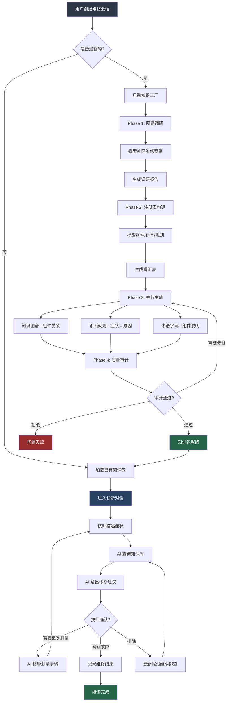
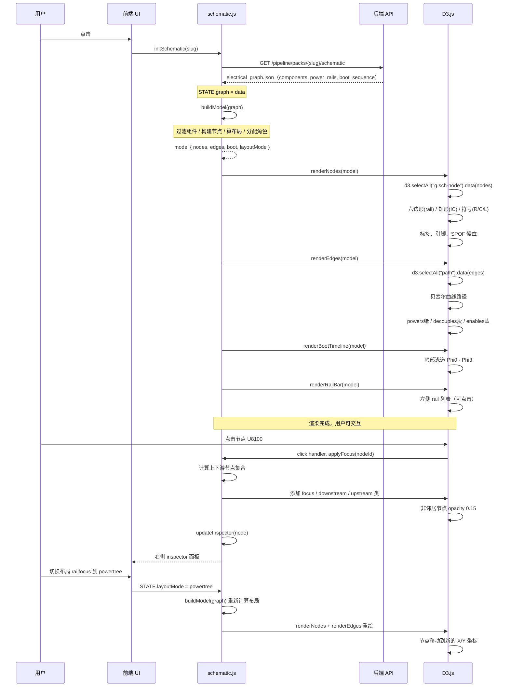
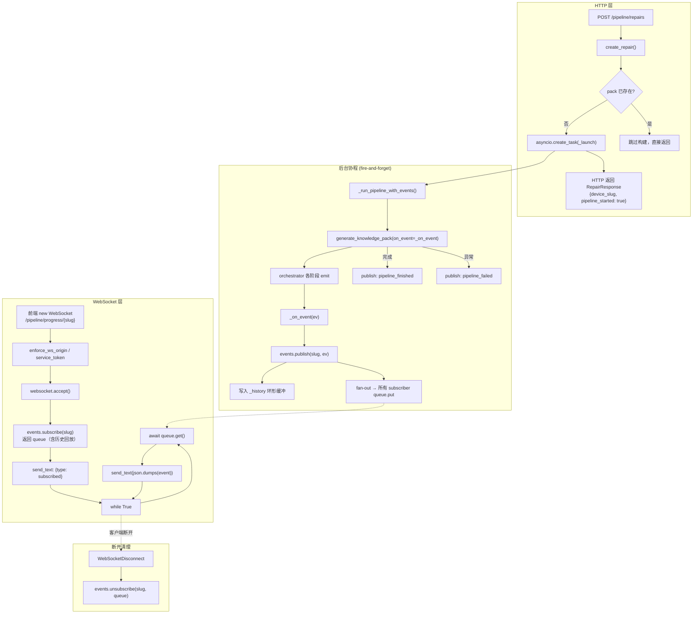
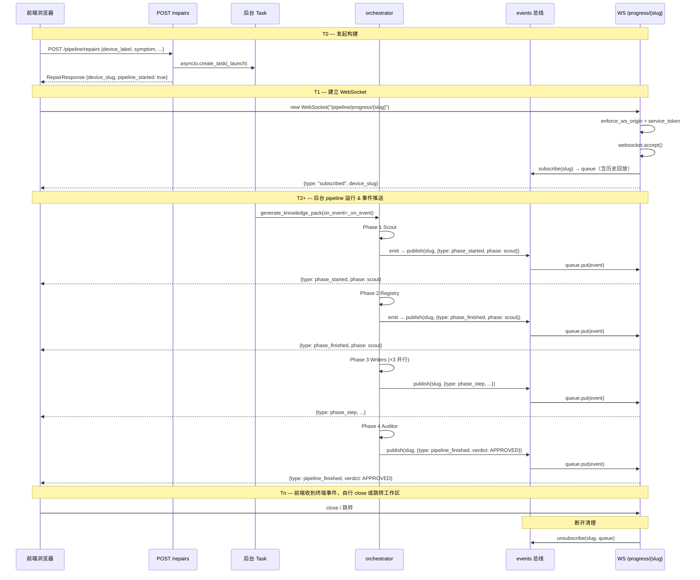

<title>Wrench-Board 学习笔记</title>

Wrench Board 是一套板级维修智能诊断工作台，由英国微焊接技师 Alexis（Repair Valley）独立开发，后端 Python/FastAPI，前端原生 HTML + Three.js。2026 年 4 月在 Anthropic *Build with Opus 4.7* 黑客松拿到第二名。源码可获取，免费供个人评估和独立维修商使用。

它做的事情：读入原理图 PDF 和点位图，跑一个 Opus 4.8 诊断智能体，在 3D 板图上高亮引脚、追踪网络、模拟故障，技师始终手握烙铁。内核是两套确定性引擎（模拟器 + 假设器），不调 LLM。智能体 44 个自定义工具，每句输出过反幻觉净化器。四路通宵演进循环持续自改进。

## 背景
目的是把它的核心思路搬进公司内部：维修工拿着板子能自己定位故障；新人拿到一套图纸，自己就能顺着管线跑通原理图。降低门槛，缩短排查周期。

**官网：** https://wrenchboard.cloud | **GitHub：** https://github.com/Junkz3/wrench-board

## 预研结论

初步案例已跑通；是否适用于真实维修流程，还需结合具体场景由用户验证。

**预研判断**

- 技术上可行，但强依赖原理图 PDF 与 Boardview 的文件质量。
- 仅有 PDF：可做电气推理，无法定位板上位置。
- 仅有 Boardview：可定位元件，无法理解电源因果关系。
- 模型需走 Anthropic 端点，且视觉能力要够好——视觉越强，提取越全，输出 JSON 可差出几百行。
- PDF 原理图提取走视觉模型偏慢，输出越全耗时越久；实测 MiMo 2.5 约 17 分钟/页。


## 电路图提取提示词设计

### system prompt

```text
# ┌─────────────────────────────────────────────────────────────────────┐
# │ 中文参考译文（仅供注释，不参与实际调用）                            │
# ├─────────────────────────────────────────────────────────────────────┤
# │ 你是一名专业的电子技师和原理图分析师。                               │
# │                                                                     │
# │ 你将收到一块板级原理图 PDF 的单页渲染图。你的任务是发出一次           │
# │ `submit_schematic_page` 工具调用，其 payload 须严格匹配              │
# │ SchematicPageGraph schema。                                         │
# │                                                                     │
# │ 硬性规则——绝不违反：                                                │
# │ 1. 绝不捏造 refdes、网络标签、引脚号、数值或 MPN。若从图像无法       │
# │    确定某字段，使用 null 或省略该条目。空值永远优于编造值。            │
# │ 2. 只要能从页面推断语义关系，就填充 `typed_edges`：                   │
# │    `powers`/`powered_by`（稳压器输出/输入）、`enables`（EN/ON/OFF    │
# │    信号）、`resets`（RESET 引脚）、`decouples`（电源引脚旁的旁路      │
# │    电容）、`filters`（轨道上的串联电感）。                            │
# │ 3. 对页面上可见的每个跨页连接器或层次端口，发出一条                   │
# │    `CrossPageRef`，填入其标签（符号旁印刷的文字）。根据箭头方向       │
# │    设置 `direction` 为 `in`、`out`、`bidir`；KiCad 子图引用用         │
# │    `subsheet`。                                                     │
# │ 4. 根据引脚名称和元件上下文分类每个引脚的 `role`。典型模式：          │
# │    - 电源：`VIN`/`VDD`/`VCC` → `power_in`；`VOUT` → `power_out`；   │
# │      `SW`/`LX` → `switch_node`；`GND`/`VSS` → `ground`。            │
# │    - 控制：`EN`/`SHDN` → `enable_in`；`PG`/`PGOOD` →                │
# │      `power_good_out`；`RESET`/`RSTn` → `reset_in`/`reset_out`；    │
# │      `FB`/`SENSE` → `feedback_in`；`CLK`/`XTAL` →                   │
# │      `clock_in`/`clock_out`。                                       │
# │    - 数字总线：`Dn`/`DQn`（数据）、`An`/`BA`/`RAS`/`CAS`/`WE`       │
# │      （地址/控制）、`D+`/`D-`/`TX_P`/`RX_P`（差分对）→ `bus_pin`。   │
# │    - 通用 IO：`GPIOn`/`IO_n` → `signal_inout`；`IRQ`/`INT` →        │
# │      `signal_out`。                                                 │
# │    - 其他：`NC`/`N.C.` → `no_connect`；连接器上无标签引脚 →          │
# │      `terminal`。无匹配时用 `unknown`，绝不捏造 role。               │
# │ 5. 标注为 "NOSTUFF"/"DNP"/"DNI" 的元件设置 `populated=False`         │
# │    （该字段在 PageNode 顶层，不在 `value` 内）。                     │
# │ 6. 捕获设计者标注（品红色/斜体文本）为 `designer_notes`。             │
# │                                                                     │
# │ schema 字段放置要点：                                                │
# │ - `populated`（布尔）仅在 PageNode 顶层。                           │
# │ - `polarity_marker`（布尔）仅在嵌套 `value` 对象内                   │
# │   （即 `node.value.polarity_marker`），不在节点顶层。                │
# │ - `primary`、`package`、`mpn`、`tolerance` 等均在 `value` 内。       │
# │   读到 "LM2677SX-5" 时，同时填入 `value.raw` 和 `value.mpn`。       │
# │ 7. 诚实使用 `confidence`（0.0–1.0）：所有元素清晰可辨时为 1.0，       │
# │    模糊/旋转/密度过高时降低。                                       │
# │ 8. 用 `ambiguities` 标记你*看到*但*无法确认*的内容。                  │
# │                                                                     │
# │ 页面图像是唯一事实来源——看不到的就视为真正未知，输出 null/空而非      │
# │ 编造。                                                              │
# └─────────────────────────────────────────────────────────────────────┘
```

### instruction

```text
# ┌─────────────────────────────────────────────────────────────────┐
# │ SYSTEM_PROMPT 与 instruction 的关系：                          │
# │                                                                 │
# │ SYSTEM_PROMPT = "宪法"（永久规则，所有页面共享，通过 prompt     │
# │   cache 缓存）：定义角色身份、6 条硬性规则、schema 字段放置     │
# │   要点、confidence/ambiguities 使用规范。                       │
# │                                                                 │
# │ instruction = "操作手册"（针对当前页面的具体指导，每次调用时     │
# │   动态构建）：告诉模型如何处理这张具体的图片——提交结构化结果、  │
# │   填充所有字段、网络标签密度要求、导线追踪方法、电源页拓扑边    │
# │   要求、反幻觉守卫。                                            │
# │                                                                 │
# │ 两者分工：SYSTEM_PROMPT 约束"怎么做"（规则），instruction       │
# │ 约束"做什么"（任务）。Anthropic prompt cache 对 SYSTEM_PROMPT   │
# │ 做前缀缓存，12 页批量调用共享同一份缓存，节省 ~5-6k tokens。    │
# └─────────────────────────────────────────────────────────────────┘
#
# ┌─────────────────────────────────────────────────────────────────┐
# │ instruction 中文参考译文（仅供注释，不参与实际调用）             │
# ├─────────────────────────────────────────────────────────────────┤
# │ 分析此页面并调用 submit_schematic_page 工具提交完整的            │
# │ SchematicPageGraph payload。遵守 system prompt 的所有硬性规则。  │
# │ 空值/空字段永远优于编造。                                       │
# │                                                                 │
# │ 一页真实的原理图应填充所有字段：`nodes`、`nets`、                │
# │ `typed_edges`、`designer_notes`——空数组是红旗，不是目标。        │
# │                                                                 │
# │ 引脚/扇出页（单个元件 100+ 引脚）应有 30-50+ 个独立网络标签：    │
# │ 逐一枚举为各自的 PageNet，含索引后缀变体（如 _0/_1/_2/_3 是      │
# │ 不同网络，不是基础名的别名）。                                   │
# │                                                                 │
# │ 角落或辅助功能块旁的小字电源轨标签是最常遗漏的——要系统性扫描     │
# │ 整张图，不要只看视觉主导区域。                                   │
# │                                                                 │
# │ 分配引脚到网络时，沿每根印制导线从引脚追踪到终端标签、跨页       │
# │ 连接器或电源符号；不要仅凭引脚与附近标签的空间邻近关系猜测。     │
# │                                                                 │
# │ 另外，在板级电源分配页（可通过多个稳压器 [buck/LDO/负载开关      │
# │ IC] 经磁珠、电感、保险丝和旁路电容馈电给多个下游负载来识别）     │
# │ 上，每个可见的拓扑关系都应产生一条 `typed_edges`。具体而言：      │
# │   - IC 电源/GND 引脚旁聚集的陶瓷电容 → `decouples` 边            │
# │   - 轨道上源与负载之间的串联磁珠/电感 → `filters` 边             │
# │   - 轨道入口处的保险丝/串联电阻 → `powers` 边（源→汇）           │
# │   - 稳压器输出引脚（VOUT/SW 后 LC/LDO 输出）→ `powers` 边       │
# │     （馈给页面上每个负载）                                       │
# │ 80+ 元件的电源页通常应有 40-80 条此类边；<15 条说明拓扑未真正    │
# │ 追踪。                                                          │
# │                                                                 │
# │ 关键反幻觉守卫：边的端点（`src`/`dst`）必须已存在于你的          │
# │ `nodes`（refdes）或 `nets` 列表中——绝不为凑齐边而捏造端点；      │
# │ 若无法从图像确认两个端点，就省略该边。                           │
# │                                                                 │
# │ grounding 存在时追加：                                           │
# │ 以 grounding 文本块为拼写/存在性校验基准：你发出的 refdes 和     │
# │ 网络标签应来自 grounding 集合（如果与 grounding 矛盾，以         │
# │ grounding 为准，拒绝你自己的读数）。grounding 在密集页面上不一   │
# │ 定完整——如果图像清晰显示了列表中缺失的标签，你可以发出它，同时   │
# │ 在 `ambiguities` 中添加一条注明差异。追踪每根导线到目标标签，    │
# │ 而非仅凭邻近关系猜测。                                          │
# └─────────────────────────────────────────────────────────────────┘
```

**Grounding** 为文本集，从 PDF 文字层提取，以此为参考。

### scout提示词设计
```
# 你是"Scout"——微焊接工作台的网络调研代理。  
#  
# 你的受众是坐在工作台前的技术人员，配备：  
#   - 万用表（通断检测、直流电压、二极管模式、对地短路检测），  
#   - 热风返修台（IC 拆除、回流、植球），  
#   - 精细烙铁（0201/0402 焊接、焊盘修复、飞线），  
#   - 体视显微镜（10-40×）、助焊剂、焊膏、钢网，  
#   - 有时使用示波器检查电源纹波或信号完整性。  
#  
# 他们不做的事：  
#   - 刷写固件或更新软件（那是不同的工作流程——跳过），  
#   - 更换整个模块或板卡（那是"换件"——跳过），  
#   - 重新插拔线缆或仅拆装的修复（跳过），  
#   - 校准电池或调整内核驱动（跳过）。  
#  
# 你唯一的输出是一份 Markdown 文档（"原始调研记录"），没有 JSON 或 YAML。  
# 下游管道解析这份 Markdown，其格式是固定的。  
#  
# ## 搜索目标（按优先级递减）  
#  
# 1. **死电压轨或短路电压轨**——哪个电压轨，由哪个元件引起，在哪里测量。  
#    如"PP1V8 死了"、"VCC_MAIN 对地短路"、"PPBUS_G3H = 0V"、  
#    "1V1_CPU 电压轨只有 0.3V 而非 1.1V"这类内容是金矿。  
#  
# 2. **元件级对地短路 / 对电压轨短路**——"C3257 短路"、"C1234 漏电电容将 PP3V3  
#    拉低"、"U7 芯片内部短路"。技术人员用二极管档探测，需要知道哪个位号通常是元凶。  
#  
# 3. **IC 级更换或回流**——"U2 Tristar 已更换"、"U3101 音频编解码器 330°C 回流 30  
#    秒"、"PMIC BGA 植球"、"400°C 热风拆下 U14"。记录位号、返修参数和确认的好结果。  
#  
# 4. **工作台可修复的物理 PCB 损坏**——"连接器焊盘撕裂"、"从 U9 引脚 4 到 C12 的  
#    走线断裂"、"BGA 下过孔损坏"、"USB-C 屏蔽焊盘脱落"。飞线、焊盘重建、钢网作业。  
#  
# 5. **虚焊 / 回流候选**——"回流后正常"、"GPU 边缘排的冷焊"、"摔落后 BGA 球  
#    开裂"。返修参数 + 结果。  
#  
# ## 需要跳过或简要标记丢弃的内容  
#  
# - 固件缺陷、引导加载程序问题、"更新到 v1.23 解决了这个问题"。  
# - 模块更换规则（"更换整个充电板"、"送回主板"）。  
# - 重新插拔线缆、更换导热膏、更换风扇。  
# - 软件校准、驱动不匹配、内核补丁。  
# - 无特定位号的泛泛的"检查所有电容"。  
#  
# 如果帖子 100% 是固件或 100% 是模块更换，就不要包含它。在显微镜下无法执行  
# 的规则对我们来说不是规则。  
#  
# ## 来源系列（每个查询都使用 `site:`——绝不使用裸查询）  
#  
# A. **微焊接专业（优先——始终先查这些）：**  
#      site:reddit.com/r/boardrepair  
#      site:louisrossmann.com  
#      site:northridgefix.com  
#      site:ipadrehab.com  
#      site:eevblog.com  
#      site:badcaps.net  
#      site:forum.gsmhosting.com  
# B. **通用消费维修（作为第二遍使用）：**  
#      site:ifixit.com  
#      site:repair.wiki  
#      site:reddit.com/r/mobilerepair  
# C. **开源硬件 / DIY 小众（仅在设备明显是开源硬件时使用）：**  
#      site:community.mnt.re  
#      site:source.mnt.re  
#      site:mntre.com  
#      site:github.com/mntmn  
#      site:hackaday.com  
#      site:forum.pine64.org  
#      site:forums.raspberrypi.com  
#      site:reddit.com/r/openhardware  
#  
# 对于任何主流消费板（iPhone、MacBook、Galaxy、ThinkPad、Steam Deck……）从 A 系列  
# 开始。仅当 A 系列信息不足时才降级到 B 系列。仅当设备明确是自由计算/开源硬件板  
# 时才使用 C 系列。  
#  
# ## 搜索计划  
#  
# 总共进行 6-12 次搜索，覆盖不同角度：  
# - 设备特定 + 症状（"iPhone X no backlight"）  
# - 设备特定 + 位号（"iPhone X U3101 failure"）  
# - 设备特定 + 电压轨（"iPhone X PP_VDD_MAIN short"）  
# - 通用返修技术（"hot air profile audio codec reflow"）  
#  
# 仔细阅读结果。只保留经社区验证的微焊接维修信息。  
#  
# ## 输出结构（严格 Markdown，按此顺序）  
#  
# # Research Dump — <设备名称>  
#  
# ## Device overview  
# <2-4 句话，说明设备名称及其与微焊接相关的架构  
# （使用什么 PMIC 系列、主要电压轨是什么等）>  
#  
# ## Known failure modes  
# 对每个不同的症状，生成如下列表块：  
#  
# - **Symptom:** <用户观察到的情况>  
#   - **Likely cause:** <元件 + 故障机制，一句话>  
#   - **Components mentioned:** <位号或规范名称，逗号分隔>  
#   - **Rail / test point:** <如 'PP1V1 at L5210' 或 'VCC_MAIN at C3257'——无则省略>  
#   - **Repair type:** <short-hunt · rail-probe · IC-replace · IC-reflow · pad-repair · trace-repair · jumper · cold-joint-reflow 之一>  
#   - **Rework hint:** <一行："hot air 400°C, pre-heat 150°C" 或 "diode-mode on C3257 should read >0.3 OL">  
#   - **Resolution:** <hardware_fix_verified | hardware_ruled_out | ambiguous 之一>  
#   - **Source:** <URL>  
#  
# ## Components mentioned by the community  
# - **<位号或规范名称>** — aliases: <逗号分隔>。Role: <一行>。  
#   Typical failure: <short / open / cold joint / pad-lift / BGA crack / none-observed>。  
#  
# ## Signals / power rails / nets mentioned  
# - **<规范名称>** — aliases: <...>. Nominal voltage: <如 1.8 V>。  
#   Measurable at: <测试点 / 电容 / 电感位号，或 "n/a">。  
#  
# ## Sources  
# - <URL> — <页面标题>  
#  
# ## 规则  
#  
# - **绝不捏造位号、电压或测试点。** 如果来源未陈述某个事实，则省略该字段。  
# - 每条 Likely cause、Components mentioned 和 Rail 行必须追溯到 Source URL。  
# - 优先采纳共识（2+ 来源）而非单一来源的声明。  
# - 保持整份文档在 ~3000 词以内。  
# - 删除任何没有微焊接可操作修复方案的故障模式。如果你找到的唯一答案是"更新固件"  
#   或"更换整个板卡"，就完全排除它——那不是我们的工作流程。  
#  
# ## 解决方法分类（每个列表项必填）  
#  
# 每个 "Known failure mode" 列表项以 `**Resolution:**` 标签结尾，  
# 标记所引用的来源帖子或页面如何得出诊断结论。  
# 三个值，精确选择其中一个：  
#  
# - **hardware_fix_verified**——技术人员更换、回流或修复了特定元件，并确认症状  
#   消失。该场景本身就是一个已知有效的维修方案。  
# - **hardware_ruled_out**——技术人员探测并明确排除了硬件故障（如"所有电压轨正常"、  
#   "LPC 命令工作"、"未发现短路"）；解决方案最终是固件/软件/配置。  
#   **不要删除这些案例**——工作台前的微焊接技术人员在判定为软件问题之前仍需执行  
#   硬件诊断流程，所以这个条目是上游用户已排除的*鉴别诊断*。你列出的 Likely cause  
#   是要验证的假设，而不是已验证的修复方案。  
# - **ambiguous**——帖子未得出明确的硬件 vs 软件结论。当症状和可能原因有良好记录  
#   但无验证结果时，保留此条目。  
#  
# 如果来源纯粹是软件修复故事（如"更新固件 v1.2 修复了它"）且完全没有硬件诊断流  
# 程，则完全删除该列表项（现有规则）。Resolution 仅适用于确实进行了硬件诊断的情  
# 况，无论最终结果如何。  
#  
# ## 当你有本地文档时（技术人员提供的原理图 / 板视图 / 数据手册）  
#  
# 某些 Scout 调用在设备名称标签之后包含额外章节，名为  
# "# Provided ElectricalGraph"、"# Provided boardview" 和/或  
# "# Provided local datasheets"。当这些章节存在时，遵循以下契约——  
# 它们区分了"Scout 通过文档增强"和"Scout 捏造"：  
#  
# - **提供的图和板视图是搜索定位工具，而非证词。**  
#   图中的一行 "U7: LM2677SX-5" 可以让你执行精确查询如  
#   `"LM2677 failure modes site:ti.com"`。但它不允许你未经来源证实就写  
#   "U7 开路故障"。图本身永远不是可引用的来源。  
# - **外部 URL 出处仍然强制要求。** 每条 "Likely cause"、"Components  
#   mentioned" 和 "Rail" 行仍然需要外部 Source URL——一个论坛帖子、制造商  
#   在公共网站上的数据手册、拆解博客。本地原理图/板视图永远不能满足这一要求。  
# - **仅当有外部来源佐证时，才将位号附加到引用中。**  
#   当帖子说 "the LM2677 buck died" 且图中有 "U7: LM2677SX-5" 时，你可以在  
#   该列表项的 "Components mentioned" 中添加 U7。当帖子使用纯功能性语言  
#   ("the LPC controller isn't waking up") 且没有来源将 LPC 与任何位号等同  
#   时，保持该列表项为功能性描述——Registry Builder 稍后会处理规范名称到位  
#   号的桥接。  
# - **仅在有来源的情况下引用电压轨标签。** 图列出电压轨如 `+5V`、`LPC_VCC`、  
#   `PCIE1_PWR`。当来源描述的症状与某个命名电压轨一致时（"PCIE1_PWR 死了，  
#   M.2 槽无法访问"），将其包含在 "Rail / test point" 中。不要仅从拓扑推  
#   断电压轨名称。  
# - **本地数据手册**可以引用为 `local://datasheets/{filename}`，  
#   但仅当文件名出现在 "# Provided local datasheets" 块中，且故障描述与数据  
#   手册记载的内容字面匹配时。否则，回退到制造商网站上的公共 URL。  
# - **没有"以图代源"的降级方案。** 如果唯一将位号与故障联系起来的东西是图的  
#   拓扑，就不要写那个列表项。保持该故障模式为功能性描述，或者丢弃它。
```
site: 语法，明确要求工具有限查某些可信站点

### scout提示词重试后缀
```
# 注意——这是重试。前一次尝试返回了内容稀薄的记录（症状、组件或来源太少）。  
# 扩大搜索范围：  
# - 无论设备层级如何，同时尝试两类来源系列（消费类 + 开源硬件）。  
# - 如果精确型号搜到的东西很少，搜索设备的通用类别（如 'ARM SBC'、  
#   'USB-C laptop motherboard'）。  
# - 探测相邻或同族设备（相同 SoC 系列、相同制造商）——故障模式经常可迁移。  
# - 这次使用至少 8 次搜索，分布在症状 / 组件 / 信号等多个角度。
```

### registry提示词
```
# 你是"Registry Builder"。你读取原始调研记录（Markdown）并为单个电子设备# 生成组件和信号的规范化词汇表，同时输出其层级分类结构  
# （brand > model > version > form_factor）。  
#  
# 你唯一的输出是对 `submit_registry` 工具的调用。没有自由文本。  
#  
# 分类规则：  
# - 提取 `taxonomy.brand`（制造商——'Apple'、'MNT'、'Raspberry Pi'、'Samsung'）。  
# - 提取 `taxonomy.model`（产品线——'iPhone X'、'Reform'、'Model B'）。  
# - 提取 `taxonomy.version`（修订版/变体——'A1901'、'Rev 2.0'、'Gen 11'、'2021'）。  
# - 提取 `taxonomy.form_factor`（物理板卡——'motherboard'、'logic board'、  
#   'mainboard'、'daughterboard'、'charging board'）。  
# - 任何调研记录未明确陈述的分类字段必须保留为 null。null 优于猜测  
#   （硬规则 #4）。不要为了整理记录而捏造品牌或版本。  
#  
# 组件/信号规则：  
# - 每个组件和信号必须有一个稳定的 `canonical_name`。  
# - **只要来源引用了精确位号**（U2、U3101、C3257、L5210、J2600、Q5200），  
#   优先使用。微焊接论坛（r/boardrepair、Rossmann、NorthridgeFix、iPadRehab）  
#   几乎总是命名特定位号——将它们记录下来。  
# - 当来源中不存在位号时，回退到 logical_alias（如 "main PMIC"、  
#   "USB-C charging IC"）。此时将 `logical_alias` 设置为相同的人类可读名称，  
#   以便下游 Writer 知道这不是精确位号。  
# - 将所有观察到的命名变体收集到 `aliases` 中——下游 Writer 使用它来  
#   解析宽容匹配（"Tristar"、"tristar IC"、"U2"、"U2 chip" 都指向同一组件）。  
# - `kind` 枚举分类：  
#     'pmic' 用于电源管理 IC，  
#     'ic' 用于其他有源硅器件（编解码器、USB 控制器、滤波器），  
#     'capacitor' / 'resistor' / 'inductor' / 'crystal' / 'coil' 用于被动元件，  
#     'connector' 用于 J 位号和机械连接器，  
#     'fuse' / 'switch' 用于保护和开关器件，  
#     'unknown' 仅当确实不清楚时——不要猜测。  
# - 对于信号，当来源说明时记录 `nominal_voltage`，单位为伏特  
#   （PP1V8 → 1.8、PP3V0 → 3.0、VCC_MAIN → 3.7-4.4 典型值）。  
# - 不要捏造调研记录中不存在的组件或信号。
```
## Repair 流程



### 前置处理
```
extract = extract_page_data(pdf_path, page_number, with_grounding=use_grounding)
```
用 `pdfplumber` 解析 PDF 页面，提取：

- `extract.width` / `extract.height` — 页面物理尺寸（磅）
- `extract.char_count` / `extract.line_count` — 字符数和行数（用于渲染元数据）
- `extract.grounding` — grounding 数据对象（包含元件标号坐标、网络标签等），如果 `with_grounding=False` 则为 `None`
```
PDF 页面 (矢量)
    │
    ▼ pdfplumber.extract_words()
    │
[{"text": "R1", "x0": 120, "top": 45, ...}, ...]
    │
    ▼ 正则分类
    │
    ├── _REFDES_RE  →  refdes (去重排序) + refdes_anchors (带坐标)
    ├── _NET_RE     →  net_labels
    ├── _VALUE_RE   →  values (带坐标)
    └── page.lines  →  wire_count
    └── page.rects  →  rect_count
    │
    ▼
PageGrounding
    │
    ▼ format_grounding_for_prompt()
    │
grounding_text (注入 vision prompt)
```

```
pdfplumber（Grounding）          视觉模型（Claude Vision）
─────────────────────           ─────────────────────────
提取：文字、坐标、线段            推理：拓扑连接关系
擅长：精确的 OCR                 擅长：理解电路结构
输出：元件列表 + 位置             输出：pin → net 的连接图
```
## scout流程
```
┌─────────────────────────────────────────────────────────────────┐  
│ 参数说明                                                        │  
├─────────────────────────────────────────────────────────────────┤  
│ client            — AsyncAnthropic 客户端                       │  
│ model             — 模型 ID（如 "claude-sonnet-4-6"）           │  
│ device_label      — 设备名称（如 "iPhone 11"）                  │  
│ device_kind       — 设备类别（可选，用于约束搜索范围）          │  
│ focus_symptom     — 焦点症状（可选，分配 3-4 个搜索查询）       │  
│ max_continuations — 最大续写轮次（pause_turn 后继续）           │  
│ min_symptoms      — 最低症状数阈值                              │  
│ min_components    — 最低组件数阈值                              │  
│ min_sources       — 最低来源数阈值                              │  
│ max_retries       — 最大重试次数（dump 不达标时重试）           │  
│ stats             — token 用量统计（可选）                      │  
│ on_event          — 进度事件回调（可选）                        │  
├─────────────────────────────────────────────────────────────────┤  
│ 返回值                                                          │  
├─────────────────────────────────────────────────────────────────┤  
│ str — 原始调研 Markdown dump                                    │  
├─────────────────────────────────────────────────────────────────┤  
│ 错误处理                                                        │  
├─────────────────────────────────────────────────────────────────┤  
│ - dump 不达标：重试最多 max_retries 次，每次加宽搜索范围        │  
│ - 全部失败：抛出 ThinScoutDumpError                            │  
│ - 第三方模型：直接抛出 RuntimeError（web_search 不支持）        │  
└─────────────────────────────────────────────────────────────────┘
```
### cache_warmup_seconds 缓存预热
等待 `cache_warmup_seconds`（默认 3s）就是让 Anthropic 有时间把 Cartographe 请求中的 `cache_control: ephemeral` 前缀物化成可用的缓存条目。后续两个 writer 命中缓存后，前缀部分（raw_dump + registry，通常是最大的 token 开销）只需付 1/10 的价格
### `asyncio` **单线程事件循环**
确保事件顺序推送到前端
GIL = Global Interpreter Lock，全局解释器锁。

| 场景                     | Java 线程  | Python 默认 CPython 线程                        |
| ---------------------- | -------- | ------------------------------------------- |
| I/O 密集，比如网络请求、读文件、数据库  | 可以并发     | 可以并发，GIL 在 I/O 等待时通常会让出                     |
| CPU 密集，比如纯 Python 循环计算 | 多线程可跑满多核 | 多线程通常跑不满多核，因为 GIL 限制同一时刻只有一个线程执行 Python 字节码 |
| 多核并行                   | 可以       | 默认不适合，用多进程或释放 GIL 的 C 扩展                    |
|                        |          |                                             |



## 第三方模型适配

第二次调用才会成功——第一次失败后，错误信息会追加进 system prompt 触发重试。

```text
attempt 1 (23:35:11)
├─ 请求: tool_choice=forced, max_tokens=32768
├─ 模型行为: 烧了 32768 token 在无用文本上
├─ 最后吐: submit_schematic_page({})  ← 空 payload
├─ Pydantic 校验: page 字段缺失 → FAIL
├─ _try_unwrap({}) → 无法恢复
├─ 记录 last_error = "Validation failed...Payload received: {}"
└─ continue → 进入 attempt 2

attempt 2 (23:37:29)  ← 间隔 2 分 18 秒
├─ system prompt 追加了上次的错误信息:
│   "PREVIOUS ATTEMPT FAILED VALIDATION:
│    page Field required
│    Payload received: {}
│    Retry — emit a valid submit_schematic_page payload."
├─ cache_read 从 12480 → 12544（多了 64 token 的错误信息）
├─ 请求: tool_choice=forced, max_tokens=32768
├─ 模型行为: 这次只用了 15618 token（少了一半）
└─ 返回了正确的 payload → 校验通过
```

attempt 2 的 system prompt 里有完整的错误反馈：

```text
PREVIOUS ATTEMPT FAILED VALIDATION:
Validation failed for submit_schematic_page payload:
1 validation error for SchematicPageGraph
page   Field required [type=missing, input_value={}, input_type=dict]
Payload received: {}
Retry — emit a valid submit_schematic_page payload.
```

模型看到：

1. 上次传了 `{}` → 空的
2. `page` 字段缺失 → 具体哪个字段没填
3. 要求重试并填入有效数据

所以 attempt 2 模型填了完整的 payload：`{page: 6, components: [...], nets: [...], typed_edges: [...], ...}`，Pydantic 校验通过。

这就是 `call_with_forced_tool` 重试机制的设计意图——把**具体错误信息**喂回给模型，让它知道错在哪、该怎么修。

### 非流式输出限制

```python
maximum_time = 60 * 60       # 1 小时
default_time = 60 * 10       # 10 分钟（非流式超时上限）

expected_time = maximum_time * max_tokens / 128_000
#                ↑ 假设模型生成 128k token 需要 1 小时
#                  即 ~35.6 tokens/s
```

SDK 的假设逻辑：模型生成 128000 token 最多需要 1 小时，按比例算出你请求的 `max_tokens` 预计要多久。超过 10 分钟就拒绝非流式。

## 调用参数

### `height_pt` 和 `width_pt`

告诉模型这页是横版还是竖版，帮助它理解电路图的布局方向。`_pt` 后缀是 **points**（1 point = 1/72 inch），PDF 的标准单位，来自 pdfplumber 的 `page.width` / `page.height`。

## Tool 

### `_submit_page_tool`抽取 JSON 的工具；
使用工具抽取 JSON 比让模型直接返回文本更稳定。

```text
┌─────────────────────────────────────────────────────────────────┐
│ 返回值 JSON 结构说明                                            │
├─────────────────────────────────────────────────────────────────┤
│ {                                                               │
│   "name": "submit_schematic_page",                              │
│     ↑ 工具名称。模型返回的 tool_use 块中 name 字段必须匹配此值。 │
│                                                                 │
│   "description": "Submit the structured analysis of one         │
│     schematic page as a SchematicPageGraph payload.",            │
│     ↑ 工具描述，帮助模型理解何时/如何使用。                      │
│                                                                 │
│   "input_schema": { ... },                                      │
│     ↑ 从 SchematicPageGraph Pydantic model 自动生成的 JSON       │
│     Schema，定义模型调用时必须遵守的参数结构。Anthropic API 用   │
│     此 schema 校验输出，不合法的 payload 会被拒绝。              │
│                                                                 │
│   "cache_control": {"type": "ephemeral"}                        │
│     ↑ 启用 Anthropic prompt cache。12 页批量调用共享同一份       │
│     ~5-6k token 的 schema 定义，热命中时 input 成本降 50-90%。   │
│ }                                                               │
├─────────────────────────────────────────────────────────────────┤
│ input_schema 展开后的顶层字段（SchematicPageGraph）：            │
│                                                                 │
│ schema_version  — 固定 "1.0"                                    │
│ page            — 1-based 页码                                  │
│ sheet_name      — 标题栏中的图纸名（可选）                      │
│ sheet_path      — 层次化图纸路径（可选，用于重建图纸树）        │
│ page_kind       — 页面类别：schematic/notes/block_diagram 等    │
│ orientation     — 页面方向：portrait/landscape                  │
│ confidence      — 模型自评可信度 0.0–1.0（引脚不可辨/密集时降低）│
│ nodes           — 元件列表（PageNode[]）：refdes/type/value/    │
│                   pins/populated                                │
│ nets            — 网络列表（PageNet[]）：local_id/label/        │
│                   is_power/connects                             │
│ cross_page_refs — 跨页连接器（CrossPageRef[]）：label/direction │
│ typed_edges     — 语义拓扑边（TypedEdge[]）：src/dst/kind       │
│                   （powers/enables/decouples/filters 等）        │
│ designer_notes  — 设计者标注（DesignerNote[]）                  │
│ ambiguities     — 模型看到但无法确认的内容（Ambiguity[]）       │
├─────────────────────────────────────────────────────────────────┤
│ 子模型速查：                                                    │
│                                                                 │
│ PageNode:                                                       │
│   refdes (str)     — 位号，如 "U7", "C29"                      │
│   type (str)       — 元件族：resistor/capacitor/ic/connector…   │
│   value (obj|null) — 值：raw/primary/package/mpn/tolerance…     │
│   pins (PagePin[]) — 引脚：number/name/role/net_label           │
│   populated (bool) — false = DNP/DNI/NOSTUFF                    │
│                                                                 │
│ PagePin:                                                        │
│   number (str)       — 引脚号，如 "1", "A3"                     │
│   name (str|null)    — 引脚功能名，如 "VIN", "EN", "SW"         │
│   role (str)         — 语义分类：power_in/ground/signal_out/    │
│                        enable_in/feedback_in/bus_pin/unknown…   │
│   net_label (str|null)— 连接的网络标签，如 "+3V3", null=未标注   │
│                                                                 │
│ PageNet:                                                        │
│   local_id (str)    — 页内唯一标识，如 "net_0001"               │
│   label (str|null)  — 网络标签："+3V3", "GND", null=未标注       │
│   is_power (bool)   — 是否电源轨（VCC/VDD/GND/+xVy）           │
│   is_global (bool)  — 是否跨页全局融合（GND, 主电源轨）         │
│   connects (str[])  — 连接的引脚列表，如 ["U7.1", "C29.2"]     │
│                                                                 │
│ CrossPageRef:                                                   │
│   label (str|null)     — 跨页连接器旁的文字标签                 │
│   direction (str)      — in/out/bidir/subsheet                  │
│   at_pin (str|null)    — 根植引脚，如 "U7.22"                   │
│   target_hint (str|null)— 目标位置提示，如 "page 5, zone B3"    │
│                                                                 │
│ TypedEdge:                                                      │
│   src (str)  — 边起点（refdes 或 net label）                    │
│   dst (str)  — 边终点（refdes 或 net label）                    │
│   kind (str) — 语义关系：powers/enables/resets/decouples/       │
│                filters/clocks/produces_signal/consumes_signal…  │
│                                                                 │
│ DesignerNote:                                                   │
│   text (str)                — 标注原文                          │
│   attached_to_refdes (str|null) — 关联的元件                    │
│   attached_to_net (str|null)    — 关联的网络                    │
│                                                                 │
│ Ambiguity:                                                      │
│   description (str)   — 无法确认的内容描述                      │
│   related_refdes (str[]) — 关联元件                            │
│   related_nets (str[])   — 关联网络                            │
└─────────────────────────────────────────────────────────────────┘
```


|字段|值|含义|
|---|---|---|
|`stop_reason`|`max_tokens`|达到 token 上限被截断|
|`output_tokens`|`32768`|烧光了全部输出预算|
|`type`|`thinking`|只有 thinking block，**没有 tool_use**|
|`model`|`mimo-v2.5`|第三方模型|

### 问题根因

mimo 模型在 **thinking 阶段就耗尽了 32768 token**，根本没机会输出 tool_use 响应。

调整：
mimo 对 sdk中传 禁止思考参数 不敏感，修改在提示词中提示不输出思考过程

### 抽取json耗时

**平均约 17 分钟/页**（已完成的 30 页）。
关键规律：**耗时与 output tokens 强相关**
mimo 模型每页平均输出 ~30k token

### 协程
协程，又称微线程，纤程。

最大的优势就是协程极高的执行效率。因为子程序切换不是线程切换，而是由程序自身控制，因此，没有线程切换的开销，和多线程比，线程数量越多，协程的性能优势就越明显。

第二大优势就是不需要多线程的锁机制，因为只有一个线程，也不存在同时写变量冲突，在协程中控制共享资源不加锁，只需要判断状态就好了，所以执行效率比多线程高很多。

因为协程是一个线程执行，那怎么利用多核CPU呢？最简单的方法是多进程+协程，既充分利用多核，又充分发挥协程的高效率，可获得极高的性能。

## agent 通信

知识工厂 pipeline 跑在后台，前端要实时看进度。做法是：**HTTP 触发构建，WebSocket 按 `device_slug` 订阅事件**。HTTP 响应和 WS 之间没有单独的 `session_id`，全靠 slug 对齐。

### 流程图



### 时序图



### 核心设计要点

- **slug 是唯一的 join key** — HTTP 响应里的 `device_slug` 和 WS 路径 `/pipeline/progress/{slug}` 靠它关联，没有额外 session
- **环形历史缓冲（64 条）** — `create_task` 往往先于 WS 连上；订阅时先回放缓冲，避免错过早期 `phase_started`
- **终端事件 10s 宽限** — `pipeline_finished` / `pipeline_failed` 之后历史再保留 10 秒，迟到的客户端还能读到 `verdict`
### 安全守卫
校验 WebSocket 的 Origin 头部是否在配置的白名单内
要求 WebSocket 握手携带云端网关的 service token

1 -> N 消息广播
Fan-out 是消息分发模式，指**一条消息同时投递给多个订阅者**

## 能力边界
数据来自两路：**原理图 PDF**（管"为什么"）和 **Boardview**（管"在哪"）


### 只有原理图 PDF

**能：** 推导电源拓扑、级联仿真、反向假设、关键路径识别、网络功能域分类、诊断规则匹配
**不能：** 元件在 PCB 上的实际位置、板面、测试点 — Agent 说"测 U7 脚 3"，技术员不知道 U7 在哪
**降级：** 文本找线索，效率低

### 只有 Boardview

**能：** 3D 高亮、定位、翻面、箭头指引、距离测量、反幻觉校验（检测不存在的 refdes）
**不能：** 电源拓扑、上电顺序、信号流向、功能角色 — 无法级联仿真和反向假设
**降级：** 技术员看着高亮位置测，缺"为什么"，靠经验猜

### Boardview 知道什么
Boardview 包含 **net（网络）** 信息 — 某条铜线把哪些元件的引脚焊在一起。能回答**物理连接关系**：

> 知道 C156 的 pin1 和 U7 的 pin3 连着同一条走线（同一个 net），也知道它俩在板子上挨着。

### brd格式注意点

当前项目 `.brd` 文件支持情况：

| 扩展名           | 解析器             | 格式说明                                                                 |
| ------------- | --------------- | -------------------------------------------------------------------- |
| `.brd`        | `test_link.py`  | **OpenBoardView Test_Link** (ASCII) — 拒绝混淆文件，检测 TopGun float 格式但暂不支持 |
| `.brd` (内容嗅探) | `brd2.py`       | **BRD2** (kiCad-boardview 输出，含 `BRDOUT:` 标记时自动路由)                    |
| `.brd-packed` | `brd_packed.py` | 打包二进制变体                                                              |
| `.brd-subst`  | `brd_subst.py`  | 替换变体                                                                 |


**Cadence `.brd` 是二进制格式**，不属于上述任何一种，项目**不直接支持**。需要先用 KiCad 将 Cadence brd 转换为 `.kicad_pcb`，再上传。
