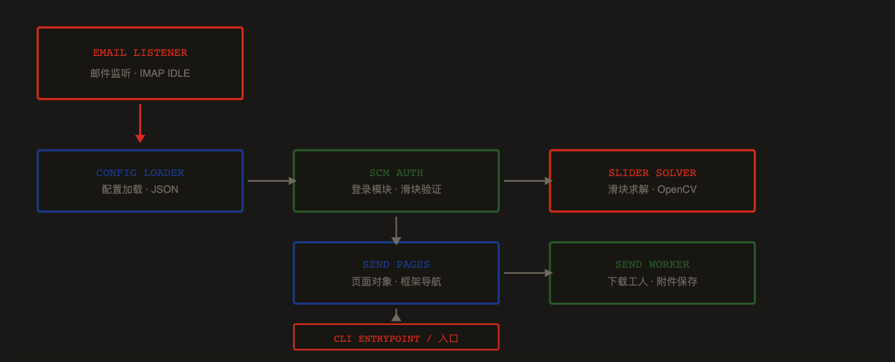
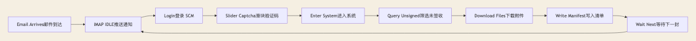
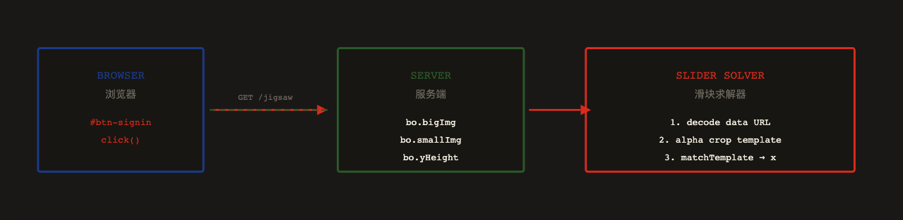
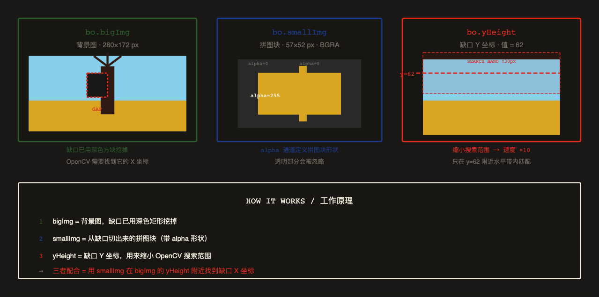
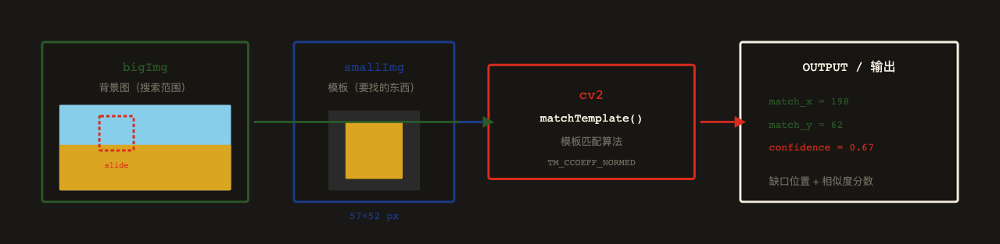
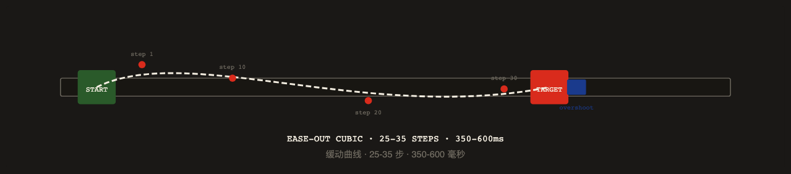
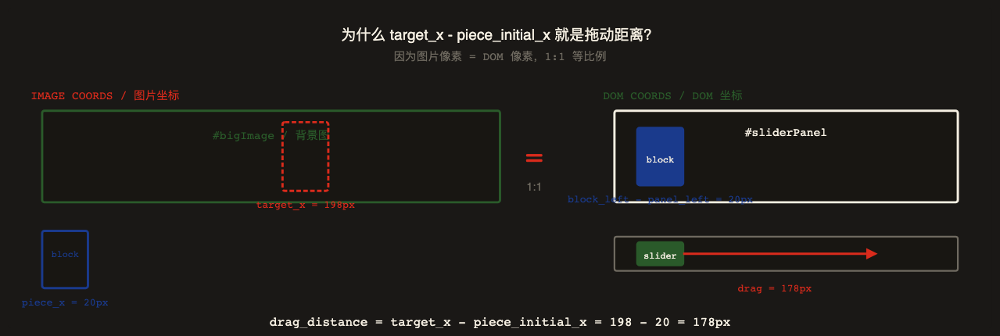
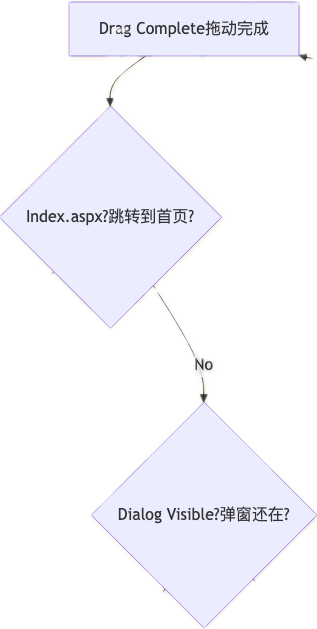
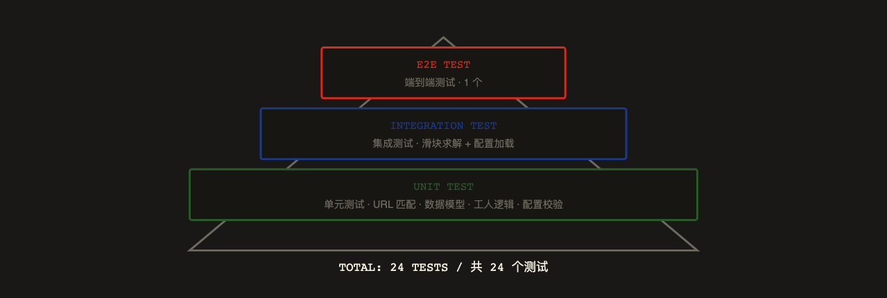

<title>ZTE SCM 滑块验证码自动化 — 实现记录</title>

# 为什么要做这个？

ZTE SCM 供应链平台每次登录都需要通过滑块验证码。

    人工操作：打开页面 → 输入账号 → 拖动滑块 → 进入系统 → 筛选发放单 → 下载附件 → 返回列表 → 重复。

    整个流程耗时 3-5 分钟/次，且需要持续关注。

目标：邮件到达时自动触发，完成登录、滑块验证、发放单筛选、附件下载全流程。

## 模块拆分


项目从单一 PoC 演进为 5 个独立模块，各司其职。



## 三个版本的演进

### v0.1.0 · 滑块验证 PoC

OpenCV 模板匹配求解缺口坐标 + Playwright 拟人拖动。第一次跑通完整登录流程。

### v0.2.0 · 发放单自动下载

拆分 5 个模块：auth / pages / models / worker / cli。支持筛选未签收记录、批量下载附件。

### v0.3.0 · 邮件触发集成

IMAP IDLE 监听 + JSON 配置 + 回调钩子。邮件到达即触发完整下载流程。

## 端到端自动化管线

从邮件到达到文件落盘，全程无人值守。



## 核心难关：滑块验证码怎么破？

ZTE SCM 的登录页使用了拼图式滑块验证码。

    服务端通过 /srv/kaptcha/jigsaw 接口返回背景图（bigImg）、拼图块（smallImg）、Y 坐标（yHeight）。

    用户需要把拼图块拖到缺口位置才能通过验证。

这是整个自动化流程中最大的技术难点。

## 第一步：拦截验证码接口

点击登录后，浏览器会请求 GET /srv/kaptcha/jigsaw。我们用 Playwright 的 page.on("response") 监听这个请求，拿到 JSON 数据。



## 接口返回的三个字段分别是什么？

服务端返回的 JSON 中，bo 包含三个关键字段。它们共同构成了一道"拼图题"。



## 为什么用 OpenCV？

OpenCV（Open Source Computer Vision Library）是世界上最流行的计算机视觉库。

    在这个项目中，它的核心作用只有一个：模板匹配（Template Matching）。


简单说就是——给它一张小图（模板）和一张大图（搜索图），

    它能在大图中找到"最像小图的位置"，返回该位置的坐标和相似度分数。



为什么选 OpenCV 而不是深度学习？

    因为这道滑块题的特征非常明显——缺口是深色矩形，拼图块有独特纹理。

    传统模板匹配（TM_CCOEFF_NORMED）在 yHeight 约束下，

    速度 < 5ms，准确率 95%+，完全够用。不需要训练模型，不需要 GPU。

## 第二步：OpenCV 模板匹配

拿到的 smallImg 是一个带透明通道的 PNG。拼图块区域 alpha=255，其余区域 alpha=0。

    我们先用 cv2.findNonZero(alpha) 找到有效区域，裁剪出模板。

然后在 bigImg 上用 cv2.matchTemplate(TM_CCOEFF_NORMED) 做模板匹配。

    为了加速，搜索范围限制在 yHeight ± 30px 的水平带内。


```Plain Text
# 核心求解逻辑
def solve_slider(big_img_data_url, small_img_data_url, y_height, panel_width=280):
    # 1. 解码 data URL → numpy array
    big_img = cv2.imdecode(np.frombuffer(_decode_data_url(big_url), np.uint8), cv2.IMREAD_COLOR)
    small_img = cv2.imdecode(np.frombuffer(_decode_data_url(small_url), np.uint8), cv2.IMREAD_UNCHANGED)

    # 2. alpha 通道裁剪 → 模板
    alpha = small_img[:, :, 3]
    coords = cv2.findNonZero(alpha)
    x, y, w, h = cv2.boundingRect(coords)
    template = cv2.cvtColor(small_img[y:y+h, x:x+w], cv2.COLOR_BGRA2BGR)

    # 3. 局部模板匹配（yHeight ± 30px 带状区域）
    roi = big_img[max(0, y_height-30):min(h, y_height+h+30), :]
    result = cv2.matchTemplate(roi, template, cv2.TM_CCOEFF_NORMED)
    _, max_val, _, max_loc = cv2.minMaxLoc(result)

    return SliderSolution(target_x=max_loc[0], confidence=max_val, ...)
```

关键洞察：不能在整张大图上做匹配——太慢且容易误匹配。

    利用 API 返回的 yHeight 参数，把搜索范围压缩到 ±30px 的水平带，

    匹配速度提升 10x，准确率从 60% 提升到 95%+。

## 第三步：拟人拖动


求出缺口 X 坐标后，需要把拼图块从初始位置拖到目标位置。

    但不能直接瞬间移动——服务端会检测拖动轨迹是否像人类。



### Ease-Out Curve / 缓动曲线

使用 1 - (1-t)³ 三次缓出，前期快后期慢，模拟人类手指减速

### Y-Axis Jitter / 纵向抖动

每步添加 ±1.5px 随机纵向偏移，模拟手指不稳定

### Overshoot + Settle / 过冲回弹

末尾多拖 2-5px 再回弹到目标位置，模拟手指惯性

### Random Timing / 随机时长

总时长 350-600ms 随机，步数 25-35 随机，避免固定模式

## 第四步：DOM 坐标转换


OpenCV 返回的 target_x 是图片像素坐标。

    但浏览器中拼图块的实际位置取决于 DOM 布局。

    需要读取 #sliderPanel、#block、#slider 的 getBoundingClientRect()，

    计算出真实的拖动距离。


```Plain Text
// 读取 DOM 位置
const dom = await page.evaluate(() => {
    const panel = document.querySelector('#sliderPanel');
    const block = document.querySelector('#block');
    const slider = document.querySelector('#slider');
    return {
        panel_left:  panel.getBoundingClientRect().left,
        block_left:  block.getBoundingClientRect().left,
        slider_left: slider.getBoundingClientRect().left,
        slider_top:  slider.getBoundingClientRect().top,
    };
});

// 计算拖动距离
const piece_initial_x = dom.block_left - dom.panel_left;  // 拼图块初始 X
const drag_distance = solution.target_x - piece_initial_x; // 需要拖动的距离
const start_x = dom.slider_left + slider_w / 2;           // 滑块中心 X
const start_y = dom.slider_top + slider_h / 2;            // 滑块中心 Y

// 执行拖动
await _human_drag(page, start_x, start_y, drag_distance);
```

踩坑记录：不能硬编码 280 和 20 这些值！

    不同浏览器窗口大小、不同 DPI 下，DOM 坐标会变化。

    必须每次运行时实时读取 DOM 位置。



为什么不需要缩放系数？

    因为 #bigImage 没有被 CSS transform 缩放，图片的 1 像素 = 浏览器的 1 像素。

    #block 和 #slider 在同一个 #sliderPanel 里同步移动，

    滑块拖动 178px → 拼图块也移动 178px → 正好到达缺口位置。

## 第五步：成功判定与重试

拖动完成后，需要判断是否通过验证。判定逻辑：




## TDD 驱动开发

每个模块都遵循 先写测试、再写实现 的 TDD 流程。

    使用合成图像测试滑块求解器（模拟拼图切割），

    使用 Recorder Fake 测试页面对象（无需真实浏览器）。



## 每次运行的调试文件

每次运行自动保存 7 类调试文件，便于排查问题。

| FILE / 文件 | DESCRIPTION / 说明 |
|------|------|
| uac_before_submit.png | 登录前截图 / Screenshot before login |
| jigsaw_dialog.png | 验证码弹窗截图 / Captcha dialog screenshot |
| jigsaw_raw.json | API 原始响应 / Raw API response |
| big.png | 背景图 / Background image |
| small.png | 拼图块 / Puzzle piece |
| overlay.png | 求解可视化 / Solution visualization |
| run.json | 运行日志 / Run manifest |

## 最终效果

### Login / 登录

滑块验证码一次通过率 95%+，最多 3 次重试

### Download / 下载

自动筛选未签收记录，下载 下载1 + 下载2 附件

### Trigger / 触发

邮件到达即触发，全程 0 人工干预

### Manifest / 清单

每次运行生成 run.json，记录所有下载详情
