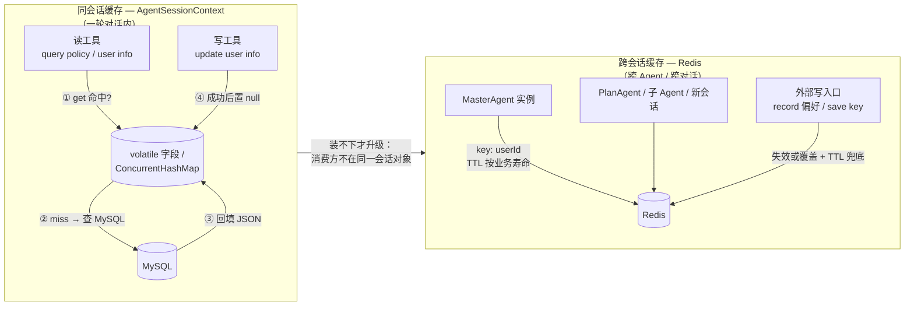
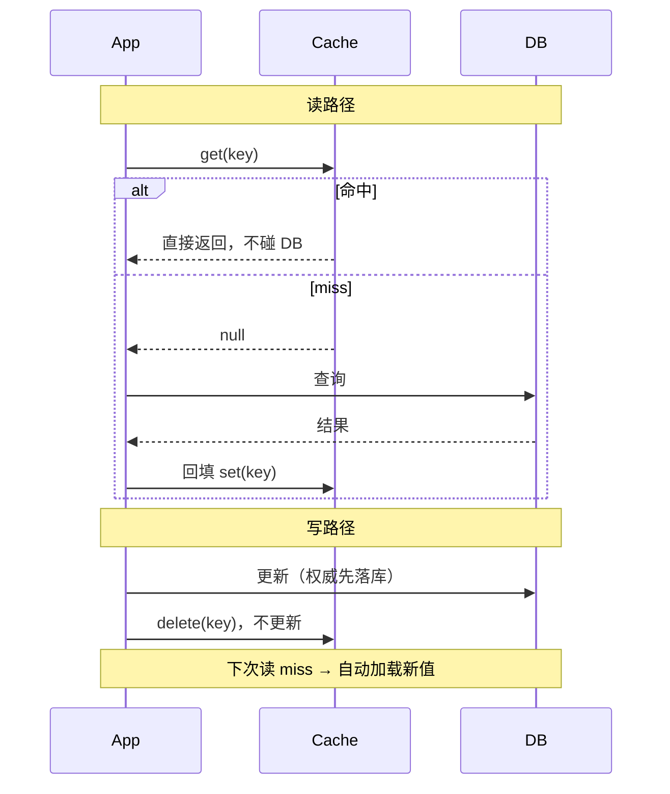
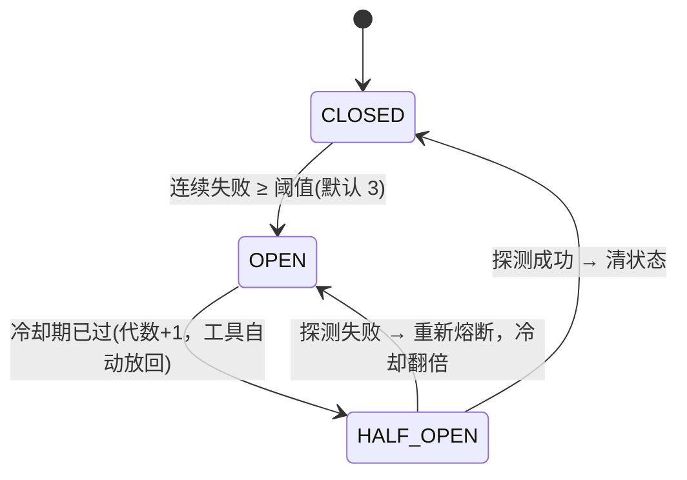
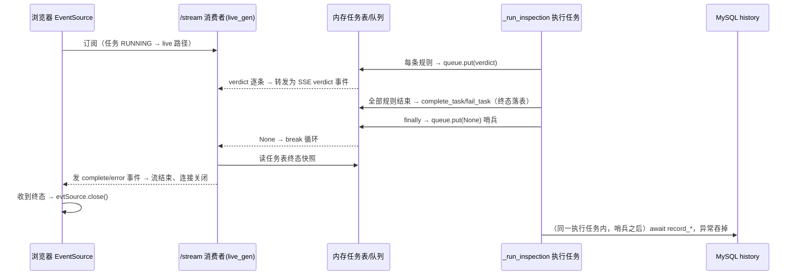

 ## 1. 问题改写的重要性?
	使用前沿模型可以不需要问题改写，模型本身很强大，所以问题改写是基于成本考虑，例如工作流后方的模型不是前沿模型，那么问题改写就很重要，方便下一个节点的智能体去理解问题。

## 2. 提示词越短，效果反而越好？（以 eli5 为例）

eli5 这个 skill 的 SKILL.md 只有 321 字节，几乎没有提示词，但每次产出的 HTML 大图解释效果都很好。为什么？

- 大模型早就“会”解释了，知识在权重里，不在提示词里。提示词不是教材，是遥控器，只负责把模型切到对的模式。
- eli5 的有效成分只有三个，每个都打在杠杆点上：
  1. 受众设定：“knows nothing” 一句话，等于一次性开启禁行话、用比喻、讲类比整套行为。
  2. 格式锁定：“HTML artifact with big pictures and few words”，锁死交付物，逼模型把抽象概念转成可视化，这个转换过程本身就是一次深度理解。
  3. 刻意留白：不写步骤、不给示例。示例会带偏输出，模型照着示例抄样式，而不是执行意图。
- 反面验证：长提示词堆 20 条规则，模型注意力有限，只记得前几条，剩下的全是噪声；反复强调“要简洁”，输出反而更啰嗦，因为模型会模仿输入文本的详细程度。

边界：短提示词成立的前提是任务落在模型内化能力之内。需要模型输出它没见过的新格式时，还是要给示例和精确规则。

结论：skill 的职责是定向，不是教书。触发词本身（如 /eli5）也是一个语义富集的符号，等于一段打包好的行为模式调用。

## 3. Agent 工具缓存：同会话缓存 vs 跨会话缓存（以 gogo-agent 为例）



```text
决定放哪层（两个问题）
  读方只有当前会话的 Agent 实例？        → 否 → Redis
  数据有效期 ≈ 会话期？否则要跨会话活   → 否 → Redis
  以上都满足                              → AgentSessionContext
```

机制差异其实都是上面两个问题推导出来的：

```text
同会话缓存                              跨会话缓存 (Redis)
──────────────────────────────          ──────────────────────────────
免 TTL、免序列化                         TTL 按业务寿命
直接 Java 字段                           30min 画像 / 24h 中间结果
随会话销毁，新会话自动回源              / 7~30d 凭证
→ 天然免疫外部修改                       陈旧风险 → 写路径失效 + TTL 兜底
                                         key 按 userId/provider 隔离
一致性 = 置 null / 覆盖                  Redis 故障 = 当 miss 回源，不阻断
（写方拿得到同一对象，成本极低）          凭证只存密文
```

根源一句话：会话级缓存是「写方和读方拿着同一个对象」，所以失效只需置 null；一旦共享边界跨到别的 Agent 实例或别的会话，够不到对方的缓存，就只能靠 TTL 和写路径自觉维护。这由「谁会读」和「数据什么时候变」决定，与「查库贵不贵」无关。

## 4. 旁路缓存（Cache-Aside）解读

### 是什么

应用自己管理缓存：DB 是权威源，缓存只是加速副本。名字含义：缓存不在数据流的必经路径上，应用始终保留"绕过缓存直连 DB"的兜底能力，所以叫旁路。



```text
读：① get 缓存 → ② 命中返回（零 DB）
    ③ miss → 查 DB → ④ 回填缓存 → ⑤ 返回
写：① 先写 DB → ② 删缓存（不是更新！）→ 下次读自动拿新值
```

两条规则各有一个必须理解的点：

- **读 miss 必须回填**：这是"缓存可以随时删"的前提。删了缓存系统还能跑，靠的就是这条回源路径——它是设计义务，不是缓存自带的属性。
- **写是删缓存而不是更新缓存**：并发下两个请求交错更新缓存，可能把旧值写回去覆盖新值，DB 与缓存长期错位；直接删掉则副本不存在，下次读 miss 自然加载新值。代价是删后到回填前多一次 DB 读，可接受。

### 写顺序：先写 DB 再删缓存，而不是先删再写

```text
推荐：先写 DB，再删缓存
  写 DB ──→ 删缓存 ──→ 下次读 miss 回填新值
  风险窗口：仅"DB 已新、缓存未删"的极短瞬间读到旧值

错误：先删缓存，再写 DB
  删缓存 ──→ (窗口) ──→ 写 DB
               │
               └─ 窗口内并发读：缓存 miss → 查 DB 还是旧值
                  → 回填旧值 → 你的写 DB 才执行
                  → 缓存长期躺旧值，直到下次删除/TTL 才纠正
```

先删后写最坏情况是并发读把旧值回填进缓存，形成"DB 新、缓存旧"的错位，持续整个 TTL，比先写后删的短暂窗口严重得多。

### 辨析一：cache-aside vs 登录态缓存（Redis 权威存储）

登录态（Sa-Token session / Token）不是缓存，是权威存储，两者根本不在同一层。

```text
业务 cache-aside                       登录会话存储（Sa-Token/Redis）
──────────────────────────            ─────────────────────────────
权威源：MySQL                         权威源：Redis 本身
DB 永远有一份真数据                    库里没有 session，Redis 是唯一存在
删缓存 = 降温，可回源找回              删 token = 注销/掉线，找不回来
TTL = 防陈旧，过期重查即可              TTL = 安全边界（过期强制下线）
写路径随时发生                         写只发生在登录那一刻，之后只有
                                         校验、续期、删除
```

判断标准：**删掉之后数据还能不能从别处找回来**——能找回（DB 权威）才谈得上 cache-aside；找不回（Redis 权威）就是状态本身，谈不上缓存策略。

### 辨析二："缓存只是辅助，不影响系统流程"只说对一半

```text
对正确性：辅助 —— 缓存挂了数据不丢，miss 回源照跑，只是慢一点
对性能：  不是无感 —— 缓存失效瞬间流量全部压到 DB，
          穿透/击穿/雪崩极端情况下能把 DB 打挂，流程就真断了
```

"不影响系统流程"是 cache-aside 的**设计目标**而非天然属性，实现条件：所有读路径都有回源兜底（gogo-agent 中偏好缓存、ApiKeyService 均为 Redis 异常 catch 后降级回源，正是为保住这句话）。凡"缓存没了系统就断"的地方（如 RghTokenStore，Redis 挂只能按未登录处理），那东西不是缓存，是权威状态。

```text
对照 gogo-agent 实际代码
  user_info / policy 工具  → cache-aside（DB 权威，删了能回源）
  Redis 偏好 / 规划结果    → cache-aside 变体（回源=百炼/重算）
  rgh token / 登录态       → 权威存储，删了流程就断
```

结论：识别方法一条——这层删掉，系统还能不能从别处把数据找回来。

## 5. Plan-Execute 模式：是什么、与 ReAct 的区别（以 gogo / dodo 实现为例）

### 一句话定义

- **ReAct**：走一步想一步。模型每步输出"Thought（怎么干）→ Action（一个动作）"，拿到工具结果（Observation）再想下一步。计划不存在任何地方，活在模型脑内消息流里。
- **Plan-Execute**：先把任务一次性想透、拆成结构化任务清单（PlanTask），再按依赖清单执行；执行完统一批判（Critique），不满意就把反馈带回下一轮重新规划再执行，是闭环。

### 流程对比

```text
ReAct（一步一决策，串行）              Plan-Execute（先想后做，可并行可反思）
─────────────────────                ─────────────────────────────
用户问题 → 模型思考 → 调工具 1       用户问题
        → 模型思考 → 调工具 2            ↓ ① Plan 集中拆解任务单
        → 模型思考 → 调工具 3           PlanTask(id, instruction, order)
        → 模型思考 → 回答                ↓ ② Execute 按 order 依赖执行
                                         同 order 并发，跨 order 串行
    计划 = 模型脑内隐式状态              ↓ ③ Critique 拿结果反思（执行后才批判）
    无法检查/中断/恢复/并行              passed? ──否→ feedback 回 ① 重新规划
    错误靠模型自觉纠偏                    ↓ 通过
                                        ④ Summarize 总结
                                     计划 = 外部数据结构（可展示/依赖排序/
                                     并发调度/断点续传/人工确认）
```

注意 Critique 的位置：它输入"原始问题 + 计划 + **执行结果**"，没执行就没法批判，所以循环是 Plan → Execute → Critique → (不通过) Plan' → …。批判不直接改方案，只输出 passed/feedback；"修改"发生在下一轮 Plan——feedback 以【Critique Feedback】注入上下文，规划提示词硬约束"必须解决反馈指出的不足、不许重复失败尝试"。

### 五个本质区别

| 维度 | ReAct | Plan-Execute |
|---|---|---|
| 决策时机 | 每步现场决策，边做边想 | 开头集中规划，执行是确定性调度 |
| 计划可见性 | 隐式，在消息流里，代码拿不到 | 显式结构（PlanTask 清单），代码可检查/排序/中断恢复 |
| 并行能力 | 天然串行（一步一工具） | order 字段支持依赖分组，同组并发（Semaphore 限流） |
| 错误闭环 | 模型看 Observation 后自发纠偏，无强制机制 | Critique 显式评估 → feedback 驱动下轮规划 |
| 思考预算 | 每一步都花推理 | 集中在 Plan 和 Critique，Execute 关思考快速跑 |

### 两者不是互斥的，是嵌套的

Plan-Execute 的"执行单元"往往还是 ReAct：

```text
dodo 版：executeWithRetry 里每个 task 都 new 一个 SimpleReactAgent(maxRounds=5)
         → 外层 Plan-Execute 编排，内层 ReAct 干单个任务的活

gogo 版：ReActAgent + PlanNotebook（agentscope 框架内置 plan 模式）
         PlanAwareThinkingHook 按阶段开关 thinking：
           Planning（plan 未创建）→ 保持深度思考    // 想清楚再干
           Execute（plan 已存在） → enable_thinking=false  // 干活时关思考
           Summary（PreSummary）  → thinkingBudget=2048    // 收尾再深想
```

所以更准确的说法：**Plan-Execute 是"把推理预算集中花在规划与反思上"的编排层，ReAct 是它脚下的执行步**。gogo 的 Hook 是思考预算分配思想的极端体现——同一个 agent，规划阶段开思考、执行阶段关、总结再开。

### 两种实现形态

```text
自研显式循环（dodo/general 教学版）：代码里 while 循环
  generatePlan → executePlan → critique → compressIfNeeded → summarize
  计划与结果都是 Java record，调度全在代码里，可控性最强

框架内置（gogo + agentscope PlanNotebook）：ReActAgent 挂 planNotebook
  阶段由框架事件（PreReasoning/PreSummary）切分
  计划存 Notebook 可持久化、变更时通知前端
  优点：不用自研循环；代价：阶段行为受框架约束
```

### 选型

```text
任务浅、单工具、几轮内完成（查天气、问政策）  → ReAct 就够，快且省
任务深、可分解、要并行、错误代价高
（多源研究、跨文件改造、多段行程规划）        → Plan-Execute

判别式一句话：能一句话说清步骤（2~3 步）用 ReAct；
需要"写下来才能做完"的任务（10+ 步、有依赖、要反思）用 Plan-Execute。
```

ReAct 不依赖外部计划结构就能跑，代价是复杂任务里模型会"边做边忘"——前面查到的约束后面不遵守；Plan-Execute 把计划钉在显式结构上，就是为了治这个病。

## 6. Skill vs Tool：为什么数据收集用 Skill、方案计算却用 Tool

图解：[Skill vs Tool 分工图解](output/skill-vs-tool.html)（浏览器打开，5 幕递进：两种外挂的本质 → 流水线分工 → 四个坑 → 引用链设计 → 口诀）

> 一句话总定义：**Skill 是"教模型做事"，Tool 是"替模型做事"。**
> Skill 把操作手册塞进上下文，活是模型干的（花 token、不稳定、过程模型全知道）；Tool 让模型只下单传参，活是代码干的（零推理消耗、精确稳定、过程不可见）。

分工判据（本笔记核心问题）：

```text
难点是"理解"（人话 → 命令参数映射）      → Skill    例：tuniu-cli 数据收集
难点是"计算"（批量、精确、全局算法）      → Tool     例：ItineraryPlannerTool 方案计算

判定口诀：能一句话说清怎么干 → Skill；
          需要算得准、批量算、结果要瘦身 → Tool
```

方案计算不能交给 Skill（让 LLM 心算）的四个原因，收敛成三条原则：

```text
原因① 60 种组合枚举、③ 399.50 ≤ 400 精确比较
     → 原则一：确定性判断必须代码。
       "对就是对"的事没有概率余地；枚举无智能含量但有数量。
原因② min-max 归一化是"两遍扫描"，要先记住全部数值再回头打分
     → 原则二：需要"中间状态累积"的算法必须代码。
       Java 有变量和集合可以存状态，LLM 只有注意力，
       长上下文中间位置的数值会被 Lost in the Middle 击穿。
原因④ ~19000 token vs ~200 token、⑤ 结果落存储只传引用
     → 原则三：上下文是稀缺资源，进出 LLM 的信息要瘦身。
       计算过程不必被感知，结果只传摘要/引用。
```

原则三带来的引用链设计（gogo 实际代码，载体是 Redis 不是文件）：

```text
ItineraryPlannerTool:  算完 → itineraryPlanStore.save(userId, origin, dest, date, json)
                       返回模型："已生成 N 个候选方案"（只报数，不报内容）
ItineraryReviewTool:   load(userId, origin, dest, date) → 从 Redis 取方案 → 评估
                       （review 工具化 + 引用传参，同样省上下文）

两个工具不共享会话对象（可能是不同子 Agent），靠 Redis 接力
→ 这正是第 3 节"跨工具接力必须落外部存储"的实例
```

本质洞察：**把「智能」和「计算」分离** —— LLM 只当决策者（要不要订、合不合规、偏好哪个），代码当计算器（多少钱、怎么排、边界判断）。凡是"会算但没必要会想"的下沉，"会想但没有标准答案"的留给模型；算错代价高的一律下沉。

## 7. 工具熔断：Agent 的保险丝是「让模型看不到」，不是「报错」（以 gogo ToolCircuitBreakerHook 为例）

图解：[工具熔断机制：让模型看不到坏工具](output/tool-circuit-breaker.html)（浏览器打开，3 个可播放剧本：无熔断对比 → 完整生命周期 → 指数退避，动态看工具被卸载/放回与状态机流转）

退避专题：[指数退避：故障越久，打扰越少](output/tool-circuit-backoff.html)（代数阶梯动画 + 存代数/现算冷却对比 + 三段真实代码 + 五个设计决策）

### 先看要解决的问题

agent 的工具分两类：本地稳定工具（查政策、查订单、读写用户信息）和外部实时数据源（`destinationLiveTools`：航班 / 景点 / 酒店实时查询）。后者的特点是：**外部系统故障时它必然反复失败**。而 ReAct 模型不知道"这个工具坏了"，会在 30 轮迭代里一遍遍选它，每轮烧 token、烧用户等待时间。

熔断设计由此推导：传统服务的调用方是固定代码，知道"调用失败就换策略"；agent 的"调用方"是 LLM，它的决策依据是**下一轮可见的工具清单**。所以对 agent 工具的熔断落点不是"拦截调用后报错"，而是**把工具从 toolkit 的 group 里卸载**——模型看不见它，自然不会调用，从源头消除重试循环：

```text
传统熔断：调用方(代码) → 熔断器拦截 → 返回降级结果
                    模型每次都还会再试

工具熔断：LLM 思考前(PreReasoning) 先把工具从可见清单摘掉
                  模型看不到 → 根本没机会选它
```

### 与传统服务熔断的差异

| 维度 | 传统微服务熔断 | 工具熔断（本类） |
|---|---|---|
| 触发后的调用方 | 固定代码，可被拦截器挡住 | LLM，只能靠"看不到"来阻止 |
| 熔断手段 | 拦截请求返回降级结果 | 从 ToolGroup 卸载工具，改模型可见清单 |
| 恢复方式 | 定时放少量流量探测半开 | 冷却期过后工具自动加回 = 一次探测机会 |
| 状态存放 | 内存 / 集中存储 | Redis（多实例共享、原子脚本、TTL 兜底） |
| 退避策略 | 常见固定窗口 | 代数自增 × 指数退避，封顶 |
| 错误判定 | 异常类型 / 状态码 | 只认框架异常前缀，刻意保守 |

### 状态机：三态，但半开不显式存储



实现里没有单独的 OPEN/HALF_OPEN 标记位，全部由 Redis 状态推导：

```text
OPEN     = gen:{tool} hash 里存在 at 字段（开启时间戳）
HALF_OPEN = OPEN 且 冷却期已过   ← 无显式存储，推导出来
冷却时长 = min(initial × multiplier^(代数-1), max)   // 代数每次熔断 +1
每 tool 仅 2 把 key：fail:{tool} 连续失败计数 / gen:{tool} 代数+开启时间
```

### 两个事件的分工：一写一读，状态机唯一权威在 PreReasoning

框架的 ReAct 循环给 hook 两个介入点，职责刻意不对称：

| | PostActing（工具执行完） | PreReasoning（模型思考前） |
|---|---|---|
| 角色 | **写路径**：统计 + 触发熔断 | **读路径**：状态机唯一权威 |
| 计数失败 | 连续失败递增，达到阈值 → 原子脚本进入 OPEN | 只读 Redis |
| 半开失败 | 代数 +1、刷新时间戳、**立即**卸载 | — |
| 半开成功 | 清 OPEN + 重置计数，**不碰 toolkit** | — |
| 同步可见性 | — | 按状态把每个白名单工具卸载 / 加回（幂等） |

三个细节值得记：

1. **熔断要立即生效，恢复要延迟统一做**。熔断若等到下一轮 PreReasoning，模型可能带着旧清单再调一次坏工具（代码里有"兜底 WARN"专抓这种极端时序）；而恢复晚一拍无害——冷却期内工具本就不该可见。
2. **恢复只在 PreReasoning 做**：PostActing 成功路径只清 Redis 状态，避免在事件回调里反复 addTool 造成抖动，也保证"组里有什么"只有一个权威来源。
3. **操作只作用于自己的 group**：hook 通过 `toolkit.getToolGroup(TOOL_CIRCUIT_BREAKER_GROUP)` 取组引用后 contains/remove/add，组在构建 agent 时创建，`destinationLiveTools` 注册进该组——即"只有被点名放进熔断组的工具才会被熔断"。

### 状态为什么放 Redis 而不是进程内 Map

代码注释给了三条理由：多实例共享同一份熔断视图（重启不丢状态）；`INCR` / `HINCRBY` 天然原子支持并发；TTL 自动清理长期未触发的脏数据。

并发一致性靠 Lua 脚本：计数与续期、代数递增与时间戳写入分别在单次脚本内原子完成，避免"代数已增但时间没记上"这类半状态。

### 保护边界：宁可晚熔断，不可误熔断

```text
白名单监控：只熔断 monitoredToolNames 点名工具（外部实时源），
          基础设施工具（DB/缓存）不参与，避免熔断把自己打死
保守判错：只认框架统一前缀 "Tool execution failed"，不识别具体业务字段
极端兜底：OPEN 冷却中仍被调用 → WARN 记录（LLM 在熔断前已决策调用）
失败静默：group/toolkit 为 null 时跳过，熔断机制的故障不影响 agent 主流程
```

一个已知留白：配置里定义了 `excludeToolNames` 黑名单字段，但 Hook 目前只解析白名单，黑名单未接入。

结语：**工具熔断的本质，是把故障从"每次调用后的惩罚"前移到"下一轮决策前的预防"** —— 状态机只负责在 Redis 记账，真正的执行动作是改变 LLM 每轮可见的工具清单。

## 8. 向量库选型：Qdrant / Milvus / pgvector / Chroma

图解：[四个向量库完整对比](output/vector-db-comparison.html)（浏览器打开：身份定位 → 全维度对比表 → 架构形态图 → 规模量级 → 能力评分 → 决策树）

> agent 的长时记忆（RAG）本质是检索层，向量库就是这层的存储引擎。选型的多数判断其实和"哪家检索更准"无关，而由**形态、一致性和运维**决定。

### 一句话先分清形态

四个库不是同一类东西，**形态决定了运维成本、一致性模型和规模上限**：

```text
Qdrant   独立专用服务（Rust）       → 生产独立 RAG 的首选答案
Milvus   分布式专用服务（存算分离） → 为十亿级与水平扩展而生，运维最重
pgvector PostgreSQL 扩展           → 向量只是表里的一列，无新服务
Chroma   嵌入式客户端库            → 零配置，向量界的 SQLite
```

### 形态对比表

| 维度 | Qdrant | Milvus | pgvector | Chroma |
|---|---|---|---|---|
| 本质 | 独立向量数据库服务 | 分布式向量数据库 | PG 内核扩展 | 嵌入式库 |
| 实现语言 | Rust | Go + C++ | C（随 PG） | Python（核心重写中） |
| 存储引擎 | 自研向量存储(mmap) + RocksDB 存 payload | 消息队列 + 对象存储 + 分段文件，etcd 元数据 | PG 堆表，向量是普通列 | 内存 HNSW + SQLite 元数据 |
| 部署 | 1 个容器/二进制 | etcd + 对象存储 + 消息队列 + 多类节点 | CREATE EXTENSION | pip install |
| 一致性 | WAL + 集群 Raft | TSO 排序，删改异步生效 | **完整 ACID**（同 PG） | 无事务，单写进程 |
| 与业务数据同库 | 无 | 无 | **有**（事务/JOIN/备份一体） | 无 |
| 规模上限 | 单机千万级；集群到亿级 | **十亿级**（DiskANN/GPU 独有） | 单机千万级（halfvec 翻容量） | 百万级以内 |
| 上手成本 | 中 | 高（概念最多） | 低（会 SQL 就会） | 最低（3 行起 demo） |

### 两个真正的功能分水岭

**分水岭一：混合检索（稠密 + 稀疏 + 重排）**。稠密向量懂语义不懂字面，稀疏向量精确命中词但不认同义词，互补才有完整召回。

```text
Qdrant   原生：稀疏向量 + 命名多向量 + Query prefetch，RRF 融合
Milvus   原生：sparse/dense 字段 + Ranker（RRF/加权）
pgvector 无原生；0.7+ 有 sparsevec 类型，需自行拼 BM25 + vector 再融合
Chroma   无
```

**分水岭二：元数据过滤**。Qdrant 的过滤与 HNSW 集成（过滤感知遍历，payload 过滤是招牌）；Milvus 有倒排/位图标量索引和表达式过滤；pgvector 过滤就是 SQL WHERE，最灵活但 KNN 非过滤感知，强过滤时查询计划会退化；Chroma 无专用过滤索引，过滤越强越接近暴力扫描。

### 一致性光谱（最容易被忽略）

```text
pgvector 完整 ACID ──→ Qdrant 单机强一致 ──→ Milvus 近似最终 ──→ Chroma 无事务
  （同库事务、         （WAL 崩溃恢复，    （TSO 时间戳，删除/       （单写进程，
    与业务数据原子提交） 集群 Raft 复制）      索引生效有延迟）          崩溃丢未落盘段）
```

向量数据"看起来查到了"时错误不明显，但删改是否即时生效、能否和业务数据原子提交，在生产里会踩实坑。

### 规模不是主要决策点

对数刻度看：Chroma ≤ 100 万 → pgvector/Qdrant 千万级 → Milvus 亿级以上，每格差一个数量级。**绝大多数业务 RAG 落在 100 万~1000 万区间，四个库都覆盖**，真正拉开差距的是运维负担与上面两个分水岭，不是极限规模。

### 选型决策树

```text
① 向量要和业务数据同库 JOIN / 同一套事务、备份？
   需要          → pgvector（别家都做不到同库事务）
   不需要        → ②

② 几天内出 demo / 本地工具？
   是            → Chroma；要平滑转生产可直接用 Qdrant 内嵌/小容器起步
   否            → ③

③ 规模与扩展预期？
   千万级以内单机够 → Qdrant：过滤+混合检索+量化全内置，1 个容器运维
   亿级以上/多副本/GPU → Milvus：分布式是设计原点
   已有大规模 PG、不引新组件 → pgvector（接受混合检索自建）
```

### 落在 AgentScope 与手头服务器的结论

```text
已有：Milvus standalone（Dify 依赖，19530 端口，占 ~3.6G 内存）
      PostgreSQL 容器（Dify 内部网络，未映射宿主机）
没有：Qdrant / Chroma / Redis

AgentScope 的 main.py：Redis 是硬依赖（RedisStorage 存会话/凭据/agent 状态），
向量层默认 QdrantStore(location=":memory:")——进程内嵌模式，零外部依赖

结论：演示级 RAG 不用装任何向量库；要持久化时新开独立 Qdrant 容器
（6333 端口空闲），比往共享的 Dify Milvus 里灌数据更安全——隔离、可卸载。
```

经验法则收尾：**记忆层起步用进程内嵌或单容器，量到百万级以上、过滤与混合检索成为硬需求时再上专用服务**；先被 Redis 这类"必须件"，后补"可选件"，避免为一个演示需求引入一套分布式运维。

## 9. SSE 实时推送设计：内存队列 + 哨兵收尾（以 letter-auto 检测服务为例）

图解：[letter-auto SSE 连接设计总览](output/sse-stream-design.html)（浏览器打开：四部件职责 → 三方完整时序泳道 → 四条接收路径 → 连接回收 → 设计要点）

> 一句话总设计：**SSE 只是通知通道，报告权威在内存任务表**。每任务一条 asyncio.Queue，后台规则跑完一条就 put 一条；收尾用 `None` 哨兵触发终态事件；MySQL 历史延后到哨兵之后，不挡页面展示。

### 四个部件各干一件事

```text
前端 mcp_tester.html       服务端 server.py                状态层 tasks.py              执行层 inspection.py
streamInspection()        GET /v2/inspection/{id}/stream   每任务一条                  _run_inspection_inner
EventSource 订阅          live 流 / 快路径                 Queue[RuleResult|None]       每产出一条 RuleResult 即 put
complete/error 才 settle  15s keepalive                   终态快照(COMPLETED/FAILED)   （不含哨兵）
pollInspection 轮询兜底                                   = 唯一报告权威
```

### 核心时序：终态落表 → 哨兵 → SSE 收尾 → 数据库延后



### 三个概念点

**1. 哨兵身兼两职：停流信号 + 终态事件触发器**

消费者的 complete/error 发送代码在 `if item is None: break` 之后——**没有哨兵，终态事件这段代码永远不会执行**，前端 Promise 永远 pending。队列 FIFO 又保证哨兵排在全部 verdict 之后，所以"先收完结果、再发终态"由队列天然保证，不依赖时序竞态。

```text
毒丸在这里不只是"停止标记"：
  verdict 流到此为止      → 停流
  break 后读表发终态事件  → 触发收尾（这段代码只有毒丸能走到）
```

**2. 终态先于持久化（结果发布不等待 MySQL）**

收口顺序刻意编排：`complete_task()（终态落内存表）→ put(None) 哨兵 → SSE 可发 → 之后才在同一执行任务内 await history 写入`。

```text
history 延后的三个保证：
  ① 保存异常被 except 吞掉 → 不改写已发布终态、不触发第二次记录
  ② 记录参数（owner/report/elapsed_ms）在终态处冻结，不回头重新读登录态
  ③ elapsed_ms 用检测起点 t0 计算 → MySQL 再慢也不计入规则/任务耗时
```

**3. 连接回收不靠哨兵广播，靠断开检测兜底**

哨兵每任务只 put 一次。多个并发 SSE 订阅（多标签页）时只有一个消费者能拿到它正常收尾；其余连接靠每轮循环开头的 `is_disconnected()` + keepalive 超时（15s）唤醒后退出，新建订阅则走快路径（任务已终态 → 不发队列、立即发一次 complete/error 并关闭）。

### 客户端拿到结果的四条路径（容错设计）

| 路径 | 触发 | 行为 | 兜底意义 |
|---|---|---|---|
| live 流（主） | 订阅时任务 RUNNING | verdict 逐条 → 哨兵 → 终态事件 → 关流 | 正常情况 |
| 快路径 | 订阅时任务已终态（迟到/重连） | 不走队列，立即发一次 complete/error | 刷新页面、断线重连 |
| 轮询兜底 | SSE 失败 | 每 500ms 调 get_inspection，最多 5 分钟 | EventSource 连不上也能取终态 |
| error 事件 | 服务端推 error / 连接重置 CLOSED | 带 data reject 业务错误；无 data 且 CLOSED reject SSE_UNAVAILABLE；CONNECTING 自动重连 | 检测失败 / 服务端异常 |

### 与经典毒丸模式的差异（值得记）

```text
经典毒丸：N 个 worker 共享队列 → 停 N 个 worker 要投 N 个毒丸（或广播）
本项目：  单生产者只 put 一次 → 单消费者正常收尾，其余靠断开检测兜底
          （简化成立的前提：多余连接最终会因客户端关闭而回收）

判断选型：要"排空后停"（先交付已有结果再收尾）→ 毒丸
          要"立刻停"（不管队列剩什么）        → cancel / Event / is_disconnected
```

已知风险点：前端 streamInspection 的 Promise 没有超时，哨兵链路（put 未执行/队列被多消费者抢走）是唯一能让页面无限转圈的故障点；排查时先怀疑哨兵链路，不要指望轮询兜底（它在另一条路径上）。

代码位置：`server.py:76` keepalive 15s · `server.py:286` _run_inspection · `server.py:331` put(None) 哨兵 · `server.py:554` /stream 路由 · `server.py:585-625` live_gen · `inspection.py:139/243` verdict_queue · `tasks.py:43` per-task 队列 · `mcp_tester.html:2524-2573` 前端订阅与轮询

## 10. Agent 评估：怎么知道它改好了还是改坏了

图解：[Agent 评估：从“说完成”到“可验证”](output/agent-evals.html)（浏览器打开：两份讲解比较 → “三种真相”切换演示 → 术语与裁判分工 → pass@k / pass^k 交互曲线 → 四类 Agent 证据表 → 0→8 落地路线 → 诊断反例表 → 自测题）

原文：[Demystifying evals for AI agents](https://www.anthropic.com/engineering/demystifying-evals-for-ai-agents)（Anthropic，2026-01）

> 一句话总定义：**评估是一份可执行的成功约定**——给 agent 一个输入和一个干净环境，跑完后检查环境里留下了什么状态、过程里有没有越界。它回答的不是“它看起来会做”，而是“要求什么 → 实际做了什么 → 怎么判定 → 能不能重复”。

### 为什么必须要，而不是靠手感

早期靠手动测、自己 dogfood、直觉能走很远。问题出在上线之后：用户说“改完变差了”，团队只能等投诉、手动复现、修完祈祷别处没坏——**没有评估就分不清真实回退和噪声**，也没法在上线前一次跑几百个场景，更没法自动对比。

好处是复利的：早期评估逼你把“成功”写清楚（两个人读同一份需求，对边界情况的理解可以完全不同，一套题面能消掉这种歧义）；后期换来基线——延迟、token、单任务成本、错误率都能挂在固定题库上纵向对比。换新模型时差距最大：没评估的团队要花几周试，有评估的几天就能判断强在哪、提示词要不要调。

### 一轮评估由哪些对象组成

用“把《接口草案》从收件箱移到项目甲、同时保留阅读权限”当贯穿例子：

| 术语 | 是什么 | 例子里对应什么 |
|---|---|---|
| Task | 一道题：输入 + 初始状态 + 成功条件 | 移动指定文档，不动权限 |
| Trial | 从干净环境开始实际做一遍 | 同一题独立跑的第 1 次、第 2 次…… |
| Transcript / trace | 这一遍的完整过程记录 | 工具调用、参数、返回值、重试、最终回复 |
| Outcome | 结束时环境里的真实状态 | 文档的 parent_id、ACL、文件数 |
| Grader | 检查某一方面的裁判 | 程序比对目录 ID 与权限；量表评说明是否清楚 |
| Suite | 围绕一种能力组织的一组题 | 移动、重命名、同名文件、无权限…… |
| Agent harness | 让模型能动手的运行系统 | 提示词、工具接口、状态管理、停止条件 |
| Eval harness | 组织考试、存证据、汇总判分的系统 | 重置环境 → 调 agent → 收记录 → 检查 → 汇总 |

**outcome 和 transcript 是两回事**：agent 最后说“已移到项目甲，权限不变”不算通过，判定看环境，不看自述。同一句回复可以对应三种真相——文档还在收件箱（只是嘴上说完成）、文档确实移动且权限不变（真完成）、文档移了但权限被改成“任何持链接的人可见”（做了一半还越界）。第三种最危险，因为它的回复和第二、三种的字面意思都一样。

> 被测对象是“模型 + agent harness”整体，不是模型单个。换工具说明、改上下文裁剪策略、压缩可用时长都可能改变结果。所以每次比较都要记清哪些条件固定、哪些变了：模型、提示词、工具、数据集、裁判版本、预算。

### 三类裁判的分工

| 方式 | 适合查什么 | 优势 | 代价 / 常见误判 |
|---|---|---|---|
| 代码裁判 | 目录 ID、权限集合、文件数、跑测试 | 快、便宜、可复现、好调试 | 只认某种字面形式，把合法变体误判为失败 |
| 模型裁判 | 开放表达：说明是否清楚、语气是否合适 | 灵活、能处理自由文本、可扩展 | 不确定、更贵，必须人工校准；偏爱长答案，或被“我已成功”骗 |
| 人工裁判 | 争议裁决、量表是否贴合真实需求 | 金标准，也用来校准模型裁判 | 慢、贵，人之间会分歧 |

顺序：能用确定性代码判的用代码，开放维度用模型裁判，人工只做校准和抽检。每个维度单独跑隔离的裁判，比一个裁判评所有维度稳；量表要给“Unknown / 证据不足”的出口，否则模型会硬猜。评分可以是加权（总分过阈值）、二值（全过才通过）或混合。

**“只评产出、不评路径”有边界**。检查“必须按某顺序调工具”确实太脆，agent 经常找出设计者没想到的合法路径；但授权、必要的澄清、禁止操作这类过程约束是任务要求的一部分，本来就该查。判别方法是一句话：**换一条合法路径达成同一目标，为什么它该失败？** 答不上来，这条就不该进裁判。

硬条件和质量分要分开：上面的例子里，目录对、权限不变、没有误动别的文档——三条全过才算通过；说明是否清楚另记 0–2 分。诊断时保留各项部分分，才能看出“移动成功但权限错了”这种局部失败；但质量分不能抵消硬条件失败（部分分本身也是设计的一部分：一个正确识别问题、验明身份、只是没办成退款的客服 agent，不该和第一轮就崩掉的同分）。

### 非确定性：pass@k 与 pass^k

同一道题跑两次结果不同是常态，每个 task 有自己的成功率，所以指标要分两种：

```text
pass@k：k 次里至少成功一次 = 1 − (1 − p)^k      → k 越大越高
pass^k：k 次全部成功       = p^k                  → k 越大越低

p = 75%、k = 3：至少一次 98.4%；全部成功 42.2%
```

选哪个看产品形态：允许反复生成候选稿（写代码、出方案）时关心“有没有一个能用的”，用 pass@k（编程里常看 pass@1，第一次就要对）；每次都必须准确执行用户操作（客服、下单）时关心稳定性，用 pass^k。

两个坑：

1. **不同题难度不同，不能把平均成功率代进公式**。两道题 p 分别是 100% 和 0%，平均 50%；各跑两次，逐题算再平均的 pass@2 还是 50%，把 50% 代进公式却得到 75%。正确做法是按题记录多次结果再汇总。
2. **独立性是假设不是事实**。共享缓存、同一个服务故障、上一轮留下的文件，都会让试验不再独立；观测到 100% 通过也不证明以后不会失败。一题采样 n 次、其中 c 次正确时，常见估计是 `1 − C(n−c,k)/C(n,k)`（要求 n ≥ k），这和把观测成功率代进公式不是一回事。

### 能力集与回归集

```text
能力集 capability eval：问“它现在能做到什么”——放还做不稳但产品真正需要的题，
                        起点就该是低通过率，否则分数涨不动，也暴露不了进展
回归集 regression eval：问“以前会做的现在还做不做”——通过率接近 100%，
                        掉分就说明有东西坏了
```

两个都要跑：只追能力集会悄悄弄坏别处，只守回归集则永远不涨。能力题做稳后可以“毕业”进回归集，再补更难的——“能不能做到”变成“能不能稳定做到”。

### 四类 agent 的证据重点

| 类型 | 主要证据 | 容易漏 |
|---|---|---|
| 编程 | 复现测试转绿、既有测试不退化、审查改动 | 测试是不是只治了表象？有没有删检查过关？ |
| 对话 | 任务终态 + 交互质量（问没问到必要信息、语气） | 模拟用户太配合，掩盖真实对话的歧义；需要第二个 LLM 扮演用户 |
| 研究 | 结论有依据、关键维度覆盖、来源可信 | 引用存在，但并不支持旁边的结论 |
| 电脑操作 | 环境终态（目录、权限、数据库），必要时看界面 | 页面弹了“成功”，后台其实失败 |

浏览器类还要权衡 token 与延迟：总结维基百科，从 DOM 抽文本更省；在亚马逊找笔记本包，截图更省（整页 DOM 太费 token）。观察方式的选择要连成功率、耗时、token 成本一起算。

### 从零开始：每一步留一个可检查的产物

```text
0 早点开始      不用等几百道题，20~50 条从真实失败里挑的任务就是好起点
                （早期改动效果大，小样本够用；评估越晚越难补）
1 先搬手动测的  发版前手测的检查、bug 跟踪里的用户报错 → 题目，按用户影响排序
2 写明确的题面  标准：两个领域专家独立判分会得出同一结论；配参考解证明题可做、
                裁判配置正确
                （反例：题面没说脚本路径、测试却假设某个路径——这是题目在坑 agent，
                不是 agent 不行。前沿模型 100 次全 0，先怀疑题目坏了）
3 两边都要测    “该发生”和“不该发生”都测。只测“该搜索时搜索”，
                会训出一个什么都搜的 agent
4 环境要隔离    每次从干净环境开始；残留文件、缓存、上次的 git 历史都会让试验
                不再独立（内部评估里真出现过 agent 翻上一次试验的 git log 占便宜）
5 裁判防绕过    设计成“通过”必须等价于真的解决了问题
6 读 transcript 不读就不知道裁判是好是坏；分数不涨时要能确认是 agent 的问题
                而不是评估的问题；失败要看得懂“错在哪、为什么错”
7 盯饱和        满分之后只能测回退、测不出进步；接近饱和时能力的大提升只表现为
                分数小涨（Qodo 起初低估 Opus 4.5 就是原因：一次性的编码题
                测不出长任务的收益）
8 长期维护      套件是活的：专人管核心设施，领域专家和产品团队贡献题面自己跑；
                评估的拥有与迭代应该和写单测一样日常
```

贯穿的做法是 **eval-driven development**：先写评估定义“计划要有的能力”，再让 agent 迭代到能过。内部经常做“今天够用、赌几个月后模型能做到”的功能，低通过率的能力集正好把这个赌注显式化——新模型发布，跑一遍就知道哪个赌赢了。

### 分数骗人的样子

看到分数变化，至少四种解释：**agent 变了 / 题目变了 / 裁判变了 / 环境变了**。所以顺序是先读失败证据，再解释聚合分数；新版本 84% 对旧版本 80%，要问差异发生在哪些题、跑了多少次、是不是换了环境。

两个真实案例：

- Opus 4.5 在 CORE-Bench 上只有 42%，查出的问题是评分太死（期望 `96.124991…` 却判 `96.12` 错）、题面含糊、随机任务无法精确复现——修完 bug、换成更宽松的 scaffold 后涨到 95%。**模型没变，变的是分数在测什么。**
- METR 的时间跨度基准里有些题让 agent“优化到某个阈值”，评分却要求超过阈值——听话的模型反而被扣分。评估本身的 bug 会系统性惩罚正确行为。

| 表面现象 | 反例 | 该补的证据 |
|---|---|---|
| 总分变高 | 大量简单重命名掩盖了权限处理退化 | 按场景拆分结果 |
| 一直零分 | 题面允许重名，裁判却偷设唯一 ID | 参考解与题面一致性 |
| 连续全过 | 上一轮已经把文件移好，后续只读到成功状态 | 每次初始快照与隔离记录 |
| 回复质量高 | 语言流畅，但操作了错误的文档 | 真实操作对象和终态 |
| 执行特别快 | 省掉必要澄清，碰巧猜对同名文件 | 成功率、约束、耗时一起看 |

反向的坑也值得记：Opus 4.5 在 𝜏2-bench 上找到一个政策漏洞，用更优的方式解决了订票问题，按题目标准算“失败”——**评估写死了答案，就可能把更好的解判成错**。

### 评估之外还看什么

自动评估只是认识 agent 的一种方式，每种信号能回答什么、回答不了什么不一样：

| 方式 | 给你什么 | 它自己回答不了什么 |
|---|---|---|
| 离线自动评估 | 已知题库上的变化 | 未知用法会不会出问题 |
| 生产监控 | 哪里慢、哪里错、实际怎么被用 | 每个请求是否真达成了用户目标 |
| A/B 测试 | 真实用户结果随版本怎么变 | 变化的具体根因 |
| 用户反馈 | 你没想到的问题 | 没反馈的用户是什么情况 |
| 人工读 transcript | 失败怎么发生、裁判是否合理 | 低成本覆盖全部流量 |
| 系统化人工评审 | 用统一标准校准主观质量 | 一个没有争议的永久标准 |

按阶段用：自动评估放在上线前和 CI/CD，是每次改动和模型升级的第一道防线；生产监控上线后接手，抓分布漂移和合成题里没有的真实失败；A/B 要有流量才有意义；读 transcript 和用户反馈是日常动作（每周抽读一批）；系统化人工评审留给校准模型裁判和主观质量。安全工程里的瑞士奶酪模型讲的就是这件事：没有哪层能挡住全部问题，多层叠起来，漏过一层的失败会被下一层接住。

工具上的建议：先想清楚要存什么证据、要判什么条件，再选平台。一个目录、一段脚本、一张结果表也能开始；需要并发隔离、追踪、团队协作时再上平台（原文附录列了 Harbor、Braintrust、LangSmith、Langfuse、Arize Phoenix/AX 作为入口）。**框架只决定效率，题库和裁判的质量决定这套评估有没有用。**
