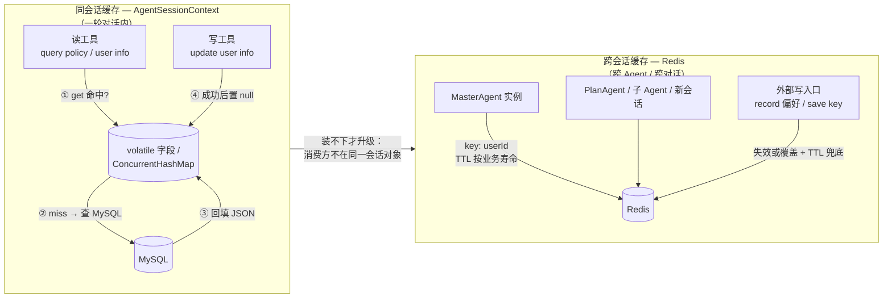
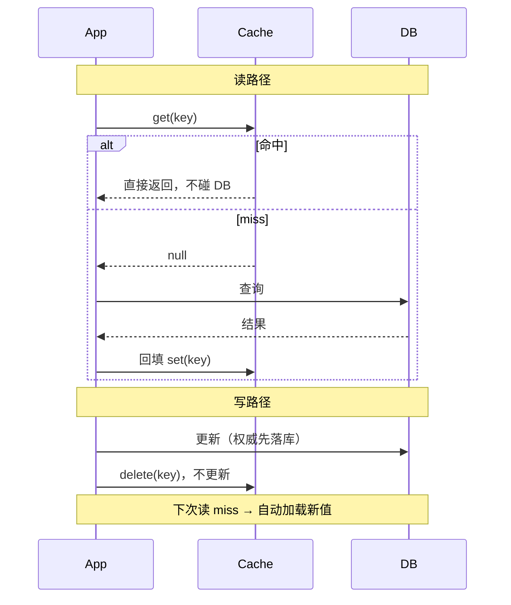

 ## 1. 问题改写的重要性?
	使用前沿模型可以不需要问题改写，模型本身很强大，所以问题改写是基于成本考虑，例如工作流后方的模型不是前沿模型，那么问题改写就很重要，方便下一个节点的智能体去理解问题。

## 2. 提示词越短，效果反而越好？（以 eli5 为例）

eli5 这个 skill 的 SKILL.md 只有 321 字节，几乎没有提示词，但每次产出的 HTML 大图解释效果都很好。为什么？

- 大模型早就“会”解释了，知识在权重里，不在提示词里。提示词不是教材，是遥控器，只负责把模型切到对的模式。
- eli5 的有效成分只有三个，每个都打在杠杆点上：
  1. 受众设定：“knows nothing” 一句话，等于一次性开启禁行话、用比喻、讲类比整套行为。
  2. 格式锁定：“HTML artifact with big pictures and few words”，锁死交付物，逼模型把抽象概念转成可视化，这个转换过程本身就是一次深度理解。
  3. 刻意留白：不写步骤、不给示例。示例会带偏输出，模型照着示例抄样式，而不是执行意图。
- 反面验证：长提示词堆 20 条规则，模型注意力有限，只记得前几条，剩下的全是噪声；反复强调“要简洁”，输出反而更啰嗦，因为模型会模仿输入文本的详细程度。

边界：短提示词成立的前提是任务落在模型内化能力之内。需要模型输出它没见过的新格式时，还是要给示例和精确规则。

结论：skill 的职责是定向，不是教书。触发词本身（如 /eli5）也是一个语义富集的符号，等于一段打包好的行为模式调用。

## 3. Agent 工具缓存：同会话缓存 vs 跨会话缓存（以 gogo-agent 为例）



```text
决定放哪层（两个问题）
  读方只有当前会话的 Agent 实例？        → 否 → Redis
  数据有效期 ≈ 会话期？否则要跨会话活   → 否 → Redis
  以上都满足                              → AgentSessionContext
```

机制差异其实都是上面两个问题推导出来的：

```text
同会话缓存                              跨会话缓存 (Redis)
──────────────────────────────          ──────────────────────────────
免 TTL、免序列化                         TTL 按业务寿命
直接 Java 字段                           30min 画像 / 24h 中间结果
随会话销毁，新会话自动回源              / 7~30d 凭证
→ 天然免疫外部修改                       陈旧风险 → 写路径失效 + TTL 兜底
                                         key 按 userId/provider 隔离
一致性 = 置 null / 覆盖                  Redis 故障 = 当 miss 回源，不阻断
（写方拿得到同一对象，成本极低）          凭证只存密文
```

根源一句话：会话级缓存是「写方和读方拿着同一个对象」，所以失效只需置 null；一旦共享边界跨到别的 Agent 实例或别的会话，够不到对方的缓存，就只能靠 TTL 和写路径自觉维护。这由「谁会读」和「数据什么时候变」决定，与「查库贵不贵」无关。

## 4. 旁路缓存（Cache-Aside）解读

### 是什么

应用自己管理缓存：DB 是权威源，缓存只是加速副本。名字含义：缓存不在数据流的必经路径上，应用始终保留"绕过缓存直连 DB"的兜底能力，所以叫旁路。



```text
读：① get 缓存 → ② 命中返回（零 DB）
    ③ miss → 查 DB → ④ 回填缓存 → ⑤ 返回
写：① 先写 DB → ② 删缓存（不是更新！）→ 下次读自动拿新值
```

两条规则各有一个必须理解的点：

- **读 miss 必须回填**：这是"缓存可以随时删"的前提。删了缓存系统还能跑，靠的就是这条回源路径——它是设计义务，不是缓存自带的属性。
- **写是删缓存而不是更新缓存**：并发下两个请求交错更新缓存，可能把旧值写回去覆盖新值，DB 与缓存长期错位；直接删掉则副本不存在，下次读 miss 自然加载新值。代价是删后到回填前多一次 DB 读，可接受。

### 写顺序：先写 DB 再删缓存，而不是先删再写

```text
推荐：先写 DB，再删缓存
  写 DB ──→ 删缓存 ──→ 下次读 miss 回填新值
  风险窗口：仅"DB 已新、缓存未删"的极短瞬间读到旧值

错误：先删缓存，再写 DB
  删缓存 ──→ (窗口) ──→ 写 DB
               │
               └─ 窗口内并发读：缓存 miss → 查 DB 还是旧值
                  → 回填旧值 → 你的写 DB 才执行
                  → 缓存长期躺旧值，直到下次删除/TTL 才纠正
```

先删后写最坏情况是并发读把旧值回填进缓存，形成"DB 新、缓存旧"的错位，持续整个 TTL，比先写后删的短暂窗口严重得多。

### 辨析一：cache-aside vs 登录态缓存（Redis 权威存储）

登录态（Sa-Token session / Token）不是缓存，是权威存储，两者根本不在同一层。

```text
业务 cache-aside                       登录会话存储（Sa-Token/Redis）
──────────────────────────            ─────────────────────────────
权威源：MySQL                         权威源：Redis 本身
DB 永远有一份真数据                    库里没有 session，Redis 是唯一存在
删缓存 = 降温，可回源找回              删 token = 注销/掉线，找不回来
TTL = 防陈旧，过期重查即可              TTL = 安全边界（过期强制下线）
写路径随时发生                         写只发生在登录那一刻，之后只有
                                         校验、续期、删除
```

判断标准：**删掉之后数据还能不能从别处找回来**——能找回（DB 权威）才谈得上 cache-aside；找不回（Redis 权威）就是状态本身，谈不上缓存策略。

### 辨析二："缓存只是辅助，不影响系统流程"只说对一半

```text
对正确性：辅助 —— 缓存挂了数据不丢，miss 回源照跑，只是慢一点
对性能：  不是无感 —— 缓存失效瞬间流量全部压到 DB，
          穿透/击穿/雪崩极端情况下能把 DB 打挂，流程就真断了
```

"不影响系统流程"是 cache-aside 的**设计目标**而非天然属性，实现条件：所有读路径都有回源兜底（gogo-agent 中偏好缓存、ApiKeyService 均为 Redis 异常 catch 后降级回源，正是为保住这句话）。凡"缓存没了系统就断"的地方（如 RghTokenStore，Redis 挂只能按未登录处理），那东西不是缓存，是权威状态。

```text
对照 gogo-agent 实际代码
  user_info / policy 工具  → cache-aside（DB 权威，删了能回源）
  Redis 偏好 / 规划结果    → cache-aside 变体（回源=百炼/重算）
  rgh token / 登录态       → 权威存储，删了流程就断
```

结论：识别方法一条——这层删掉，系统还能不能从别处把数据找回来。

## 5. Plan-Execute 模式：是什么、与 ReAct 的区别（以 gogo / dodo 实现为例）

### 一句话定义

- **ReAct**：走一步想一步。模型每步输出"Thought（怎么干）→ Action（一个动作）"，拿到工具结果（Observation）再想下一步。计划不存在任何地方，活在模型脑内消息流里。
- **Plan-Execute**：先把任务一次性想透、拆成结构化任务清单（PlanTask），再按依赖清单执行；执行完统一批判（Critique），不满意就把反馈带回下一轮重新规划再执行，是闭环。

### 流程对比

```text
ReAct（一步一决策，串行）              Plan-Execute（先想后做，可并行可反思）
─────────────────────                ─────────────────────────────
用户问题 → 模型思考 → 调工具 1       用户问题
        → 模型思考 → 调工具 2            ↓ ① Plan 集中拆解任务单
        → 模型思考 → 调工具 3           PlanTask(id, instruction, order)
        → 模型思考 → 回答                ↓ ② Execute 按 order 依赖执行
                                         同 order 并发，跨 order 串行
    计划 = 模型脑内隐式状态              ↓ ③ Critique 拿结果反思（执行后才批判）
    无法检查/中断/恢复/并行              passed? ──否→ feedback 回 ① 重新规划
    错误靠模型自觉纠偏                    ↓ 通过
                                        ④ Summarize 总结
                                     计划 = 外部数据结构（可展示/依赖排序/
                                     并发调度/断点续传/人工确认）
```

注意 Critique 的位置：它输入"原始问题 + 计划 + **执行结果**"，没执行就没法批判，所以循环是 Plan → Execute → Critique → (不通过) Plan' → …。批判不直接改方案，只输出 passed/feedback；"修改"发生在下一轮 Plan——feedback 以【Critique Feedback】注入上下文，规划提示词硬约束"必须解决反馈指出的不足、不许重复失败尝试"。

### 五个本质区别

| 维度 | ReAct | Plan-Execute |
|---|---|---|
| 决策时机 | 每步现场决策，边做边想 | 开头集中规划，执行是确定性调度 |
| 计划可见性 | 隐式，在消息流里，代码拿不到 | 显式结构（PlanTask 清单），代码可检查/排序/中断恢复 |
| 并行能力 | 天然串行（一步一工具） | order 字段支持依赖分组，同组并发（Semaphore 限流） |
| 错误闭环 | 模型看 Observation 后自发纠偏，无强制机制 | Critique 显式评估 → feedback 驱动下轮规划 |
| 思考预算 | 每一步都花推理 | 集中在 Plan 和 Critique，Execute 关思考快速跑 |

### 两者不是互斥的，是嵌套的

Plan-Execute 的"执行单元"往往还是 ReAct：

```text
dodo 版：executeWithRetry 里每个 task 都 new 一个 SimpleReactAgent(maxRounds=5)
         → 外层 Plan-Execute 编排，内层 ReAct 干单个任务的活

gogo 版：ReActAgent + PlanNotebook（agentscope 框架内置 plan 模式）
         PlanAwareThinkingHook 按阶段开关 thinking：
           Planning（plan 未创建）→ 保持深度思考    // 想清楚再干
           Execute（plan 已存在） → enable_thinking=false  // 干活时关思考
           Summary（PreSummary）  → thinkingBudget=2048    // 收尾再深想
```

所以更准确的说法：**Plan-Execute 是"把推理预算集中花在规划与反思上"的编排层，ReAct 是它脚下的执行步**。gogo 的 Hook 是思考预算分配思想的极端体现——同一个 agent，规划阶段开思考、执行阶段关、总结再开。

### 两种实现形态

```text
自研显式循环（dodo/general 教学版）：代码里 while 循环
  generatePlan → executePlan → critique → compressIfNeeded → summarize
  计划与结果都是 Java record，调度全在代码里，可控性最强

框架内置（gogo + agentscope PlanNotebook）：ReActAgent 挂 planNotebook
  阶段由框架事件（PreReasoning/PreSummary）切分
  计划存 Notebook 可持久化、变更时通知前端
  优点：不用自研循环；代价：阶段行为受框架约束
```

### 选型

```text
任务浅、单工具、几轮内完成（查天气、问政策）  → ReAct 就够，快且省
任务深、可分解、要并行、错误代价高
（多源研究、跨文件改造、多段行程规划）        → Plan-Execute

判别式一句话：能一句话说清步骤（2~3 步）用 ReAct；
需要"写下来才能做完"的任务（10+ 步、有依赖、要反思）用 Plan-Execute。
```

ReAct 不依赖外部计划结构就能跑，代价是复杂任务里模型会"边做边忘"——前面查到的约束后面不遵守；Plan-Execute 把计划钉在显式结构上，就是为了治这个病。

## 6. Skill vs Tool：为什么数据收集用 Skill、方案计算却用 Tool

图解：[Skill vs Tool 分工图解](output/skill-vs-tool.html)（浏览器打开，5 幕递进：两种外挂的本质 → 流水线分工 → 四个坑 → 引用链设计 → 口诀）

> 一句话总定义：**Skill 是"教模型做事"，Tool 是"替模型做事"。**
> Skill 把操作手册塞进上下文，活是模型干的（花 token、不稳定、过程模型全知道）；Tool 让模型只下单传参，活是代码干的（零推理消耗、精确稳定、过程不可见）。

分工判据（本笔记核心问题）：

```text
难点是"理解"（人话 → 命令参数映射）      → Skill    例：tuniu-cli 数据收集
难点是"计算"（批量、精确、全局算法）      → Tool     例：ItineraryPlannerTool 方案计算

判定口诀：能一句话说清怎么干 → Skill；
          需要算得准、批量算、结果要瘦身 → Tool
```

方案计算不能交给 Skill（让 LLM 心算）的四个原因，收敛成三条原则：

```text
原因① 60 种组合枚举、③ 399.50 ≤ 400 精确比较
     → 原则一：确定性判断必须代码。
       "对就是对"的事没有概率余地；枚举无智能含量但有数量。
原因② min-max 归一化是"两遍扫描"，要先记住全部数值再回头打分
     → 原则二：需要"中间状态累积"的算法必须代码。
       Java 有变量和集合可以存状态，LLM 只有注意力，
       长上下文中间位置的数值会被 Lost in the Middle 击穿。
原因④ ~19000 token vs ~200 token、⑤ 结果落存储只传引用
     → 原则三：上下文是稀缺资源，进出 LLM 的信息要瘦身。
       计算过程不必被感知，结果只传摘要/引用。
```

原则三带来的引用链设计（gogo 实际代码，载体是 Redis 不是文件）：

```text
ItineraryPlannerTool:  算完 → itineraryPlanStore.save(userId, origin, dest, date, json)
                       返回模型："已生成 N 个候选方案"（只报数，不报内容）
ItineraryReviewTool:   load(userId, origin, dest, date) → 从 Redis 取方案 → 评估
                       （review 工具化 + 引用传参，同样省上下文）

两个工具不共享会话对象（可能是不同子 Agent），靠 Redis 接力
→ 这正是第 3 节"跨工具接力必须落外部存储"的实例
```

本质洞察：**把「智能」和「计算」分离** —— LLM 只当决策者（要不要订、合不合规、偏好哪个），代码当计算器（多少钱、怎么排、边界判断）。凡是"会算但没必要会想"的下沉，"会想但没有标准答案"的留给模型；算错代价高的一律下沉。
